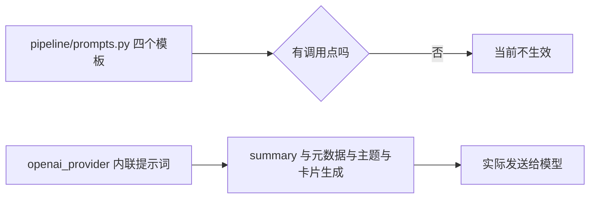
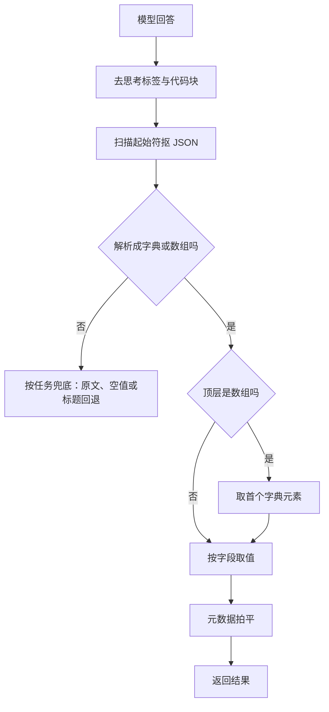

# 提示词来源与 JSON 解析契约

提示词在这个仓库里有两处定义。一处是流水线目录下的模板文件，放着四个英文模板常量；另一处是 Provider 实现里的内联中文字符串。检索调用点会发现一个事实：模板文件的四个常量没有任何引用，被使用的都是内联提示词。这属于代码现状，不是设计声明，读的时候需要以调用点为准。

内联提示词有几个共同点：中文书写、明确要求输出 JSON、对输入做字符数截断。截断上限各自不同，从 8000 到 50000 不等，与任务需要的上下文量对应。理解这些上限，才能在长文输入时预期到信息丢失的位置。

## 两处来源的实际使用

模板文件定义了四个常量：摘要、元数据提取、生成卡片、相关主题（`backend/pipeline/prompts.py`）。它们的写法是英文说明加占位符，例如摘要模板以 “You are KnowledgeDiver's summarization assistant” 开头。

在 `backend` 范围内检索这四个常量名，只命中定义处，没有任何导入或格式化调用。因此当前生效的是 Provider 内部的中文提示词：

| 任务 | 生效位置 | 模板文件对应常量 |
| --- | --- | --- |
| 摘要 | `backend/ai/openai_provider.py` | 无引用 |
| 摘要加元数据 | — | 无引用 |
| 元数据提取 | — | 无引用 |
| 相关主题提取 | — | 无引用 |
| 翻译 | — | 无 |
| 主题聚类 | — | 无 |
| 卡片生成 | `-...` | 无引用 |
| 文档分析 | `-...` | 无 |

“无引用”是对当前代码的静态检索结论。模板文件仍保留，可能是历史遗留或为将来抽取做准备；只要没有被导入，修改它不会影响行为。



## 截断上限各不相同

每个提示词在拼装前对输入做切片，上限按任务设定：

| 任务 | 输入上限 | 位置 |
| --- | --- | --- |
| 摘要 | 15000 字符 | `openai_provider.py` |
| 元数据提取 | 8000 字符 | — |
| 主题提取 | 12000 字符 | — |
| 卡片生成（每来源） | 30000 字符 | `backend/ai/openai_provider.py` |
| 文档分析（整体） | 50000 字符，超出加提示 | — |
| 翻译 | 不截断 | — |
| 聚类（每来源摘要） | 500 字符 | — |

切片是简单的从头截取，不保留尾部。文档分析是唯一在截断后追加提示语的路径，会在正文后加一句“文档过长，已截取”，让模型知道自己拿到的是节选。其它路径被截断时没有这类声明，模型会把节选当全文处理。

翻译不截断，说明它假设输入不长；聚类把每个来源的摘要压到 500 字符，是为了让多个来源都能进上下文。

## 元数据扁平化

摘要与元数据两条路径都会把模型返回的元数据对象拍平：

| 值的类型 | 处理 |
| --- | --- |
| 字符串、整数、浮点 | 原样保留 |
| 列表 | 每项转字符串 |
| 字典 | 转成 JSON 字符串 |
| 其它 | 转字符串 |

拍平的目的是让后续存储只面对标量或字符串列表，不必处理嵌套结构。代价是嵌套信息变成一段 JSON 文本，查询时无法按字段过滤。

解析前还会防御“模型返回数组”的情况：如果解析结果不是字典，取数组首个字典元素，否则给空字典。

## 解析失败的兜底

模型返回的是文本而不是结构，解析必须当成"可能失败"来写，示意如下：

```python
# 示意：从自由文本里取 JSON 并兜底
def parse_json_block(text: str, default):
    start, end = text.find("{"), text.rfind("}")
    if start < 0 or end <= start:
        return default
    try:
        return json.loads(text[start:end + 1])
    except json.JSONDecodeError:
        return default
```

先按第一对花括号截出候选片段（模型常在 JSON 前后加解释性文字），再解析；失败就返回`default`而不是抛出，让调用方能继续跑完这一轮。代价是格式错误被静默吸收，因此这类兜底要配合日志计数，否则错误率无处可见。

三条路径的失败行为不同：

| 路径 | 解析失败时 |
| --- | --- |
| 摘要加元数据 | 把原始文本当摘要返回，元数据为空 |
| 元数据提取 | 返回空字典 |
| 主题提取 | 返回空列表 |
| 聚类 | 回退按标题分组 |
| 卡片生成 | 见相邻单元的口径 |

摘要路径把解析失败的原文当摘要，是“宁可留下原文也不丢内容”的选择；元数据与主题路径返回空值，因为空的标签或主题不会破坏卡片。聚类回退到标题分组，保证多来源仍能各自成卡，不会因为模型格式错误而全部丢失。



## 不可信内容包裹

抓取正文、上传文档正文与文件名都可能在提示词里注入指令。实现提供一层包裹钩子（`openai_provider.py`）：

```python
def _untrusted():
    global _UNTRUSTED_MODULE
    if _UNTRUSTED_MODULE is None:
        from backend.agent import untrusted as _impl
        _UNTRUSTED_MODULE = _impl
    return _UNTRUSTED_MODULE
```

延迟导入的理由写在注释里：质量包初始化会经改进策略反向导入本模块，如果顶层导入会把依赖环闭上。缓存到模块级全局后，后续调用开销可以忽略。

包裹行为由开关决定，默认模式原样返回，只有显式打开时才加边界标记。文件名走单独的 `_safe_meta`，只在开关打开时做中和处理，保证默认路径逐字段不变。调用点包括摘要加元数据、卡片生成与文档分析。

| 模式 | 行为 |
| --- | --- |
| 默认 legacy | 原样进入提示词 |
| 打开 on | 加边界块，文件名先中和 |

## 易错点

1. 改模板文件以为生效。它没有调用点。
2. 认为所有路径都会声明截断。只有文档分析声明。
3. 把元数据嵌套结构当可查询字段。它被转成 JSON 字符串。
4. 认为解析失败会抛异常。各路径有不同兜底。
5. 在顶层导入不可信模块。会造成循环依赖。
6. 认为包裹默认开启。默认模式原样返回。

## 小结

### 核心概念

| 概念 | 取值或做法 | 来源 |
| --- | --- | --- |
| 模板文件 | 四个英文常量，无调用点 | `backend/pipeline/prompts.py` |
| 生效提示词 | Provider 内联中文提示词 | `backend/ai/openai_provider.py` 起 |
| 摘断上限 | 8000 到 50000 按任务不同 | `backend/ai/openai_provider.py` |
| 截断声明 | 仅文档分析追加提示 | `backend/ai/openai_provider.py` |
| 元数据拍平 | 标量保留，列表转字符串，字典转 JSON | `backend/ai/openai_provider.py` |
| 数组防御 | 非字典时取首个字典元素 | `backend/ai/openai_provider.py` |
| 解析失败兜底 | 原文、空值或标题回退 | `backend/ai/openai_provider.py` |
| 不可信包裹 | 延迟导入，默认原样 | `backend/ai/openai_provider.py` |

### 设计权衡

| 决策 | 收益 | 代价 |
| --- | --- | --- |
| 提示词内联在实现里 | 与解析逻辑同处一地 | 模板文件成为死代码 |
| 按任务设截断上限 | 控制上下文成本 | 超长输入静默丢失尾部 |
| 元数据拍平 | 存储简单 | 丢失嵌套查询能力 |
| 解析失败各有兜底 | 单次失败不致命 | 失败原因不显式暴露 |
| 包裹默认关闭 | 保持既有输出逐字段一致 | 需要显式开启防护 |

## 练习

### 基础题

1. 说明模板文件与内联提示词的实际使用情况。
2. 列出至少四个任务的截断上限与位置。
3. 写出元数据拍平的四条规则。

### 挑战题

4. 把所有提示词抽到统一模块并保持行为不变，给出迁移与回归方案。
5. 为截断增加“尾部摘要”或分段处理策略，说明对长文场景的收益。
6. 设计一个提示注入的回归用例集，覆盖默认与开启包裹两种模式。

### 附：本页引用的路径

| 路径 | 用途 |
| --- | --- |
| `backend/ai/openai_provider.py` | 内联提示词、截断与解析兜底 |
| `backend/pipeline/prompts.py` | 未被引用的四个模板常量 |
| `backend/agent/untrusted.py` | 不可信内容包裹实现 |
| `backend/utils/titles.py` | 标题归一化 |
