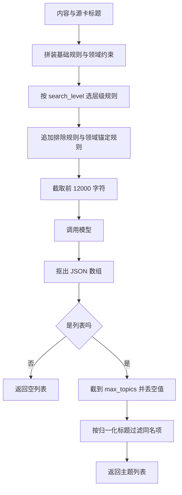
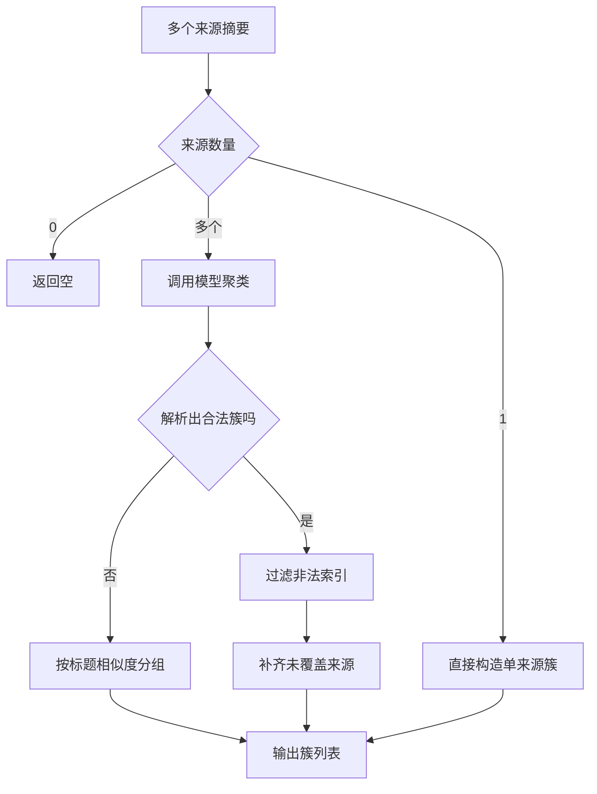

# 主题提取层级与聚类回退

延申搜索要先决定搜什么，然后才轮到检索。主题提取负责从一段内容里挑出适合单独成卡的词，挑得准不准直接决定后续检索的质量。实现把这件事拆成两条约束：一条来自搜索层级，决定提什么抽象程度；另一条来自源卡标题，决定哪些词不许提。

约束之后还有一层代码兜底。模型可能忽略“不许提取和源卡同名的词”这条规则，尤其是只差空格或标点的变体。代码在解析后自己做一次归一化比对，把这类词删掉。聚类的回退逻辑也是同一思路：模型输出不可用时，用标题相似度分组，保证流程不中断。

## 四种搜索层级

提示词构造器把层级规则写成字典，未知层级退回默认档（`backend/ai/openai_provider.py:350-370`）：

| 层级 | 提取方向 | 示例 |
| --- | --- | --- |
| `default` | 与主主题不同的具体主题 | “法拉利”而非“汽车品牌” |
| `downstream` | 更细更专的下位概念 | 从“机器学习概述”提取“梯度下降”“反向传播” |
| `peer` | 同层次同类主题 | 从“保时捷”提取“法拉利”“兰博基尼” |
| `upstream` | 更高层的上位概念 | 从“机器学习”提取“人工智能”“计算机科学” |

默认档强调“与当前内容的主要主题不同”，下游档强调“更具体更细化”，同级档强调“可比性”，上游档强调“父类与所属领域”。四条规则都附了具体例子，这是让模型稳定输出的一种做法：规则抽象，例子锚定。

基础规则里还有一条领域约束（`:340`）：禁止提取跨领域的通用多义词或泛化短词，并明确列出“稳定性”“卷积”“注意力”在多个领域含义不同的例子。要求是提取带领域语境的具体词，例如“系统稳定性”而不是“稳定性”。

## 源卡标题带来的两条规则

当调用方传入源卡标题时，提示词会追加两段（`:342-348`）：

```python
if exclude_title:
    exclude_rule = "禁止提取与源卡标题相同、近义或属于它上位概括的主题"
if source_title:
    source_rule = "所有主题必须与源卡领域一致；歧义短词必须自带领域限定"
```

排除规则防的是重复建卡：卡片本身是“机器学习”，就不该再提取“机器学习概述”这类同义或上位主题。代码注释还特别点出只差空格、标点或大小写的变体也算相同（`:344`）。

领域锚定规则解决的是检索歧义。方案调整后搜索词不再拼接源卡标题，改为在提取阶段就把领域写进主题（`:328-330`），例如输出“猎人（杀戮尖塔2）”而不是“猎人”。注释解释了理由：无领域限定的短词联网搜索会返回同名异义内容。

## 解析后的代码兜底

`extract_related_topics` 在拿到列表后做三件事（`:397-409`）：

1. 只接受列表类型，截到 `max_topics` 个；
2. 逐项转字符串并丢掉空值；
3. 若传了排除标题，用标题归一化函数再过滤一遍同名项。

第三步有实测来源：注释记录曾提取出“Transformer架构”，与源卡“Transformer 架构”重复（`:401-403`）。归一化函数在公共工具里，规则是去空白（含全角）、统一全半角括号、转小写（`backend/utils/titles.py:14-17`）。它是精确匹配，不做模糊。

这里有一个接口参数上的不一致：抽象基类把 `max_topics` 默认写成 5（`backend/ai/provider.py:78`），实现里写成 10（`openai_provider.py:381`）。调用方显式传参时不受影响，依赖默认值时会按实现取值。



## 聚类的正常路径

`cluster_summaries` 先把每个来源压成“标题加 500 字摘要”的一段文本（`openai_provider.py:439-445`），再要求模型返回主题名、来源索引与描述。

输入为零时返回空列表，输入只有一个时直接构造单来源簇，省掉一次模型调用（`:429-437`）。解析后逐项校验必须同时含主题名与来源索引，索引会被过滤到合法范围（`:475-481`）。如果没有任何合法簇，回退按标题分组（`:483-485`）。

已分配的索引会被收集起来，没被任何簇覆盖的来源各自补成一个单来源簇（`:487-497`）。这一步保证“来源不丢失”：模型即使漏掉某个来源，它仍会作为独立主题出现在结果里。

## 聚类失败时的标题回退

解析异常或空结果都会走标题分组（`:499-501`、`:503-534`）。回退逻辑遍历所有标题，用相似判定决定归入已有组还是新建组。相似判定有三条（`:544-552`）：

| 判定 | 条件 |
| --- | --- |
| 完全相等 | 归一化后相等 |
| 包含关系 | 一个标题包含另一个 |
| 相似度 | `SequenceMatcher` 比值不低于 0.7 |

回退用的归一化函数在 Provider 内部另写了一份（`:536-542`）：先做兼容性归一化，再小写，再去掉空白与连接符，最后去掉括号内容。它与公共工具的规则不同——公共工具保留括号内容并做精确匹配，回退版本删掉括号并允许模糊。

两套规则的用途也不一样：公共工具用于“标题变体精确去重”，宁可漏判；回退版本用于“聚类兜底”，宁可合并。同名函数不同行为是这里最容易混淆的地方。



## 易错点

1. 认为未知层级会报错。会退回默认档。
2. 忽略源卡标题的两条附加规则。它们决定主题是否被排除。
3. 认为代码兜底能识别近义主题。归一化只处理字符差异。
4. 依赖抽象层的默认主题数。实现的默认值不同。
5. 认为聚类失败会丢来源。未覆盖来源会被补齐。
6. 混用两套标题归一化规则。一个精确一个模糊。

## 小结

### 核心概念

| 概念 | 取值或做法 | 来源 |
| --- | --- | --- |
| 搜索层级 | default、downstream、peer、upstream | `backend/ai/openai_provider.py:350-368` |
| 未知层级 | 退回 default | `:370` |
| 领域约束 | 禁止跨域多义词与无领域限定的短词 | `:340` |
| 排除规则 | 禁止与源卡同名、近义、上位 | `:342-344` |
| 领域锚定 | 歧义短词自带领域限定 | `:346-348` |
| 提取上限 | 12000 字符 | `:377` |
| 代码兜底 | 归一化标题精确过滤 | `:401-405` |
| 聚类回退 | 标题相等、包含或相似度 0.7 | `:544-552` |
| 来源补齐 | 未覆盖来源各自成簇 | `:487-497` |

### 设计权衡

| 决策 | 收益 | 代价 |
| --- | --- | --- |
| 层级用字典分派 | 未知输入安全降级 | 默认档行为不明显 |
| 规则配具体例子 | 模型输出更稳定 | 提示词更长 |
| 代码层做标题兜底 | 不依赖模型守规则 | 只能处理字符级变体 |
| 未覆盖来源补齐 | 来源不丢失 | 可能造出质量差的单来源簇 |
| 回退用模糊匹配 | 聚类尽量合并 | 可能错误合并 |

## 练习

### 基础题

1. 写出四种搜索层级与各自的提取方向。
2. 说明源卡标题带来的两条规则各自防什么。
3. 列出聚类解析后的校验与补齐步骤。

### 挑战题

4. 设计一个评估集比较四种层级的提取质量，说明标注口径。
5. 统一两套标题归一化规则或明确分工，给出迁移与回归方案。
6. 为代码兜底增加近义词判断，说明数据来源与误删风险。

### 附：本页引用的路径

| 路径 | 用途 |
| --- | --- |
| `backend/ai/openai_provider.py` | 层级提示词、提取兜底与聚类回退 |
| `backend/ai/provider.py` | 抽象方法签名 |
| `backend/utils/titles.py` | 公共标题归一化与精确查重 |
