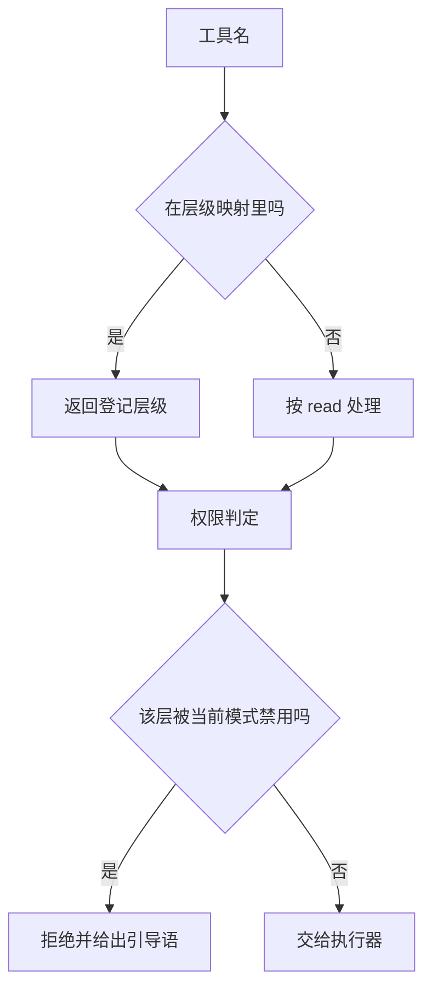
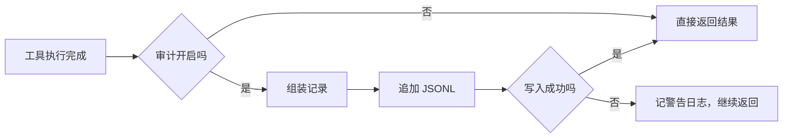

# 工具清单与三层权限

Agent 能做什么，取决于它能看到哪些工具、以及这些工具在权限上被归为哪一层。这个仓库把“工具是什么”从执行器里拆了出来，单独放在注册表模块。注册表同时承担四件事：声明工具 schema、登记层级、解析权限开关、记录调用审计。

拆分的动机写在模块开头：原来的执行器文件有 1279 行，同时承担 schema 声明、执行分支、决策规则与阈值四件事，任何新工具或新策略都要改同一个类（`backend/agent/tool_registry.py:3-9`）。拆出注册表后，MCP 只读导出与权限分级这两个方向都只需要遍历注册表。

## 十三个工具与三个层级

层级只有三个（`tool_registry.py:45-48`）：

| 层级 | 含义 | 工具 |
| --- | --- | --- |
| read | 只读，不改库、不消耗 AI | 语义搜索、卡片详情、关联卡、列卡、树视图、质量评估、库评估、探索评估 |
| prescribe | 只读但消耗一次 AI 调用 | 缺口盘点 |
| write | 联网、生成或修改内容与链接 | 关键词搜索、延申扩展、刷新卡片、建链 |

模块注释特意澄清一个容易混淆点：write 层级与“搜索预算熔断名单”不是同一概念——建链属于写层（改动知识结构），但不消耗搜索预算，所以不在熔断名单里（`:17-18`）。

schema 是一个列表，每项是标准的函数调用格式，含名称、描述与参数（`:54-232`）。描述写得很细，实际上承担了策略引导的职责。例如语义搜索被描述为“查找已有知识的第一步，应始终优先调用”；刷新的描述写明触发条件非常严格，绝大多数情况下应优先用延申扩展；建链的描述说明必须传 `parent` 才能改变树结构。

## 层级映射与未登记工具

层级映射是一张显式字典（`:247-261`），新增工具必须在这里登记。注释强调注册表是唯一来源。

`tool_tier` 对未登记的名字返回 read（`:271-273`）。这个默认值是保守的：未知工具不会被当成写层而被额外拦截，但如果权限模式是只读，未知工具仍会通过——因为未知名字落在允许集合里。兜底的是执行器对名称的校验，未登记的名字会匹配失败。

按层级过滤 schema 的函数供 MCP 只读导出与上下文裁剪共用（`:280-283`），输入一组允许层级，输出对应 schema 列表。这样“只读导出”不需要另写一份工具清单。

## 别名与模糊匹配素材

注册表里放了一张别名表，处理模型的常见口误（`:238-244`）：

| 模型可能写 | 映射到 |
| --- | --- |
| `get_card` | `get_card_info` |
| `search_keyword` | `search_by_keyword` |
| `link_cards` | `link_card` |
| `assess_exploration` | `assess_exploration_need` |
| `search_similar` | `search_similar_cards` |

注释说明了精确匹配优先的原因：`get_card` 如果走模糊匹配，会在 `get_card_info` 与 `get_card_tree` 之间产生歧义（`:237`）。别名表把这类常见拼写固定下来，避免歧义。

## 三种权限模式

权限模式的开关是环境变量 `KD_TOOL_PERMISSION`（`:50`），默认值来自全局配置（`:308-311`）：

| 模式 | 禁用的层级 | 效果 |
| --- | --- | --- |
| legacy（默认） | 无 | 零拦截，保持既有行为 |
| no_write | write | 只允许只读与处方 |
| readonly | write 与 prescribe | 只允许只读层 |

未知取值一律回退 legacy（`:309-311`），保证配置写错时不会意外锁死能力。禁用集合由 `blocked_tiers` 计算，legacy 返回空集，注释写明这是“零拦截、零开销”（`:314-321`）。

判定函数返回“是否允许”加拒绝原因（`:324-333`）。拒绝原因是模板化的固定措辞，会点名工具、层级、当前模式，并列出可用的只读工具，最后提示用户可以显式开启写权限（`:263-268`）。这条引导语直接返回给模型，属于“把拒绝也当成一次提示”的做法。

## 审计开关

审计由 `KD_TOOL_AUDIT` 控制，默认关闭（`:336-339`）。关闭时记录函数是纯空操作（`:348-349`）。开启后每条记录追加到 JSONL 文件，默认路径是数据目录下的 `agent_tool_audit.jsonl`（`:52`、`:342-343`）。

写入逻辑包在异常处理里，注释写明“审计失败绝不能影响工具执行”（`:357-358`）。记录字段包含时间戳、工具名、层级、是否成功、是否被拦、原因、用户名与会话号（`backend/agent/tools.py:243-251`）。

## 不可信返回值名单

注册表还维护一份名单，标记哪些工具的返回值可能包含外部派生文本（`:289-293`）。当前十三个工具全部在名单内，`returns_untrusted_text` 对它们都返回真（`:296-298`）。

| 检查项 | 结果 |
| --- | --- |
| 名单覆盖工具数 | 十三，与全部工具一致 |
| 用途 | MCP 出站包裹与注入判定 |
| 包裹条件 | 仅成功结果，错误与拒绝消息不包裹 |

名单覆盖全部工具，说明当前没有任何工具被判定为“返回值一定安全”。对搜索类工具这显然合理；对 `list_cards` 这类返回标题与 ID 的工具也标记，属于保守处理。

## 易错点

1. 认为未知工具会被按写层拦截。默认按只读处理。
2. 把 write 层级与搜索熔断名单当成同一份。建链不在熔断名单里。
3. 认为权限模式写错会报错。未知值回退默认模式。
4. 认为审计默认开启。默认关闭且无副作用。
5. 认为别名表只是文档。执行器会用它改写工具名。
6. 认为名单只覆盖搜索工具。当前覆盖全部十三个。

## 小结

### 核心概念

| 概念 | 取值或做法 | 来源 |
| --- | --- | --- |
| 工具数量 | 十三个 | `backend/agent/tool_registry.py:54-232` |
| 层级 | read、prescribe、write | `:45-48` |
| 未登记工具 | 按 read 处理 | `:271-273` |
| 权限开关 | `KD_TOOL_PERMISSION` | `:50` |
| 禁用集合 | legacy 空、no_write 禁写、readonly 禁写与处方 | `:314-321` |
| 拒绝语 | 点名工具与层级并给替代 | `:263-268` |
| 审计开关 | `KD_TOOL_AUDIT`，默认关 | `:336-339` |
| 审计路径 | `data/agent_tool_audit.jsonl` | `:52` |
| 不可信返回值 | 覆盖全部工具 | `:289-293` |

### 设计权衡

| 决策 | 收益 | 代价 |
| --- | --- | --- |
| schema 与执行器分离 | 新工具只改一处 | 两层之间要同步名称 |
| 未知工具按只读 | 不会误拦新工具 | 只读模式下未知工具会放行 |
| 未配置或配错回退默认 | 不会锁死能力 | 配置错误静默 |
| 拒绝语带替代建议 | 模型能自我纠正 | 提示词被写进代码 |
| 审计默认关闭 | 零开销 | 默认没有调用留痕 |

## 练习

### 基础题

1. 列出三个层级的含义与各自的工具。
2. 说明 write 层级与搜索预算熔断名单的区别。
3. 写出三种权限模式各自禁用的层级。

### 挑战题

4. 为新增一个只读工具列出需要改动的所有位置与顺序。
5. 设计权限拒绝的错误码与结构化字段，替代当前纯文本引导语。
6. 讨论“全部工具都标记不可信返回值”的影响，给出收紧名单的判据。

### 附：本页引用的路径

| 路径 | 用途 |
| --- | --- |
| `backend/agent/tool_registry.py` | schema、层级、权限与审计 |
| `backend/agent/tools.py` | 执行器与审计调用点 |
| `backend/quality/thresholds.py` | 权限模式常量来源 |
| `backend/config.py` | 权限模式与审计默认值 |
