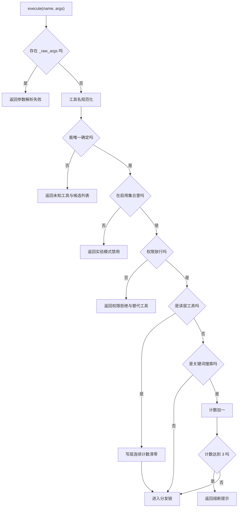
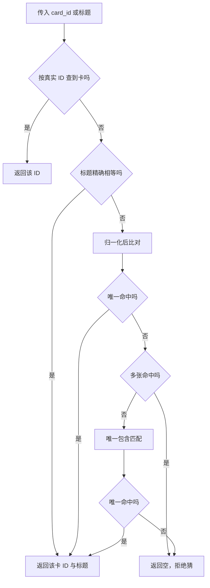

# 执行器的分发与容错

模型输出的工具调用请求不可靠。它可能拼错工具名、把参数写成坏 JSON、把卡片标题当 ID 传，或者连续盲目联网。执行器的职责就是在干活之前把这些情况一一挡住，并且用模型能理解的话告诉它怎么改。整个分发流程是一条检查链，任何一环不通过都返回失败结果，而不是抛异常。

这条链的顺序需要记住：坏参数最先挡，工具名接着纠正，然后是实验开关与权限，最后是搜索熔断。顺序决定了错误优先级——参数坏了就不必先纠结权限。

## 构造与依赖

执行器只接收两个参数：流水线 API 与可选的启用工具集合（`backend/agent/tools.py`）：

```python
def __init__(self, api, enabled_tools: set[str] | None = None):
    self._api = api
    self._quality = QualityProvider(api.card_store, raw_store=api.raw_store)
    self._enabled_tools = enabled_tools or set(_TOOL_NAMES)
    self._write_streak = 0
```

质量提供者在构造时自建，注入存储与原始存储。启用集合为空时默认放开全部工具。连续写层计数初始为零，注释写明“连续三次写层工具且无读层间隔时搜索被拒”。

所有工具最终都通过流水线 API 执行，不直接操作存储（模块注释），这保证了权限、任务与缓存的统一处理点。

## 分发前的五道检查

检查链的顺序就是优先级，示意如下：

```python
# 示意：分发前的检查链，任何一环不过都返回"失败结果"而不是抛异常
if bad_json(args):        return fail("参数不是合法 JSON，请重新生成")
name = fuzzy_match(tool)  # 工具名拼错时纠正，纠正不到就报错
if not experiment_on(name): return fail("该工具在当前模式下未启用")
if not is_tool_allowed(name): return fail("权限不足")
if search_breaker_open(): return fail("搜索过于频繁，请先用本地工具")
return await dispatch(name, args)
```

把异常收成"失败结果"是给模型设计的关键：模型看到的是可读的失败原因，可以据此改正并重试；如果直接抛异常，循环就中断了。顺序上先挡参数、再纠名、最后查权限，意味着参数坏掉时不会先浪费一次权限判定。

分发在 `_execute_impl` 里，整个函数包在一个异常处理内。顺序如下：

| 顺序 | 检查 | 不通过的处理 |
| --- | --- | --- |
| 1 | 参数里是否有 `_raw_args` | 返回参数解析失败，提示用双引号 |
| 2 | 工具名规范化 | 无法唯一确定则列出全部可用工具 |
| 3 | 是否在启用集合里 | 返回实验模式已禁用该工具 |
| 4 | 权限层级是否放行 | 返回权限拒绝语与替代工具 |
| 5 | 搜索熔断计数 | 连续三次盲搜时拒绝 |

第一步针对的是模型输出的参数不是合法 JSON 的情况。提供方不会让执行器直接崩，而是把原始文本放进 `_raw_args` 透传。执行器看到这个键就返回一段明确的修复提示，指出键名与字符串值都要用双引号。

第三步的启用集合服务于实验模式：只放开部分工具做对比，被禁用的工具返回一句“请使用可用工具完成当前任务”。

第五步只对关键词搜索计数。读层工具会把计数清零；搜索成功后计数加一，达到三次时拒绝本次调用，并把计数回退一次再返回，提示先检查本地内容。注释解释了为什么延申与刷新不计数：它们从明确卡片出发，是定向动作，不应被盲搜熔断锁死。



## 工具名如何被纠正

规范化分四步：精确名字、别名表、归一化后的包含匹配、编辑距离。归一化会去掉空白、下划线、连字符与括号并转小写。

包含匹配可能命中多个：例如 `link` 同时命中建链与获取关联卡。此时用编辑距离在候选里再筛，只有唯一一个距离不超过 2 才返回，否则返回空表示无法确定。完全无包含命中时，对所有工具名做一次编辑距离筛选，同样要求唯一。

| 输入 | 处理 | 结果 |
| --- | --- | --- |
| 精确名 | 直接命中 | 原名 |
| 别名表内 | 映射 | 目标名 |
| `search_keyword` | 别名命中 | `search_by_keyword` |
| `link` | 包含命中两个 | 距离判定不定则拒绝 |
| 任意错拼且唯一近邻 | 距离不超过 2 | 近邻名 |

纠正成功会记一条警告日志，便于观察模型实际拼错的名字。

## 卡片标识的解析

模型经常把标题当 ID。解析函数按四级顺序匹配：真实 ID、标题精确相等、归一化后唯一相等、唯一包含匹配。归一化去空白（含全角）、统一括号、转小写。

歧义时宁可失败：归一化后仍有多张卡就返回空，包含匹配命中也只在唯一时采用。函数返回真实 ID 与“回退用到的标题”两项，后者用于在摘要里注明发生了标题回退。



## 参数缺失与异常收敛

`_require` 负责参数安全读取：键不存在或字符串为空时返回点名的错误结果，并附带提示。它不抛异常，调用方用一行判断就能提前返回。

分发链本身是一条 if/elif，十三个工具各占一个分支，最后落到“未知工具”兜底。整个函数外层捕获所有异常，把它转成失败结果并附上异常文本，同时记错误日志。

## 审计包在入口

`execute` 先调用实现，再在开关打开时记录一条审计。记录里包含工具名、层级、是否成功、是否被拦与原因。审计在入口而不是在每个分支里，保证所有路径都覆盖到。

## 易错点

1. 认为坏参数会抛异常。它变成一条可读的失败结果。
2. 认为工具名拼错就失败。唯一匹配时会自动纠正。
3. 忽略搜索熔断只针对关键词搜索。延申与刷新不计数。
4. 认为标题一定能当 ID 用。多张同名时会被拒绝。
5. 认为未知工具会被静默忽略。它返回候选列表。
6. 忘记 `_require` 不抛异常。它返回结果对象。

## 小结

### 核心概念

| 概念 | 取值或做法 | 来源 |
| --- | --- | --- |
| 构造依赖 | 流水线 API 与启用集合 | `backend/agent/tools.py` |
| 检查顺序 | 坏参数、名称、开关、权限、熔断 | `backend/agent/tools.py` |
| 名称纠正 | 精确、别名、包含、编辑距离 | `backend/agent/tools.py` |
| 熔断阈值 | 连续三次关键词搜索 | `backend/agent/tools.py` |
| 标识解析 | 四级匹配，歧义拒绝 | `backend/agent/tools.py` |
| 参数校验 | 返回结果，不抛异常 | `backend/agent/tools.py` |
| 异常收敛 | 全部转失败结果 | `backend/agent/tools.py` |
| 审计位置 | 入口统一记录 | `backend/agent/tools.py` |

### 设计权衡

| 决策 | 收益 | 代价 |
| --- | --- | --- |
| 检查链前置 | 错误提示精准 | 分支多、顺序需维护 |
| 名称模糊匹配 | 容忍模型口误 | 可能纠正到非预期工具 |
| 歧义时拒绝 | 不会猜错卡 | 需要模型再查一次 |
| 熔断只针对盲搜 | 定向动作不被锁 | 计数规则要解释 |
| 异常统一收敛 | 单次失败不中断循环 | 失败原因埋在摘要文本里 |

## 练习

### 基础题

1. 按顺序写出分发前的五道检查与各自的处理。
2. 说明工具名规范化的四个步骤。
3. 解释卡片标识解析在歧义时的行为与理由。

### 挑战题

4. 为工具调用设计结构化错误码，替换当前纯文本摘要，说明兼容方案。
5. 修改熔断规则为“按时间窗计数”，给出实现与对现有计数的影响。
6. 设计一组模糊工具名用例，覆盖包含匹配与编辑距离的边界。

### 附：本页引用的路径

| 路径 | 用途 |
| --- | --- |
| `backend/agent/tools.py` | 执行器、分发链与标识解析 |
| `backend/agent/tool_registry.py` | 工具名单、别名与权限 |
| `backend/quality/provider.py` | 执行器内建的质量提供者 |
| `backend/agent/schemas.py` | 工具结果模型 |
