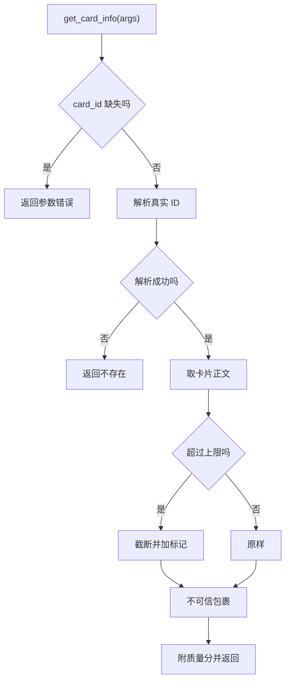
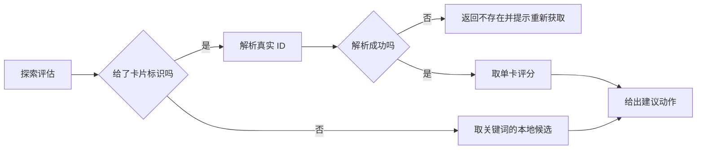

# 读层工具的实现细节

只读工具看起来最安全，但它们的输出会直接进入模型的下一轮上下文，所以实现上有两个共同约束：输出不能无限长，内容必须区分“本系统的说明”与“外部抓取的原文”。截断上限与不可信包裹就是为这两点服务的。

读层工具还有一类隐藏成本：质量评分需要向量与结构计算，属于同步阻塞操作。执行器把这些计算放进线程池，避免卡住事件循环。理解这一点，才能解释为什么几乎每个读层工具都出现一次线程调度调用。

## 语义搜索与质量附加

语义搜索要求 `query` 非空，缺失时返回点名错误（`backend/agent/tools.py:335-341`）。随后取两个可选参数：条数默认 5，门槛默认 0.5（`:342-343`），再调用流水线 API。

| 参数 | schema 默认 | 实现默认 | 位置 |
| --- | --- | --- | --- |
| 条数 | 5 | 5 | `tool_registry.py:64`、`tools.py:342` |
| 门槛 | 0.35 | 0.5 | `tool_registry.py:65`、`tools.py:343` |

门槛的默认值在两处不一致：schema 写 0.35，执行器写 0.5。模型通常按 schema 显式传值，所以日常影响有限；依赖默认值时以执行器为准。schema 的描述还特意说明这是召回门槛而非最终相关判断，返回后仍需读卡片确认。

命中结果逐条附上质量分（`:351-357`）：

```python
for r in results:
    enriched = await asyncio.to_thread(self._quality.enrich, r["card"])
    cards.append({
        "id": r["card"].id, "title": r["card"].title, "score": r["score"],
        "quality": enriched.get("quality", {}),
    })
```

摘要里会带上 gap 值，让模型在结果列表阶段就能看到哪张卡更薄弱。线程调度是因为质量计算是同步的。

没有命中时返回成功但内容为“未找到相关内容”，而不是失败（`:345-350`）。空结果不是错误。

## 卡片详情与截断

读详情前先解析标识（`:421-447`）。正文超过配置上限时截断并追加“内容已截断”标记（`:432-433`）。上限来自全局配置 `AGENT_CARD_CONTENT_MAX_CHARS`，属于“单张卡最多占用多少上下文”的预算控制。

截断后正文会经过不可信包裹（`:434-436`）。默认模式原样返回；开启防护时加边界块与声明，防止抓取正文里的指令被模型当成本系统指令。摘要里如果发生了标题回退，会显式注明（`:438`）。

返回值的数据部分包含卡片 ID、标题、正文长度与质量分（`:442-446`）。正文长度用的是未截断的原始长度，便于调用方判断截断程度。



## 关联卡、列表与树视图

三个结构类工具的实现都很薄（`:449-494`）：

| 工具 | 解析标识 | 输出 |
| --- | --- | --- |
| 关联卡 | 是 | 关联卡 ID 列表，空时给一句提示 |
| 列表 | 否 | 总数加前 50 张的标题与 ID |
| 树视图 | 否 | 层级文本，最多 80 行 |

关联卡只返回 ID，不含标题——这是设计上的一处不便：模型拿到 ID 后还要再读一次详情。列表工具在数据部分也只放前 50 张，但摘要里报告总数（`:472-483`），超出部分不会进入上下文。

树视图把嵌套结构转成缩进文本，每个节点带“几个子节点、多少字”的标记（`:213-237`）。超过 80 行时截断并给出剩余节点数。摘要为空时返回“知识库为空”而不是空字符串（`:231-233`）。树数据同时放进数据字段，供需要结构的调用方使用。

## 三张质量类读工具

质量类工具直接消费质量提供者的缓存与报告：

| 工具 | 数据来源 | 摘要内容 |
| --- | --- | --- |
| 卡片质量评估 | 全部评分，降序 | 最薄弱的前 N 张，带 gap、结构分、语义分 |
| 知识库评估 | 簇报告 | 簇数、覆盖不足数、薄弱簇明细、覆盖不足卡 |
| 探索评估 | 单卡评分或关键词 | 是否需要联网与建议动作 |

卡片质量评估默认取 5 张（`:944-957`）。它假设全部评分已按 gap 降序排列，直接切片；这个顺序由质量模块负责保证。

知识库评估处理空报告：簇与覆盖不足都为空时给出“卡片过少”的说明（`:959-966`）。薄弱簇明细里会列出三个维度的缺失情况，用“低于 0.5”的判据标出缺哪个维度，并给出代表卡与薄弱卡 ID（`:972-979`）。

探索评估要求提供卡片标识或关键词之一（`:722-729`）。带卡片标识时先解析真实 ID，解析失败直接报错并提示重新获取（`:731-740`）。注释记录了这个顺序的由来：此前幻觉 ID 会走到“可以直接联网搜索”的分支，等于把错误引导成搜索指令（`:732-733`）。



## 易错点

1. 依赖语义搜索门槛的默认值。schema 与实现不一致。
2. 把空结果当失败。搜索无命中返回成功。
3. 认为卡片详情返回全文。超限会截断。
4. 认为关联卡返回标题。只返回 ID。
5. 忽略列表与树视图的输出上限。分别是 50 张与 80 行。
6. 探索评估不先解析标识。会把幻觉 ID 引导成联网。

## 小结

### 核心概念

| 概念 | 取值或做法 | 来源 |
| --- | --- | --- |
| 语义搜索门槛 | schema 0.35、实现 0.5 | `tool_registry.py:65`、`tools.py:343` |
| 质量附加 | 线程池内执行 enrich | `tools.py:353` |
| 正文上限 | 全局配置常量，超出截断 | `:432-433` |
| 不可信包裹 | 正文与缺口摘要 | `:436`、`:1025` |
| 列表上限 | 50 张 | `:473`、`:481` |
| 树上限 | 80 行 | `:213`、`:235-236` |
| 薄弱卡默认 | 前 5 张 | `:945` |
| 库评估空报告 | 卡片过少提示 | `:961-966` |
| 探索评估顺序 | 先解析标识再判断 | `:731-740` |

### 设计权衡

| 决策 | 收益 | 代价 |
| --- | --- | --- |
| 搜索结果附带质量分 | 一次调用看到薄弱程度 | 每条多一次同步计算 |
| 详情截断 | 控制上下文占用 | 长卡信息不全 |
| 列表与树设上限 | 输出可控 | 大库需多次调用 |
| 关联卡只给 ID | 输出短 | 需要二次查询 |
| 探索评估先解析标识 | 不误导成联网 | 多一次列表查询 |

## 练习

### 基础题

1. 说明语义搜索的参数默认值与两处不一致。
2. 列出卡片详情与树视图的截断规则。
3. 对比三张质量类读工具的输入与输出。

### 挑战题

4. 统一语义搜索门槛的默认值，给出对既有调用方的影响评估。
5. 让关联卡返回标题与质量分，说明输出长度与调用次数的取舍。
6. 为树视图设计分页或按深度过滤的参数方案。

### 附：本页引用的路径

| 路径 | 用途 |
| --- | --- |
| `backend/agent/tools.py` | 读层工具实现 |
| `backend/agent/tool_registry.py` | schema 默认值与描述 |
| `backend/quality/provider.py` | 评分与簇报告 |
| `backend/agent/untrusted.py` | 不可信内容包裹 |
