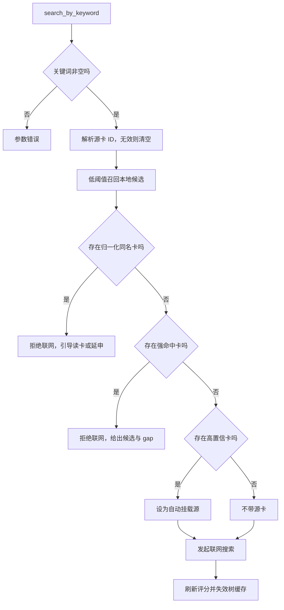
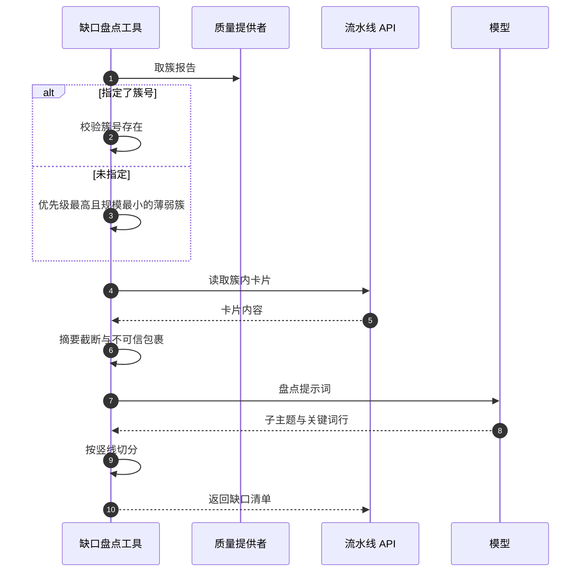

# 写层工具与缺口盘点

写层工具是唯一会改变知识库的一类，因此实现里塞了大量“先别写”的检查。关键词搜索是最典型的例子：在联网之前，它先做标题精确预检、向量强命中拦截、自动挂载判定，只有都通不过才发起搜索。这些拦截的阈值全部来自质量模块的阈值文件，属于单一来源。

缺口语义上也是写的前置：先盘点一个主题域缺什么，再决定搜什么。它是处方层工具——只读但消耗一次模型调用，因此权限模式收紧时它比写层先被禁。

## 关键词搜索的本地拦截

搜索入口先校验关键词非空，再取最大来源数与可选源卡 ID（`backend/agent/tools.py:496-504`）。源卡 ID 会先解析，解析失败时不报错，而是清空它并继续走自动挂载（`:505-516`）。注释写明选择这种处理的原因：无效 ID 如果中断流程，模型会被卡在一次可恢复的错误上。

拦截按顺序发生：

| 顺序 | 检查 | 阈值或依据 | 命中后的动作 |
| --- | --- | --- | --- |
| 1 | 标题归一化精确同名 | 精确相等 | 拒绝联网，引导读卡或延申 |
| 2 | 向量强命中 | 召回门槛 0.25，强命中 0.65 | 拒绝联网，给出候选与 gap |
| 3 | 高置信自动挂载 | 0.7 | 允许联网，新卡自动挂到该卡 |
| 4 | 无高置信 | — | 允许联网，返回候选父卡建议 |

第一步不联网、不编码，是整条链里最便宜的一步（`:532-546`）。注释解释了它不可替代的原因：向量相似度需要编码，而“PID控制”与“PID 控制”这类变体只有精确归一化能稳定拦住。

第二步先做低阈值召回，再用强命中门槛筛选（`:524-530`、`:548-570`）。召回层从宽是为了不漏候选，最终判断仍交给模型读卡确认。注释记录阈值从 0.80 放宽到 0.65 的意图：让模型更愿意读本地卡。

第三步的自动挂载阈值刻意设到 0.7，注释给出了反例日志：阈值 0.5 加根卡兜底时，蜥蜴人、矮人、种族特性、技能学派全部挂到根卡，知识库退化成“一个根加一排并列子卡”（`:517-522`）。代码里明确写着“不再根卡兜底”，低于门槛的挂载层级交给模型用建链工具决定（`:575`）。

搜索成功后刷新质量评分并失效树缓存（`:593-595`）。未自动挂载时，摘要里附带相似度最高的三张候选父卡，并说明建链工具支持直接传标题（`:596-607`）。这条提示是“把结构决策交回模型”的落地方式。

## 延申与刷新怎么写库

延申先解析源卡，再调用流水线 API，固定最多提取 6 个主题（`:618-636`）。新卡片由后端自动链到源卡，成功后同样刷新评分与树缓存（`:647-649`）。摘要是固定的“生成 N 张新卡片，新卡已自动链接到源卡”。

刷新是三步写操作（`:657-720`）：

1. 用原卡标题重新搜索，关键参数是“不持久化”——只生成候选内容，不产生新卡（`:674-677`）；
2. 在候选里挑“正文字符数最多、来源数最多”的那张（`:690`）；
3. 更新原卡的正文、元数据与来源，然后失效该卡评分并刷新全局（`:693-702`）。

搜索失败时原卡保持不变，返回失败并带上任务错误信息（`:679-688`）。刷新只替换内容，不改变树结构。

| 工具 | 写什么 | 是否新建卡 |
| --- | --- | --- |
| 关键词搜索 | 新卡，可能自动挂链 | 是 |
| 延申 | 新卡，自动挂到源卡 | 是 |
| 刷新 | 覆盖原卡正文与来源 | 否 |

## 建链与父卡方向

建链要求两个标识都存在，缺一个就返回点名错误（`:1082-1088`）。两张卡相同直接拒绝（`:1091-1092`）。

两个标识分别解析，失败时区分是哪一侧无效（`:1094-1110`）。注释解释了为什么要分开报：模型常见错误是一张传 ID、另一张传标题，合在一起报会让它不知道改哪边（`:1093`）。

写库后失效树缓存（`:1114`）。父卡参数决定是否改树结构：传 `a` 表示 A 是 B 的父卡，传 `b` 反之，不传只建立无向链接（`:1121-1122`）。摘要里会把实际方向说清楚。

## 缺口盘点的选簇与模型调用

缺口盘点先用簇报告（`:992-1000`）。指定簇号时校验存在性，不存在则返回可用提示（`:1001-1008`）。未指定时只在薄弱簇里选，没有薄弱簇就建议指定簇号（`:1009-1016`）。

选择规则是“优先级最高、同等优先级下规模最小”（`:1016`）。规模小的簇先补，符合“小主题更容易补齐”的直觉。

随后读取簇内卡片，正文压成 300 字摘要并做不可信包裹（`:1018-1026`）。提示词要求列出 3 到 8 个缺失子主题，每个给一个中文搜索关键词，输出格式是“子主题 | 关键词”，不要多余解释（`:1033-1040`）。

调用模型时每次新建一个提供者实例，用配置加载函数取配置，整体超时 120 秒（`:1042-1045`）。超时与其它失败分别返回不同摘要。解析时只接受含竖线的行，按第一个竖线切分（`:1058-1064`），没有有效行则返回失败并附原始输出。

## 易错点

1. 认为搜索一定联网。四道本地拦截会先挡住。
2. 把自动挂载阈值当 0.5。实际是 0.7，且不再根卡兜底。
3. 认为无效源卡 ID 会报错。会清空并继续。
4. 认为延申需要手动建链。新卡自动链到源卡。
5. 把刷新当成新建卡。它覆盖原卡且不持久化候选。
6. 认为缺口盘点会补内容。它只给关键词清单。

## 小结

### 核心概念

| 概念 | 取值或做法 | 来源 |
| --- | --- | --- |
| 召回门槛 | 0.25 | `backend/agent/tools.py:529` |
| 强命中门槛 | 0.65 | `:551` |
| 自动挂载门槛 | 0.7，不做根卡兜底 | `:571-575` |
| 标题预检 | 归一化精确同名 | `:534-536` |
| 延申主题数 | 最多 6 个 | `:635` |
| 刷新选择 | 正文最长、来源最多 | `:690` |
| 建链方向 | 父卡参数 a 或 b，省略仅无向 | `:1121-1122` |
| 盘点选簇 | 优先级最高、规模最小 | `:1016` |
| 盘点超时 | 120 秒 | `:1045` |

### 设计权衡

| 决策 | 收益 | 代价 |
| --- | --- | --- |
| 多层本地拦截 | 减少无效联网 | 判定链较长 |
| 无效源卡不报错 | 流程可恢复 | 模型可能察觉不到 |
| 取消根卡兜底 | 结构不再平铺 | 挂载依赖模型主动建链 |
| 刷新不持久化候选 | 不产生垃圾卡 | 候选无法复用 |
| 盘点只给关键词 | 输出可执行 | 不直接补内容 |

## 练习

### 基础题

1. 按顺序列出关键词搜索的四道拦截与阈值。
2. 说明延申与刷新在写库上的差别。
3. 写出建链的父卡参数语义。

### 挑战题

4. 为自动挂载设计可配置阈值，说明如何避免根卡吸附问题复发。
5. 设计刷新的回滚方案，在更新后内容变短时恢复原卡。
6. 让缺口盘点输出结构化清单（含主题与关键词字段），说明提示词与解析的改动。

### 附：本页引用的路径

| 路径 | 用途 |
| --- | --- |
| `backend/agent/tools.py` | 写层工具与缺口盘点实现 |
| `backend/agent/tool_registry.py` | 工具描述与层级 |
| `backend/quality/thresholds.py` | 召回与挂载阈值 |
| `backend/quality/provider.py` | 簇报告与评分刷新 |
| `backend/ai/openai_provider.py` | 盘点调用的模型提供者 |
