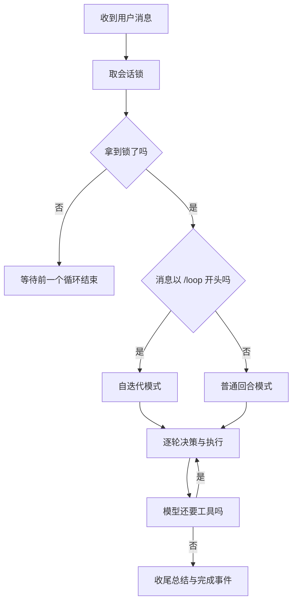
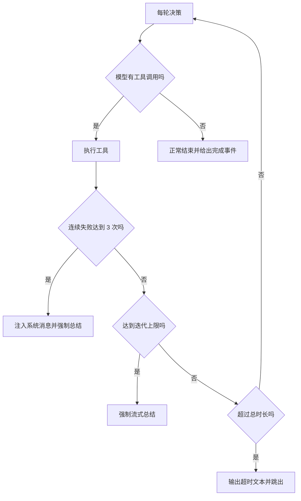

# 循环骨架与迭代预算

Agent 的运行是一个循环：把消息交给模型，模型要么给文本，要么给工具调用，执行工具后再把结果交回去，直到模型不再要工具。这听起来简单，但工程上有两个必须钉死的上限——否则一次错误决策可能让循环转几十圈、烧掉大量调用。

仓库里有两种循环形态。普通模式按轮次走，适合对话；以特定前缀开头的消息进入自主迭代模式，允许连续改进知识库。两者的 SSE 事件序列不同，但共用同一套决策、执行与持久化组件。

## 两种模式的回合结构

模块开头写明了事件序列（`backend/agent/loop.py`）：

| 模式 | 事件序列 |
| --- | --- |
| 普通 | 工具调用、工具结果若干轮，然后文本，最后完成 |
| 自迭代 | 每轮工具调用、工具结果、文本，重复 N 轮，最后完成 |

自迭代模式由消息前缀触发，前缀后的内容作为本轮目标，为空时用默认目标“持续改进知识库质量”。

| 常量 | 取值 | 说明 |
| --- | --- | --- |
| 最大迭代轮数 | 50 | — |
| 总超时 | 1800 秒 | 注释按每轮 30 到 60 秒估算 |
| 普通工具超时 | 300 秒 | 与全局 Agent 超时一致 |
| 延申工具超时 | 600 秒 | 多子主题搜索抓取生成 |
| 心跳间隔 | 15 秒 | 工具执行期间保持 SSE 有数据 |

超时被拆成两档，注释给出了理由：延申要跑多个子主题的“搜索加抓取加生成”，三个主题就能把 300 秒打满，误杀会让整轮失败。

## 每会话互斥

同一会话的两个循环不能并行，否则历史会被交叉写入。互斥用会话级锁实现：

```python
# 示意：每个会话一把锁
locks: dict[str, asyncio.Lock] = {}

async def run_once(session_id):
    lock = locks.setdefault(session_id, asyncio.Lock())
    async with lock:                 # 同会话串行，跨会话并行
        await agent_loop(session_id)
```

"互斥锁"保证同一时刻只有一个协程持有它：粒度选在会话上而不是全局，是因为不同会话之间没有共享状态，锁太粗会白白牺牲并发。

进入循环前先取该会话的锁：

```python
ctx = AgentContext.get()
lock = ctx.lock(username, session_id)
async with lock:
    ...
```

锁的粒度是“用户加会话”，同一会话同时只能有一个循环。这样后台循环与用户新消息不会并发改写同一份历史。



## 实验模式裁剪工具与注入

实验模式来自配置，默认全量。两种取值：

| 模式 | 工具 schema | 树摘要注入 |
| --- | --- | --- |
| full | 全部十三个 | 开启 |
| no_quality | 去掉四个质量类工具 | 关闭 |
| 未知值 | 回退全量并记警告 | 开启 |

被移除的四个工具是卡片质量评估、库评估、探索评估、缺口盘点。这样消融实验比较的是“有质量信号与无质量信号”的差异。

权限收紧时还会二次裁剪：把被禁用层级对应的 schema 直接从列表里去掉。注释说明了动机——避免模型反复调用必然被拒的工具，既浪费轮次也污染历史。

## 卡数上下限的强制行为

两个配置项给实验设定了卡片数量边界：

| 配置 | 触发条件 | 行为 |
| --- | --- | --- |
| 上限 | 当前卡数达到上限 | schema 裁成只读，禁止新建 |
| 下限 | 当前卡数低于下限 | 禁止停止，必须继续扩展 |

上限通过每次决策前重算 schema 实现：达到上限后只剩读工具，模型无法再搜索。同时注入一条提示，说明达到实验上限并要求检查结构与收尾。

下限通过“即使模型给出总结文本也不结束”实现：检查卡数不足就继续下一轮，并注入一条禁止停止的提示，给出优先延申叶子卡、延申为空再搜索的替代路径。

## 循环的出口

出口有五类：

1. 模型给出文本且没有工具调用（正常停止）；
2. 工具连续失败达到三次，注入系统消息并强制总结；
3. 达到最大迭代轮数，强制流式总结；
4. 总超时，输出超时文本并跳出；
5. 循环过程中被取消或抛异常。

普通模式的出口类似，以最大回合数与全局超时约束，并在轮数耗尽时补一次收尾总结。

每一次出口前都会调用裁剪，把历史压到配置的消息上限内（、）。自迭代模式还会每五轮额外裁剪一次，上限翻倍。



## 一处静默回退

自迭代分支整体包在异常处理里，异常被直接忽略：

```python
try:
    if is_loop:
        ...
except Exception:
    pass
```

异常不记录日志、不返回错误事件。更需要注意的结果是：如果自迭代分支中途抛错，控制流不会结束生成器，而是继续进入下面的普通回合循环。也就是说，一次自迭代运行在出错后可能以普通模式继续，上层从事件流上不容易分辨。这是从代码读出的行为，未构造异常复现。

## 易错点

1. 认为自迭代没有上限。轮数与总时长都有上限。
2. 忽略工具超时有两档。延申是 600 秒。
3. 认为实验模式只是少几个工具。树注入也一起关。
4. 认为卡数上限只靠提示。schema 本身被裁成只读。
5. 低估每五轮一次的双倍裁剪。历史会被更激进地压缩。
6. 忽略自迭代分支的静默异常回退。出错可能转入普通模式。

## 小结

### 核心概念

| 概念 | 取值或做法 | 来源 |
| --- | --- | --- |
| 触发前缀 | `/loop` | `backend/agent/loop.py` |
| 迭代上限 | 50 轮 | — |
| 总超时 | 1800 秒 | — |
| 工具超时 | 普通 300、延申 600 秒 | — |
| 心跳 | 15 秒 | — |
| 互斥 | 每用户每会话锁 | — |
| 实验模式 | full 与 no_quality | — |
| 卡数上限 | schema 裁成只读 | — |
| 卡数下限 | 禁止停止 | — |
| 失败熔断 | 连续三次工具失败 | — |

### 设计权衡

| 决策 | 收益 | 代价 |
| --- | --- | --- |
| 双循环形态 | 对话与自主改进各得其所 | 两套出口逻辑需同步维护 |
| 延申单独超时 | 不误杀长任务 | 单轮可占用十分钟 |
| 权限层裁剪 schema | 模型不会试必然失败的调用 | 工具列表随配置变化 |
| 卡数上限裁只读 | 硬性限流 | 模型可能仍尝试旧计划 |
| 自迭代异常静默 | 不向用户抛栈 | 回退路径不可见 |

## 练习

### 基础题

1. 写出两种模式的 SSE 事件序列与触发条件。
2. 列出五个循环出口与各自的收尾动作。
3. 说明实验模式对工具与树注入的影响。

### 挑战题

4. 为自迭代分支的异常增加日志与错误事件，说明对上层协议的影响。
5. 设计按“质量提升幅度”提前停止的策略，给出信号与阈值来源。
6. 让卡数上限与下限可同时生效，说明冲突时的优先级设计。

### 附：本页引用的路径

| 路径 | 用途 |
| --- | --- |
| `backend/agent/loop.py` | 双模式循环、预算与出口 |
| `backend/agent/context.py` | 会话锁与历史 |
| `backend/agent/tools.py` | 工具执行器 |
| `backend/agent/tool_registry.py` | 层级与权限裁剪 |
