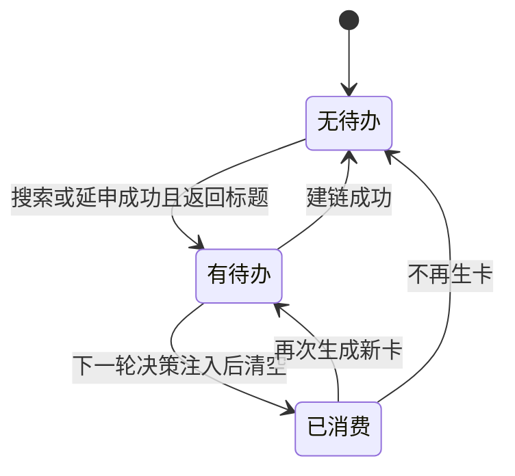

# 决策消息与动态注入

每轮决策都要把一份消息列表交给模型。这份列表里既有持久化的会话历史，也有只在这一轮有效的动态内容：当前知识库树、用户最新指令、上一轮工具失败的纠正建议、新卡生成后的挂载待办。动态内容如果随手插在历史中间，会破坏跨轮稳定的前缀，让提供方的缓存失效，成本上升。

实现的做法是纪律性的：历史保持只追加，所有动态内容合并成一条消息放在最末尾。这样每一轮的“系统提示加历史”构成连续前缀，只有尾部在变。

## 前缀缓存的排布规则

排布规则写成示意是这样：

```python
# 示意：每轮决策的消息排布
messages = [system_prompt] + history          # 稳定前缀：历史只追加，不改写
messages.append(dynamic_block(               # 动态内容合并成"一条"，放最末尾
    tree=tree_summary(),                     #   当前知识库树
    hint=latest_user_hint(),                 #   用户最新指令
    correction=last_tool_error_fix(),        #   上一轮工具失败的纠正
    mount=todo_after_new_card(),             #   新卡生成后的挂载待办
))
```

"前缀缓存"指模型服务商把请求开头那段相同内容的结果缓存下来、后续只计算变化部分，从而降价提速。它的生效条件是前缀逐字节一致：把动态内容插到历史中间，后面所有轮次的前缀都会变，缓存全部失效。

构建决策消息的函数注释写得很清楚（`backend/agent/loop.py`）：系统提示加追加式历史是跨轮稳定的连续前缀；树摘要、用户最新指令等动态内容全部合并为一条 user 消息追加到最末尾，绝不插在历史中间。

| 位置 | 内容 | 是否持久化 |
| --- | --- | --- |
| 开头 | 系统提示 | 是 |
| 中间 | 对话与工具结果，只追加 | 是 |
| 末尾 | 树摘要加决策要求、用户最新指令 | 否 |
| 末尾 | 纠正引导、挂载待办、卡数上下限提示 | 否 |

末尾的动态消息会把多段内容用空行连接成一条。树摘要后面固定跟一段决策要求：新卡必须挂到最相关节点下，可以传源卡 ID 或事后建链；不得平铺成并列根卡；优先在已有节点下延申。


## 树摘要的产生与缓存

树摘要取自卡片树，递归转成缩进文本，每个节点标出子卡数与正文字符数，最多 60 行，超出时提示可用树工具看完整结构。为空时返回空字符串，不注入。

摘要走增量缓存：键是用户与会话，写层工具成功后失效，新一轮用户消息也失效。只读轮次直接命中缓存，不再查询数据库。工具侧在每次成功写库后调用失效（`backend/agent/tools.py`）。

| 事件 | 树摘要缓存 |
| --- | --- |
| 进入新一轮会话 | 失效 |
| 收到中途用户消息 | 失效 |
| 写层工具成功 | 失效 |
| 只读工具 | 不失效 |

## 工具失败后的纠正引导

失败引导由回调触发，内容是动态的、不进历史。`_build_correction` 按失败摘要里的关键词分派五种建议：

| 摘要特征 | 纠正建议 |
| --- | --- |
| 缺口盘点或含 `cluster_id` | 参数是整数簇号，先调库评估拿到簇号 |
| 含“未知工具” | 工具名拼错，从工具描述里选 |
| 含“不存在”或 `not found` | 先获取真实卡片 ID 或精确标题 |
| 含“参数” | 按描述核对参数名与类型 |
| 其它 | 按原因修正后重试，仍失败先看库里现状 |

这段映射的关键在于“失败摘要本身就是分派键”。它依赖摘要文本的措辞，属于隐式契约：改摘要文案可能让引导落空。

约束性反馈不算失败。返回里带“被拦”或“本地命中”标记的结果属于系统主动引导，不触发纠正。这类结果的成功标志是假，但语义上不是错误。

引导提示有一个容易忽略的行为：它在成功轮次不会被清除，只在下一次失败时被覆盖。也就是说一次失败之后，后续每一轮决策都会带上同一条建议，直到再次失败改写它。

## 挂载检查提示

新卡生成后的挂载待办由结果回调设置。触发条件是工具成功且名字是关键词搜索或延申，并且返回数据里有标题列表。提示内容要求紧接着做挂载检查：相关就立即建链并传父卡方向；新卡应作根卡则检查有无卡应挂到它下面；确实独立就说明原因。

这条提示的由来写在注释里：实测发现 Agent 生成新卡后从不建链，新卡全部平铺成孤立根卡，长提示词里的规则模型不遵守，于是改成在生卡后的下一轮直接下指令。

生命周期是三条：设置、一次性消费、被成功建链清除。消费发生在构建决策消息时，用过即清；而建链成功后直接清除，表示待办完成。



## 消息末尾的其它注入

除纠正与挂载，末尾还会按卡数上下限追加提示：

| 条件 | 注入内容 |
| --- | --- |
| 卡数达到上限 | 不要再建卡，检查结构并收尾 |
| 卡数低于下限 | 禁止停止，优先延申叶子卡，为空再搜索 |

下限提示给出的替代路径很有信息量：先延申，延申返回零张再改用关键词搜索。它把“如何凑够卡数”的方法写进了运行时指令。

## 剥离模拟工具调用

模型有时会在文本里写工具调用的样子，例如尖括号包起来的工具名，或者带扳手表情的“调用工具”行。这类文本如果进入历史，下一轮模型会模仿，形成表演工具调用的循环。剥离函数处理三种形态：

1. markdown 代码块包裹的 XML；
2. 未包裹的 XML 块，含自闭合形式；
3. 带扳手表情的工具行。

剥离发生在两处：流式文本收集完成、写进历史之前；以及决策文本带工具调用时写入历史之前。注意流式发出的 token 不做剥离——用户仍可能看到这些文本，剥离只保证历史干净。

## 易错点

1. 把动态内容插进历史中间。会破坏前缀缓存。
2. 认为树摘要每轮都查询。只读轮次命中缓存。
3. 认为纠正引导是持久对话。它只在决策时追加。
4. 认为引导用完即清。它持续到下一次失败覆盖。
5. 认为流式输出已被剥离。剥离只作用于历史。
6. 认为约束性反馈会触发纠正。被明确排除。

## 小结

### 核心概念

| 概念 | 取值或做法 | 来源 |
| --- | --- | --- |
| 消息排布 | 历史在前，动态内容合并到末尾 | `backend/agent/loop.py` |
| 树摘要 | 最多 60 行，带子卡数与字数 | — |
| 摘要缓存 | 写库与新一轮消息时失效 | — |
| 纠正分派 | 五种摘要特征 | — |
| 引导生命周期 | 不随成功清除 | — |
| 挂载提示 | 生卡后设置，消费或建链后清除 | — |
| 卡数注入 | 上限禁建、下限禁停 | — |
| XML 剥离 | 三种形态，只作用于历史 | — |

### 设计权衡

| 决策 | 收益 | 代价 |
| --- | --- | --- |
| 动态内容放末尾 | 前缀缓存命中 | 模型要靠末尾指令保持注意 |
| 树摘要缓存 | 只读轮次零查询 | 缓存失效点需覆盖写路径 |
| 纠正按摘要分派 | 失败能转成学习 | 依赖摘要措辞 |
| 挂载提示一次性 | 不反复唠叨 | 模型未挂载时不再提醒 |
| 剥离只作用历史 | 用户可见原始输出 | 界面可能显示无效文本 |

## 练习

### 基础题

1. 说明决策消息的排布规则与原因。
2. 列出纠正引导的五种分派特征。
3. 描述挂载提示的三个生命周期节点。

### 挑战题

4. 用结构化错误码替代摘要文本分派，给出改造方案。
5. 让纠正引导在成功轮次后自动衰减或清除，说明判据。
6. 评估在流式输出阶段也剥离模拟调用的影响与风险。

### 附：本页引用的路径

| 路径 | 用途 |
| --- | --- |
| `backend/agent/loop.py` | 决策消息、摘要缓存与提示注入 |
| `backend/agent/tools.py` | 树缓存失效入口 |
| `backend/agent/tree_cache.py` | 树摘要增量缓存 |
| `backend/agent/context.py` | 系统提示与历史 |
