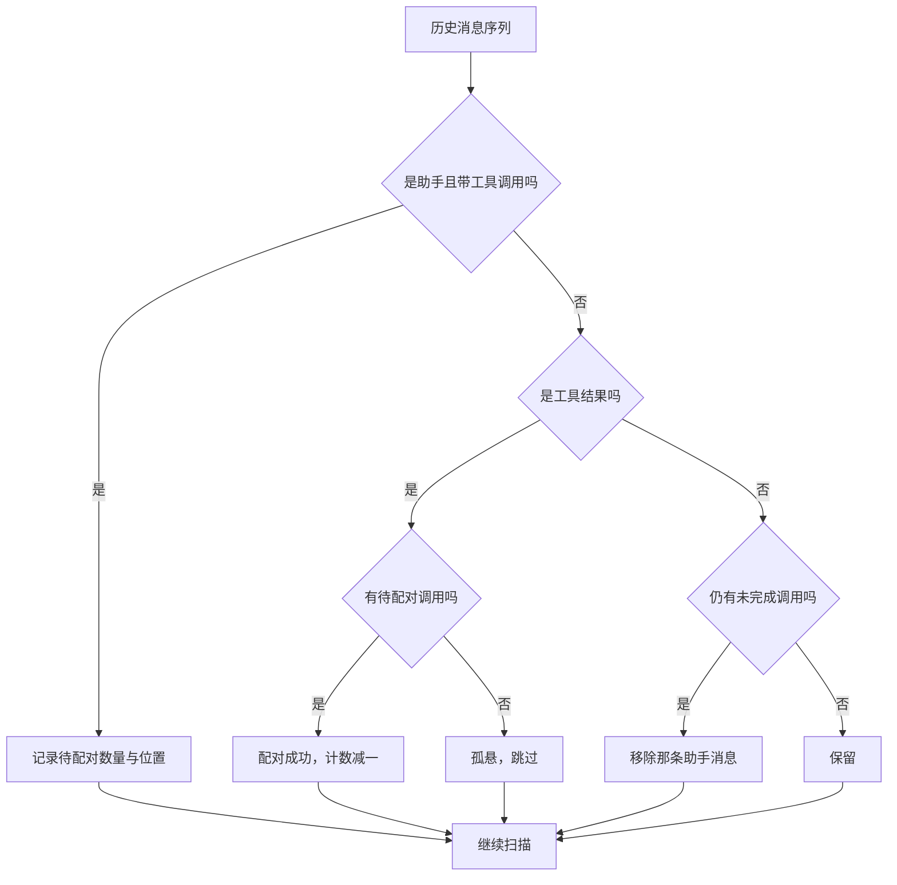
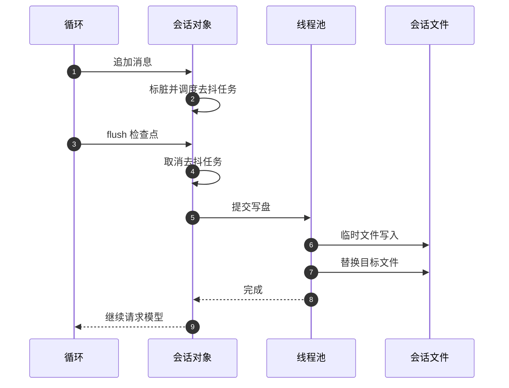

# 会话上下文与持久化

Agent 的会话历史需要跨请求存活，因为用户可能刷新页面、换设备继续，或者让后台循环跑上半小时。历史如果只放在内存，进程重启就丢；如果每个消息都同步写盘，又会在热路径上阻塞事件循环。实现选择中间路线：内存为准，磁盘异步投影，关键边界强制落盘。

历史还必须在交给模型前做一次核对。模型接口对工具消息的配对要求很严：工具结果必须紧跟在带工具调用的助手消息之后。中途取消、超时或裁剪都可能留下半截配对，直接发出去会被服务拒绝。上下文模块专门有一段清洗逻辑处理这件事。

## 历史放在哪

会话文件按“用户加会话号”存放（`backend/agent/context.py:80-85`）：

```python
def _session_dir(username): return Path("data/agent") / username
def _session_path(username, session_id): return _session_dir(username) / f"{session_id}.json"
```

写入用“临时文件加替换”的原子方式（`:99-105`）：先写到同名的临时文件，再替换目标。这样即使写一半进程退出，也不会留下半个 JSON 文件。读取失败时返回空值而不是抛错（`:88-96`），调用方按“没有历史”处理。

## 加载时的两处处理

构造会话时读文件，然后做两件事（`:164-169`）：

| 情况 | 处理 |
| --- | --- |
| 有历史且首条是系统消息 | 用当前系统提示覆盖首条内容，再清洗 |
| 其它 | 全新历史，只放系统提示 |

覆盖首条系统消息意味着系统提示的更新会立即应用到旧会话，不需要清空历史。清洗函数负责修复半截的工具配对（`:115-154`），它处理三种畸变：

| 畸变 | 处理 |
| --- | --- |
| 孤悬工具消息，前面没有工具调用 | 跳过 |
| 工具调用后跟的结果数量不足 | 移除该助手消息 |
| 末尾工具调用没有任何结果 | 移除 |

清洗是流式的：顺序扫描，用“待配对数量”和“最近一次工具调用在结果列表里的位置”两个状态判断是否完整（`:126-150`）。新的工具调用打断旧的未完成调用时，旧的会被删掉（`:131-134`）。



## 热路径与落盘

消息追加只改内存并标脏（`:237-273`），然后调度一个去抖任务：等半秒再写盘（`:195-207`）。同一轮里连续追加多条消息，会被合并成一次写盘。写盘本身放进线程池，不阻塞事件循环（`:209-215`）。

| 阶段 | 行为 | 是否碰磁盘 |
| --- | --- | --- |
| 追加消息 | 改内存、标脏、调度任务 | 否 |
| 去抖等待 | 半秒内继续合并 | 否 |
| 异步落盘 | 线程池写文件 | 是 |
| 检查点落盘 | 取消等待，立即写并等完成 | 是 |

检查点由循环在每次模型请求前调用（`:217-233`）。它的语义是“模型看到的都必须已经落盘”：先取消还没触发的去抖任务，再立即持久化并等待完成。失败只记日志，不打断本轮（`:232-233`）。

还有一个细节：没有事件循环的同步调用路径会退化为直接同步保存（`:185-191`），保持旧行为可用。



## 裁剪与工具配对

裁剪保留全部系统消息，只对非系统消息设上限（`:278-289`）。裁切点如果落在工具消息上，会向前回溯到对应的助手工具调用消息，避免产生孤悬工具（`:284-287`）。

循环在每次出口前裁剪一次，自迭代模式每五轮再额外裁剪一次、上限翻倍（`backend/agent/loop.py:543-544`）。额外裁剪的意义是长循环下主动回收上下文。

## 内存会话与淘汰

会话对象按“用户与会话号”的键保存在单例里（`:312-352`）。上限 50 个，超出时淘汰最久未活跃的那个，同时清理它的锁（`:330-339`）。

锁是每键一把，循环进入时获取（`:348-352`）。淘汰与清空都会同时移除锁与历史，避免锁留在字典里泄漏。

## 系统提示里有什么

系统提示是一个长字符串（`context.py:24-77`），内容分四块：

| 块 | 内容 |
| --- | --- |
| 质量分数解释 | 各字段含义与判读阈值 |
| 工作流 | 先本地检索，联网前先评估，刷新是最后手段 |
| 知识库构建规范 | 概念命名、领域限定、禁止孤立卡、搜索节奏 |
| 规则 | 中文回答、如实报告失败、禁止模拟工具调用 |

质量字段的解释需要单独记住：它写明各维度默认值 0.5 表示“无法评估”而不是“质量中等”（`:37`）；语义分缺少向量或没有可比邻居时取 0.5（`:32`）；`gap_percentile` 是会话内相对位置，1.0 表示本会话最弱，不等同绝对质量（`:38`）。这几句直接决定模型如何解读评分，写错会系统性误导判断。

工作流部分还写入了搜索节奏的硬性要求：两次关键词搜索之间必须至少调用一次读层工具；返回被拦或本地命中时必须停下来读本地卡（`:64`）。这条规则与执行器的搜索熔断是同一意图的两个层次：一个在提示层劝导，一个在代码层强制。

## 易错点

1. 认为追加消息会立即写盘。它只标脏。
2. 忽略检查点的取消语义。它会打断去抖等待。
3. 认为清洗只处理孤立工具消息。还处理结果不足与末尾悬空。
4. 认为裁剪只按条数。它还会回溯保证配对。
5. 忽略会话上限 50 与淘汰策略。
6. 把 0.5 当作质量中等。提示里写明是无法评估。

## 小结

### 核心概念

| 概念 | 取值或做法 | 来源 |
| --- | --- | --- |
| 存储位置 | `data/agent/用户/会话.json` | `backend/agent/context.py:80-85` |
| 写盘方式 | 临时文件加替换 | `:99-105` |
| 加载处理 | 覆盖系统提示并清洗 | `:164-169` |
| 清洗畸变 | 孤悬工具、结果不足、末尾悬空 | `:115-154` |
| 去抖间隔 | 0.5 秒 | `:22` |
| 检查点 | 取消去抖后立即落盘 | `:217-233` |
| 裁剪 | 保留系统消息，回溯配对 | `:278-289` |
| 会话上限 | 50，淘汰最久未活跃 | `:330-339` |
| 默认值语义 | 0.5 表示无法评估 | `:37` |

### 设计权衡

| 决策 | 收益 | 代价 |
| --- | --- | --- |
| 内存为准、磁盘异步 | 热路径不阻塞 | 崩溃可能丢半秒内更新 |
| 检查点强制落盘 | 模型所见已持久化 | 每轮多一次写盘等待 |
| 清洗替代报错 | 旧历史可继续使用 | 静默删除部分消息 |
| 裁剪回溯配对 | 不产生非法请求 | 实际保留条数略多于上限 |
| 内存会话上限 50 | 防止无界增长 | 高并发下会淘汰活跃会话 |

## 练习

### 基础题

1. 写出会话文件的路径规则与写盘方式。
2. 说明三种需要清洗的畸变及处理。
3. 对比去抖落盘与检查点落盘的差别。

### 挑战题

4. 给清洗过程加统计日志，说明需要的字段与用途。
5. 设计会话淘汰的可配置策略（按活跃时间或按内存占用）。
6. 把系统提示拆成版本化文件并记录每轮使用的版本，说明收益。

### 附：本页引用的路径

| 路径 | 用途 |
| --- | --- |
| `backend/agent/context.py` | 会话历史、持久化与系统提示 |
| `backend/agent/loop.py` | 检查点与裁剪调用点 |
| `backend/agent/routes/agent.py` | 历史读取与清空接口 |
| `backend/agent/tree_cache.py` | 树摘要缓存 |
