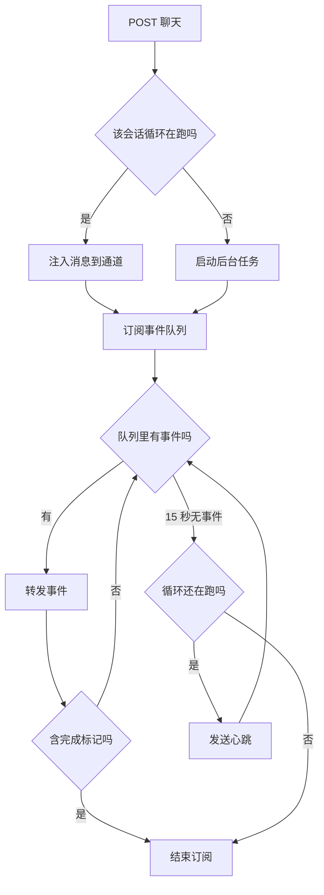
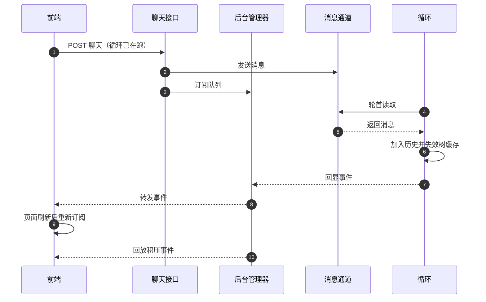

# 后台循环与消息通道

如果让 SSE 响应直接消费循环生成器，前端一断开，生成器就被取消，正在跑的工具和后台流水线任务也跟着被取消。用户刷新一次页面，半小时的工作可能白做。这个模块存在的理由就是解决这一件事：把循环放到后台任务里跑，SSE 只是订阅者。

解耦之后，循环的生命周期与连接生命周期分开。断开只结束订阅；重新连接后订阅同一个事件队列，还能看到断开期间积压的事件。用户中途发消息也不再需要新开一轮，而是通过一个通道注入正在运行的循环。

## 后台任务与事件队列

管理器是单例，内部按“用户与会话”维护两张表：任务与队列（`backend/agent/manager.py:26-43`）。启动逻辑很短（`:49-71`）：

```python
def start(self, key: str, generator) -> None:
    if self.is_running(key):
        return
    q: asyncio.Queue = asyncio.Queue()
    self._queues[key] = q

    async def _consume() -> None:
        try:
            async for event in generator:
                await q.put(event)
        ...
        finally:
            await q.put(_sse("complete", {"turns": -1, "tools_used": [], "interrupted": True}))
            await asyncio.sleep(0.2)
            self._queues.pop(key, None)
            self._tasks.pop(key, None)

    self._tasks[key] = asyncio.create_task(_consume())
```

同一个键已有运行中的循环时，启动请求被忽略（`:50-52`），不会出现两个循环抢同一份历史。

消费任务的三种结束路径都会写入队列：正常结束不额外写；被取消写一条取消错误；异常写一条错误消息（`:56-64`）。无论哪种路径，收尾都会补一条“完成”事件并标记为已中断（`:65-69`）。清理队列与任务前等待 0.2 秒，给订阅者一点时间把最后的事件读走。

## 订阅与心跳

订阅逻辑处理三种情况（`:73-91`）：

| 情况 | 行为 |
| --- | --- |
| 没有队列或循环不在跑 | 返回一条错误事件后结束 |
| 15 秒内收到事件 | 立即转发 |
| 15 秒无事件且循环仍在跑 | 发送心跳注释行 |

心跳用的是 SSE 注释行，前端不展示内容但能据此判断连接存活（`:89`）。注释说明前端只看“有没有数据”。

结束判定用的是字符串包含：事件里出现完成标记就返回（`:84-85`）。这是从代码读出的一个粗糙点——它不解析 JSON，只做子串匹配，语义上依赖事件格式保持稳定。

需要注意完成事件可能出现两次：生成器自身在出口处会发一条完成事件，管理器的收尾也会补一条标记中断的完成事件。订阅者在第一条处就返回，因此第二条通常不会被读到，但队列里确实存在。这是从代码读出的顺序，未实际观测双事件。



## 中途消息的注入通道

通道模块只做一件事：接收外部消息、交给循环（`backend/agent/bridge.py:1-38`）。结构是按键维护的队列，注册时创建，注销时删除，发送时若没有队列就静默丢弃（`:24-28`），接收是非阻塞的，队列为空返回空值（`:30-37`）。

循环在两处读取通道：自迭代模式在每轮开头（`backend/agent/loop.py:476-480`），普通模式在每个回合开头（`:563-568`）。读到消息后做三件事：加入历史、失效树摘要缓存、向界面回显一条“收到用户消息”的文本事件。

| 步骤 | 目的 |
| --- | --- |
| 加入历史 | 让模型在下一轮看到指令 |
| 失效树缓存 | 外部可能已改库 |
| 回显事件 | 让用户知道消息已送达 |

普通模式还会把它记为“用户最新指令”，在决策消息末尾再强调一次（`:563-565`），因为普通模式一轮可能包含多次模型调用。



## 四个接口

路由模块提供四个端点（`backend/agent/routes/agent.py`）：

| 方法与路径 | 作用 | 关键行为 |
| --- | --- | --- |
| `GET /api/agent/history` | 读历史 | 取或建会话后返回消息列表 |
| `POST /api/agent/chat` | 发消息 | 循环在跑则注入，否则启动 |
| `GET /api/agent/stream` | 重连订阅 | 无循环时返回错误事件 |
| `POST /api/agent/clear` | 清空 | 删会话与锁 |

聊天接口的分支逻辑体现了整体设计（`:36-66`）：先算键，若循环在跑，就把消息发进通道再订阅；否则用消息启动新循环再订阅。两条路径返回的响应头一致，都关闭缓冲并禁用缓存（`:45-48`），保证事件及时到达。

重连端点注释写明用途是刷新页面后回连，并强调断开订阅不影响循环继续运行（`:74-76`）。历史端点直接用会话对象的转模型消息方法，返回完整消息列表（`:22-24`），前端可据此恢复界面。

## 易错点

1. 认为断开 SSE 会取消循环。循环在后台任务里。
2. 认为刷新会丢失进度。重连可订阅同一队列回放积压。
3. 忽略 15 秒无事件发心跳。这是连接存活的判据。
4. 认为完成事件只有一条。管理器收尾还会补一条。
5. 认为通道会缓存未送达消息。没有队列时静默丢弃。
6. 认为重复启动会开两个循环。已运行时直接忽略。

## 小结

### 核心概念

| 概念 | 取值或做法 | 来源 |
| --- | --- | --- |
| 解耦方式 | 后台任务加事件队列 | `backend/agent/manager.py:1-9` |
| 重复启动 | 直接忽略 | `:49-52` |
| 收尾事件 | 完成并标记中断 | `:65-69` |
| 心跳 | 15 秒超时发注释行 | `:82-89` |
| 结束判定 | 事件字符串含完成标记 | `:84-85` |
| 通道 | 每键队列，非阻塞收发 | `backend/agent/bridge.py:12-37` |
| 通道读取点 | 每轮或每回合开头 | `backend/agent/loop.py:476`、`:563` |
| 接口数 | 四个 | `backend/agent/routes/agent.py:15-101` |

### 设计权衡

| 决策 | 收益 | 代价 |
| --- | --- | --- |
| 循环后台运行 | 断连不丢工作 | 需要额外的生命周期管理 |
| 队列订阅与回放 | 刷新后接着看 | 队列在内存，进程重启即失 |
| 心跳注释行 | 连接存活可观测 | 15 秒粒度较粗 |
| 子串判定完成 | 实现简单 | 依赖事件格式稳定 |
| 通道无队列即丢弃 | 不会堆积消息 | 循环结束后消息静默丢失 |

## 练习

### 基础题

1. 说明循环与 SSE 解耦要解决的具体问题。
2. 写出订阅的三种情况与处理。
3. 列出四个接口的作用与关键行为。

### 挑战题

4. 把完成判定改为解析 JSON 事件类型，说明兼容与回归方案。
5. 为通道增加投递确认或离线缓冲，说明对交互体验的影响。
6. 设计循环状态的查询接口（运行中、已用轮数、最近事件序号）。

### 附：本页引用的路径

| 路径 | 用途 |
| --- | --- |
| `backend/agent/manager.py` | 后台任务、队列与订阅 |
| `backend/agent/bridge.py` | 中途消息通道 |
| `backend/agent/routes/agent.py` | 四个 Agent 接口 |
| `backend/agent/loop.py` | 通道读取点与事件产出 |
