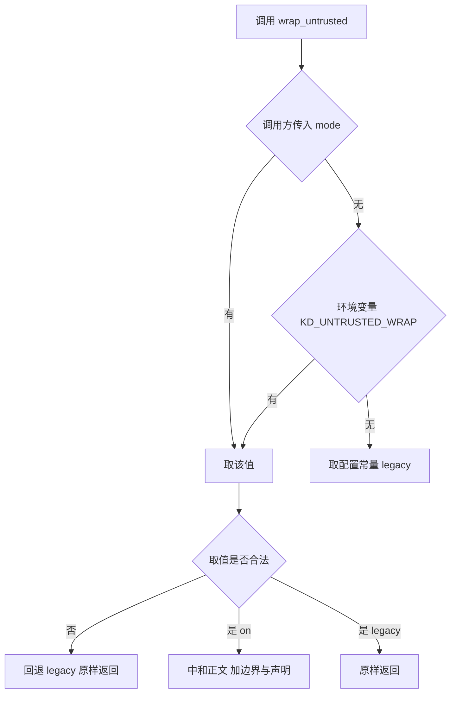
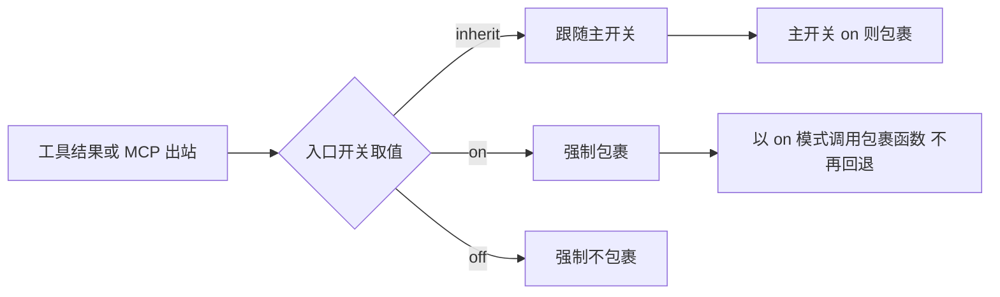

# 包裹协议与边界中和

隔离方案落地成一条字符串拼接规则。规则本身很短：首尾各放一个标记，标记之间先写声明、再写内容。但要让它在工程上可用，需要回答几个细节问题：内容里自带标记怎么办、来源说明写在哪里、已经包裹过的内容再包一次怎么办、导出展示时怎么取回原文。

这些细节都有对应的实现，而且每一个都对应一类真实故障。以下按包裹的字段、模式解析、入口开关与取回四个部分展开。

## 包裹的字段构成

一条包裹好的文本长这样（`backend/agent/untrusted.py:75-96`）：

| 位置 | 内容 | 说明 |
| --- | --- | --- |
| 第一行 | 开始标记 | 固定常量，模型据此识别边界 |
| 第二行 | 不可信声明 | 固定文案，声明其中的指令不得执行 |
| 可选行 | 来源说明 | 形如「来源: card:某标识」 |
| 分隔行 | 三个短横线 | 把声明与正文分开，便于 strip 取正文 |
| 正文 | 已中和的外部内容 | 内容里的边界标记已被替换 |
| 最后一行 | 结束标记 | 固定常量，闭合包裹 |

声明与来源说明的拼接方式是：有来源时在声明后另起一行写来源，没有来源时只有声明（`backend/agent/untrusted.py:93-95`）。分隔行是取回原文的定位锚点，strip 逻辑按它切开。

$$
\text{包裹} = \text{开始标记} + \text{声明} + \text{来源} + \text{分隔行} + \text{正文} + \text{结束标记}
$$

## 三种标记常量

模块里定义三个常量，名称与用途固定（`backend/agent/untrusted.py:39-41`）：

| 常量 | 取值 | 用途 |
| --- | --- | --- |
| 开始标记 | 三个尖括号包住 UNTRUSTED_EXTERNAL_CONTENT | 标识外部内容的起点 |
| 结束标记 | 同上，前缀带 END | 标识终点 |
| 替换标记 | 双方括号包住 UNTRUSTED_MARKER_REDACTED | 中和后的占位符 |

中和的做法是把正文里出现的开始与结束标记都替换成替换标记（`backend/agent/untrusted.py:61-63`）：

$$
\text{begin} \to \text{redacted}, \qquad \text{end} \to \text{redacted}
$$

替换而不是删除，是为了让审计者看到「这里原本有内容」而不是「这里本来什么都没有」。载荷里的标记被替换之后，整段包裹只剩首尾这一对边界，攻击者无法用它来提前闭合。

## 空内容与来源标签

两个容易忽略的细节。第一，空内容不包裹（`backend/agent/untrusted.py:88-90`）：

$$
\text{text} = \text{None} \; \text{或} \; \text{空串} \Rightarrow \text{原样返回}
$$

这条早返回保证空字符串不会变成一段只有边界与声明的文本。否则下游会看到一段非空内容，语义完全改变。

第二，来源标签也要中和。标签通常来自网页标题或上传文件名，这两个都是不可信输入，如果标题里含边界标记，同样会造成边界混乱（`backend/agent/untrusted.py:93-94`）。因此标签与正文走同一个中和函数。

$$
\text{safe\_label} = \text{neutralize}(\text{label})
$$

标签只用于让模型理解来源，不参与任何信任判断（`backend/agent/untrusted.py:86`）。这一点在实现上没有差别，但在语义上要写清楚：不能因为来源是可信号就提高信任，也不能因为来源不可信就降低到拒绝处理。

## 模式解析的优先级

模式解析按三级优先级（`backend/agent/untrusted.py:49-58`）：

| 优先级 | 来源 | 说明 |
| --- | --- | --- |
| 最高 | 调用方显式传入的 mode | 便于单测与灰度 |
| 中 | 环境变量 KD_UNTRUSTED_WRAP | 部署时统一设置 |
| 低 | 配置模块的默认常量 | 代码内默认 legacy |

解析结果是两种合法取值之一，其余一律回退 legacy（`backend/agent/untrusted.py:57-58` 与 `backend/quality/thresholds.py:103-105`）。回退策略的选择理由与默认值相同：任何拼写错误、空值、大小写问题都不应该让系统进入未定义行为。

$$
\text{mode} \in \{\text{legacy}, \text{on}\}, \qquad \text{其余取值} \Rightarrow \text{legacy}
$$

## 入口级开关的语义

主开关之外还有两个入口级开关，用来控制具体通道是否包裹（`backend/agent/untrusted.py:117-141`）：

| 入口 | 环境变量 | 配置属性 |
| --- | --- | --- |
| 工具返回值 | KD_UNTRUSTED_WRAP_TOOL_RESULTS | UNTRUSTED_WRAP_TOOL_RESULTS |
| MCP 资源 | KD_UNTRUSTED_WRAP_MCP | UNTRUSTED_WRAP_MCP |

两个入口各有三种取值语义：

| 取值 | 语义 |
| --- | --- |
| inherit | 跟随主开关，默认 |
| on | 强制包裹，无论主开关 |
| off | 强制不包裹，无论主开关 |

inherit 作为默认值是为了让部署只需要一个开关：打开主开关，所有登记过的入口一起生效；需要单独灰度某个入口时再用显式的 on 或 off。解析顺序是调用方覆盖、环境变量、配置属性，最后回退 inherit（`backend/agent/untrusted.py:128-141`）。

入口级的包裹函数在实现上直接以 on 模式调用包裹函数，不走主开关判断（`backend/agent/untrusted.py:144-155`）。这样入口开关与主开关的语义不会互相干扰：入口层已经决定要包，包裹层不再回退。

$$
\text{entry} = \text{on} \Rightarrow \text{wrap\_untrusted}(\cdot, \text{mode} = \text{on})
$$

## 判断与取回

模块提供两个配套函数。判断函数只检查首尾是否为一对边界（`backend/agent/untrusted.py:99-103`）：

$$
\text{is\_wrapped} = \text{startswith}(\text{begin}) \; \text{且} \; \text{rstrip 后 endswith}(\text{end})
$$

它不做完整解析，也不验证包裹内部是否还有别的标记。这样的设计够用于它的两个目的：测试断言与避免重复包裹（`backend/mcp/server.py:102-103`）。

取回函数用于展示与导出这类不需要边界的场景：先校验是否已包裹，再切掉首尾标记，然后按分隔行取声明之后的部分（`backend/agent/untrusted.py:106-114`）。

| 函数 | 输入 | 输出 |
| --- | --- | --- |
| is_wrapped | 任意文本 | 是否首尾为一对边界 |
| strip_wrap | 已包裹文本 | 原始外部内容 |
| neutralize | 任意文本 | 边界标记被替换的文本 |

三个函数的分工是：判断用于跳过重复包裹，取回用于展示，中和用于处理正文与来源标签。把中和单独暴露成公开接口，是为了让那些进入提示词但不在包裹体内的不可信元数据也能处理（`backend/agent/untrusted.py:66-72`）。

## 小结

### 核心概念

- 包裹由开始标记、声明、可选来源、分隔行、已中和正文与结束标记六部分构成。
- 三个常量分别是开始标记、结束标记与替换标记，中和把内容里的边界标记替换成替换标记。
- 空内容不包裹，来源标签与正文一样要中和，标签只说明来源不参与信任判断。
- 模式解析优先级为调用方、环境变量、配置常量，非法取值一律回退 legacy。
- 入口级开关有 inherit、on、off 三种语义，判断函数只查首尾边界，取回函数按分隔行取正文。

### 设计权衡

| 选择 | 带来的能力 | 付出的代价 |
| --- | --- | --- |
| 固定标记而非随机标记 | 模型可识别、实现简单 | 攻击者可读到协议 |
| 中和而非删除标记 | 审计可见原文痕迹 | 内容被改写一小段 |
| 空内容早返回 | 语义不变 | 需要单独测试这一路径 |
| 三级模式优先级 | 部署与单测都方便 | 需要文档写清覆盖关系 |
| is_wrapped 只查首尾 | 实现轻、用途明确 | 不能作为完整校验 |

## 练习

### 基础题

1. 写出包裹的六个组成部分与顺序，说明分隔行的作用。
2. 说明中和为什么用替换而不用删除，以及来源标签为什么要一起处理。
3. 复述模式解析的优先级与非法取值的处理。

### 挑战题

4. 设计一组单元测试覆盖空内容、来源含标记、内容含成对标记三种情形。
5. 分析 is_wrapped 只查首尾的局限，设计一个更严格的校验函数并说明代价。
6. 讨论入口级开关 inherit/on/off 的灰度用法，给出一次分入口上线的步骤。

## 附：本页引用的路径

| 路径 | 用途 |
| --- | --- |
| `backend/agent/untrusted.py` | 标记常量与声明（:39-46）、模式解析（:49-58）、中和与包裹（:61-96）、判断与取回（:99-114）、入口开关（:117-155） |
| `backend/config.py` | 三个开关的配置常量（:49-54） |
| `backend/quality/thresholds.py` | 合法取值集合（:103-105） |
| `backend/mcp/server.py` | 避免重复包裹的判断调用（:99-103） |
| `/mnt/d/KnowledgeDiver` | 素材仓库根，正文中素材路径均相对该根 |
