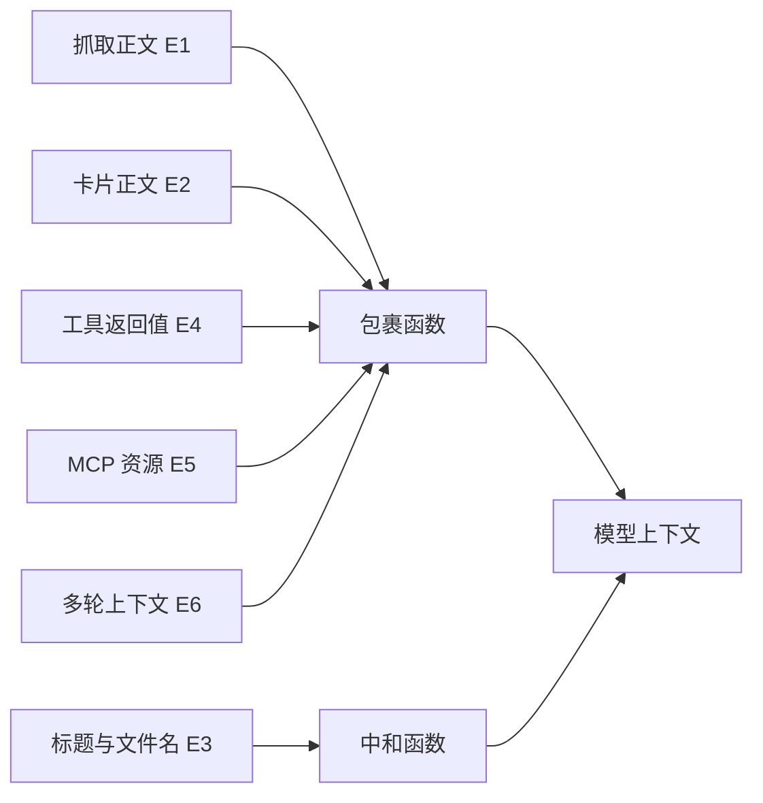
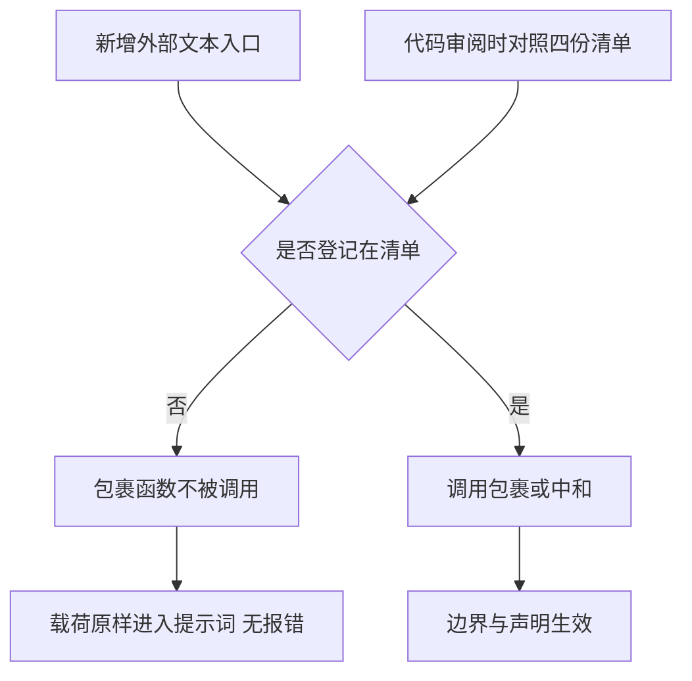

# 接入点与覆盖面

隔离代码写完之后，决定防护效果的关键在于它被调用的位置够不够全，而不在于这段代码本身有多严谨。外部文本进入模型上下文的位置有六类，只要有一类没有接上包裹函数，载荷就从那个口子原样进入提示词，而系统不会有任何报错：包裹函数没有被调用，自然也不会失败。

项目把这件事写成一份显式的接入点清单，并规定新增入口必须登记（`backend/agent/untrusted.py`）。以下先看入口的六类划分，再看四份清单各自覆盖哪些位置。

## 六个入口的分类

接入点在代码里是一份可被程序读取的清单（`backend/agent/untrusted.py`）：

```python
# 生成侧——抓取原文/文档正文进入提示词前包裹
GENERATION_INTEGRATION_POINTS = (
    "ai/openai_provider.py:generate_cards_from_sources 的 sources 正文",
    "ai/openai_provider.py:analyze_document_stream 的文档正文",
    "ai/openai_provider.py:summarize_with_metadata 的抓取正文",
)
# Agent 侧——卡片正文/摘要进入 Agent 上下文前包裹
AGENT_INTEGRATION_POINTS = (
    "agent/tools.py::_get_card_info",
    "agent/tools.py::_plan_knowledge_gaps",
)
# MCP 边界的出站与入站
TOOL_RESULT_INTEGRATION_POINTS = ("backend/mcp/server.py::to_mcp_content",)
MCP_INTEGRATION_POINTS = (
    "backend/mcp/server.py::to_mcp_content（出站资源文本）",
    "backend/agent/untrusted.py::wrap_mcp_resource_description（入站描述）",
)
PENDING_INTEGRATION_POINTS: tuple[str, ...] = ()
```

把"哪些位置必须包裹"写成常量元组的用处是：它让覆盖面可以被检索、被对照，新增入口时必须在`PENDING_INTEGRATION_POINTS`之外显式登记，否则就是漏接。这里的失效模式很特别——包裹函数不被调用时不会报错，载荷只是原样进入提示词，日志里没有任何异常。

威胁模型把外部文本进入模型上下文的路径分成六类（`research/pivot/profile_b_spec.md`）：

| 入口 | 名称 | 典型载体 |
| --- | --- | --- |
| E1 | 抓取网页正文 | 摘要、建卡提示词里的原文 |
| E2 | 卡片正文 | Agent 读到卡片内容 |
| E3 | 来源标题或文件名 | 提示词里的标题与文件名 |
| E4 | 工具返回值 | 工具结果跨 MCP 边界 |
| E5 | MCP 资源描述 | 外部 server 的资源文本 |
| E6 | 多轮上下文 | 历史消息里的残留载荷 |

两套注入用例在各入口上的分布如下（`scripts/agent_injection_eval/core.py` 与 `research/pivot/injection_cases.jsonl`）：

| 入口 | 官方 48 条 | 边界标记 18 条 | 说明 |
| --- | --- | --- | --- |
| E1 | 17 | 4 | 主入口，对应抓取正文 |
| E2 | 18 | 6 | 卡片正文，数量最多 |
| E3 | 2 | 0 | 标题与文件名 |
| E4 | 5 | 5 | 工具返回值，关键分化项 |
| E5 | 3 | 3 | MCP 资源，关键分化项 |
| E6 | 3 | 0 | 多轮上下文 |

E4 与 E5 是这份评测里的关键分化项：是否把这两类入口接入，直接决定中间档的数值（`research/pivot/profile_b_spec.md` 与）。因此接入点清单里它们被单列，而不是混在 Agent 侧。

## 生成侧的四条路径

生成侧把抓取正文与文档正文送进提示词，目前登记了四条（`backend/agent/untrusted.py`）：

| 接入点 | 标签 | 场景 |
| --- | --- | --- |
| 多来源建卡 | web-sources | 把多个来源融合成一张卡 |
| 流式建卡 | web-sources | 同一提示词的另一条执行路径 |
| 文档分析流式 | document:文件名 | 上传文档的正文 |
| 带元数据摘要 | web-page | 单页正文的摘要与元数据提取 |

四条路径的包裹方式一致：把待进入提示词的正文段整体包成一个边界块，标签注明来源类型（`backend/ai/openai_provider.py` 与 、）。多来源场景采用整体包裹而不是逐来源包裹，理由是重复声明会稀释声明的作用，单一边界更容易被模型识别（`backend/ai/openai_provider.py`）。

文件名这类元数据单独处理。它进入提示词但不在包裹体内，如果含边界标记会造成边界混乱，因此走中和接口而不是包裹接口（`backend/ai/openai_provider.py`）。

$$
\text{正文} \Rightarrow \text{包裹}, \qquad \text{文件名等元数据} \Rightarrow \text{中和}
$$

provider 模块对隔离实现采用延迟导入，原因是包初始化会形成循环依赖：质量包经改进器与流水线反向导入 provider，顶层导入会死锁在初始化阶段（`backend/ai/openai_provider.py`）。延迟导入加模块缓存之后，每次调用的开销可以忽略。

## Agent 侧的两条路径

Agent 侧把卡片内容送进上下文，登记了两条（`backend/agent/untrusted.py`）：

| 接入点 | 标签 | 场景 |
| --- | --- | --- |
| 卡片详情 | card:卡片标识 | 工具结果里的完整正文 |
| 缺口盘点 | card:卡片标识 | 送进盘点提示词的摘要片段 |

卡片详情在返回前先按字符上限截断，再包裹（`backend/agent/tools.py`）。顺序很关键：先截断再包裹，包裹标记不会被截断掉；反过来可能得到一个缺少结束标记的残缺包裹。

缺口盘点路径对正文取前 300 个字符并压成一行，再包裹后拼进提示词（`backend/agent/tools.py`）。这条路径的载荷虽然短，但它直接进入模型调用，因此同样需要登记。

## MCP 边界的出站与入站

工具结果跨 MCP 边界时，包裹由一个统一出口完成，而不是每个工具各写一遍（`backend/mcp/server.py`）：

$$
\text{success} \wedge \text{入口开关} \wedge \text{工具在名单内} \wedge \text{尚未包裹} \Rightarrow \text{包裹}
$$

四个条件各有含义：

| 条件 | 理由 |
| --- | --- |
| success 为真 | 错误与拒绝消息是本系统自己的引导语，不是外部内容 |
| 入口开关为真 | 由入口级开关控制是否生效 |
| 工具在名单内 | 只有返回值可能含外部派生文本的工具才需要 |
| 尚未包裹 | 避免对同一条文本重复包裹 |

工具名单是一个显式集合，包含检索、卡片读取、质量评估、缺口盘点等十三类工具（`backend/agent/tool_registry.py`）。名单的判据是「成功返回值是否可能包含外部派生文本」，由工具名查询函数对外暴露（`backend/agent/tool_registry.py`）。

$$
\text{returns\_untrusted\_text}(\text{name}) = \text{name} \in \text{十三工具集合}
$$

出站资源文本走同一套包裹，入站方向的外部 server 资源描述有一个预留入口（`backend/agent/untrusted.py` 与）。预留的原因是本仓库目前没有外部 MCP 客户端，这条路径暂时不会被触发，但接口先放在那里，等接入外部 server 时不必再补。



## 未登记入口等于静默失效

清单末尾有一条硬性规定：新增生成、摘要或资源入口时必须登记，否则隔离会静默失效（`backend/agent/untrusted.py`）。当前待接入清单为空，说明已知入口都已覆盖。

| 清单 | 条目数 | 状态 |
| --- | --- | --- |
| 生成侧 | 4 | 已接入 |
| Agent 侧 | 2 | 已接入 |
| 工具返回值 E4 | 1 个统一出口 | 已接入 |
| MCP 资源 E5 | 2（出站与入站预留） | 已接入加预留 |
| 待接入 | 0 | 无已知缺口 |

还有一条限制记录在注释里：进程内 Agent 工具结果不在上一轮改造的写入范围内（`backend/agent/untrusted.py`）。也就是说 E4 的包裹发生在跨 MCP 边界的统一出口，而进程内直接调用工具的返回值由 Agent 侧的两个接入点负责。两层合起来覆盖当前链路，但两者的分工需要在改动时保持清楚。



## 小结

### 核心概念

- 外部文本进入模型上下文有六个入口：抓取正文、卡片正文、标题文件名、工具返回值、MCP 资源与多轮上下文。
- 官方 48 条用例中 E1 有 17 条、E2 有 18 条、E4 有 5 条、E5 有 3 条，E4 与 E5 是否接入直接决定中间档。
- 生成侧登记四条路径，正文整体包裹、文件名等元数据单独中和。
- Agent 侧登记卡片详情与缺口盘点两条路径，MCP 边界由统一出口按四个条件判断是否包裹。
- 新增入口必须登记，否则隔离静默失效；进程内工具结果与跨边界出口的分工要在改动时保持清楚。

### 设计权衡

| 选择 | 带来的能力 | 付出的代价 |
| --- | --- | --- |
| 显式接入点清单 | 覆盖可审计 | 新增入口要记得同步 |
| 多来源整体包裹 | 单一边界更易识别 | 无法逐来源标注信任 |
| 元数据用中和不用包裹 | 不影响标题语义 | 元数据没有声明保护 |
| 统一出口判断 | 避免逐工具重复实现 | 依赖工具名单维护 |
| 入站入口预留 | 将来接入不用补 | 当前路径未被实际触发 |

## 练习

### 基础题

1. 列出六个入口与各自在官方 48 条用例中的数量，指出那两个关键分化项。
2. 说明生成侧四条路径的标签与包裹方式，以及文件名为什么走中和。
3. 复述 MCP 统一出口的四个判断条件与各自理由。

### 挑战题

4. 为一个新增的「上传表格解析」入口写接入方案，说明走包裹还是中和。
5. 设计一份接入点审计脚本，能对代码里的外部文本入口与清单做交叉核对。
6. 分析进程内工具结果与跨边界出口的分工，给出改动时避免漏接的流程。

## 附：本页引用的路径

| 路径 | 用途 |
| --- | --- |
| `backend/agent/untrusted.py` | 四份接入点清单与待接入说明 |
| `backend/ai/openai_provider.py` | 延迟导入与元数据中和、四条生成侧包裹（、） |
| `backend/agent/tools.py` | Agent 侧两个接入点 |
| `backend/agent/tool_registry.py` | 十三类工具名单与查询函数 |
| `backend/mcp/server.py` | 统一出站包裹的四个条件 |
| `research/pivot/profile_b_spec.md` | 六类入口定义与关键分化项 |
| `/mnt/d/KnowledgeDiver` | 素材仓库根，正文中素材路径均相对该根 |
