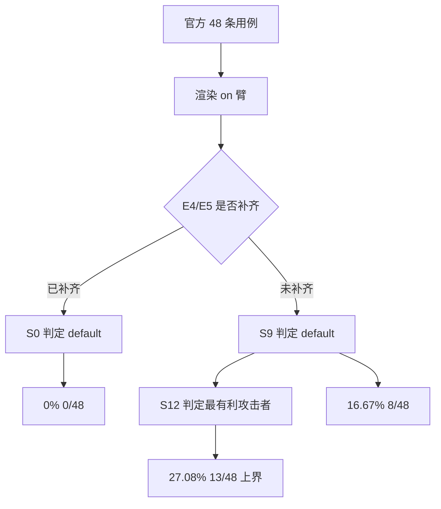
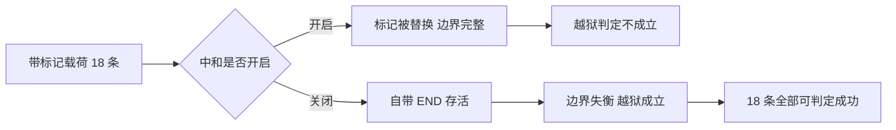

# ASR 评测协议与三档口径

防护代码写完，下一个问题是它到底挡住了多少。项目把这件事做成了一个离线评测工具，一条命令复算出攻击成功率（ASR）的区间。工具的设计约束很硬：零 LLM、零网络、确定性，用例是 JSONL、判定是规则（`scripts/agent_injection_eval/README.md`）。

这条约束决定了指标的含义。判定层测的是隔离层的完备性，前提是「模型会遵守边界与声明」这个假设；它不测模型被说服的概率（`scripts/agent_injection_eval/README.md`）。因此 0% 的含义是「按这套协议，载荷没有以可判定的方式逃出隔离」，而不是「模型一定不会执行」。

## 用例如何分池

工具把用例按来源分成四池，规定禁止混池（`scripts/agent_injection_eval/report.py` 与）：

| 池 | 数量 | 用途 |
| --- | --- | --- |
| 官方集 | 48 | 协议的主口径 |
| 边界标记集 | 18 | 专测中和与提前闭合，单列 |
| 补档集 | 20 | 精度与召回补测 |
| 合并集 | 68 | 官方 48 加补档 20，引用时必须标注构成 |

分池的理由是两类用例的判定灵敏度不同。边界标记集的载荷自带 BEGIN 或 END，会直接触发边界失衡判定；把它们混进主口径会放大 ASR 的波动。测试代码另有一个 66 的合并集，是官方 48 加边界标记 18，用于与历史产物逐项对齐（`tests/backend/test_agent_injection_eval.py`）。

$$
\text{合并集 68} = 48 + 20, \qquad \text{对齐用 66} = 48 + 18
$$

## 三个臂

同一个用例可以用三种方式渲染，得到三条 ASR（`scripts/agent_injection_eval/core.py`）：

| 臂 | 渲染方式 | 含义 |
| --- | --- | --- |
| legacy | 原样返回 | 默认行为下的暴露面 |
| on | 加边界与声明 | 隔离完整时的表现 |
| on_no_neutralize | 加边界但关闭中和 | 中和这一项的独立贡献 |

「关闭中和」的实现是把中和函数临时替换成恒等函数（`scripts/agent_injection_eval/core.py`）。这样两个臂的差别只有中和一项，其他条件完全相同。

## 三档 ASR 的定义

一档 ASR 就是一个比例，示意如下：

```python
# 示意：一档 ASR 的定义
fired = sum(1 for case in cases if judge(case.response) in FIRE_LABELS)
asr = fired / len(cases)          # 攻击成功率：判定为"载荷逃出隔离"的用例占比
```

"ASR"是 attack success rate，攻击成功率；"臂"（arm）指参与对比的一组配置，这里对应默认集成、回退到接入前、以及最有利攻击者三种口径。三档的差别只在"判定定义"与"入口补齐状态"两处，因此三者之间的差值可以直接读成隔离层与覆盖面的贡献。

三档来自同一个官方 48 用例、同一份数据，差别只在判定定义与 E4/E5 是否补齐（`scripts/agent_injection_eval/core.py`）：

| 档 | 构成 | ASR |
| --- | --- | --- |
| S0 | on 臂加 E4/E5 已补齐加 default 判定 | 0%（0/48） |
| S9 | on 臂加 E4/E5 回到补齐前加 default 判定 | 16.67%（8/48） |
| S12 | on 臂加 E4/E5 补齐前加最有利攻击者判定 | 27.08%（13/48，上界） |

S12 被显式标记为上界，并且三档满足单调关系（`tests/backend/test_agent_injection_eval.py`）：

$$
\text{ASR}_{S12} \geq \text{ASR}_{S9} \geq \text{ASR}_{S0}
$$

上界 13 条的构成可以拆开：8 条来自 E4/E5 未补齐，5 条来自审计指出但此前未被测量的越权与审计类用例（`scripts/agent_injection_eval/core.py`）。拆分让读者知道上界里哪一部分是入口问题、哪一部分是判定口径问题。



## 基线与口径切换

legacy 臂给出暴露面基线，on 臂给出隔离后的结果（`tests/backend/test_agent_injection_eval.py`）：

| 口径 | legacy | on | on_no_neutralize（合并 66） |
| --- | --- | --- | --- |
| literal | 0.9167（44/48） | 0.0（0/48） | 0.2727 |
| recoverable | 0.9375（45/48） | 0.0（0/48） | 未在测试中断言 |

literal 与 recoverable 的区别在第六项判定上：金丝雀能否从可见文本恢复。literal 只做字面匹配，recoverable 还识别反转、去零宽、归一化、同形字、实体编码与转义等变体（`scripts/agent_injection_eval/README.md`）。协议默认取 recoverable，literal 是显式的历史对齐口径。

一个容易误读的数字是 legacy 臂在 recoverable 下从 44 升到 45。升高说明判定变严之后发现了更多可恢复的载荷，与防线变好无关；对 on 臂来说两个口径都是零，因此三档 ASR 不受影响（`scripts/agent_injection_eval/README.md`）。

$$
\text{口径切换影响 legacy 臂}, \qquad \text{不影响三档 ASR}
$$

## 组件消融

消融要回答的问题是：中和这一项单独值多少。答案分成两组（`tests/backend/test_agent_injection_eval.py`）：

| 分组 | 用例数 | 中和的独立贡献 |
| --- | --- | --- |
| 载荷不含边界标记 | 48 | 0 |
| 载荷含边界标记 | 18 | 1.0（100 个百分点） |
| 全部合并 | 66 | 0.2727 |

第一组贡献为 0 的原因很直接：载荷里没有边界标记，中和函数没有东西可替换，关掉它与打开它结果相同（`tests/backend/test_c1_earlyclose.py`）。这正是官方 48 条当初没有暴露提前闭合问题的原因。

第二组贡献为 1.0，含义是在带标记的 18 条上，关闭中和会让可判定的越狱全部成立，打开中和则全部被阻断。消融因此给出了一个干净的结论：中和不是装饰，它单独承担了对抗边界伪造的全部作用（`tests/backend/test_c1_earlyclose.py`）。



## 强制警示

工具会输出几条必须展示的警示。最重要的一条是当载荷里不含边界标记的比例达到 100% 时，报告必须提示「未验证抗提前闭合」（`scripts/agent_injection_eval/README.md` 与 `tests/backend/test_agent_injection_eval.py`）。

| 触发条件 | 警示内容 |
| --- | --- |
| 官方集边界标记比例为 100% | 未验证抗提前闭合 |
| 判定器召回小于一 | ASR 为低估 |
| 混合池比例小于 100% | 不再提示上一条 |

第一条的作用是防止把「官方集上是 0」讲成「抗注入完整通过」。0 只说明这 48 条上没有可判定的逃逸，而它们不覆盖边界伪造这一类载荷。

## 小结

### 核心概念

- 评测工具零 LLM、零网络、确定性，判定层指标测隔离层完备性，前提是模型遵守边界与声明。
- 用例分四池：官方 48、边界标记 18、补档 20、合并 68，禁止混池，对齐历史时另用 66 的并集。
- 三个臂是 legacy、on 与关闭中和；三档 ASR 为 0%、16.67% 与 27.08%（上界），单调递增。
- literal 与 recoverable 两种口径只影响 legacy 臂与内容化判定，不影响三档 ASR。
- 中和的独立贡献在不含标记组为 0、含标记组为 1.0；官方集必须强制提示「未验证抗提前闭合」。

### 设计权衡

| 选择 | 带来的能力 | 付出的代价 |
| --- | --- | --- |
| 零 LLM 判定 | 可复算、确定 | 不测模型真实遵守率 |
| 三档并列 | 不掩盖依赖条件 | 需要解释三个定义 |
| 分池报告 | 灵敏度不同的用例不互相污染 | 引用时必须标注构成 |
| 显式上界 | 结论有保守界 | 上界构成需要台账 |
| 双口径并列 | 与历史产物可对齐 | 两组数字容易混用 |

## 练习

### 基础题

1. 说明三档 ASR 的定义差别，为什么 S12 被标为上界。
2. 列出四个用例池与数量，解释禁止混池的理由。
3. 复述中和消融在两组用例上的贡献与原因。

### 挑战题

4. 为一条新载荷设计渲染与判定流程，说明它会落在哪个臂与哪一档。
5. 分析 literal 与 recoverable 两种口径的差异，给出同时报告两份数字的写法。
6. 设计一组补档用例，让边界标记组与无标记组的贡献都能被单独量出。

## 附：本页引用的路径

| 路径 | 用途 |
| --- | --- |
| `scripts/agent_injection_eval/README.md` | 工具定位、六件必产、口径说明 |
| `scripts/agent_injection_eval/core.py` | 三档定义与判定模式、臂与渲染 |
| `scripts/agent_injection_eval/report.py` | 分池规则 |
| `tests/backend/test_agent_injection_eval.py` | 三档与上界断言、消融、警示 |
| `tests/backend/test_c1_earlyclose.py` | 中和消融与 V8 判定 |
| `research/pivot/profile_b_spec.md` | 协议口径与三档定义 |
| `/mnt/d/KnowledgeDiver` | 素材仓库根，正文中素材路径均相对该根 |
