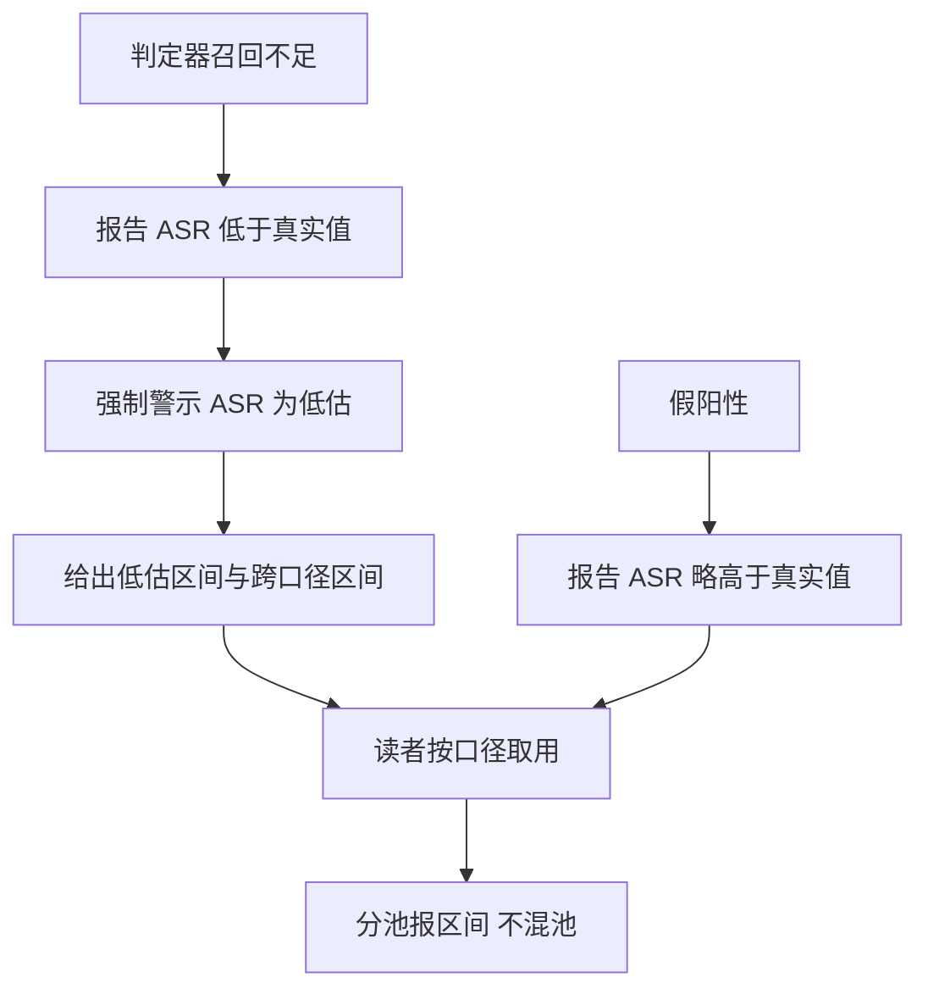
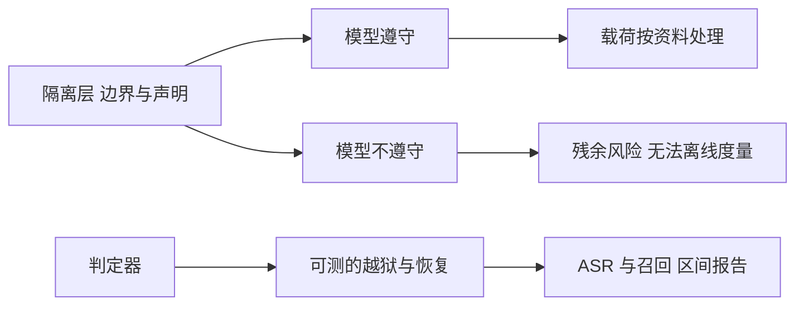

# 判定质量与残余风险

ASR 是判定器给出的数，判定器本身的质量决定了这个数偏向哪一侧。项目在报告里把这一点写成强制警示：当判定器召回小于一时，报告顶部必须展示「ASR 为低估」（`scripts/agent_injection_eval/README.md:59-63`）。它带来的是一个可以量化的偏差方向，而不是一句免责声明。

这一篇讲三件事：判定质量怎么测、防护的代价与置信区间怎么报、以及这套方案在模型与协议层面还剩哪些风险。所有数字都来自项目自己的评测产物。

## 判定器召回的三个口径

召回的分母是应当被判成功的违规用例，分子是被判定器抓到的数量。项目按口径给出三个数字（`scripts/agent_injection_eval/README.md:65-71`）：

| 口径 | 构成 | 规避型召回 |
| --- | --- | --- |
| 参考口径 | 无金丝雀池加 literal，任一判定 | 0.1923（5/26） |
| 严格协议 | 无池加 recoverable，仅第六项判定 | 0.1538（4/26） |
| 协议口径 | 含金丝雀池加 recoverable，任一判定 | 0.8462（22/26） |

三个数字的差别说明口径对结论的影响极大。参考口径偏低的原因是金丝雀池缺失与字面匹配让编码变体逃过判定；协议口径加入了评测级金丝雀池并识别编码变体，召回升到 0.8462。

$$
\text{召回}_{参考} = 0.1923, \quad \text{召回}_{协议} = 0.8462
$$

审计台账另有三组数字，与工具口径的差异被逐项记录，用于说明口径切换的影响（`scripts/agent_injection_eval/README.md:65-71`）。把这些数字并列而不是只报最大的那一个，是这份报告的可信度来源。

## ASR 低估的区间

召回不足意味着真实 ASR 高于报告值，因此低估幅度必须给出一个区间（`scripts/agent_injection_eval/README.md:73-77`）：

| 口径 | 低估幅度 |
| --- | --- |
| 审计窄口径与仅第六项定义 | 76.9% 到 88.5% |
| 工具协议口径 | 15.4% |
| 跨口径 | 15.4% 到 84.6% |

这张表的读法是：按最严的审计口径，报告值可能只覆盖了真实值的一小部分；按工具协议口径，偏差小得多。跨口径区间保留了两端的差距，读者可以按自己采用的口径取用。

$$
\text{真实 ASR} \geq \text{报告 ASR}, \qquad \text{低估幅度} \in [15.4\%, 84.6\%]
$$

报告里同时给出判定器的精确率：负例精确率 0.9167（`scripts/agent_injection_eval/README.md:57-58`）。也就是说存在少量把正常用例判为违规的假阳性，这会让 ASR 略偏高，方向上与召回不足的偏低相反，两者不能互相抵消。

## 置信区间与分池

点估计之外，报告给出三种区间：Wilson、Clopper-Pearson 与 bootstrap，聚类的簇是入口 E1 到 E6，另报逐用例 bootstrap（`scripts/agent_injection_eval/README.md:47-52`）。

| 档 | 点估计 | Wilson 区间宽度 |
| --- | --- | --- |
| S0 | 0（0/48） | 7.41 个百分点 |
| S9 | 0.1667（8/48） | 20.88 个百分点 |
| S12 | 0.2708（13/48） | 24.43 个百分点 |

区间宽度随比例远离零而变大，这条规律解释了为什么不能用单次运行的差值下结论。分池时尤其要注意：官方 48 与补档 20 必须分开报，合并池只在标注构成后引用（`scripts/agent_injection_eval/report.py:386`）。

## 包裹的代价

隔离不是零成本。项目对第二层防护做过一次真实代价测量（`scripts/agent_injection_eval/README.md:53-56`）：

| 指标 | 数值 | 说明 |
| --- | --- | --- |
| 任务完成率代价 | 0.0 个百分点 | 良性业务不受影响 |
| 延迟 | 每次运行加 2.9 秒 | 固定开销 |
| 标记固定开销 | 166 个字符 | 每条包裹的额外文本 |
| 良性误拦 | 0 个百分点 | 没有把正常内容当攻击处理 |
| 行为层收益 | 不可评估 | 记为 not_evaluable |

最后一行是这份报告最诚实的一处：隔离的行为层收益依赖模型是否遵守声明，而离线工具测不到这一层，因此不能填零冒充，也不能填一个正向数字（`scripts/agent_injection_eval/README.md:55-56`）。数据不完整时必须输出不可用标记并给出指针。

$$
\text{代价可测}, \qquad \text{行为层收益} = \text{不可评估}
$$

## 金丝雀恢复的共用实现

第六项判定涉及金丝雀恢复：载荷要求模型输出一个标识串，判定器检查该串能否从可见文本恢复。项目把归一化与恢复函数上游化到隔离模块，产品、离线工具与评测工具三处共用同一实现，评测工具侧只做转发并带断言（`scripts/agent_injection_eval/README.md:80-88`）。

| 组件 | 实现位置 |
| --- | --- |
| 归一化与恢复 | 隔离模块 |
| 评测工具侧 | 纯转发加断言 |
| 编码变体 | 八类加组合变体 |

协议明确声明了一个已知上界：把金丝雀拆成两段的载荷当前不可恢复，因此规避型召回的上界是 26 条里的 22 条（`scripts/agent_injection_eval/README.md:88-90`）。给出这个上界的原因是防止读者把 0.8462 当成可以继续推高的天花板。

$$
\text{规避型召回上界} = \frac{22}{26}
$$

## 残余风险清单

把前面各篇的限制集中起来，这套防护的残余风险可以列成一张清单：

| 风险 | 性质 | 当前处理 |
| --- | --- | --- |
| 模型不遵守声明 | 依赖层 | 声明只是提示，无强制手段 |
| 判定器召回不足 | 度量层 | 强制提示 ASR 为低估并给区间 |
| 假阳性 | 度量层 | 报精确率 0.9167 |
| 拆分金丝雀 | 载荷层 | 如实声明不可恢复 |
| 进程内工具结果 | 覆盖层 | 由 Agent 侧接入点覆盖，分工需保持 |
| MCP 入站描述 | 覆盖层 | 接口预留，当前无外部 client |
| 攻击者知道协议 | 协议层 | 中和标记，但不隐藏协议 |
| 行为层收益 | 评估层 | 记为不可评估 |

第一行是这套方案的根本限制：边界与声明改变的是模型看到的上下文结构，最终是否遵守取决于模型。工程上能做的是把「数据」与「指令」在形式上分开，并在评估里如实报告测不到的部分。

## 小结

### 核心概念

- 判定器召回小于一时 ASR 是低估，报告必须提示并给出低估区间，跨口径区间为 15.4% 到 84.6%。
- 规避型召回按口径给出 0.1923、0.1538 与 0.8462 三个数，负例精确率 0.9167。
- 三档 ASR 的区间宽度分别为 7.41、20.88 与 24.43 个百分点，官方集与补档集必须分池报告。
- 包裹的代价为完成率 0.0 个百分点、延迟加 2.9 秒、固定 166 字符、良性误拦 0，行为层收益不可评估。
- 金丝雀恢复实现三处共用，已知上界为 26 条中 22 条；残余风险集中在模型遵守、判定召回与入口覆盖三层。

### 设计权衡

| 选择 | 带来的能力 | 付出的代价 |
| --- | --- | --- |
| 多口径并列 | 偏差方向透明 | 报告复杂、易混用 |
| 强制警示 | 防止过度主张 | 顶部信息密度高 |
| 聚类置信区间 | 反映用例相关性 | 需要簇划分与解释 |
| 固定标记开销 | 协议简单可识别 | 每条多 166 字符 |
| 如实声明上界 | 结论可信 | 不能给出更高数字 |

## 练习

### 基础题

1. 说明三个召回口径的构成与数值，解释协议口径为什么最高。
2. 解释 ASR 低估的来源与报告方式，以及假阳性对偏差方向的影响。
3. 列出包裹的四项代价与不可评估的那一项。

### 挑战题

4. 设计一个把拆分金丝雀也纳入判定的方案，说明实现难点与验证方式。
5. 分析聚类置信区间与逐用例 bootstrap 的差别，给出选择依据。
6. 为这套防护写一份残余风险接受说明，区分可用工程手段缓解与只能如实报告的部分。

## 附：本页引用的路径

| 路径 | 用途 |
| --- | --- |
| `scripts/agent_injection_eval/README.md` | 召回与低估区间（:59-77）、置信区间与代价（:47-56）、金丝雀收敛与上界（:80-90） |
| `scripts/agent_injection_eval/report.py` | 分池规则（:24、:386） |
| `backend/agent/untrusted.py` | 归一化与恢复的上游实现（:260-337） |
| `research/pivot/dex_asr_rigor/REPORT.md` | 补档用例与精度复核产物 |
| `/mnt/d/KnowledgeDiver` | 素材仓库根，正文中素材路径均相对该根 |
