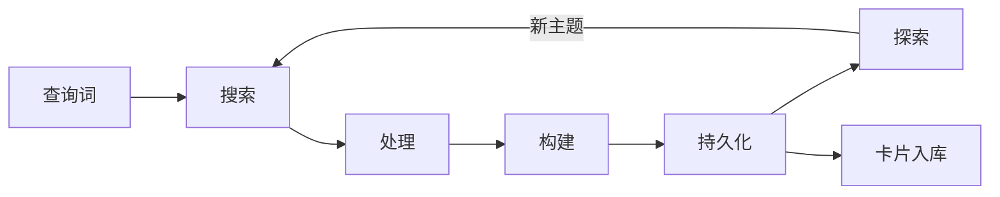
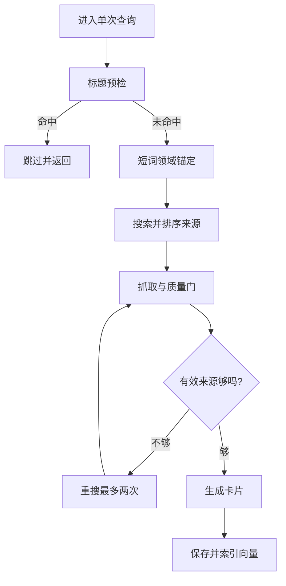

输入一个主题词，系统最终给出若干张知识卡片。中间发生的事情由搜索、抓取、生成、入库、再探索五个环节依次推进，其中好几个环节会调用模型，但整条路径远不止一次模型调用。每个环节都可能失败、跳过或提前结束。

这一页跟着一次查询走完整条路径，说明每个阶段做什么、阶段之间用什么对象交接、失败时怎么回退。理解这条骨架是后续讨论质量门、去重和递归探索的前提。

## 一次查询的五个阶段

流水线的阶段划分写在接口模块的文档注释里（`backend/pipeline/stages.py`）：搜索把主题词变成候选来源列表，处理把来源变成正文，构建把正文变成卡片，持久化把卡片写入存储，探索从卡片里抽出相关主题再回到第一步。

五个阶段各有抽象基类，每个基类只声明自己需要的方法（`backend/pipeline/stages.py`）。搜索提供者要实现搜索与关闭；处理器要实现处理与关闭；构建器要实现构建与关闭；持久化只要求同步保存；探索者要实现探索、抽取主题与关闭。源码里它们都是 `abc.ABC` 的子类，用 `@abstractmethod` 标出必须实现的方法：

```python
class SourceProvider(ABC):
    @abstractmethod
    async def search(self, query: str, max_results: int = 5) -> List[SearchResult]: ...
    @abstractmethod
    async def close(self) -> None: ...

class ContentProcessor(ABC):
    @abstractmethod
    async def process(self, results: List[SearchResult]) -> List[ProcessedContent]: ...

class CardBuilder(ABC):
    @abstractmethod
    async def build(self, content: List[ProcessedContent], context: str): ...

class CardPersister(ABC):
    @abstractmethod
    def save(self, cards: List[Any]) -> List[Any]: ...

class Explorer(ABC):
    @abstractmethod
    def explore(self, cards: List[Any]) -> AsyncIterator[ExploreTask]: ...
```

`ABC` 与 `@abstractmethod` 的作用是声明接口：没实现全部抽象方法的子类无法实例化。正因为实现类之间互不认识，替换一段才不需要动其他四段。

| 阶段 | 输入 | 输出 |
| --- | --- | --- |
| 搜索 | 查询词、最大来源数 | 来源列表 |
| 处理 | 来源列表 | 正文列表 |
| 构建 | 正文列表、上下文 | 卡片 |
| 持久化 | 卡片列表 | 落库卡片 |
| 探索 | 卡片列表 | 待探索主题 |



## 阶段之间用什么对象交接

阶段之间不传字典，而是传四个数据类（`backend/pipeline/stages.py`）：来源结果带网址、标题与摘要；处理结果带来源对象、正文与元数据，并单独保留抓取原文；抓取结果带正文与来源信息；探索任务带查询词、深度与父卡编号。其中两个的字段定义如下：

```python
@dataclass
class ProcessedContent:
    source: SearchResult
    text: str
    metadata: Dict[str, Any] = field(default_factory=dict)
    # 抓取原文：卡片生成直接基于原文，避免「摘要的摘要」二次压缩
    raw_text: str = ""

@dataclass
class ExploreTask:
    query: str
    depth: int = 1
    parent_card_id: Optional[str] = None
```

`@dataclass` 让 Python 自动生成 `__init__` 与 `repr`，字段本身就成了阶段之间的契约；`parent_card_id` 允许为空，表示这是第一层探索、没有父卡。

处理结果里同时保留正文与抓取原文，是因为下游的卡片生成直接吃原文：注释写明“卡片生成直接基于原文，避免摘要的摘要二次压缩”（`backend/pipeline/stages.py`）。这条约定在构建器里被落实为优先取原文、摘要只作兜底（`backend/pipeline/defaults.py`）。

进度也用对象表达。进度模型带阶段名、提示语、百分比、时间戳、当前条目与模型输出，其中模型输出字段让流式生成的中间结果可以直接推到前端（`backend/pipeline/stages.py`）：

```python
class PipelineProgress(BaseModel):
    stage: str
    message: str
    progress: float = 0.0
    timestamp: str = ""
    current_item: Optional[str] = None
    ai_output: Optional[str] = None
```

它用 pydantic 的 `BaseModel` 定义（字段可自动校验、序列化），每个字段都会随着事件流被逐条推到前端；`progress` 是 0 到 1 的小数，只保证单调向前。

## 依赖注入与两种流水线

流水线本身只认识五个阶段接口，具体实现由工厂函数组装（`backend/pipeline/factory.py`）。这种做法叫依赖注入：`Pipeline` 只接收五个对象，不 import 任何具体实现，所以测试时可以塞入假的搜索源，生产时由 `create_pipeline` 决定用哪一套。主题查询的流水线按搜索提供者三选一：默认走外部搜索客户端，百度与博查各有自己的来源提供者，处理器统一是抓取加质量门的组合，抓取来源的提前终止数传 2。

文档查询的流水线换掉的只有两处：来源固定为博查并带百度兜底，处理器换成文档分块抓取（`backend/pipeline/factory.py`）。其余三段实现完全相同，这就是阶段接口的价值——替换一段不需要改其他四段。

| 组件 | 主题查询 | 文档查询 |
| --- | --- | --- |
| 来源 | 三选一 | 博查带兜底 |
| 处理器 | 网页抓取加质量门 | 文档分块 |
| 构建器 | 相同 | 相同 |
| 持久化 | 相同 | 相同 |
| 探索者 | 相同 | 相同 |

## 单次查询的推进顺序

单次查询在内部函数里按固定顺序推进（`backend/pipeline/pipeline.py`）：先做标题预检，再做领域锚定并改写查询词，然后搜索、按域名质量排序、抓取与质量门、必要时重搜、生成卡片。

每一步都会把进度推进一个固定分值：搜索完成加 0.15，排序加 0.05，处理完成加 0.25，生成完成加 0.35，保存加 0.05（`backend/pipeline/pipeline.py`）。分值不精确反映耗时，只保证前端进度条单调向前。

标题预检命中同名卡片时直接返回，连搜索都不发生。这是三层去重里的第一层，后面两层的机制单独成页讨论。



## 有效来源不足时的重搜

重搜的目标数按实际请求数自适应，不写死成三：三个来源需要两个合格，五个来源需要三个，一个来源只需要一个，允许一个失败（`backend/pipeline/pipeline.py`）。

目标还要与处理器的提前终止数一致，否则会出现在提前终止于两个合格来源后仍然触发无谓重搜的情况——注释把这条写成了必须对齐的约束。重搜最多两次，新结果要跨尝试去重并过滤已被封禁的域名。

## 递归探索与并发

卡片保存之后，如果当前深度还没到上限，探索者会从卡片内容里抽相关主题（`backend/pipeline/pipeline.py`）。每个主题被包装成一个探索任务，深度加一，然后并发执行。

并发的方式是为每个任务新建一个子流水线，共享同一批阶段实例与存储，各自设置自己的深度。子流水线的事件通过一个有界队列汇总回父流水线，父流水线按完成数推进进度。

| 参数 | 默认 | 作用 |
| --- | --- | --- |
| 最大探索深度 | 1 | 控制递归层数 |
| 探索并发 | 7 | 同时展开的子流水线数 |
| 队列容量 | 200 | 子流水线事件缓冲 |

队列容量与超时是配套的：取事件时带超时，超时后继续循环而不是退出，避免某个子流水线卡死导致整体停摆（`backend/pipeline/pipeline.py`）。

## 资源释放

流水线提供了统一的关闭方法，按来源、处理器、构建器、探索者的顺序逐个关闭，任一关闭抛错只记日志不中断（`backend/pipeline/pipeline.py`）。子流水线在自身任务结束时也调用关闭。

顺序与构造顺序一致，意味着先释放外部资源再释放内部缓存；单项失败不阻断其余项，是因为关闭阶段的异常不应该影响已经写入存储的卡片。

## 小结

### 核心概念

- 流水线由搜索、处理、构建、持久化、探索五个阶段串联。
- 阶段之间用数据类交接，处理结果同时保留正文与原文。
- 卡片生成吃抓取原文，摘要只作兜底。
- 具体实现由工厂注入，主题查询与文档查询只换两段。
- 单次查询按标题预检、锚定、搜索、抓取、生成推进并累计进度。
- 重搜目标数随实际来源数自适应，且必须与提前终止对齐。
- 递归探索用子流水线并发，事件经有界队列汇总。

### 设计权衡

| 决策 | 选择 | 收益 | 代价 |
| --- | --- | --- | --- |
| 阶段拆分 | 五个接口 | 可单独替换 | 需要工厂组装 |
| 正文传递 | 原文加摘要双份 | 避免二次压缩 | 内存占用上升 |
| 重搜目标 | 自适应取值 | 小请求也能补齐 | 逻辑分支变多 |
| 探索并发 | 子流水线 | 展开快 | 需要队列与超时控制 |

## 练习

### 基础题

1. 写出五个阶段各自的输入与输出。
2. 说明处理结果为什么同时保留正文与原文。
3. 解释重搜目标数为什么不能硬编码成三。

### 挑战题

1. 给定一次“有效来源只有两个、卡片生成质量偏低”的现象，说明可从哪几个参数入手。
2. 设计一个替换阶段实现的实验，要求不改动其他四段代码。
3. 论证探索并发从 7 提到 20 时需要同时调整哪些配套参数。

## 附：本页引用的路径

| 路径 | 用途 |
| --- | --- |
| KnowledgeDiver/ | 素材根，正文相对路径均相对它 |
| `backend/pipeline/stages.py` | 阶段接口、数据对象与进度模型 |
| `backend/pipeline/pipeline.py` | 查询推进、重搜、递归探索与释放 |
| `backend/pipeline/factory.py` | 两种流水线的组装 |
| `backend/pipeline/defaults.py` | 各阶段默认实现 |
