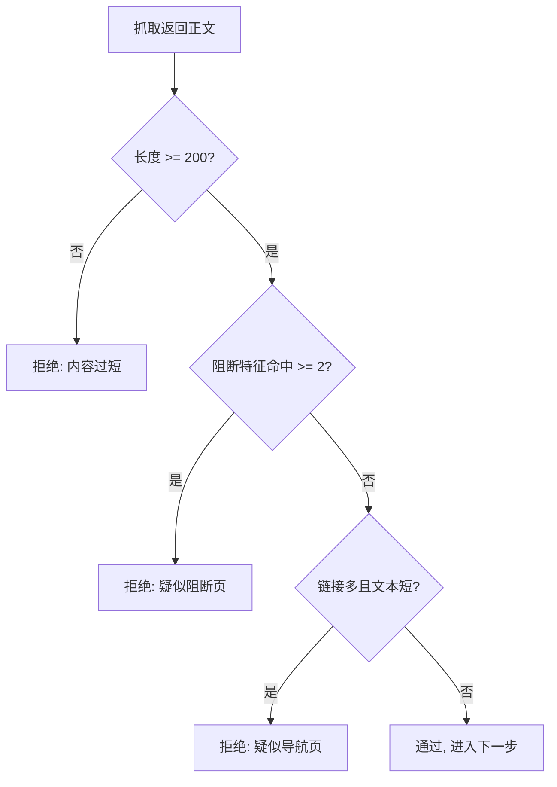
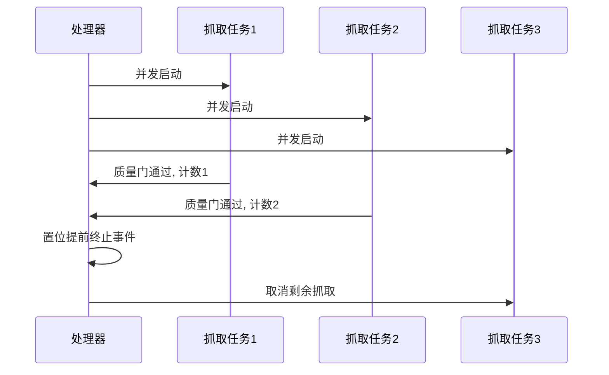

抓取失败有两种形态：一种是拿不到内容，另一种是拿到了内容但没有价值——验证码页、地区限制提示、只剩导航链接的列表页。后一种更麻烦，因为它在链路上看起来是成功的，成本却照样花出去，还会把垃圾文本喂给模型。

质量门就是为第二种形态准备的。它放在抓取之后、模型之前，用纯字符串启发式先过一遍，把明显没有价值的页面挡在模型调用之外。这一页讲清它的判据与调用位置，以及围绕它的两套成本控制机制。

## 质量门的位置

模块注释把位置写得很明确：三道启发式门全部使用标准库、零模型调用，在抓取之后、摘要之前执行，目的是避免为垃圾内容支付模型成本（`backend/pipeline/quality_gate.py:1-9`）。

这句话给出了一个设计原则：能用手写规则判定的问题，不要交给模型。判据本身不追求覆盖全部情况，只追求便宜且可解释。

## 三道启发式门

门函数接收正文，返回是否通过与未通过原因两个值（`backend/pipeline/quality_gate.py:26-38`）。三道门依次是：最小长度两百字符；阻断或错误页特征命中两个及以上；链接数超过三十而正文不足两千字符。

阻断特征表是中英混合的二十个短语，覆盖访问被拒、要求开启脚本、人机验证、频率限制、地区限制、订阅墙、403 与 404 等（`:13-20`）。第三条门针对导航页：短文本里塞满链接，说明这是一张目录而不是正文。

| 门 | 判据 | 典型拦下的页面 |
| --- | --- | --- |
| 最小长度 | 少于 200 字符 | 占位页、空壳页 |
| 阻断特征 | 命中 2 个及以上 | 验证码、403、订阅墙 |
| 链接密度 | 链接多于 30 且正文少于 2000 字符 | 导航与列表页 |

## 一票否决与可审计

原实现使用三项加权的复合分，这里简化成任一门槛不满足即拒绝，原因是复合分会把“内容太短”和“疑似阻断”混成一个分数，出问题时说不清到底哪一条不满足（`backend/pipeline/quality_gate.py:7-8`）。

一票否决的收益是可解释：拒绝原因字符串直接带上门名与实测数值，比如内容过短会把实际字符数写进去，链接密度会写出链接数与字符数（`:30`、`:37`）。日志里出现这条原因时，不需要再去复算分数。

## 自检函数

模块自带一个自检：构造五百字符正常长文应当通过，四字符短文应当被拒且原因包含“过短”，混合阻断特征的文本应当被拒且原因包含“阻断”，五十个链接加短文本应当被拒且原因包含“导航”（`backend/pipeline/quality_gate.py:41-54`）。

自检覆盖的是四类边界，其中“通过”与三种“拒绝”各一例。把自检写在模块里，好处是改判据时能立刻发现把正常页面误伤成垃圾的情况。

## 处理器里的调用点

质量门在处理器的一次抓取流程里位于抓取成功之后（`backend/pipeline/defaults.py:218-246`）：先取内容，取不到就记一次域名失败并返回空；取到了就调用门函数，不通过同样记一次域名失败并返回空；通过才组装处理结果并计入合格来源数。

处理结果里正文与原文都指向抓取文本，注释写明摘要层已经不再被消费，卡片生成直接用原文（`:237-241`）。这一步省掉了一次模型调用，也避免了摘要再摘要造成的二次压缩。

| 结果 | 处理器的动作 | 是否计入合格来源 |
| --- | --- | --- |
| 抓取失败 | 记域名失败，返回空 | 否 |
| 质量门拒绝 | 记域名失败，返回空 | 否 |
| 通过 | 组装处理结果 | 是 |

## 提前终止：够用就停

处理器构造时可以指定一个提前终止数：合格来源达到这个数就停止剩余抓取（`backend/pipeline/defaults.py:199-210`）。实现方式是每成功一个就检查计数并置位事件，同时并发抓取的任务会监听这个事件，置位后取消排在后面的抓取任务（`:234-266`）。

搜索场景的工厂把这个数传成 2，理由写在参数注释里：候选池扩大之后低质站点居多，抓到两个合格来源就够生成卡片，不必逐个抓完（`:204-206`）。代价是当两个合格来源恰好都偏弱时，卡片输入会比较单薄。

## 抓取层自己的两层过滤

抓取器还有两道与质量门互补的检查。第一道是短时间窗去重：同一地址十分钟内抓过就跳过，避免并发探索分支重复抓同一页（`backend/pipeline/defaults.py:130-143`）。第二道是正文长度下限一千字符，低于这个值直接记域名失败（`:151-155`）。

注意这个一千字符下限与质量门的两百字符阈值不同，而且位置在质量门之前。前者拦的是“几乎没抓到东西”，后者拦的是“抓到了但没价值”；把两个阈值混用会让质量门的阻断特征失去意义。

## 域名质量记账

抓取失败、正文过短、质量门拒绝三种情况都会调用域名质量缓存的失败记录，成功时记录内容长度（`backend/pipeline/defaults.py:144-158`）。流水线里对这批记录的说明是：连续三次失败会自动封禁域名三十天（`backend/pipeline/pipeline.py:610`）。

重搜挑选新结果时也会过滤掉已被封禁的地址（`backend/pipeline/pipeline.py:636-640`）。这条机制的收益是坏域名会随着失败次数自动淡出候选池，不需要人工维护黑名单。

## 阈值是怎么定的

四个阈值都是具体数字：两百字符、两个特征命中、三十个链接、两千字符、一千字符下限（`backend/pipeline/quality_gate.py:11-23`、`backend/pipeline/defaults.py:151`）。源码里没有记录这些取值的推导过程，因此按通用做法理解：它们来自对抓取样本的观察，量级正确即可，不必精确。

调整阈值的正确方式是抽样复核，而不是凭感觉加减。取一批被门拒掉的页面人工判断是否真的没价值，再取一批通过的页面看有没有漏进来的垃圾，两边都统计比例，才能判断该放宽还是收紧。

| 阈值 | 偏严的后果 | 偏松的后果 |
| --- | --- | --- |
| 两百字符 | 短而精的页面被拒 | 空壳页进入模型 |
| 两个特征命中 | 正常页面被误伤 | 阻断页漏过 |
| 三十链接加两千字符 | 目录页漏过 | 正文页被误伤 |

## 小结

### 核心概念

- 质量门位于抓取之后、模型之前，零模型调用。
- 三道门分别是长度、阻断特征与链接密度。
- 一票否决替代复合分，换取可审计的拒绝原因。
- 模块自带自检覆盖一例通过与三例拒绝。
- 处理器用提前终止数控制只抓够用的合格来源。
- 抓取层另有十分钟去重与一千字符下限两道过滤。
- 域名连续失败三次自动封禁三十天。

### 设计权衡

| 决策 | 选择 | 收益 | 代价 |
| --- | --- | --- | --- |
| 判据形式 | 启发式规则 | 便宜且可解释 | 覆盖有限 |
| 组合方式 | 一票否决 | 原因清晰 | 不能按分值排序 |
| 抓取数量 | 提前终止于 2 个 | 省时间 | 输入可能偏薄 |
| 域名管理 | 失败自动封禁 | 免人工维护 | 需要缓存与阈值 |

## 练习

### 基础题

1. 写出三道质量门各自的判据与典型拦截对象。
2. 说明一票否决相比复合分的收益。
3. 解释一千字符下限与两百字符阈值为什么不能合并。

### 挑战题

1. 给出一组新的阻断特征词，并说明如何验证它不会误伤正常页面。
2. 设计一个实验，比较提前终止数取 2 与取 3 时卡片输入长度与生成质量的差别。
3. 论证域名自动封禁阈值从三次改到五次的影响，并给出需要的监控项。

## 附：本页引用的路径

| 路径 | 用途 |
| --- | --- |
| KnowledgeDiver/ | 素材根，正文相对路径均相对它 |
| `backend/pipeline/quality_gate.py` | 三道门、拒绝原因与自检 |
| `backend/pipeline/defaults.py` | 处理器调用点、抓取过滤与提前终止 |
| `backend/pipeline/pipeline.py` | 域名封禁说明与重搜过滤 |
