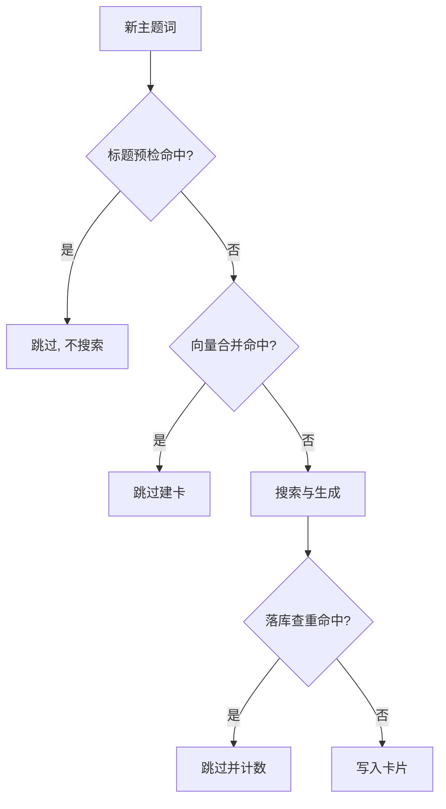
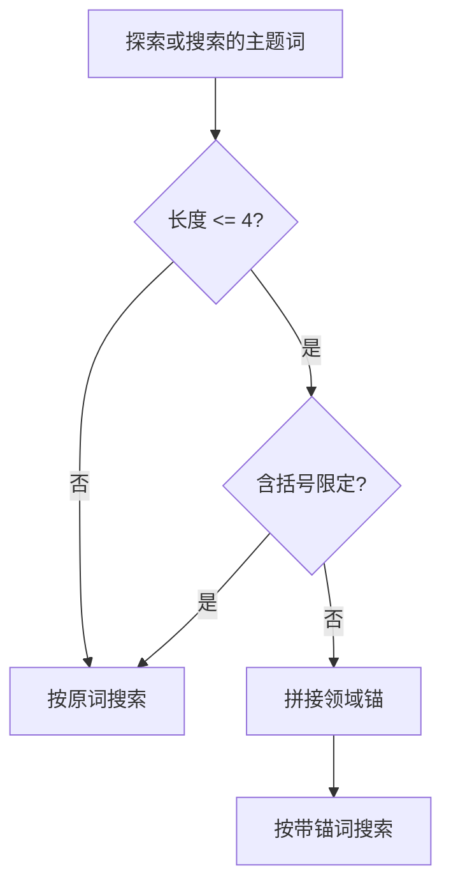

知识库最怕的是同一件事写成好几张卡：标题略不同，内容高度重叠，链接图里还互相指来指去。去重因此被拆到三个不同阶段各设一道闸，判据与代价都不同。

它们的分工可以用一条原则概括：能用精确匹配解决的不做语义比较，能做语义比较的不等落库。

## 三层去重的分工

第一层在搜索之前：按归一化标题精确查重，命中就连搜索都不发起。第二层在探索主题进入子流水线之前：用向量搜索判断主题是否已被已有卡片覆盖。第三层在落库时：按标题精确查重，跳过后统计跳过数量（`backend/pipeline/defaults.py`）。

三层的代价依次上升：精确查重是纯内存比对，向量合并要编码加检索，落库查重已经太晚——搜索、抓取、生成的钱都花完了。所以设计的取向是把拦截点尽量前移。

| 层 | 位置 | 判据 | 代价 |
| --- | --- | --- | --- |
| 一 | 搜索前 | 归一化标题精确匹配 | 最低 |
| 二 | 探索前 | 向量距离小于阈值 | 中 |
| 三 | 落库时 | 标题精确匹配 | 最高（已花完） |



## 标题预检为什么能提前

单次查询里，预检发生在搜索之前：用归一化标题查已有卡片列表，命中就直接返回并给出一条进度提示（`backend/pipeline/pipeline.py`）。这里有一个显式豁免：重新收集同名主题的场景传入不持久化标志，预检放行。

预检放在花钱之前才有价值，因为精确判据不受查询词改写影响：查询词一旦被锚定变长，向量相似度会被稀释，语义判据可能漏判，而「标题归一化后完全相等」这类判据不受影响。本工程的由来记录正是这个失效模式——锚定让距离阈值漏过 13 个重复主题，白做约 300 秒搜索与生成，最后由落库查重兜底；把精确预检提前到搜索前，这部分成本直接归零。

## 向量合并的判据

合并阈值是一个模块级常量，语义距离小于 0.40 即认为已被覆盖（`backend/pipeline/pipeline.py`）。判定过程是：对主题词编码，在卡片库里取最近的三条，逐一排除源卡自身，若有命中则记录距离并返回命中。

```python
# 向量搜索合并阈值——语义距离小于此值即认为主题已被覆盖
MERGE_DISTANCE_THRESHOLD = 0.40
```

这里的「距离」由编码模型算出来，数值越小表示两个主题越接近；0.40 是本工程观察后取的分界，换成别的编码模型必须重新标定。

这个阈值是唯一一个语义层面的判据，因此也最依赖编码质量。注释提到锚定长词会让相似度被稀释，正是阈值漏判的原因。阈值调大能减少重复，但会误合并本来不同但相邻的主题。

## 合并与建链必须分开

命中已有卡片时，代码只做跳过，不建链接。注释解释了原因：旧实现会把匹配到的已有卡片当成当前卡片的子卡，而匹配到的往往是上位概念或根卡，于是产生反向边，污染链接与反向链接，导致根卡查询返回空、整棵树构建失败（`backend/pipeline/pipeline.py`）。

去重与建边必须分开：重复只意味着不建卡，不意味着要建立关系。把匹配到的已有卡当成新卡的子卡会造出反向边，污染正反链接，最终让根卡查询返回空。本工程的一次实测里，两个相近主题的距离是 0.352，建链后 27 张卡全部带上反向链接、根卡消失——这正是把两件事拆到不同入口的理由。

## 软锚定：短词才拼标题

锚定规则只有两行判断：主题词去掉空白后长度不超过四、并且不含中文或英文括号，才需要锚定（`backend/pipeline/pipeline.py`）。长度上限与括号判断各挡一类情况——长词自包含，带括号的限定词已经自带领域。

```python
ANCHOR_MAX_LEN = 4

def _needs_anchor(topic: str) -> bool:
    t = topic.strip()
    if not t or len(t) > ANCHOR_MAX_LEN:
        return False
    return "（" not in t and "(" not in t
```

注意判据是按字符数算的：中文两三个字就可能是个跨领域多义词（「毒蛇」既可能是动物也可能是游戏），所以上限压到四；一旦带上括号限定，词面本身已经指明了领域，就不再拼接。

需要锚定的理由是实测的漂移：建库过程中十三张卡里有六张漂移，例如“Zero”被理解成区块链项目、“毒蛇”被理解成某款游戏、“F-35”被理解成作战识别系统；延申搜索时“瀑布模型”被理解成粒子系统模拟。这些词都短、都没有限定词，正是规则的命中区。



## 领域锚从哪来

锚的取用有优先级：源卡标题最精确，其次是会话的根卡标题，都没有就返回空（`backend/pipeline/pipeline.py`）。第二档针对的是没有源卡、只剩一个短词的搜索场景，注释举的例子是某游戏库里的“Zero”应当锚定到根卡标题。

拼接前还有一次检查：锚已经在查询词里出现就不重复拼。不持久化的场景同样豁免，因为那类请求搜的正是原卡标题本身，拼上锚反而搜偏。

## 向量索引与批内信号

卡片保存成功之后会统一做一次向量索引：把标题与正文拼成文本编码，写入卡片存储，然后对这批新卡算一个临时信号（`backend/pipeline/pipeline.py`）。

这个信号只用于日志诊断，不是正式质量分。注释写得很清楚：正式评分统一走质量模块的四维评分，而新卡此刻还没挂载链接，拿不到图论信号，所以这里只记录结构与语义的批内成分，权重是结构 0.55 加语义 0.45。另有一个方法专门用来加载已有卡片的向量，供需要全局相似度的场景使用。

## 归一化标题怎么比

预检与落库查重都叫“标题查重”，两处用的判据并不相同：预检调用的是归一化精确匹配，落库用的是存储层的标题查询（`backend/pipeline/pipeline.py`、`backend/pipeline/defaults.py`）。

归一化的规则是去空白（含全角）、把中文括号统一成半角、转小写，然后要求两串完全相等（`backend/utils/titles.py`）。工具模块的注释给了三组对照：「PID控制」与「PID 控制」判为同一张，「梯度（深度学习）」与「梯度」判为不同，「二阶振荡环节」与「二阶过阻尼系统」判为不同。

第三组对照说明了这条判据的边界：语义相近但字面不同的标题交给向量层处理，精确层只负责字面完全一致的变体。

| 对照 | 判据结果 | 由谁决定 |
| --- | --- | --- |
| PID控制 与 PID 控制 | 同一张 | 精确层 |
| 梯度（深度学习） 与 梯度 | 不同张 | 向量层 |
| 二阶振荡环节 与 二阶过阻尼系统 | 不同张 | 向量层 |

## 阈值和编码模型的绑定关系

距离阈值没有跨模型通用的取值：换一个编码模型，同一对文本的距离会整体平移，必须重新标定。标定的通用做法是取两组样本——一组确认应当合并的重复主题、一组确认不该合并的相邻主题——分别统计距离分布，把分界点放进两组的间隔里；两组靠得太近说明模型分辨不出这类差别，调阈值解决不了。本工程的 0.40 按这个方式取得，源码里没有留下推导过程。

标定的做法是取两组样本：一组确认应当合并的重复主题，一组确认不应当合并的相邻主题，分别统计距离分布，把分界点放在两组的间隔里。两组靠得太近时，说明当前编码模型分辨不出这类差别，调阈值解决不了问题。

| 现象 | 可能原因 | 处理方向 |
| --- | --- | --- |
| 重复主题漏合并 | 阈值偏小，或锚定稀释了相似度 | 重标阈值，先查锚定 |
| 不同主题被合并 | 阈值偏大 | 收紧阈值，让精确层兜底 |

## 三层各自的失效场景

| 层 | 失效表现 | 原因 |
| --- | --- | --- |
| 精确预检 | 字面不同的同一主题漏过 | 判据只看字面 |
| 向量合并 | 相邻但不同的主题被误判 | 阈值与编码质量 |
| 落库查重 | 拦住时成本已经花完 | 位置太靠后 |

三层都不能单独保证不重复，组合起来的效果是把多数重复挡在花钱之前，把拿不准的留给后面的层处理（`backend/pipeline/pipeline.py`）。

## 小结

### 核心概念

- 去重分三层：搜索前精确预检、探索前向量合并、落库时标题查重。
- 拦截点越靠前，节省的成本越多。
- 预检提前的动因是锚定稀释相似度导致向量合并漏判。
- 向量合并阈值是 0.40，语义相邻的主题可能被误合并。
- 合并命中只跳过建卡，不建链接，因为反向边会污染整棵树。
- 软锚定只对四字以内的无括号短词生效。
- 领域锚优先取源卡标题，其次是会话根卡标题。

### 设计权衡

| 决策 | 选择 | 收益 | 代价 |
| --- | --- | --- | --- |
| 去重层次 | 三层 | 兼顾成本与召回 | 判据需分别维护 |
| 预检时机 | 搜索前 | 零成本拦截 | 只覆盖精确同名 |
| 合并动作 | 跳过不建链 | 图结构干净 | 重复主题之间无关联 |
| 锚定范围 | 仅短词 | 减少漂移 | 长词漂移无兜底 |

## 练习

### 基础题

1. 写出三层去重各自的位置与判据。
2. 说明合并命中时为什么不建链接。
3. 列出需要软锚定的两个条件。

### 挑战题

1. 给定一次“重复主题白做三百秒搜索”的现象，说明修复点与验证方式。
2. 设计一套评估方案，判断向量合并阈值从 0.40 调到 0.35 是否划算。
3. 论证把锚定规则从长度判断改成词性判断的收益与风险。

## 附：本页引用的路径

| 路径 | 用途 |
| --- | --- |
| KnowledgeDiver/ | 素材根，正文相对路径均相对它 |
| `backend/pipeline/pipeline.py` | 预检、合并、锚定与向量索引 |
| `backend/pipeline/defaults.py` | 落库查重的实现 |
