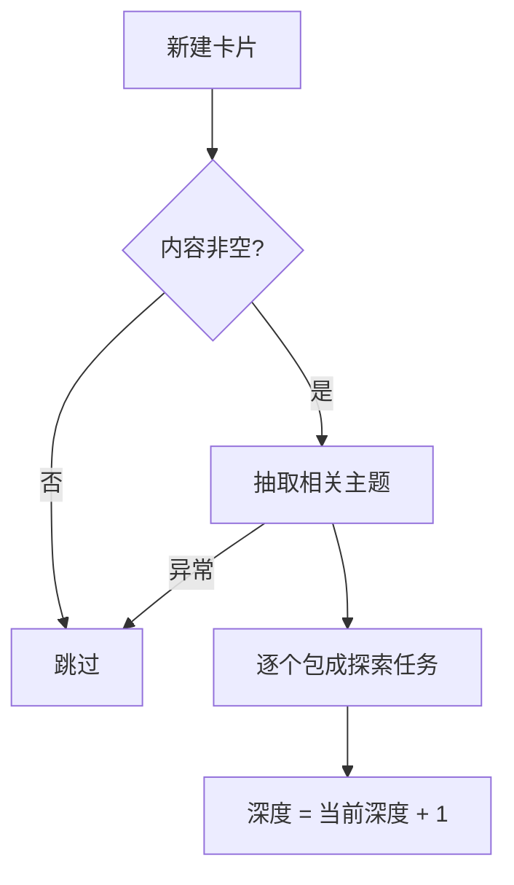
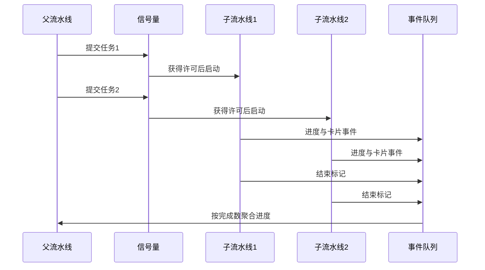

主题词只决定第一层卡片，知识库的规模靠第二层撑起来：每张卡里提到的、可以单独成卡的概念再各搜一轮，如此递归。这个机制让一次查询能衍生出几十张卡，也让并发、去重、树结构三件事同时变得复杂。

这一页讲递归是怎么落地的：主题从哪来、深度怎么限制、并发怎么组织、事件怎么汇总，以及父子关系为什么必须显式维护。

## 探索任务的来源

探索者接口声明了三个方法：流式产出探索任务、按卡片内容抽取主题、关闭（`backend/pipeline/stages.py:123-139`）。默认实现遍历这批卡片，跳过内容为空的，对每张卡调一次主题抽取，再把每个主题包成带父卡编号的探索任务（`backend/pipeline/defaults.py:471-483`）。

探索任务本身是三个字段：查询词、深度、父卡编号（`backend/pipeline/stages.py:47-51`）。父卡编号让下游能建立父子关系，深度让子流水线知道自己还能不能继续递归。

| 字段 | 作用 | 由谁赋值 |
| --- | --- | --- |
| 查询词 | 子流水线的搜索输入 | 主题抽取结果 |
| 深度 | 递归层数控制 | 父流水线加一 |
| 父卡编号 | 建立父子关系 | 产出主题的那张卡 |

## 主题抽取的约束

抽取主题的提示词给了四条规则：主题要是独立的概念或实体而不是关键词；要具体到可用，例如某款具体车型而不是泛称；要与当前内容的主旨不同；只返回一个主题名列表，条数上限由参数给出（`backend/pipeline/prompts.py:31-43`）。

调用时还会传入排除标题与来源标题，默认实现把卡自己的标题作为排除项（`backend/pipeline/defaults.py:476-479`）。抽取失败被吞掉并跳过这张卡，不让一张卡的问题中断整轮探索（`:482-483`）。这个选择是合理的：探索是增益环节，任何单点失败都不该影响已经入库的卡片。

## 深度如何限制递归

父流水线在保存卡片之后检查自己的深度：已经等于上限就直接收尾，不再产出探索任务（`backend/pipeline/pipeline.py:723-729`）。如果探索者一个主题都没抽出来，同样收尾（`:736-742`）。

子流水线继承父流水线的最大深度，但把自己的当前深度设成任务带来的深度（`:760-771`）。深度因此由每个分支各记一份，同一层的多个分支互不影响，没有一条全局计数。

| 参数 | 含义 | 默认 |
| --- | --- | --- |
| 最大探索深度 | 允许的递归层数 | 1 |
| 任务深度 | 该分支当前层数 | 父深度加一 |

## 并发子流水线的构造

并发靠为每个任务新建一个流水线实例实现，各实例共享同一批阶段对象与存储（`backend/pipeline/pipeline.py:750-786`）。共享是刻意的：搜索客户端、卡片存储都持有连接或缓存，各建一份会浪费资源，也会让去重看不见彼此的新卡。

每个子流水线跑完或抛错后都会关闭自己，并向队列投一个结束标记（`:778-782`）。错误只记日志，不向上抛，因为一个分支失败不该让整轮探索失败。

并发数由信号量限制，默认取七（`:750`、`:77-78`）。这个值与主题上限、搜索来源数一起出现在工厂签名的默认参数里（`backend/pipeline/factory.py:30-37`）。

## 事件队列与进度聚合

子流水线的事件通过一个有界队列回传，容量二百（`backend/pipeline/pipeline.py:751`）。父流水线循环取事件，取事件时带超时，超时后继续循环而不退出，避免某个分支静默卡死导致整轮停摆（`:788-792`）。

结束标记只做计数，累计到任务总数就结束循环；进度按完成比例推进，并把子流水线的百分比压到 0.99 以内，保证最后一条完成消息能占住 1.0（`:794-804`）。子流水线的事件被原样转发，卡片与带编号的对象直接向上抛出（`:806-815`）。

顺序是不保证的。队列里的事件按到达顺序取出，因此前端看到的卡片顺序与探索任务的顺序无关。

## 树方向：链接与父指针

子流水线创建卡片后，父流水线会为每张新卡建一条延申链接，并显式写入父卡编号（`backend/pipeline/pipeline.py:709-721`）。注释记录了一个失败案例：不能用持久化器的保存方法来更新父指针，因为它的标题查重会把已经入库的卡自己判成重复并跳过，父指针更新被吞掉；实测表现是链接对称正常但新卡的父指针全空（`:715-719`）。

这个例子说明去重与结构更新必须用不同入口：去重入口只负责写入新卡，结构变更走存储层的直接更新。两者混用会让副作用互相抵消。

## 延申搜索入口

除了递归路径，还有一条手动延申入口，接收卡片内容与源卡编号（`backend/pipeline/pipeline.py:365-372`）。它先抽取主题，抽取时要排除源卡标题（`:376-389`），再对每个主题依次过两道闸：标题预检命中就跳过搜索，向量合并命中就跳过建卡，剩下的进入待探索列表（`:436-451`）。

两道闸的命中数会合成一条进度消息告诉用户，去掉了多少、还剩多少（`:453-459`）。全部被拦下时直接返回完成，一个子流水线都不开（`:465-471`）。

## 递归展开到第几层

递归的收益随深度递减：第一层覆盖主题本身，第二层覆盖直接相关的概念，第三层之后多数主题与原点隔了两跳，重复率上升而去重会拦掉大半。深度上限默认取一，意味着只展开一层，正是这个成本的折中（`backend/pipeline/pipeline.py:77`）。

| 深度 | 典型收益 | 主要成本 |
| --- | --- | --- |
| 一 | 覆盖直接相关概念 | 搜索与生成开销 |
| 二 | 少量跨域关联 | 去重压力上升 |
| 三及以上 | 新增少于重复 | 时间与接口配额 |

不同深度各自的实测收益，本仓库未见对照记录，这里的判断按通用做法给出。

## 小结

### 核心概念

- 探索任务由查询词、深度与父卡编号三个字段组成。
- 主题抽取要求返回具体概念而非关键词，并排除源卡标题。
- 单张卡抽取失败只跳过该卡，不中断整轮。
- 深度按分支各记一份，子流水线的上限继承父流水线。
- 并发通过为每个任务新建子流水线实现，阶段对象共享。
- 事件经有界队列汇总，进度按完成数推进并压在 0.99 以内。
- 父指针要用存储层直接更新，不能走标题查重的保存入口。

### 设计权衡

| 决策 | 选择 | 收益 | 代价 |
| --- | --- | --- | --- |
| 并发方式 | 每任务一个子流水线 | 隔离失败 | 实例开销 |
| 阶段对象 | 共享 | 资源与去重一致 | 需保证线程安全 |
| 错误处理 | 只记日志 | 单点失败不扩散 | 问题易被忽略 |
| 顺序 | 不保证 | 实现简单 | 前端需自行排序 |

## 练习

### 基础题

1. 写出探索任务的三个字段与各自来源。
2. 说明深度为什么按分支各记一份而不是全局计数。
3. 解释父指针为什么不能走保存入口更新。

### 挑战题

1. 给定“探索轮次结束后卡片顺序混乱”的反馈，说明需要改动的是哪一层。
2. 设计一个实验，比较并发数 7 与 15 时单位时间新增卡片数与失败率。
3. 论证把主题上限从 7 提到 20 时，去重与队列容量需要如何配套调整。

## 附：本页引用的路径

| 路径 | 用途 |
| --- | --- |
| KnowledgeDiver/ | 素材根，正文相对路径均相对它 |
| `backend/pipeline/pipeline.py` | 深度控制、子流水线、队列与父指针 |
| `backend/pipeline/stages.py` | 探索者接口与探索任务定义 |
| `backend/pipeline/defaults.py` | 默认探索实现与主题抽取调用 |
| `backend/pipeline/prompts.py` | 主题抽取提示词 |
| `backend/pipeline/factory.py` | 深度与并发默认值 |
