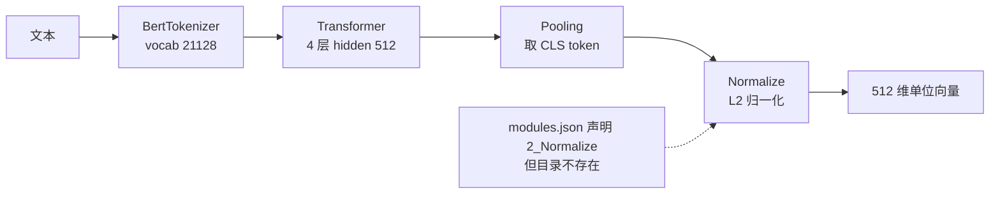
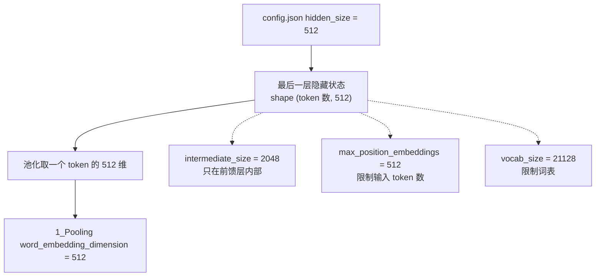

# bge-small-zh 的模型画像与 512 维输出

把 `models/bge-small-zh-v1.5/` 换成一个 768 维的模型，写入向量表会直接失败——建表时列宽已经写死为 512；即使绕过写入，检索也会因维度不一致而报错。这个 512 维契约是嵌入模型与存储层之间最容易断的一环。RAG 流水线里唯一被复用的模型是嵌入模型：检索、向量合并、质量评分都要先经过它。KnowledgeDiver 把权重放在仓库内的 `models/bge-small-zh-v1.5/`，代码里的加载函数优先读这个目录，目录不存在时才退回 Hugging Face 上的同名模型（`backend/ai/embedder.py:20-21`）。路径判断写在一行里，没有额外的配置开关，因此部署时是否自带权重，只由目录是否存在决定。

这份目录里没有 Python 代码说明模型能力，能回答“它输出多少维、用什么方式把 token 汇成一个向量、能吃多长的文本”的东西只有四份配置 JSON 与一份权重文件。把它们逐项读出来，比记住模型名字更可靠：换一个权重目录时，同样的位置会给出不同的数字。

文中出现的字节数来自对 `model.safetensors` 的文件大小，参数量由该大小除以每个 float32 的 4 字节得到，属于算术推导，不是运行期读到的值。

## 从目录布局读出模型身份

模型目录的顶层内容如下（`models/bge-small-zh-v1.5/`）：

| 条目 | 作用 | 代码是否读取 |
| --- | --- | --- |
| `config.json` | Transformer 结构参数 | 由 transformers 自动读取 |
| `sentence_bert_config.json` | 句向量封装层参数 | 由 sentence-transformers 读取 |
| `tokenizer.json`、`vocab.txt`、`tokenizer_config.json` | 分词器与词表 | 由 transformers 读取 |
| `1_Pooling/config.json` | 池化方式 | 由 modules.json 索引 |
| `modules.json` | 模块流水线清单 | 由 sentence-transformers 读取 |
| `config_sentence_transformers.json` | 打包时的库版本记录 | 供人核对，不参与推理 |
| `model.safetensors` | 4 字节浮点权重 | 由 transformers 读取 |
| `.cache/huggingface/` | 下载缓存与元数据 | 不参与推理 |

`modules.json` 把推理拆成三个模块：索引 0 是 `Transformer`，路径为空，用当前目录的权重；索引 1 是 `Pooling`，路径 `1_Pooling`；索引 2 是 `Normalize`，路径 `2_Normalize`（`models/bge-small-zh-v1.5/modules.json:16-17`）。索引 2 指向的目录在磁盘上不存在，顶层只有 `1_Pooling`。这是打包时的取舍还是下载缺件，从目录本身无法判定，标注为待确认。

即使索引 2 的目录缺失，代码侧仍然拿到归一化后的向量：`Embedder._encode_blocking` 显式传入 `normalize_embeddings=True`（`backend/ai/embedder.py:65-70`）。两种归一化叠加的结果一致，但依赖关系变成了代码决定，而不是模型目录决定。

## 512 维来自 hidden_size

输出维度不是句向量封装层自己决定的，它等于 BERT 最后一层的隐藏宽度。`config.json` 里 `hidden_size` 为 512（`models/bge-small-zh-v1.5/config.json:11`），池化层配置里的 `word_embedding_dimension` 同样是 512（`models/bge-small-zh-v1.5/1_Pooling/config.json:2`）。两处一致，说明封装层按隐藏宽度取池化结果，没有再做降维或投影。

同一份配置里还有三个与维度相关但不同的数：

- `intermediate_size` 为 2048（`config.json:16`），是前馈层的中间宽度，不参与输出维度；
- `max_position_embeddings` 为 512（`config.json:21`），是位置编码能覆盖的 token 数上限；
- `vocab_size` 为 21128（`config.json:31`），是词表规模。

把 512 与 2048、21128 混在一起是最常见的误读。输出向量的长度只取决于 `hidden_size`，其余两个数分别限制输入长度与词表。

## CLS 池化与归一化模块

池化配置只有一项为真：`pooling_mode_cls_token` 为 `true`，均值池化、最大值池化与按长度开方后的均值池化都是 `false`（`1_Pooling/config.json:3-6`）。句向量的取值方式因此是取序列首位的 `[CLS]` 向量，而不是对全部 token 求平均。

这个选择影响两件事。第一，向量里主要承载整句的聚合信息，与具体词的位置关系弱；第二，输入被截断时，`[CLS]` 仍然存在，输出维度不变，但语义覆盖范围会缩小。BGE 系列的官方用法是在查询前加一句指令前缀，而这里的代码没有加任何前缀，直接编码原文（`backend/ai/embedder.py:65-70`）。是否需要在查询侧补前缀，属于检索质量调参，不给结论。

分词器的三个上限也定在 512：`sentence_bert_config.json` 的 `max_seq_length` 为 512（`models/bge-small-zh-v1.5/sentence_bert_config.json:2`），`tokenizer_config.json` 的 `model_max_length` 同样为 512（`models/bge-small-zh-v1.5/tokenizer_config.json:7`）。超过上限的输入由 sentence-transformers 按 `max_seq_length` 截断，截断点之后的内容不进入向量。

两处大小写配置互相矛盾：`sentence_bert_config.json:3` 写 `do_lower_case` 为 `true`，`tokenizer_config.json:5` 写 `false`。对中文文本这两者都不改变分词结果，只有在混入英文大写时才有差别。这一处按配置文件冲突记录，实际生效值需要按加载链路核对。

## 词表、层数与注意力头

模型是一个 4 层、8 头的 BERT：`num_hidden_layers` 为 4，`num_attention_heads` 为 8（`config.json:23-24`），`architectures` 声明为 `BertModel`（`config.json:3-5`）。8 头分摊 512 维，每个头的宽度是 64。4 层对应约 23 亿次乘加级别的推理量，这也是它在 CPU 上能做到毫秒级单条编码的原因。

分词器是 `BertTokenizer`，`tokenize_chinese_chars` 为 `true`（`tokenizer_config.json:12-13`），中文按字切分，英文按子词切分。词表 21128 个 token（`config.json:31`）覆盖中文常用字与英文片段；生僻符号落到 `[UNK]`，这一 token 在 `special_tokens_map.json` 里定义。

四个数与推理代价的关系：层数决定深度，注意力头数决定每层内的并行分支，隐藏宽度决定每层的矩阵尺寸，词表决定输入端的嵌入表大小。改其中任何一个都会改变权重文件的字节数，改隐藏宽度还会同时改变向量表维度。

## 参数量的算术核对

权重文件 `model.safetensors` 的大小是 95,827,648 字节（目录清单读出）。配置里 `torch_dtype` 为 `float32`（`config.json:27`），每个参数占 4 字节，因此可反推参数量：

$$N_{\text{param}} = \frac{95\,827\,648}{4} = 23\,956\,912 \approx 2.40 \times 10^7$$

把这个数与结构参数对上，可以判断权重文件是否完整。嵌入表一项就有 $21128 \times 512 = 1.08 \times 10^7$ 个参数，占近一半；每层注意力约 $4 \times 512^2 = 1.05 \times 10^6$，前馈层约 $2 \times 512 \times 2048 = 2.10 \times 10^6$，四层合计约 $1.26 \times 10^7$。两项相加与反推值同量级，说明下载的是一份完整的小模型权重，而不是只剩部分层的残件。

文件大小同时决定加载内存的下界：把 95.8 MB 权重展开到内存里至少需要同样的量级，加上 PyTorch 运行时与分词器缓存，首次调用会明显慢于后续调用。这一条与 `embedder.py` 模块文档里写的首次加载约 500 ms 对应（`backend/ai/embedder.py:4-5`），但 500 ms 与每条约 10 ms 都是注释里的声明值，未在本仓库实测，标注为待实测。

## 模型文件与运行时依赖的版本错位

`config_sentence_transformers.json` 记录打包时的库版本：sentence-transformers 2.2.2、transformers 4.28.1、pytorch 1.13.0+cu117（`models/bge-small-zh-v1.5/config_sentence_transformers.json:2-5`）。运行时的依赖固定在 `sentence-transformers==3.4.1`（`requirements.txt:25`），文件里的 transformers 版本号与打包时不同（`config.json:28` 记为 4.30.0）。

三个版本号彼此不一致，但都不影响推理结果：权重是 safetensors 格式，结构由 `config.json` 描述，加载器按当前库版本解释。需要留意的是运行时环境：`requirements.txt` 没有固定 `torch`，也没有固定 `numpy`，它们由安装环境决定。依赖换一个版本后，首次加载的耗时与内存占用会变，向量数值在浮点误差范围内保持一致。

模型目录里还留着 `.cache/huggingface/` 的下载元数据（`.cache/huggingface/download/` 下的 `.metadata` 文件）。这些文件只服务于 Hugging Face 的缓存校验，不参与推理；部署时保留它们无害，删掉它们也不会触发重新下载，因为加载路径按 `_MODEL_DIR.exists()` 判断（`backend/ai/embedder.py:20-21`）。

## 维度契约：FLOAT[512] 与不一致时的报错点

向量的消费端把维度写死在建表语句里：`cards_vec` 的列定义为 `embedding FLOAT[512] distance_metric=cosine`（`backend/storage/session_database.py:149-152`）。写入时把 Python 列表按 `struct.pack(f'{len(embedding)}f', *embedding)` 转成字节（`backend/storage/sqlite_card_store.py:33-34`），长度由调用方决定；建表列的 512 才是硬约束。换一个输出 768 维的模型而不改建表语句，写入会失败或写入错误数据，这一处没有版本号或断言保护。

质量评分里有一处显式检查：`_cosine_distance` 在两份向量长度不一致时抛出 `Embedding dimension mismatch`（`backend/quality/scorer.py:183-185`）。这条错误只在评分阶段触发，且需要两份长度不同的向量同时存在，因此它更像兜底，不会在模型替换时立刻拦住问题。

把三处放在一起，维度的真实契约是：模型输出 512 维，写入端按实际长度打包，建表端固定 512，评分端只在长度不等时报错。四者里唯一有权威性的是建表语句，其余三处都要跟着它改。

## 小结

### 核心概念

| 概念 | 取值 | 来源 |
| --- | --- | --- |
| 输出维度 | 512 | `config.json:11` 与 `1_Pooling/config.json:2` |
| 池化方式 | 取 `[CLS]` token | `1_Pooling/config.json:3-6` |
| 输入上限 | 512 token | `sentence_bert_config.json:2`、`tokenizer_config.json:7` |
| 结构 | 4 层 8 头 BERT，前馈宽度 2048 | `config.json:23-24`、`:16` |
| 词表 | 21128 | `config.json:31` |
| 参数量 | 约 2396 万（由权重字节数除以 4 反推） | `model.safetensors` 大小 |
| 归一化 | 代码显式开启，模型目录声明的模块缺件 | `backend/ai/embedder.py:65-70`、`modules.json:16-17` |
| 写入契约 | `FLOAT[512] distance_metric=cosine` | `backend/storage/session_database.py:149-152` |

### 设计权衡

| 决策 | 收益 | 代价 |
| --- | --- | --- |
| 权重随仓库分发 | 离线可用，加载路径确定 | 仓库多出约 96 MB 权重 |
| 目录存在则用本地，否则回落 Hugging Face | 两种部署都能跑 | 首次调用是否联网取决于目录，行为不写在配置里 |
| 取 `[CLS]` 而不是均值池化 | 与 bge 的训练方式一致 | 长文本被截断时信息损失集中在截断段 |
| 512 维而不是 768 维 | 向量表与检索更省内存 | 表达力低于更大模型 |
| 维度由建表语句固定 | 检索端实现简单 | 换模型必须同步改建表与重索引 |

## 练习

### 基础题

1. 从模型目录的四份 JSON 里各找出一个与输出维度相关的字段，并说明哪些是限制值、哪些只是描述值。
2. 说明 `intermediate_size` 为 2048 而输出仍是 512 的原因。
3. 用权重文件大小反推参数量，并判断它是否与 4 层 512 宽的结构一致。

### 挑战题

4. 若把模型换成输出 768 维的版本，列出本仓库里必须同步改动的文件与行号，并说明不重索引会出现什么现象。
5. `modules.json` 声明而目录缺失的 `2_Normalize` 是否会改变向量取值，给出验证方法（不依赖修改代码）。
6. 设计一段核对脚本：读 `config.json` 与 `1_Pooling/config.json`，在两个维度字段不一致时报警，并说明它无法覆盖的失败模式。

### 附：本页引用的路径

| 路径 | 用途 |
| --- | --- |
| `models/bge-small-zh-v1.5/config.json` | 结构参数（:3-5、:11、:16、:21、:23-24、:27-28、:31） |
| `models/bge-small-zh-v1.5/1_Pooling/config.json` | 池化方式与维度（:2-6） |
| `models/bge-small-zh-v1.5/sentence_bert_config.json` | 最长序列与大小写（:2-3） |
| `models/bge-small-zh-v1.5/tokenizer_config.json` | 分词器上限与大小写（:5、:7、:12-13） |
| `models/bge-small-zh-v1.5/modules.json` | 模块流水线清单（:16-17） |
| `models/bge-small-zh-v1.5/config_sentence_transformers.json` | 打包版本记录（:2-5） |
| `models/bge-small-zh-v1.5/model.safetensors` | float32 权重（95,827,648 字节） |
| `backend/ai/embedder.py` | 加载与编码封装（:4-5、:20-21、:65-70） |
| `backend/storage/session_database.py` | 向量表建表语句（:149-152） |
| `backend/storage/sqlite_card_store.py` | 向量打包（:33-34） |
| `backend/quality/scorer.py` | 维度不一致报错（:183-185） |
| `requirements.txt` | 依赖固定（:22、:24-25） |
