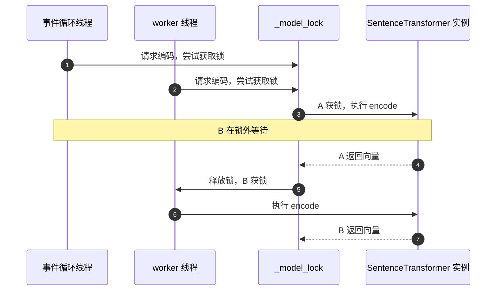
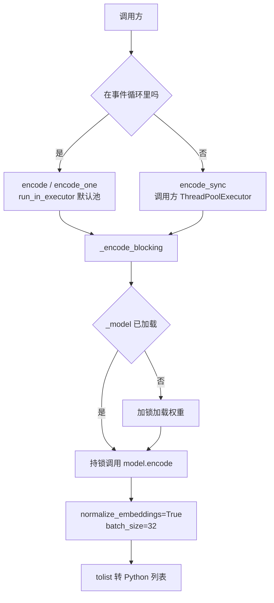
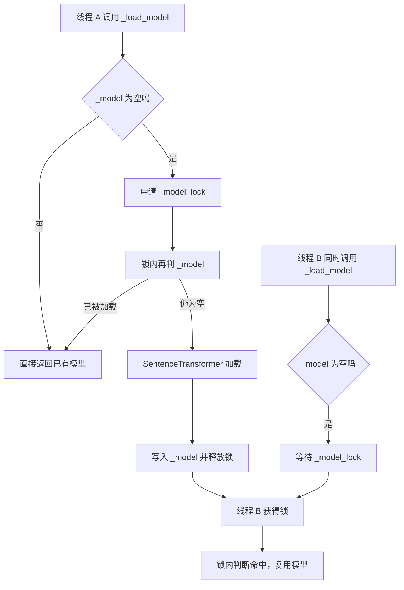

# 单例、推理锁与两种编码入口

嵌入模型占内存、加载慢，进程里只能有一份实例。KnowledgeDiver 的 `Embedder` 用类级单例与延迟加载保证这一点：第一次调用 `get` 才创建对象，第一次编码才加载权重（`backend/ai/embedder.py`）。所有调用方拿到的都是同一个对象，共享同一份权重与同一把锁。

难点不在单例本身，而在两个上下文都要用同一个模型：FastAPI 的请求处理跑在事件循环里，质量评分与全量嵌入加载跑在同步调用链里。事件循环不能被几秒的模型推理阻塞，同步调用链又不能新建事件循环去调用异步接口。代码给出的答案是一把 `threading.Lock` 加两条编码入口，把并发收窄成串行，再由调用方决定在哪条线程上等结果。

设备与线程数不显式设置时会跟随库的默认行为（默认跑 CPU、用默认线程池），换到 GPU 环境或改动线程数后，并发与延迟特征都会变。下面涉及默认值的地方按这个前提理解，实际行为要按环境核对。

## 单例与延迟加载

类的状态全在类属性上：`_instance` 保存唯一实例，`_model` 保存加载后的模型（`backend/ai/embedder.py`）。`get` 在 `_instance` 为空时构造一次，之后直接返回。这种写法在单进程内成立；多进程部署时每个进程各有一份实例，模型会按进程数重复占用内存。

延迟加载把加载成本推到第一次编码。`_load_model` 先看 `_model` 是否已存在，存在就直接返回；不存在才进入加锁区加载 sentence-transformers 模型。`from sentence_transformers import SentenceTransformer` 写在函数内部，导入本身也推迟到首次加载，缩短了模块导入阶段的时间。这就是典型的双重检查锁：

```python
_model_lock = threading.Lock()

def _load_model(self):
    if self._model is not None:
        return self._model
    with _model_lock:
        if self._model is not None:   # 等锁期间可能已被别的线程加载
            return self._model
        from sentence_transformers import SentenceTransformer
        self._model = SentenceTransformer(_MODEL_NAME)
        return self._model
```

第一次判空让绝大多数调用不进锁；进锁后再判一次，避免两个线程各加载一遍模型、内存翻倍。`threading.Lock` 是进程内的互斥量，同一时刻只有一个线程能进入 `with` 块。

模型来源在两个字符串之间切换：仓库内目录存在时用本地路径，否则用 Hugging Face 上的 `BAAI/bge-small-zh-v1.5`。这段判断在模块导入时执行一次，之后 `_MODEL_NAME` 不再变化。部署到没有外网的环境时，如果本地目录缺失，错误要到首次编码时才暴露。

## 一把锁同时保护加载与推理

模块级只有一把锁 `_model_lock`（`backend/ai/embedder.py`），它同时承担两个职责：

- 加载：多个线程同时首次编码时，只有一个线程执行 `SentenceTransformer(...)`，其余线程在锁外等到加载结束，再由双重检查直接复用。
- 推理：`_encode_blocking` 在调用 `model.encode` 期间持锁，把事件循环线程与 worker 线程的编码调用排成队列。

```python
def _encode_blocking(self, texts):
    model = self._load_model()
    with _model_lock:                  # 推理期间也持同一把锁
        return model.encode(
            texts,
            normalize_embeddings=True, # 输出做 L2 归一化
            batch_size=32,
            show_progress_bar=False,
        ).tolist()
```

`normalize_embeddings=True` 让每个向量变成单位长度，`batch_size=32` 是模型内部一次前向的条数，`.tolist()` 把张量复制成普通 Python 列表——锁覆盖的就是这一整段。

两个职责共用一把锁，意味着加载期间的所有编码请求都在等待，而一次大批量编码也会挡住后续请求。收益是模型实例内部状态永远只被一个线程触碰，torch 的线程池不会出现并发争用。代价是编码吞吐被限制为串行，多核 CPU 在单进程里不会被用满。

代码注释把不这么做的后果写明了：`encode` 与 `encode_sync` 可能并发调用同一模型实例，torch 内部线程池竞争会偶发死锁。这是加锁的直接原因，属于运行期观察，不是理论推断。



## encode 与 encode_sync 的分工

两条入口最终都走到 `_encode_blocking`，差别在等待方式（`backend/ai/embedder.py`）：

| 入口 | 调用方上下文 | 等待方式 | 返回 |
| --- | --- | --- | --- |
| `encode` | 事件循环 | `run_in_executor` 挂起当前协程 | 协程，需 await |
| `encode_one` | 事件循环，单条文本 | 内部调用 `encode([text])` 取第一条 | 协程，需 await |
| `encode_sync` | 同步线程 | 直接阻塞当前线程 | 列表 |

异步入口用 `loop.run_in_executor(None, ...)`。第一个参数为 `None` 时使用事件循环的默认线程池，池内线程数由解释器默认值决定。同步入口不经过事件循环，供调用方自己放到 `ThreadPoolExecutor` 里执行。`run_in_executor` 的作用是把阻塞函数交给线程池执行，返回一个 future 由 `await` 等待；等待期间事件循环可以继续处理其他请求，所以几秒的模型推理不会把整个服务卡死。

`encode_one` 没有单独的批量路径，它把单条文本包成列表走一次 `encode`。这意味着查询侧的单条编码同样经过线程池与锁，冷启动时会触发一次模型加载。

两条入口共享锁之后，混用的后果是可预期的：异步请求排队等待某个同步批次完成。批的大小由调用方决定，锁的粒度却是一次 `encode` 调用，所以调用方把多少条文本放进一次调用，直接决定其他请求要等多久。

## 事件循环里的线程池桥接

异步入口的桥接只有三步：取当前事件循环，把阻塞函数提交到默认执行器，等待结果并记录耗时。日志按条数打印总耗时与每条例均耗时，这条日志是排查延迟的主要观测点。

同步调用方的桥接更重一些。`PipelineAPI._load_all_embeddings` 自己建一个 `ThreadPoolExecutor(max_workers=1)`，提交 `encode_sync`，再用 `future.result(timeout=PIPELINE_TIMEOUT_SYNC)` 等（`backend/pipeline/api.py`）。超时来自全局配置，取值为 30 秒（`backend/config.py`）。质量评分侧的加载函数用同一套写法（`backend/quality/provider.py`）。

这种写法在 `encode_sync` 的文档字符串里给了理由：同步链里若用 `asyncio.run` 驱动异步编码，PyTorch 在非主线程清理线程池时可能卡死（`backend/ai/embedder.py`）。绕开事件循环直接阻塞，反而更可控。代价是每个同步调用点都要自建线程池并处理超时，桥接逻辑重复了两处。



## 批量大小 32 与调用方的批次

`model.encode` 的三项参数固定：`normalize_embeddings=True`、`batch_size=32`、`show_progress_bar=False`（`backend/ai/embedder.py`）。前两项在下面两段展开，这里关注批的含义。

`batch_size` 是模型内部一次前向的条数，上限 32 与调用方传入的列表长度无关。传入 200 条文本时，模型分 7 批完成，仍只持锁一次；传入 1 条时也走一次前向。调用方侧的批是外层语义：

| 调用点 | 一次提交的文本量 | 代码位置 |
| --- | --- | --- |
| 语义搜索查询 | 1 条 | `backend/pipeline/api.py`、`backend/routes/cards.py` |
| 新建卡片索引 | 本轮保存的全部卡片 | `backend/pipeline/pipeline.py` |
| 文档流水线索引 | 本批卡片 | `backend/pipeline/pipeline.py` |
| 已有向量加载 | 会话内全部卡片 | `backend/pipeline/pipeline.py` |
| 质量评分加载 | 传入卡片列表 | `backend/quality/provider.py` |
| 向量合并预检 | 1 条主题文本 | `backend/pipeline/pipeline.py` |

外层批越大，单次调用越长，其他请求在锁外等待越久。查询侧与索引侧共用同一把锁，这是查询延迟会随索引批次波动的直接原因。若要缓解，可行的方向是调小索引批次，或在检索期间让索引走独立进程；两条路都会改变部署形态，不给结论。

## 首次加载的并发竞态

首次加载的三重保护分别是：`_model` 的空判断、锁、锁内再次判断（`backend/ai/embedder.py`）。去掉锁内的第二次判断，等待锁的线程会在获得锁后重新加载一遍模型，内存翻倍；去掉锁本身，两个线程会同时进入 transformers 的加载路径。代码注释把后一种后果记为 meta tensor 错误，属于加载期的竞态表现。



单例本身不加锁：`get` 里的判空与赋值不是原子操作。两个线程同时首次调用 `get`，理论上可能各建一个 `Embedder` 对象。实际影响有限，因为模型仍由类属性 `_model` 与锁保护；但对象级的其他状态（如果以后增加）会失去单一性。当前类里没有这种状态，因此这一处按代码事实记录，不构成当前缺陷。

## 错误处理与返回约定

编码函数本身不吞异常。`encode` 里没有 try 块，`run_in_executor` 抛出的异常会透传到 await 点（`backend/ai/embedder.py`）。处理策略由调用方决定：

| 调用点 | 失败后的行为 | 位置 |
| --- | --- | --- |
| 语义搜索接口 | 记日志并返回空结果 | `backend/pipeline/api.py` |
| 卡片语义搜索路由 | 返回 `{"results": [], "fallback": true}` | `backend/routes/cards.py` |
| 全量嵌入加载 | 返回 `None`，评分退回结构信号 | `backend/pipeline/api.py` |
| 新建卡片索引 | 捕获异常后跳过索引 | `backend/pipeline/pipeline.py` |
| 文档流水线索引 | 记警告后跳过 | `backend/pipeline/pipeline.py` |

统一的特征是把嵌入失败降级为“没有向量”，而不是让整个请求失败。降级后的可见症状是语义检索返回空、语义子分回到中性值，日志里对应一行 encode 失败的记录。排查时先看 `backend/ai/embedder.py` 的编码日志是否出现，再看调用点的降级日志。

## 小结

### 核心概念

| 概念 | 实现 | 位置 |
| --- | --- | --- |
| 单例 | 类属性 `_instance` 加 `get` 判空 | `backend/ai/embedder.py` |
| 延迟加载 | 首次编码时导入并加载权重 | `backend/ai/embedder.py` |
| 唯一锁 | `_model_lock` 同时保护加载与推理 | `backend/ai/embedder.py` |
| 异步入口 | `run_in_executor` 默认线程池 | `backend/ai/embedder.py` |
| 同步入口 | 调用方自建 `ThreadPoolExecutor` | `backend/ai/embedder.py`、`backend/pipeline/api.py` |
| 批量 | 模型内 `batch_size=32`，外层批由调用方决定 | `backend/ai/embedder.py` |
| 降级 | 调用点捕获异常并退回无向量路径 | `backend/routes/cards.py` |

### 设计权衡

| 决策 | 收益 | 代价 |
| --- | --- | --- |
| 单进程单例 | 权重只占一份内存 | 多进程部署按进程数重复占用 |
| 加载与推理共用一把锁 | 消除 torch 线程池竞态 | 编码吞吐串行，长批次阻塞其他请求 |
| 保留同步入口 | 避开 asyncio 与 PyTorch 的清理死锁 | 桥接代码在每个同步调用点重复 |
| 默认设备不做设置 | 代码短，跟随库默认值 | CPU 与 GPU 环境行为不同，需按环境核对 |
| 失败降级为无向量 | 检索与评分不会整体失败 | 问题只在日志里可见，结果静默变差 |

## 练习

### 基础题

1. 说明 `get` 与 `_load_model` 分别做了哪一层判空，去掉锁内那次判断会发生什么。
2. 列出 `encode` 与 `encode_sync` 在等待方式上的差别，并指出各自的调用方类型。
3. 说明 `batch_size=32` 与调用方一次传入 200 条文本的关系。

### 挑战题

4. 给 `encode` 增加一个按文本长度分桶的批处理策略，说明改动点、对锁持有时长的影响与需要补的测试。
5. 设计一个实验判断查询延迟是否被索引批次拖慢：要求给出观测指标、采样位置与判读口径，改动范围不超过日志与计时。
6. 把模型加载改到应用启动阶段，列出需要改动的函数与调用顺序，并说明启动失败时服务应如何表现。

### 附：本页引用的路径

| 路径 | 用途 |
| --- | --- |
| `backend/ai/embedder.py` | 单例、锁、加载与两条编码入口 |
| `backend/pipeline/api.py` | 同步加载与查询编码 |
| `backend/quality/provider.py` | 评分侧同步加载 |
| `backend/routes/cards.py` | 路由侧查询编码与降级 |
| `backend/pipeline/pipeline.py` | 索引与合并调用点 |
| `backend/config.py` | 同步桥接超时 |
| `backend/pipeline/factory.py` | 嵌入实例注入 |
