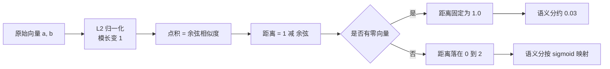
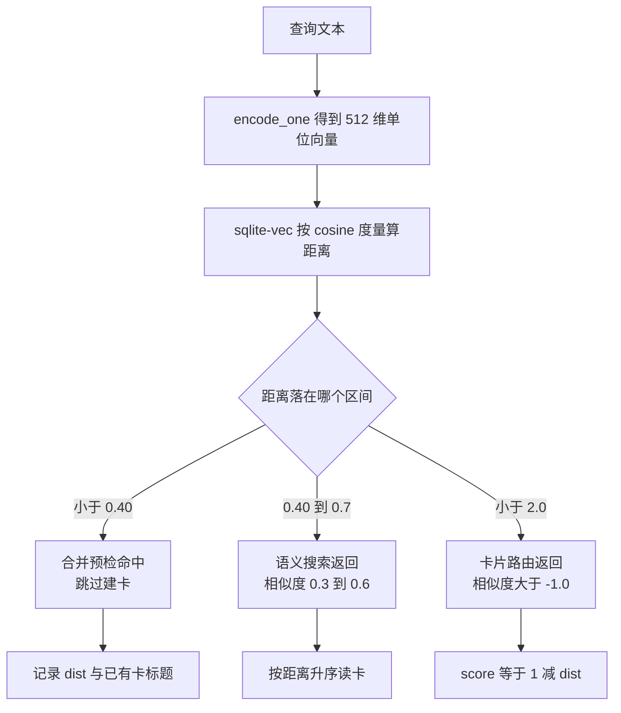

# 归一化、余弦距离与三处阈值口径

嵌入模型输出的是一串浮点，检索要的是“两条文本有多像”。这两个东西之间隔着三步：把向量归一化、选一种距离度量、再定一个阈值。KnowledgeDiver 在这三步上各有取舍：归一化固定在编码函数里，距离度量交给 sqlite-vec 的建表语句，阈值则散在三个调用点，取值分别是 0.40、0.7 与 2.0（`backend/pipeline/pipeline.py`、`backend/storage/sqlite_card_store.py`、`backend/routes/cards.py`）。

阈值不同不一定是错误，因为三处要回答的问题不同：合并要在“几乎重复”处拦下，检索要给出“可能相关”的一批结果，卡片搜索路由则把排序权交给上层。但距离与相似度的方向相反，阈值越小人越像，这一点在阅读代码时容易看反。把三个数换算成同一个口径之后，三处的实际严格程度才可比。

把不同来源的阈值换算到同一口径才能比较松紧：余弦距离与余弦相似度满足 `相似度 = 1 - 距离`，换算只用到这一条。下面的换算是算术推导，不是实测值。

## normalize_embeddings 把向量压到单位球面

编码时传入 `normalize_embeddings=True`（`backend/ai/embedder.py`），这就是那层开关：

```python
model.encode(
    texts,
    normalize_embeddings=True,   # 输出向量单位化
    batch_size=32,
    show_progress_bar=False,
)
```

sentence-transformers 在池化之后对每个向量做 L2 归一化（L2 指欧几里得范数，也就是向量各分量平方和开根号）：

$$\hat{v} = \frac{v}{\lVert v \rVert_2}, \qquad \lVert \hat{v} \rVert_2 = 1$$

归一化之后的直接后果有两个。第一，两个向量的点积等于它们的余弦相似度：

$$\hat{a} \cdot \hat{b} = \cos\theta$$

第二，向量的模长信息被丢弃，只剩方向。方向编码的是语义，模长在 bge 这类模型里没有稳定的解释，丢掉它反而让距离更可比。

归一化的位置需要留意：模型目录的 `modules.json` 也声明了一个 `Normalize` 模块（`models/bge-small-zh-v1.5/modules.json`），但对应的 `2_Normalize` 目录不存在。因此实际生效的是代码里的 `normalize_embeddings=True`，而不是模型目录里的模块声明。两处都归一化时结果相同，但依赖来源不同：模型目录决定不了向量是否单位化，代码决定。

## 余弦距离的定义与零向量边界

质量评分里的距离函数把余弦相似度翻转成距离（`backend/quality/scorer.py`）：

$$d_{\cos}(a, b) = 1 - \frac{a \cdot b}{\lVert a \rVert \lVert b \rVert}$$

距离取值范围是 $[0, 2]$：方向完全相同时为 0，相反时为 2。代码在返回前把余弦相似度夹到 $[-1, 1]$（`scorer.py`），避免浮点误差把结果推出定义域。两个向量长度不一致时直接抛 `Embedding dimension mismatch`（`scorer.py`），这是评分链路里唯一的维度断言。整个函数只有几行：

```python
def _cosine_distance(a, b):
    if len(a) != len(b):
        raise ValueError(f"Embedding dimension mismatch: {len(a)} vs {len(b)}")
    dot = sum(x * y for x, y in zip(a, b))
    norm_a = math.sqrt(sum(x * x for x in a))
    norm_b = math.sqrt(sum(x * x for x in b))
    if norm_a == 0.0 or norm_b == 0.0:
        return 1.0                       # 零向量：判成最不相似
    cos_sim = dot / (norm_a * norm_b)
    return 1.0 - max(-1.0, min(1.0, cos_sim))
```

零向量的特殊返回与维度断言都收在这一个函数里；`1 - cos` 把「越像」翻成「距离越小」，读的时候容易看反。

零向量的处理单独写了一条：任一范数为 0 时返回 1.0（`scorer.py`）。返回 1.0 而不是抛错，是为了让评分继续跑下去。按语义评分的公式，距离 1.0 会被映射到接近最低的分数：

$$s = \frac{1}{1 + e^{(1.0 - 0.30)/0.20}} = \frac{1}{1 + e^{3.5}} \approx 0.029$$

也就是说，一个零向量会被判成“与全库都不相似”，而不是中性。这是评分公式的选择，不是数据缺失的中性表达。



## sqlite-vec 的距离字段

向量表在建表时说好了度量方式：`embedding FLOAT[512] distance_metric=cosine`（`backend/storage/session_database.py`）。`distance_metric=cosine` 是 sqlite-vec 的建表参数，扩展据此维护 `distance` 列，查询端不必自己算距离。查询语句按它排序并过滤（`backend/storage/sqlite_card_store.py`）：

```python
rows = self.db.conn.execute(
    "SELECT m.card_id, v.distance "
    "FROM card_vec_map m JOIN cards_vec v ON m.vec_rowid = v.rowid "
    "WHERE v.embedding MATCH ? AND k = ? AND v.distance < ? "
    "ORDER BY v.distance",
    [blob, limit, threshold],
).fetchall
```

三个参数依次是查询向量、返回条数上限与距离阈值。方向是 `v.distance < threshold`，距离越小结果越靠前。阈值给 2.0 时等价于不过滤，因为余弦距离最大就是 2。

写入端的字节打包按列表实际长度决定（`backend/storage/sqlite_card_store.py`），查询端用的是同一个函数。两端的长度必须都等于建表时的 512，否则扩展会报错或被 `vector_search` 的 try 块吞掉，返回空列表。

## 三处阈值换算到同一口径

把距离阈值换成余弦相似度，用 $s = 1 - d$：

| 调用点 | 距离阈值 | 等价余弦相似度 | 实际含义 |
| --- | --- | --- | --- |
| 主题合并预检 | 0.40 | 0.60 | 只拦下高度相似的主题 |
| 语义搜索 API | 0.7 | 0.30 | 给出可能相关的一批卡片 |
| 卡片搜索路由 | 2.0 | −1.0 | 不过滤，只按距离排序 |

三个点的严格程度差了两个量级。合并预检最严，因为它要决定“是否跳过建卡”；语义搜索居中；路由侧把阈值交给调用方之外的层，自己只做排序。

阈值不是唯一变量，返回条数也在过滤：合并预检取前 3 条（`backend/pipeline/pipeline.py`），搜索接口默认取 `limit` 条（`backend/pipeline/api.py`），路由默认取 10 条（`backend/routes/cards.py`）。阈值决定“哪些候选算合格”，条数决定“合格里给几条”。



## 0.40 的实测背景

`MERGE_DISTANCE_THRESHOLD` 取 0.40（`backend/pipeline/pipeline.py`），合并预检用它判断主题是否已被已有卡片覆盖。这个值来自一次实测：锚定长词会稀释 bge 相似度，使 0.40 的向量合并在一个批次里漏过 13 个重复主题，白做约 300 秒的搜索与生成，最后才由持久化层按标题查重拦下。

漏过的原因可以按距离定义解释：查询主题里混入长前缀或限定词时，整个句子的语义重心被拉向限定词，与已有卡标题的余弦相似度下降，距离升到 0.40 以上。补救措施是增加一道零成本的标题精确预检，在搜索前先拦一次，向量合并继续按 0.40 兜底。

这段记录给出两条可迁移的做法：阈值要配一个实测样本量来说明，单看数字无法判断松紧；纯内存的判据优先于需要编码与检索的判据，拦截点越早成本越低。

## 语义评分如何消费距离

质量评分的语义子分把最近邻距离映射到 $(0,1)$（`backend/quality/scorer.py`）。公式在模块文档里写成：

$$s_{\text{sem}} = \frac{1}{1 + e^{(d - 0.30)/0.20}}$$

其中 $d$ 是该卡到其他卡的最小余弦距离，即最近邻距离（`scorer.py`）。距离越小，指数项越小，分数越高。三个取值可以直观核对：

| 最近邻距离 | 语义分 | 含义 |
| --- | --- | --- |
| 0.10 | 0.73 | 与某张卡非常接近 |
| 0.30 | 0.50 | 中性 |
| 0.50 | 0.27 | 与其他卡都不接近 |

没有可比较的邻居时函数返回 0.5（`scorer.py`），而不是返回 0 或 1。代码注释写明这是保持中性，避免把“无邻居”误判成“完美融入”。这一点与权重归一化的退化保护配合：当全库语义分都接近常数时，该维度的权重被归零并重新归一化（`scorer.py`）。

## 判读时的四个易错点

1. 把 `v.distance` 当成相似度。距离大表示不像，阈值给大表示更宽松，与“相似度阈值”方向相反。
2. 把三处阈值当成同一个单位。0.40、0.7、2.0 都是余弦距离，不是相似度，也不是百分比。
3. 认为归一化只发生在代码里。模型目录声明过 `Normalize` 模块，尽管目录缺失；换模型目录后要重新确认哪一层在归一化。
4. 忽略零向量的特殊返回。零向量在评分里被判成最不相似，在检索里因为 `vector_search` 的异常分支同样拿不到结果，两处表现一致但原因不同。

## 小结

### 核心概念

| 概念 | 取值 | 来源 |
| --- | --- | --- |
| 归一化 | `normalize_embeddings=True` | `backend/ai/embedder.py` |
| 距离度量 | 建表时指定 cosine | `backend/storage/session_database.py` |
| 距离定义 | $1 - \cos\theta$，范围 0 到 2 | `backend/quality/scorer.py` |
| 合并阈值 | 距离 0.40，等价相似度 0.60 | `backend/pipeline/pipeline.py` |
| 搜索阈值 | 距离 0.7，等价相似度 0.30 | `backend/storage/sqlite_card_store.py` |
| 路由阈值 | 距离 2.0，等价不过滤 | `backend/routes/cards.py` |
| 语义映射 | $1/(1+e^{(d-0.30)/0.20})$ | `backend/quality/scorer.py` |
| 零向量 | 距离固定 1.0，语义分约 0.03 | `scorer.py` |

### 设计权衡

| 决策 | 收益 | 代价 |
| --- | --- | --- |
| 编码时归一化 | 点积即余弦，检索端不必再算模长 | 模长信息不可用，向量无法再做长度加权 |
| 距离度量写进建表语句 | 度量与索引绑定，查询简单 | 换度量要重建表并重索引 |
| 三处阈值各自定义 | 每处都贴合自己的业务 | 数值不可直接比较，改一处容易误解其他两处 |
| 合并阈值取 0.40 加标题预检 | 早拦截，省掉整轮搜索与生成 | 预检只覆盖标题完全一致的情形 |
| 无邻居返回中性 0.5 | 不把缺失当成低质量 | 语义维度在小库上贡献接近常数 |

## 练习

### 基础题

1. 把 0.40、0.7、2.0 三个距离阈值换算成余弦相似度，并按严格程度排序。
2. 说明 `v.distance < threshold` 中阈值调大以后召回率与精度的变化方向。
3. 计算最近邻距离为 0.20 时的语义分，并说明 0.30 为什么对应 0.50。

### 挑战题

4. 统计一个会话里的卡片两两余弦距离分布，给出把合并阈值从 0.40 调到 0.35 或 0.45 时预计漏检与误合并的变化，并给出所需的样本量口径。
5. 给 `_cosine_distance` 增加零向量与维度检查的单元测试，列出需要覆盖的输入组合，并说明为什么零向量不能返回中性值。
6. 设计一个实验核对归一化是否真的生效：不修改业务代码，给出观测位置与判据，并解释只靠单条向量的模长能否得出结论。

### 附：本页引用的路径

| 路径 | 用途 |
| --- | --- |
| `backend/ai/embedder.py` | 编码时的归一化 |
| `backend/storage/session_database.py` | 向量表度量与维度 |
| `backend/storage/sqlite_card_store.py` | 距离查询与阈值默认值 |
| `backend/quality/scorer.py` | 余弦距离、零向量与语义映射 |
| `backend/pipeline/pipeline.py` | 合并阈值与实测记录 |
| `backend/pipeline/api.py` | 搜索接口的阈值口径 |
| `backend/routes/cards.py` | 路由侧阈值与得分换算 |
| `models/bge-small-zh-v1.5/modules.json` | 归一化模块声明 |
