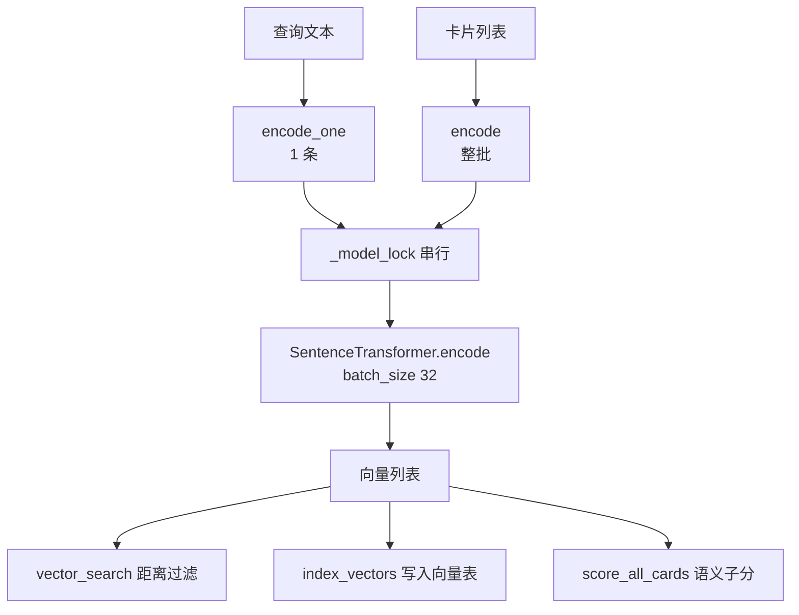
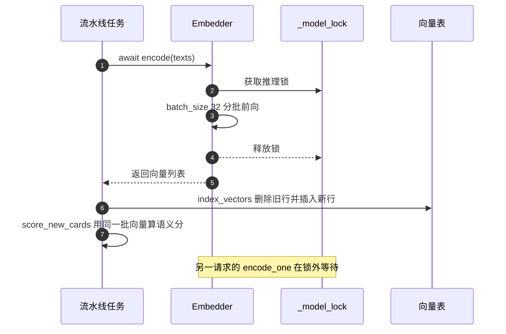
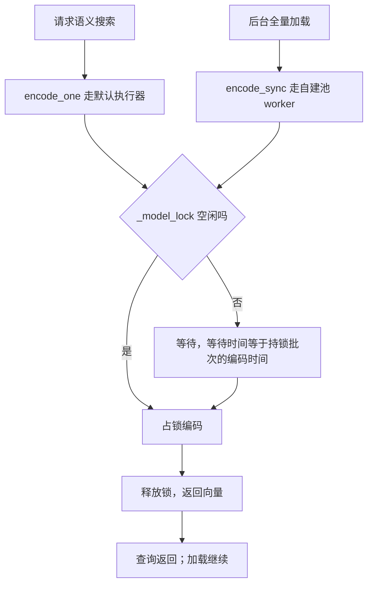

# 调用点、批次与延迟预算

嵌入函数不长，调用它的地方却分布在检索、索引、评分与路由四条路径上。每个调用点决定的都是三件具体的事：编码哪些文本、一次编码多少条、失败时降级成什么。模型是否被使用由流水线结构决定，不在这三件事里。这三件事共同决定了延迟预算，因为所有调用点共享同一个模型实例与同一把推理锁（`backend/ai/embedder.py:25`）。

延迟的主要风险不在模型本身，而在批次与等待方式。查询侧一次只编码一条，索引侧一次可能编码整个会话的卡片；查询走异步入口，评分走同步入口。当一次全量索引与一次查询叠在一起时，查询的等待时间等于索引批次的编码时间，而不是单条编码时间。把调用点、批次与超时列全，才能判断这个等待是否落在可接受范围内。

文中 500 ms 与 10 ms 两个数字来自模块文档的声明值（`backend/ai/embedder.py:4-5`），未在本仓库实测，标注为待实测。

## 调用点清单与向量来源

| 场景 | 调用方式 | 位置 |
| --- | --- | --- |
| 语义搜索接口 | `await encode_one(query)` | `backend/pipeline/api.py:443-450` |
| 卡片语义搜索路由 | `await encode_one(query)` | `backend/routes/cards.py:65-75` |
| 新建卡片索引 | `await encode(texts)`，texts 为本轮卡片 | `backend/pipeline/pipeline.py:697-702` |
| 文档流水线索引 | `await encode(texts)`，texts 为本批卡片 | `backend/pipeline/pipeline.py:823-830` |
| 已有向量加载 | `await encode(texts)`，texts 为会话全部卡片 | `backend/pipeline/pipeline.py:866-877` |
| 主题合并预检 | `await encode_one(topic)` | `backend/pipeline/pipeline.py:416-422` |
| 全量嵌入加载（同步） | `encode_sync` 包在 `ThreadPoolExecutor` | `backend/pipeline/api.py:711-737` |
| 评分侧嵌入加载（同步） | `encode_sync` 包在 `ThreadPoolExecutor` | `backend/quality/provider.py:163-185` |

八个调用点里五个是异步、两个是同步桥接，还有一个是同步桥接在评分模块里的副本。异步调用点用 `await` 让出事件循环，同步调用点阻塞自己所在的线程。两条路都经过同一把锁，因此并发时的排队顺序由锁决定，不由调用点类型决定。

向量实例的注入集中在一个地方：工厂函数在构造流水线时传入 `Embedder.get()`（`backend/pipeline/factory.py:74`、`:101`）。流水线不关心模型来自本地目录还是远端，它只要求对象有 `encode` 与 `encode_one`。



## 文本拼装口径：标题换行加正文

所有索引与评分路径用同一个拼装式：

```python
texts = [f"{c.title}\n{c.content}" for c in cards]
```

出现位置有四处：新建卡片索引（`backend/pipeline/pipeline.py:699`）、文档流水线索引（`:827`）、已有向量加载（`:875`）、同步加载（`backend/pipeline/api.py:721`）与评分侧加载（`backend/quality/provider.py:173`）。标题在前、换行、正文在后，中间没有分隔符标记。

这个口径有一个直接后果：标题与正文被拼成一个序列，模型无法区分哪一部分是标题。标题词在全文中被重复一次（标题本身也在正文里出现的情况另算），权重被轻微抬高；正文过长时按 512 token 截断，截断点之后的内容不参与向量。若希望标题单独加权，需要改这一处拼装式，四个位置必须一起改。

查询侧不做同样的拼装：`encode_one(query)` 直接编码用户输入（`backend/pipeline/api.py:445`、`backend/routes/cards.py:70`）。查询与文档的文本形态不同，这是检索常见的不对称口径。bge 系列官方做法是在短查询前加指令前缀，本仓库没有加，属于检索质量调参的空间。

## 索引写入与旧行替换

`index_vectors` 接收卡片 ID 列表与向量列表，按 `zip` 配对写入（`backend/storage/sqlite_card_store.py:412-434`）。写入前先查 `card_vec_map` 里该卡是否已有行号：有就删掉旧向量行与映射行，再插入新行并记录新行号（`:417-432`）。整个过程在 `_vec_lock` 下完成并提交一次。

三个前置判断会让调用静默返回：卡片 ID 列表为空、向量表不可用（`_vec_ready` 失败）、以及查询扩展未加载。`_vec_ready` 用一条 `SELECT 1 FROM cards_vec LIMIT 0` 探测表是否存在（`:405-410`）。表不存在时索引不报错，检索侧同样返回空列表（`:437-439`），于是整个向量能力静默消失，只剩日志里的 `向量搜索跳过`。

写入端不检查向量维度，只按列表长度打包（`:33-34`）。维度与建表时的 512 不一致时，错误发生在扩展内部，被 `vector_search` 与 `index_vectors` 的异常处理吞掉。核对维度要在更换模型时主动做一次，不能指望运行期报错。

## 批次与 30 秒超时

同步桥接的等待上限是全局常量 `PIPELINE_TIMEOUT_SYNC = 30`（`backend/config.py:117`）。两处使用方式相同：提交任务、`future.result(timeout=30)`、超时后记日志并返回 `None` 或空结果（`backend/pipeline/api.py:723-737`、`backend/quality/provider.py:175-185`）。

超时保护的是同步调用链，不是编码本身。超时之后 `future.cancel()` 或线程池退出，编码可能仍在后台线程里跑完；锁被占用期间，其他调用点继续排队。也就是说，超时把“调用方拿到降级结果”和“锁仍被占用”分开了，这两件事在延迟排查时要分别观测。

按模块文档声明的每条约 10 ms（`backend/ai/embedder.py:4-5`）估算，30 秒对应约 3000 条文本的编码时间，其中不含锁竞争与其他请求的排队时间。全量加载把会话内全部卡片放进一次编码（`backend/pipeline/pipeline.py:866-877`、`backend/pipeline/api.py:721`），卡片数超过这个量级就会超时返回 `None`，评分退回结构信号。这一推断基于声明值，实际阈值需要用编码日志核对，标注为待实测。



## 首次加载与稳态延迟

首次编码包含三段时间：导入 `sentence_transformers`（函数内导入，`backend/ai/embedder.py:55`）、从本地目录或远端加载权重（`:58`）、第一次前向传播的初始化。模块文档给出的量级是首次约 500 ms、之后每条约 10 ms（`:4-5`）。本地权重文件 `model.safetensors` 为 95,827,648 字节，加载时至少要把这份权重读进内存。

稳态延迟由四段组成：

| 阶段 | 影响因素 | 观测位置 |
| --- | --- | --- |
| 排队 | 锁是否被其他批次占用 | 无直接日志，靠编码日志的时间戳推断 |
| 分词 | 文本条数与长度 | 模型内部，无日志 |
| 前向 | 条数、`batch_size=32`、CPU 型号 | 模型内部，无日志 |
| 结果转换 | `tolist()` 复制整个批次 | `backend/ai/embedder.py:65-70` |

唯一的观测点是编码日志：条数、总耗时、每条例均耗时（`:80`）。每条例均耗时在批次较大时会下降，因为模型前向的固定开销被摊薄；这条日志可以直接回答“当前批次是否过大”。

## 两个线程池与阻塞风险

异步入口用事件循环的默认执行器（`run_in_executor(None, ...)`，`backend/ai/embedder.py:75-78`），同步调用点各自新建 `ThreadPoolExecutor(max_workers=1)`（`backend/pipeline/api.py:723`、`backend/quality/provider.py:175`）。三类线程都可能同时请求同一把锁：

- 默认执行器的线程，来自各异步调用点；
- 同步调用点自建的 worker 线程；
- 首次加载所在的那个线程，它在加载期间持锁。

风险集中在事件循环上：异步入口本身不阻塞事件循环，但同步调用方若在事件循环所在的线程里直接调用 `encode_sync`，事件循环会被 `future.result(timeout=30)` 阻塞最多 30 秒。代码通过自建线程池把等待挪到 worker 线程，调用侧是否真的在 worker 线程里，取决于上游调用链。排查到接口无响应时，先确认 `_load_all_embeddings` 或 `_load_embeddings` 是否被事件循环线程直接调用。



## 易错点

1. 只统计模型前向时间，忽略锁排队。每条例均耗时正常而接口慢，往往是批次抢占锁。
2. 把 30 秒超时当成编码上限。超时只结束等待，后台线程与锁可能仍被占用。
3. 在事件循环线程里调用 `encode_sync`。这样写会把事件循环本身阻塞到超时。
4. 改文本拼装式只改一处。五处拼装式必须同步修改，否则同一批向量来自不同口径，检索与评分结果不可比。
5. 认为向量表不可用会有显式报错。`_vec_ready` 失败、`index_vectors` 前置判断与 `vector_search` 的异常处理都是静默返回，需要看日志确认。
6. 用声明值当实测值。500 ms 与 10 ms 来自模块文档，机器、批大小与文本长度都会改变它们。

## 小结

### 核心概念

| 概念 | 取值或做法 | 位置 |
| --- | --- | --- |
| 异步调用点 | 五个，查询侧单条、索引侧整批 | `backend/pipeline/api.py:445` 等 |
| 同步调用点 | 两个，均为 `encode_sync` 加自建线程池 | `backend/pipeline/api.py:723`、`backend/quality/provider.py:175` |
| 文本拼装 | `标题 + 换行 + 正文`，五处相同 | `backend/pipeline/pipeline.py:699` 等 |
| 索引写入 | 先删旧行再插新行，映射表记录行号 | `backend/storage/sqlite_card_store.py:412-434` |
| 同步超时 | 30 秒 | `backend/config.py:117` |
| 声明延迟 | 首次约 500 ms，每条约 10 ms（待实测） | `backend/ai/embedder.py:4-5` |
| 唯一观测点 | 编码日志的条数与耗时 | `backend/ai/embedder.py:80` |

### 设计权衡

| 决策 | 收益 | 代价 |
| --- | --- | --- |
| 索引整批编码 | 一次锁占用完成全部向量，减少往返 | 长批次阻塞查询 |
| 查询单条编码 | 延迟可预测 | 无法摊薄模型固定开销 |
| 同步桥接自建线程池 | 不阻塞事件循环 | 池与桥接代码重复 |
| 30 秒超时后降级 | 调用方能继续 | 后台编码与锁占用不受超时影响 |
| 写入端不校验维度 | 代码短 | 换模型时静默出错 |

## 练习

### 基础题

1. 列出五个异步调用点，并说明各自一次提交多少条文本。
2. 说明文本拼装式的三部分构成，以及截断发生在什么位置。
3. 说明 30 秒超时之后，调用方与后台线程各自的后续状态。

### 挑战题

4. 用编码日志估算本机在 32 条一批时的每条例均耗时，与模块文档的 10 ms 对比，并分析差异来源。
5. 设计一个把索引批次限制在 32 条以内的调度方案，说明需要改动的调用点、对总索引时间与查询延迟的影响。
6. 给出一个不修改业务代码的观测方案，用于判断某次接口变慢是锁排队还是模型前向变慢，并列出需要采集的时间戳。

### 附：本页引用的路径

| 路径 | 用途 |
| --- | --- |
| `backend/ai/embedder.py` | 编码入口、锁与日志（:4-5、:25、:55-58、:65-70、:75-80） |
| `backend/pipeline/api.py` | 查询编码与同步加载（:443-450、:711-737） |
| `backend/pipeline/pipeline.py` | 索引、评分与合并调用点（:416-422、:697-706、:823-832、:866-877） |
| `backend/quality/provider.py` | 评分侧加载（:163-185） |
| `backend/routes/cards.py` | 路由侧查询编码（:65-75） |
| `backend/storage/sqlite_card_store.py` | 索引写入与探测（:33-34、:405-434） |
| `backend/config.py` | 同步超时（:117） |
| `backend/pipeline/factory.py` | 嵌入实例注入（:74、:101） |
