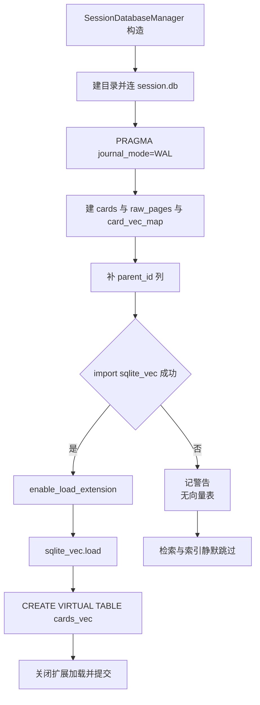
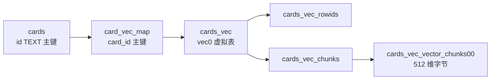

# vec0 虚拟表与会话库布局

KnowledgeDiver 的向量不走外部向量库，而是和卡片放在同一个 SQLite 文件里：每个会话一份 `session.db`，路径是 `cards/{username}/{session_id}/session.db`（`backend/storage/session_database.py`）。向量表由 sqlite-vec 扩展提供，类型是 `vec0`，列名 `embedding`，维度 512，度量 cosine。sqlite-vec 是一个以 SQLite 扩展形式提供的向量检索模块，`vec0` 是它注册的虚拟表类型：虚拟表本身不存数据，真正的向量字节由扩展维护在几张影子表里。卡片表、原始页表、映射表与向量表共用一个连接，也共用事务。

这种布局的取舍很明确：部署只依赖一个文件，备份与迁移跟着会话走；代价是向量能力依赖扩展加载，而扩展是进程内的，每个新连接都要重新加载一次。加载失败时建表语句不会执行，向量表不存在，检索静默返回空结果。

## 每个会话一个数据库文件

路径由用户名与会话 ID 拼出，构造时先建目录再连文件（`backend/storage/session_database.py`）。连接参数有三个要点，落到代码是这几行：

```python
self.db_dir = root / "cards" / username / session_id
self.db_dir.mkdir(parents=True, exist_ok=True)

self.conn = sqlite3.connect(str(self.db_dir / "session.db"), check_same_thread=False)
self.conn.row_factory = sqlite3.Row
self.conn.execute("PRAGMA journal_mode=WAL;")
```

`check_same_thread=False` 解除 sqlite3 默认的线程检查，让同一个连接能被多个线程使用；`row_factory = sqlite3.Row` 让结果行可以按列名取值；`journal_mode=WAL` 是 SQLite 的写前日志模式，读操作不会被写事务挡住。

| 参数或语句 | 取值 | 作用 |
| --- | --- | --- |
| `check_same_thread` | `False` | 允许连接跨线程使用 |
| `row_factory` | `sqlite3.Row` | 查询结果可按列名取值 |
| `PRAGMA journal_mode` | `WAL` | 读写并发，读不阻塞写 |

目录不可写时抛出的异常被改写成一整段包含目录归属与权限的提示，原因是该目录可能由 root 创建过。这一段是仓库里少见的把常见环境问题的修复命令写进异常的做法，排查权限问题时直接看异常文本即可。

实例被登记在类级字典里，按 `(username, session_id)` 分组，关闭时按分组清理。同一个会话可能同时存在多个连接对象，这与 SQLite 的多连接行为一致，但 WAL 模式下的写并发仍由数据库锁控制。

## 扩展按连接加载

加载放在建表之前，顺序是先建表结构、再迁移列、最后初始化向量表（`backend/storage/session_database.py`）。向量表初始化内部做三件事：

```python
import sqlite_vec
self.conn.enable_load_extension(True)
sqlite_vec.load(self.conn)
self.conn.execute(
    "CREATE VIRTUAL TABLE IF NOT EXISTS cards_vec USING vec0("
    "  embedding FLOAT[512] distance_metric=cosine"
    ")"
)
self.conn.enable_load_extension(False)
self.conn.commit
```

先开 `enable_load_extension`，加载完立刻关掉。`enable_load_extension(True)` 打开 SQLite 的扩展加载开关（默认关闭，是一项安全限制），随后 `sqlite_vec.load(conn)` 才把 `vec0` 模块注册进这个连接。整个块包在 try 里，失败只记一条警告 `Vector extension load failed`，不抛出。这意味着缺少扩展的环境里其余功能照常，向量表不存在，检索与索引都退化为空操作。

连接是进程级的：每个 `SessionDatabaseManager` 各自打开一个连接并各自加载扩展。没有全局一次性加载的入口，因此“扩展装好了”这句话只对加载过它的连接成立。新建连接、换会话、重建连接都要重新走一遍这段代码。



## cards_vec 的建表语句

向量表的完整定义只有两行（`backend/storage/session_database.py`）：

```sql
CREATE VIRTUAL TABLE IF NOT EXISTS cards_vec USING vec0(
  embedding FLOAT[512] distance_metric=cosine
)
```

三个信息都写在语句里：列名 `embedding`、元素类型 `FLOAT`、长度 512，以及度量 `cosine`。`IF NOT EXISTS` 让重复打开会话幂等，也意味着换模型后不会自动改建表，旧表会继续按 512 维接受数据。

建表语句与实际存储的绑定比普通表更紧：向量维度写进模块参数后，写入长度不符会报错；度量方式写进索引结构后，改度量需要重建表。模型目录里输出 512 维（`models/bge-small-zh-v1.5/config.json`），这个数与 `FLOAT[512]` 必须一起改。

## vec0 的影子表

vec0 是虚拟表，数据实际落在几张由扩展创建并维护的普通表里。在真实会话库上可以读到它们：

| 表名 | 作用 |
| --- | --- |
| `cards_vec` | 虚拟表本身，对外提供 `MATCH` 查询与 `distance` 列 |
| `cards_vec_rowids` | 行号与数据块位置的映射 |
| `cards_vec_chunks` | 数据块登记 |
| `cards_vec_vector_chunks00` | 实际的向量字节 |
| `cards_vec_info` | 扩展写入的元信息 |
| `cards_vec_chunks`、`cards_vec_rowids` 上的自动索引 | 支撑按行号与块定位 |

影子表名带 `_chunks` 与 `_vector_chunks00` 后缀，直接读它们是绕过扩展的内部结构，只在诊断时用。核对工具脚本读的是虚拟表而不是影子表（`scripts/quality_audit.py`），这是更稳的做法：影子表的布局随扩展版本变化。

## 映射表 card_vec_map

虚拟表对外只认 `rowid`，卡片用字符串 ID，两者之间靠映射表衔接（`backend/storage/session_database.py`）：

```sql
CREATE TABLE IF NOT EXISTS card_vec_map (
    card_id TEXT PRIMARY KEY,
    vec_rowid INTEGER UNIQUE
);
```

`card_id` 是主键，说明一张卡最多一行向量；`vec_rowid` 加了唯一约束，说明一个向量行号最多被一张卡引用。两个约束合起来把关系限定成一对一，写入侧因此需要“先删旧行再插新行”的替换流程，而不是覆盖更新。



映射表是普通表，与虚拟表在同一个会话库里，事务一起提交。查询时用 `JOIN` 把距离结果换成卡片 ID（`backend/storage/sqlite_card_store.py`）。映射表缺行时向量即便存在也不会被检索到，这一条是排查“库里有向量但搜不到”的第一个检查点。

## 表存在不等于有向量

扩展加载成功只说明建表语句执行过，不代表向量已经写入：判断一个会话的检索能力，要看映射表行数与卡片数的比值，而不是 `cards_vec` 表是否存在。空表同样能被 `SELECT 1 FROM cards_vec LIMIT 0` 探测通过，因为探测只回答「扩展可用且表已建」，不回答「有没有向量」。`_auto_build_vectors` 的比较逻辑正是这两张表的计数（`backend/storage/sqlite_card_store.py`）。

一次全库只读盘点里，所有会话库都建出了 `cards_vec`，但只有一部分库的映射表有行，映射行数也明显少于卡片总数，抽样库里还存在卡片数不为零、映射表却为空的会话——差值是尚未建立向量的卡片。排查「库里有向量却搜不到」时，先数映射表行数就是这个道理。

## 易错点

1. 认为扩展是全局加载的。每个连接独立加载，新连接必须重新执行。
2. 把 `cards_vec` 存在当成有向量。空的映射表会让检索返回空结果。
3. 直接读写影子表。内部布局随扩展版本变化，诊断可以看，业务代码不要依赖。
4. 换模型时只改建表语句。已存在的表不会被 `IF NOT EXISTS` 重建，需要先删表或新建会话库。
5. 忽略扩展加载失败只记警告。缺少扩展的部署里，索引与检索都不报错。

## 小结

### 核心概念

| 概念 | 取值 | 来源 |
| --- | --- | --- |
| 库路径 | `cards/{username}/{session_id}/session.db` | `backend/storage/session_database.py` |
| 并发模式 | WAL，连接允许跨线程 | `backend/storage/session_database.py` |
| 扩展加载 | 按连接加载，失败只记警告 | `backend/storage/session_database.py` |
| 向量表 | `vec0` 虚拟表，`FLOAT[512]`，cosine | `backend/storage/session_database.py` |
| 影子表 | rowids、chunks、vector_chunks00、info | 真实库 schema |
| 映射表 | `card_id` 主键与 `vec_rowid` 唯一 | `backend/storage/session_database.py` |
| 判断口径 | 映射行数与卡片数的比值，而不是表是否存在 | `backend/storage/sqlite_card_store.py` |

### 设计权衡

| 决策 | 收益 | 代价 |
| --- | --- | --- |
| 向量与卡片同库 | 一个文件备份，事务一致 | 库文件随向量增长，且依赖扩展 |
| 每连接加载扩展 | 不依赖全局状态 | 加载失败只影响当前连接，问题分散 |
| `IF NOT EXISTS` 建表 | 打开会话幂等 | 维度与度量变更不会自动生效 |
| 一对一的映射表 | card_id 与 rowid 双向可查 | 写入必须走删除加插入 |
| 失败降级为无向量 | 其余功能可用 | 检索变空没有显式错误 |

## 练习

### 基础题

1. 列出打开一个会话库时会执行的建表语句，并指出向量表与普通表的创建时机差别。
2. 说明 `card_vec_map` 的两个约束分别限制了哪种重复。
3. 给定卡片总数与映射表行数，说明如何判断该会话还缺多少张卡的向量。

### 挑战题

4. 写一段只读盘点脚本，统计多个会话库的卡片数、映射行数与向量表是否存在，并说明为什么不能直接读影子表取向量。
5. 把扩展加载从“每连接”改为“进程启动时一次”，列出需要改动的文件与调用顺序，并分析多线程下的风险。
6. 设计一个把模型换到 768 维的迁移方案：要求给出建表、数据与代码三部分的顺序，并说明中途失败时如何回滚。

### 附：本页引用的路径

| 路径 | 用途 |
| --- | --- |
| `backend/storage/session_database.py` | 库路径、连接参数、扩展加载与建表 |
| `backend/storage/sqlite_card_store.py` | 映射表使用与就绪探测 |
| `scripts/quality_audit.py` | 只读读取向量表 |
| `models/bge-small-zh-v1.5/config.json` | 输出维度 512 |
| `cards/1111/default/session.db` | 抽样会话库（82 张卡，映射 0 行） |
