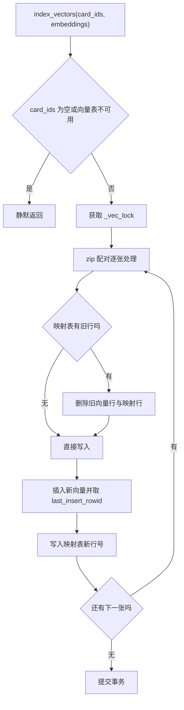
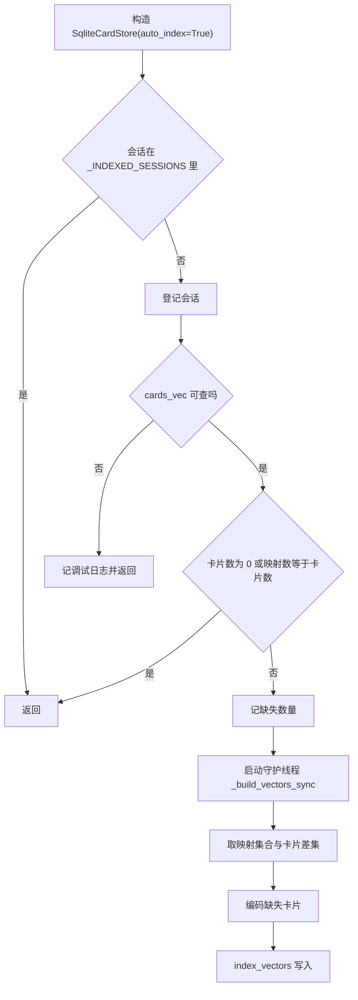

# 映射替换、增量索引与重建入口

向量写入由三个入口触发：流水线保存卡片后批量写入、进程内第一次构造卡片存储时自动补齐、以及重建索引接口。三条路的终点都是 `index_vectors`，它做的事固定：删旧行、插新行、更新映射、提交（`backend/storage/sqlite_card_store.py`）。虚拟表与映射表在同一个事务里，写入失败不会留下半条关系。

增量索引的触发点很隐蔽：它在 `SqliteCardStore` 的构造函数里。任何代码构造一个卡片存储对象，都会顺带检查当前会话的索引完整度；不完整就起一个后台线程去补。这个设计让检索能力随使用自动补齐，代价是索引的启动时机不在业务代码的显式调用里，排查时要在构造点与线程日志两处找证据。

重建接口那一节还会指出一个通用的 asyncio 陷阱：在正在运行的事件循环里调用 `run_until_complete` 会直接报错，异步框架里的同步实现要特别小心。

## 一次写入的四个动作

`index_vectors` 的输入是两个等长列表：卡片 ID 与向量（`backend/storage/sqlite_card_store.py`）。函数先做两个前置判断，任一不成立就直接返回：

```python
if not card_ids or not self._vec_ready:
    return
```

`_vec_ready` 用 `SELECT 1 FROM cards_vec LIMIT 0` 探测表是否可查。扩展未加载、表不存在、连接失效三种情况都在这里被归并成“不可用”，调用方拿不到区分信息。

通过判断后，在 `_vec_lock` 保护下逐张处理。单张卡的动作是四步：

| 步骤 | 语句 | 目的 |
| --- | --- | --- |
| 1 | `SELECT vec_rowid FROM card_vec_map WHERE card_id = ?` | 查旧行号 |
| 2 | `DELETE FROM cards_vec WHERE rowid = ?` 与 `DELETE FROM card_vec_map` | 删旧向量与旧映射 |
| 3 | `INSERT INTO cards_vec(embedding) VALUES (?)` | 写入新向量 |
| 4 | `INSERT INTO card_vec_map(card_id, vec_rowid) VALUES (?, ?)` | 记录新行号 |

四步在一个循环里，循环结束后提交一次。中间失败会留下未提交的事务，由连接关闭或后续回滚处理。逐张删除加插入而不是批量 UPSERT，原因是虚拟表没有主键约束可以用在卡片 ID 上。循环本体如下：

```python
with self._vec_lock:
    for cid, emb in zip(card_ids, embeddings):
        old = self.db.conn.execute(
            "SELECT vec_rowid FROM card_vec_map WHERE card_id = ?", (cid,)
        ).fetchone()
        if old:
            self.db.conn.execute("DELETE FROM cards_vec WHERE rowid = ?", (old[0],))
            self.db.conn.execute("DELETE FROM card_vec_map WHERE card_id = ?", (cid,))
        self.db.conn.execute("INSERT INTO cards_vec(embedding) VALUES (?)", [_encode_blob(emb)])
        new_row = self.db.conn.execute("SELECT last_insert_rowid()").fetchone()
        self.db.conn.execute(
            "INSERT INTO card_vec_map(card_id, vec_rowid) VALUES (?, ?)",
            (cid, new_row[0]),
        )
    self.db.commit()
```

`_vec_lock` 是 `threading.Lock`，把同一会话的写入串行化；`last_insert_rowid()` 取出刚写入的向量行号，再写回映射表，这正是「替换之后行号会变」的原因。



## 配对靠下标，长度不符会静默截断

写入用 `zip(card_ids, embeddings)` 配对。`zip` 在最短列表处停止，因此两个列表长度不一致时不会报错，只会少写若干张卡。长度差可能来自调用方的切片错误，也可能来自编码阶段抛异常后被上层截断；两种都会表现成“部分卡片没有向量”。

编码侧的返回条数与输入条数一致（`backend/ai/embedder.py` 的 `tolist`），所以正常路径不会出现长度差。要防的是调用方在异常分支里返回了部分结果。核对办法是比较 `card_ids` 长度与映射表新增行数，或者直接用映射表行数与卡片数比较（`_auto_build_vectors` 用的就是后者）。

## 旧行替换为什么不能用 UPDATE

向量表是 `vec0` 虚拟表，卡片 ID 不是它的列，唯一可以定位行的是 `rowid`。写入端先用映射表把 `card_id` 换成 `rowid`，再按行操作，于是替换流程被拆成删除与插入两段。

这样做的副作用是行号会变化。旧行号被删除后，新插入的行拿到新的 `last_insert_rowid`，映射表必须同步更新。只删向量不删映射、或只更新映射不删向量，都会让一对一约束或检索结果出错。诊断时可以直接数映射表行数与向量表行数，两边不等说明替换流程中途失败过。

## 增量索引的触发链

`SqliteCardStore` 构造时若 `auto_index` 为真，调用 `_auto_build_vectors`（`backend/storage/sqlite_card_store.py`）。触发链分四步：

1. 进程级集合 `_INDEXED_SESSIONS` 记录已经检查过的会话。同一个会话在一个进程内只检查一次，第二次构造直接返回。
2. 探测向量表是否可查，不可用就记一条调试日志并返回。
3. 比较 `card_vec_map` 行数与 `cards` 行数。卡片为零或两者相等都直接返回，不启动线程。
4. 计数不等时打印缺失数量，启动一个守护线程执行 `_build_vectors_sync`。

```python
def _auto_build_vectors(self, username):
    key = (username, self.session_id)
    if key in _INDEXED_SESSIONS:      # 进程级只检查一次
        return
    _INDEXED_SESSIONS.add(key)
    try:
        self.db.conn.execute("SELECT 1 FROM cards_vec LIMIT 0")   # 探测向量表
    except Exception:
        _logger.debug("Vector extension not available, skipping auto-index")
        return
    ...
```

`SELECT 1 FROM cards_vec LIMIT 0` 只做一次语法与表存在性检查、不取数据，是探测「扩展已加载且表已建」的廉价办法；`_INDEXED_SESSIONS` 是模块级 `set`，所以同一会话在一个进程内只检查一次。

第三步只比较总数，不逐卡比较差集，两者在中间状态会不一致：删过卡片、向量行没清理时，总数可能相等而具体卡片对不上。`_build_vectors_sync` 内部改用逐卡差集：取出映射表里已有的卡片 ID 集合，与卡片列表相减，只编码缺失的那些。两级判断分别服务“要不要干活”和“干哪些活”。



## 后台线程里的编码

`_build_vectors_sync` 在守护线程里加载嵌入模型并编码。它用 `asyncio.get_event_loop` 取事件循环，取不到就新建一个并设为当前循环，然后 `run_until_complete` 等编码完成。在非主线程里新建循环是可行的，但这条路径与 `encode_sync` 的设计意图相反：`encode_sync` 的文档字符串明确说不要用事件循环加 PyTorch 的组合，以避免非主线程清理时卡死（`backend/ai/embedder.py`）。

风险因此分成两层：线程里新建的事件循环不会被关闭，只被丢弃；编码本身通过嵌入模型的锁串行化，不会与其他调用并发写模型，但会把锁占用时间拉长。编码失败时异常被外层捕获，记一条 `自动索引失败` 的警告，线程结束，映射表保持不完整，下一次构造时计数不等会再试一次。

## 重建索引接口的运行期阻塞

重建接口是 `POST /api/cards/reindex`，处理函数是异步的（`backend/routes/cards.py`），内部直接调用同步的 `store.reindex_all`。`reindex_all` 的实现是取事件循环再 `run_until_complete`（`backend/storage/sqlite_card_store.py`）：

```python
try:
    loop = asyncio.get_event_loop
except RuntimeError:
    loop = asyncio.new_event_loop
    asyncio.set_event_loop(loop)
embeddings = loop.run_until_complete(embedder.encode(texts))
```

在异步处理函数里，`get_event_loop` 返回的是正在运行的事件循环。对正在运行的循环调用 `run_until_complete` 会抛 `RuntimeError: This event loop is already running`。按 asyncio 语义推导，这条路径在事件循环线程里不可用；异常会冒泡到路由层，请求以 500 结束。要规避，需要在 `reindex_all` 里改用线程池桥接，或把处理函数改成同步函数让框架放进线程池执行。这一处标注为按语义推导，未在本机触发复现。

同一个 `reindex_all` 由其他同步上下文调用时反而正常：主线程没有运行中的循环，`get_event_loop` 抛 `RuntimeError`（Python 3.12 起无当前循环时如此），代码随后新建循环并执行。也就是说，这个函数的正确性与调用线程强相关，接口路径恰好落在会失败的那一侧。

## 删除单卡向量

`delete_vector` 与写入共用同一把锁，按映射表查到行号后删两张表再提交（`backend/storage/sqlite_card_store.py`）。映射表没有该卡时整段跳过，不报错，这是删除幂等的实现方式。

删除与自动索引之间有一个顺序关系：删除后映射表行数减一，卡片数也减一，两者仍然相等，增量索引不会因为删除而重跑。若只删了卡片没有调用 `delete_vector`，映射表会多出一行，检索结果里可能出现指向已删卡片的 ID，随后读取卡片时返回空并被过滤（`backend/storage/sqlite_card_store.py`）。

## 打包格式与维度

向量以字节写入：`struct.pack(f'{len(embedding)}f', *embedding)`。格式字符串按实际长度生成，`f` 是 4 字节浮点，默认使用本机字节序。x86_64 与 ARM64 上都是小端，与读取脚本里的 `<512f` 一致（`scripts/quality_audit.py`）。换到大端平台时两侧会一起读错，属于潜在的可移植性问题，当前部署不受影响。

写入端不校验长度是否为 512。长度不等于建表维度时，错误由扩展内部抛出，再被上层吞掉。核对维度只能在换模型时主动做，例如比较 `len(embedding)` 与 512 的断言，或在重建后数映射表行数是否等于卡片数。

## 易错点

1. 认为索引只在显式调用时发生。构造存储对象就会触发一次检查与可能的后台索引。
2. 只看总数比较，不看差集。删卡后总数相等也会漏掉不一致。
3. 用 `zip` 配对却不校验长度。长度不等时部分卡片静默没有向量。
4. 在异步路由里直接调用 `reindex_all`。运行中的事件循环会拒绝 `run_until_complete`。
5. 删除卡片不删向量。检索会拿到指向已删卡片的行。
6. 把映射表行数当成向量数量的唯一判据。还要确认向量表本身有对应行。

## 小结

### 核心概念

| 概念 | 做法 | 位置 |
| --- | --- | --- |
| 写入前置判断 | 空列表或向量表不可用则返回 | `backend/storage/sqlite_card_store.py` |
| 替换流程 | 删旧向量与旧映射，再插新行 | `backend/storage/sqlite_card_store.py` |
| 配对方式 | `zip`，长度不等静默截断 | `backend/storage/sqlite_card_store.py` |
| 触发点 | 构造函数里检查会话完整度 | `backend/storage/sqlite_card_store.py` |
| 进程级去重 | `_INDEXED_SESSIONS` 集合 | `backend/storage/sqlite_card_store.py` |
| 差集编码 | 映射集合与卡片列表相减 | `backend/storage/sqlite_card_store.py` |
| 后台执行 | 守护线程加新建事件循环 | `backend/storage/sqlite_card_store.py` |
| 重建接口 | 异步路由里调用同步函数，按语义会抛错 | `backend/routes/cards.py`、`sqlite_card_store.py` |
| 字节打包 | `struct.pack` 本机字节序 | `backend/storage/sqlite_card_store.py` |

### 设计权衡

| 决策 | 收益 | 代价 |
| --- | --- | --- |
| 构造时自动索引 | 检索能力自动补齐 | 启动时机隐式，难以从业务调用追踪 |
| 进程级只检查一次 | 避免重复扫描 | 索引失败后本进程不再重试该会话 |
| 后台线程编码 | 不阻塞调用方 | 新建事件循环，异常只记警告 |
| 删旧行再插新行 | 一对一的映射始终成立 | 行号变化，需要同步更新映射 |
| 重建接口同步实现 | 代码短，逻辑集中 | 在异步路由里不可用 |

## 练习

### 基础题

1. 写出 `index_vectors` 的四步动作，并说明哪一步失败会导致映射表与向量表不一致。
2. 说明 `_auto_build_vectors` 为什么先比较总数，而 `_build_vectors_sync` 还要取差集。
3. 说明 `zip` 在长度不等时的行为，以及它会造成什么现象。

### 挑战题

4. 修复 `reindex_all` 在异步路由下的错误：给出两种改法、各自的调用链影响与需要补的测试。
5. 为 `index_vectors` 增加长度校验与部分失败回滚，说明事务边界应该画在哪里。
6. 设计一个迁移脚本：把某个会话的向量从 512 维重建为 768 维，要求给出删表、重建、重索引与校验的顺序，并说明中途失败后的恢复方式。

### 附：本页引用的路径

| 路径 | 用途 |
| --- | --- |
| `backend/storage/sqlite_card_store.py` | 写入、增量索引、重建与删除 |
| `backend/storage/session_database.py` | 映射表结构 |
| `backend/routes/cards.py` | 重建接口 |
| `backend/ai/embedder.py` | 编码入口与同步桥接说明 |
| `scripts/quality_audit.py` | 读取脚本的小端解包 |
