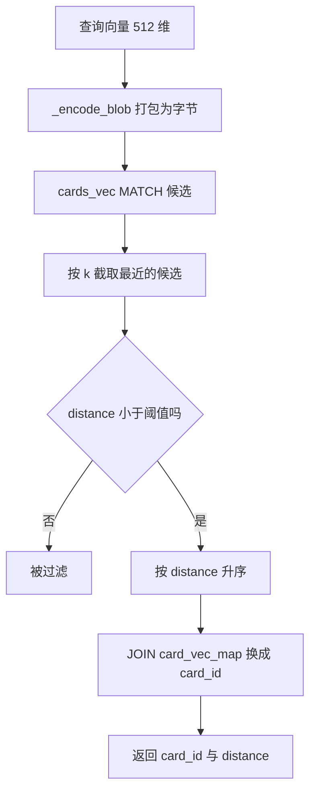
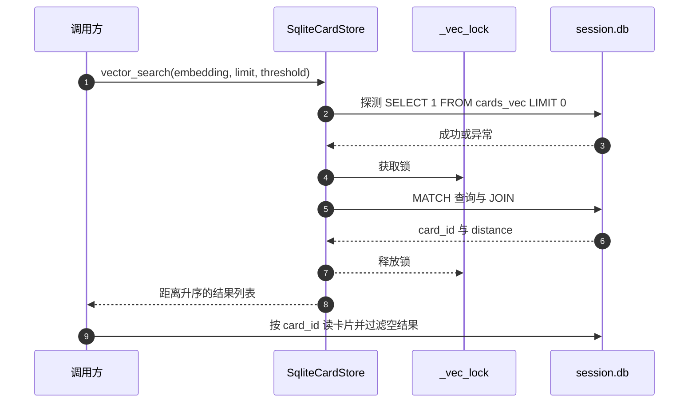

# MATCH、k 与距离过滤的查询路径

检索的入口是 `vector_search`，输入一条查询向量、返回条数上限与距离阈值，输出若干 `(card_id, distance)`（`backend/storage/sqlite_card_store.py:436-454`）。函数体不长，但一条 SQL 里叠了三层约束：向量匹配、候选条数、距离过滤。三者顺序与含义不同，混在一起看容易把 `k` 当成返回条数上限。

返回结果拿到的是距离，不是卡片。调用方要用卡片 ID 再读一次卡片表，把不存在的 ID 过滤掉（`backend/routes/cards.py:76-80`、`backend/pipeline/api.py:451-455`）。向量表与卡片表在同一个 SQLite 文件里，这个重组是一次本地查询，成本很低。

文中 `k` 的候选语义按 sqlite-vec 的 KNN 查询约定说明，仓库代码只给出用法。

## 一条查询语句的三层结构

完整语句如下（`backend/storage/sqlite_card_store.py:443-449`）：

```sql
SELECT m.card_id, v.distance
FROM card_vec_map m JOIN cards_vec v ON m.vec_rowid = v.rowid
WHERE v.embedding MATCH ? AND k = ? AND v.distance < ?
ORDER BY v.distance
```

| 子句 | 作用 | 参数 |
| --- | --- | --- |
| `JOIN` | 把向量行号换成卡片 ID | 无 |
| `MATCH ?` | 查询向量 | `_encode_blob(embedding)` |
| `k = ?` | 候选条数 | `limit` |
| `v.distance < ?` | 距离过滤 | `threshold` |
| `ORDER BY v.distance` | 最近优先 | 无 |

连接键是 `m.vec_rowid = v.rowid`，不是 `m.rowid`。映射表的隐藏 `rowid` 与 `vec_rowid` 是两个独立列，写入代码记录的是 `vec_rowid`（`:430`、`:481`）；用错列会在部分会话上取到别的向量或取不到向量。



## MATCH 与 k 的分工

`MATCH` 是 vec0 虚拟表的查询运算符，后面跟的是查询向量本身，而不是文本或 ID。传给它的必须是字节形式的浮点数组，长度与建表维度一致；用字符串或长度不符的字节会让扩展报错。

`k = ?` 限定这次 KNN 搜索取多少条候选。按 sqlite-vec 的查询约定，`k` 是最近邻候选数，作用于距离排序的截取；它不是最终返回条数，因为后面还有阈值过滤。当阈值很严时，实际返回可能远少于 `k` 条。查询里把 `k` 与阈值写在一起，读代码时要按“先取 k 条、再过阈值、最后排序”理解。

`ORDER BY v.distance` 在过滤之后仍然保留，是为了让返回顺序与距离一致。即便扩展内部已按距离产出候选，显式排序也让调用方不必依赖内部顺序。

## 距离过滤与度量

`distance_metric=cosine` 写在建表语句里（`backend/storage/session_database.py:150`），因此 `v.distance` 是余弦距离，取值 0 到 2，越小越像。过滤条件是 `v.distance < threshold`，是严格小于，距离恰好等于阈值的结果不返回。

阈值默认 0.7（`backend/storage/sqlite_card_store.py:436`），但真实取值由调用方传入：语义搜索接口用自身参数（`backend/pipeline/api.py:450`），卡片搜索路由传 2.0 相当于不过滤（`backend/routes/cards.py:75`），主题合并预检传 0.40（`backend/pipeline/pipeline.py:422`）。查询函数只负责执行，不在内部改写阈值。

向量与阈值都是调用方给的，函数不校验二者是否匹配业务含义。给一个未归一化的查询向量，余弦距离仍能算，但数值口径与库存向量不一致；库存向量在编码时已归一化（`backend/ai/embedder.py:67`），查询侧走同一个编码入口，这一点由调用链保证。

## 结果重组与卡片读取

查询返回的是 `[(card_id, distance)]`，构造在 `return [(r[0], r[1]) for r in rows]`（`backend/storage/sqlite_card_store.py:454`）。之后各调用方做同一件事：按 ID 读卡片，跳过读不到的：

| 调用方 | 读卡后的处理 | 位置 |
| --- | --- | --- |
| 卡片搜索路由 | 转成字典，得分取 `1 - dist` | `backend/routes/cards.py:76-81` |
| 语义搜索接口 | 组装卡片与相似度 | `backend/pipeline/api.py:451-455` |
| 主题合并预检 | 比较源卡 ID 后判定是否覆盖 | `backend/pipeline/pipeline.py:423-425` |

读不到的卡片通常来自删除不彻底：卡片已删、映射表还有行。查询结果里出现这类 ID 不算异常，调用方按空结果跳过即可；若日志里频繁出现，要去查 `delete_vector` 是否被调用（`backend/storage/sqlite_card_store.py:478-486`）。

## 就绪探测与锁

每次查询先探测向量表（`backend/storage/sqlite_card_store.py:437-439`）。探测失败直接返回空列表并记一条调试日志，不抛异常。探测成功后在 `_vec_lock` 内执行查询（`:441-449`），与写入共用同一把锁，因此查询不会读到正在替换的中间状态。

用锁串行化读写在 WAL 模式下不是必需的：SQLite 本身允许读写并发。这把锁保护的是另一半状态，即映射表与向量表的成对更新。若写入侧删了向量尚未更新映射，查询会看到不一致；锁把这段时间屏蔽掉。代价是一次查询要等一次写入完成，长批次索引会拖慢查询，这一点与编码锁的排队效应叠加。



## 失败模式与降级

查询把所有异常压成一个分支：记警告 `向量搜索失败` 并返回空列表（`backend/storage/sqlite_card_store.py:450-452`）。可能的触发原因有：

| 原因 | 表现 | 判别办法 |
| --- | --- | --- |
| 扩展未加载 | 探测阶段就返回空 | 看启动期是否有扩展加载警告 |
| 表不存在 | 探测失败 | `cards/` 下的库文件里查 schema |
| 查询向量维度不符 | 查询抛异常 | 比对编码输出与建表维度 |
| 映射表为空 | 查询成功但无行 | 数映射表行数 |
| 数据库被占用 | 查询超时或锁等待 | 看是否有长写入并发 |

这些原因在外层表现完全一致，都是空结果。区分它们只能看两侧证据：启动日志与数据库内容。检索结果异常时，先确认向量表可查、映射表非空，再检查查询向量本身。

## 易错点

1. 把 `k` 当成返回条数。阈值过滤后条数可能更少。
2. 连接用 `m.rowid` 而不是 `m.vec_rowid`。两者在替换过的会话上会分叉。
3. 把 `distance` 当相似度。距离越小越像，阈值是上界。
4. 认为查询失败会抛异常。所有异常都降级为空列表。
5. 忽略锁的排队成本。写入批次越长，查询等待越久。
6. 不做维度校验。维度不符只在扩展内部报错，随后被吞掉。

## 小结

### 核心概念

| 概念 | 取值或做法 | 来源 |
| --- | --- | --- |
| 查询入口 | `vector_search(embedding, limit, threshold)` | `backend/storage/sqlite_card_store.py:436` |
| 匹配运算符 | `v.embedding MATCH ?`，参数是字节 | `:446` |
| 候选条数 | `k = ?` 取 `limit` | `:446` |
| 距离过滤 | `v.distance < ?`，度量 cosine | `:446`、`backend/storage/session_database.py:150` |
| 排序 | `ORDER BY v.distance` 升序 | `:447` |
| 连接键 | `m.vec_rowid = v.rowid` | `:445` |
| 返回值 | `(card_id, distance)` 列表 | `:454` |
| 失败行为 | 记警告并返回空列表 | `:450-452` |

### 设计权衡

| 决策 | 收益 | 代价 |
| --- | --- | --- |
| 阈值由调用方传入 | 一个函数服务三种业务 | 口径分散，容易混淆松紧 |
| `k` 用调用方 `limit` | 查询计划稳定 | 阈值严时实际返回偏少，需上层补召回 |
| 读写共用一把锁 | 不会读到替换中间态 | 长写入阻塞查询 |
| 异常降级为空 | 检索不会拖垮请求 | 失败原因要靠日志与库内容自行判别 |
| 结果只返回距离 | 函数与卡片模型解耦 | 每个调用方都要重复读卡与过滤 |

## 练习

### 基础题

1. 说明 `k = ?` 与 `v.distance < ?` 在语句里的先后作用，并给出阈值很严时返回条数变少的例子。
2. 写出 `JOIN` 的连接键，并说明用 `m.rowid` 会有什么后果。
3. 列出查询失败被降级为空结果的三种可能原因与各自的判别证据。

### 挑战题

4. 给 `vector_search` 增加返回条数的下界保障：在阈值过滤后不足 `limit` 时放宽阈值补足，说明改动的 SQL 或调用层逻辑与风险。
5. 设计一个并发测试，验证写入替换期间查询不会返回不一致的映射，要求给出观测点与断言。
6. 统计某个会话里 `distance` 的分布，据此给出一个比 0.7 更贴合该会话的阈值，并说明样本量与判据。

### 附：本页引用的路径

| 路径 | 用途 |
| --- | --- |
| `backend/storage/sqlite_card_store.py` | 查询实现与失败降级（:33-34、:405-410、:436-454、:478-486） |
| `backend/storage/session_database.py` | 建表维度与度量（:143-156） |
| `backend/routes/cards.py` | 路由侧查询与重组（:65-81） |
| `backend/pipeline/api.py` | 搜索接口的查询与重组（:436-455） |
| `backend/pipeline/pipeline.py` | 合并预检的查询（:416-425） |
| `backend/ai/embedder.py` | 查询向量编码（:65-70、:83-85） |
