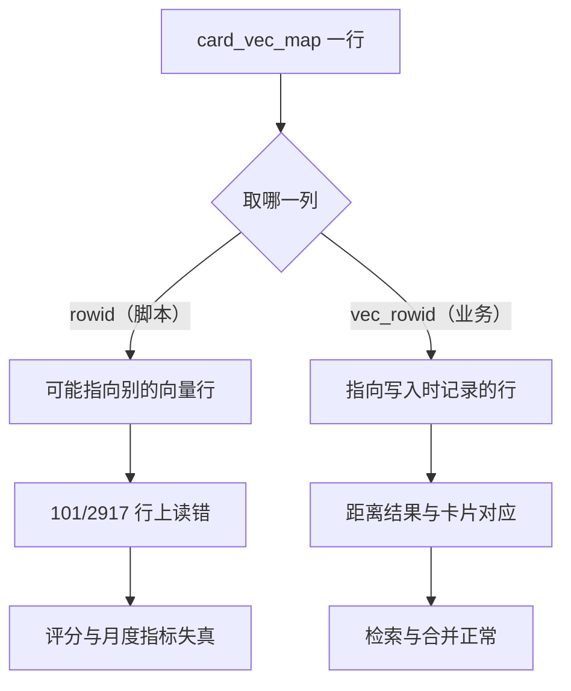
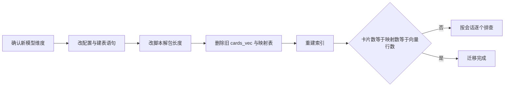

# 核对脚本、迁移与静默失败清单

向量检索的问题大多不报错：扩展没加载、映射表为空、脚本用错行号、维度不符，外在表现都是“搜不到”或“分数不对”。定位它们需要从库文件直接取数，而不是从接口返回推断。仓库里有两个脚本在做这件事，都用只读方式打开会话库，再借扩展读取向量（`scripts/quality_audit.py`、`scripts/monthly_eval/metrics.py`）。

映射表里有两个都能当行号用的东西：SQLite 隐藏的 `rowid`，和显式列 `vec_rowid`。两者只在顺序插入时相等；一旦发生过「删旧行再插新行」的替换，隐藏 `rowid` 继续按表内顺序递增，而 `vec_rowid` 跟随向量表的插入行号，两者就分叉了。核对脚本取的是隐藏 `rowid`，业务查询取的是正确的 `vec_rowid`（`backend/storage/sqlite_card_store.py`）：分叉的那些行在脚本里会读到别的向量或读空，评分核对与月度指标因此失真，业务检索不受影响。

统计数字来自对 `cards/` 下 222 个会话库的只读盘点，是某一时刻的快照。

## 只读打开与扩展加载

核对脚本的第一件事是把库打开成只读，用 URI 参数实现（`scripts/quality_audit.py`）：

```python
con = sqlite3.connect(f"file:{path}?mode=ro", uri=True)
con.row_factory = sqlite3.Row
```

只读模式避免核对过程改动生产数据，也让脚本可以在服务运行时执行。第二件事是加载 sqlite-vec：导入失败时把模块置为 `None`，脚本继续跑但不读向量；读取前再判断一次，只有模块可用才加载扩展。

```python
if sqlite_vec is not None:
    con.enable_load_extension(True)
    sqlite_vec.load(con)
    con.enable_load_extension(False)
```

整个读取块包在 try 里，任何异常都把向量结果清空。因此脚本输出“没有向量”时，可能是库里没有，也可能是扩展没装上、行号对不上或解包失败。核对脚本的返回值不带区分信息，需要人工分层确认。

## 行号偏差：rowid 与 vec_rowid

脚本从映射表取行号时用的是隐藏 `rowid`（`scripts/quality_audit.py`）：

```sql
SELECT card_id, rowid FROM card_vec_map
```

写入端记录的是显式列 `vec_rowid`（`backend/storage/sqlite_card_store.py`）。两个值在顺序插入时相等，在发生过替换后会分叉：替换流程删掉旧映射行再插入新行，映射表的隐藏 `rowid` 单调递增，而 `vec_rowid` 跟随向量表的 `last_insert_rowid`，两者递增节奏不同。

一次只读盘点里，2917 行映射中有 101 行的两个值不同（约 3.5%）：分叉是替换流程的常见结果，不是理论上的边角情况。

对这 101 行，脚本查到的向量行要么是另一张卡的，要么超出范围返回空。按脚本的行号取法，评分结果在这部分卡片上不可信。业务侧的 `vector_search` 使用 `m.vec_rowid = v.rowid`（`backend/storage/sqlite_card_store.py`），不受影响。



## 向量字节与块分配

向量以 512 个 float32 存储，单条 2048 字节（$512 \times 4$）。脚本按 `<512f` 解包（`scripts/quality_audit.py`），与写入端的 `struct.pack` 在小端平台上一致（`backend/storage/sqlite_card_store.py`）。

真实库的抽样结果（会话 `cards/7.26/8f0ea712-5a11-4108-bb04-e797428f24b5`，37 条映射行）：

| 表 | 观察值 |
| --- | --- |
| `cards_vec_rowids` | 37 行 |
| `cards_vec_vector_chunks00` | 1 行，长度 2,097,152 字节 |
| 单条向量 | 2048 字节 |
| 单个块容量 | 2,097,152 ÷ 2048 = 1024 条（算术推导） |

块大小固定为 2 MiB，与当前向量条数无关：37 条向量也只占 1 个块，其中约 75,776 字节有效，其余为预留。这让小会话的向量存储开销有下限，也解释了为什么删除向量不会立即缩小库文件。

读向量时必须走虚拟表或按块解码，不能假定块内第 N 条就是第 N 行。脚本用 `SELECT rowid, * FROM cards_vec WHERE rowid=?` 让扩展解码（`scripts/quality_audit.py`），这是稳妥的做法：

```python
row = con.execute("SELECT rowid, * FROM cards_vec WHERE rowid=?", (vec_rowid,)).fetchone()
if row is not None and isinstance(row[2], bytes):
    embeddings[cid] = list(struct.unpack("<512f", row[2]))
```

`<512f` 表示小端、512 个 4 字节浮点，与写入端的 `struct.pack` 在小端平台上一致；脚本先确认第三列确实是字节再解包。列下标依赖当前扩展版本的列顺序，换版本需要重新核对。

## 重建索引的入口与阻塞点

业务侧的重建入口是 `POST /api/cards/reindex`（`backend/routes/cards.py`），它构造卡片存储后调用 `store.reindex_all`。`reindex_all` 取全部卡片、编码、再走 `index_vectors`（`backend/storage/sqlite_card_store.py`）。

这条路径按 asyncio 语义不可用：处理函数是异步的，`reindex_all` 内部对正在运行的事件循环调用 `run_until_complete`，会抛 `RuntimeError: This event loop is already running`。核对或运维需要重建时，可靠的方式是在同步脚本里直接调用 `reindex_all`，或临时把接口改成同步函数交给线程池。这一结论按 asyncio 语义推导得出；要确认，可在异步路由里实际调用一次，观察是否抛 `RuntimeError`。

注意 `reindex_all` 只写入缺失与全部卡片，不做差集：它编码所有卡片并逐张替换。对已有向量的卡也会重新编码，因此重建耗时与卡片总数成正比。

## 换模型后的迁移顺序

模型输出维度写在三处：模型目录的配置、向量表建表语句、脚本的解包格式。

| 位置 | 当前值 | 换模型时需要 |
| --- | --- | --- |
| `models/bge-small-zh-v1.5/config.json` | 512 | 换成新权重目录 |
| `backend/storage/session_database.py` | `FLOAT[512]` | 改维度并重建表 |
| `scripts/quality_audit.py`、`scripts/monthly_eval/metrics.py` | `<512f` | 改解包长度 |
| `backend/ai/embedder.py` | 本地目录或 HF 回落 | 换目录名 |

迁移顺序建议为：先确认新模型输出维度，再改建表语句，然后是脚本解包格式，最后重建向量。原因是 `IF NOT EXISTS` 不会改动已存在的表，必须在重建前显式删除 `cards_vec` 与 `card_vec_map`；否则旧表按 512 维继续接受 768 维的写入，错误被扩展抛出后又被吞掉。

重建后核对三个数：卡片数、映射表行数、向量表行数。三者相等才算完成。会话库是逐个文件独立的，迁移要对 `cards/` 下的每个库执行。



## 静默失败清单

以下位置失败时不抛异常，只记日志或直接返回：

| 位置 | 失败表现 | 日志或返回值 | 代码位置 |
| --- | --- | --- | --- |
| 扩展加载 | 无向量表 | `Vector extension load failed` | `backend/storage/session_database.py` |
| 自动索引探测 | 跳过索引 | 调试级日志 | `backend/storage/sqlite_card_store.py` |
| 后台索引异常 | 映射表不完整 | `自动索引失败` | `backend/storage/sqlite_card_store.py` |
| 写入前置判断 | 不写入 | 无 | `backend/storage/sqlite_card_store.py` |
| 查询异常 | 空结果 | `向量搜索失败` | `backend/storage/sqlite_card_store.py` |
| 进程级去重 | 本进程不再重试 | 无 | `backend/storage/sqlite_card_store.py` |

排查顺序建议是：看启动期扩展加载日志，数映射表行数，再查查询日志。三者都正常但检索为空时，问题在阈值或查询向量本身，而不在存储层。

向量存储层缺少自动化测试，是一个需要正视的缺口：建表、写入、替换、查询、删除五个动作都没有用例覆盖，行为变更只能靠核对脚本与手工盘点发现，回归成本高。稳的做法是用临时目录建库，给这五个动作各补一个最小用例，把维度契约与扩展行为固定在 CI 里。本工程的 `tests/` 里没有直接引用 `cards_vec`、`sqlite_vec` 或 `vector_search` 的用例，与阈值相关的测试（如 `tests/backend/test_thresholds.py`）覆盖的是评分层，不能替代它。

## 小结

### 核心概念

| 概念 | 取值或做法 | 来源 |
| --- | --- | --- |
| 只读打开 | `file:{path}?mode=ro` 加 URI | `scripts/quality_audit.py` |
| 扩展可选导入 | 失败置 `None`，脚本继续 | `scripts/quality_audit.py` |
| 脚本取行号 | 隐藏 `rowid`，与 `vec_rowid` 有偏差 | `scripts/quality_audit.py` |
| 偏差规模 | 2917 行中 101 行不同 | 只读盘点快照 |
| 单条向量 | 2048 字节，`<512f` 解包 | `scripts/quality_audit.py`、`backend/storage/sqlite_card_store.py` |
| 块分配 | 固定 2 MiB，约 1024 条向量 | 影子表观察加算术推导 |
| 重建接口 | 异步路由调用同步函数，按语义会抛错 | `backend/routes/cards.py` |
| 迁移核对 | 卡片数、映射数、向量行数三者相等 | 无自动化测试 |

### 设计权衡

| 决策 | 收益 | 代价 |
| --- | --- | --- |
| 脚本只读访问 | 可在服务运行时核对 | 无法就地修复数据 |
| 异常统一清空向量 | 核对不会中断 | 失败原因不分层，需人工判别 |
| 影子表分块存储 | 写入与大块 I/O 友好 | 小会话也占 2 MiB，删除不缩文件 |
| 无自动化测试覆盖 | 无 | 行为变更靠手工盘点发现 |
| 重建按全量执行 | 逻辑简单，覆盖所有卡 | 耗时与卡片总数成正比 |

## 练习

### 基础题

1. 写出一条只读打开会话库并统计两个表行数的 SQL 或脚本片段。
2. 说明脚本用 `rowid` 取向量与业务用 `vec_rowid` 的差别，并指出哪一侧正确。
3. 计算 37 条 512 维向量占用的有效字节数与块预留字节数。

### 挑战题

4. 修正核对脚本的行号取值，说明改动后月度指标会变化多少（给出核对方法，不要求真实数据）。
5. 设计一个换模型的迁移脚本：要求包含删表、重建、三数核对与失败恢复，并说明如何处理正在运行的会话。
6. 为向量存储补一组最小测试（建表、写入、替换、查询、删除），说明每个用例需要的环境前提与断言。

### 附：本页引用的路径

| 路径 | 用途 |
| --- | --- |
| `scripts/quality_audit.py` | 只读核对与解包 |
| `scripts/monthly_eval/metrics.py` | 月度指标的同一取法 |
| `backend/storage/sqlite_card_store.py` | 写入、查询、重建与自动索引 |
| `backend/storage/session_database.py` | 建表维度与扩展加载 |
| `backend/routes/cards.py` | 重建接口 |
| `backend/ai/embedder.py` | 模型路径与维度来源 |
| `models/bge-small-zh-v1.5/config.json` | 输出维度 |
| `cards/7.26/8f0ea712-5a11-4108-bb04-e797428f24b5/session.db` | 抽样库（37 条映射，块 2 MiB） |
| `tests/backend/test_thresholds.py` | 阈值相关测试（不覆盖向量层） |
