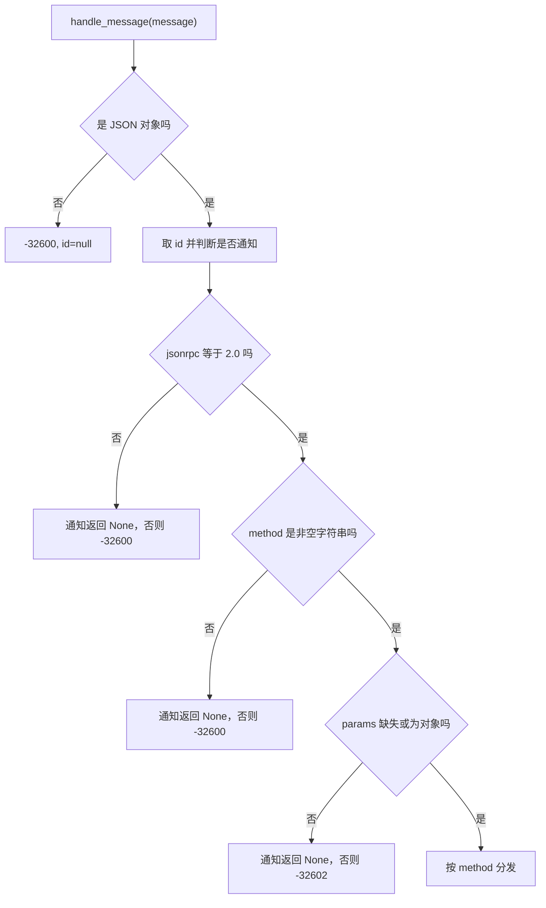
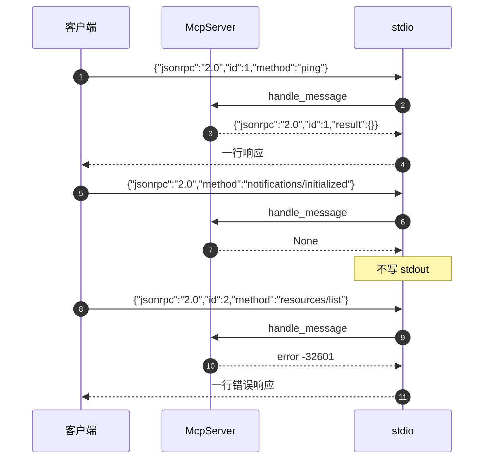

# JSON-RPC 消息信封与分发顺序

客户端把一行 JSON 写进标准输入，服务端把一行 JSON 写回标准输出——这是 MCP 最基础的通信形态。MCP（Model Context Protocol）是一套让模型客户端调用外部工具的协议，消息格式借用 JSON-RPC：每条消息带 `jsonrpc` 字段，请求另有 `id` 与 `method`，响应带 `result` 或 `error`。三种信封的最小形状如下（示意）：

```json
{"jsonrpc": "2.0", "id": 1, "method": "ping"}
{"jsonrpc": "2.0", "id": 1, "result": {}}
{"jsonrpc": "2.0", "method": "notifications/initialized"}
```

第一行是请求（有 `id`、有 `method`），第二行是对它的响应（`id` 原样回填、结果放在 `result`），第三行是通知（没有 `id`，因此不产生响应）。KnowledgeDiver 的 MCP 实现手写了一层 JSON-RPC 处理器，入口是 `McpServer.handle_message`（`backend/mcp/server.py`）。它接收一条已经解析成 Python 对象的消息，返回一条响应或 `None`。解析本身不在这一层，标准输入输出与逐行解码交给 `stdio.py`，因此这一层可以脱离传输单独测试。

“返回 None”是这套实现里最需要先记住的约定：通知没有响应，非法通知也静默丢弃。JSON-RPC 规定通知不产生响应，代码把“没有 id 或 id 为 null”直接定义为通知（`handle_message` 开头两行），于是连格式错误的通知也不会得到错误响应。客户端如果发了一条忘了带 id 的请求，就只能等超时。

文中关于 JSON-RPC 规范的说法按通用做法标注，代码未实现的部分会明确写出。

## 三种消息形态与判据

一条 JSON-RPC 消息的三个判别字段是 `jsonrpc`、`id`、`method`。代码只用它们区分请求与通知：

| 形态 | 特征 | 处理结果 |
| --- | --- | --- |
| 请求 | 有 `method`，`id` 存在且非 null | 返回响应对象 |
| 通知 | 有 `method`，无 `id` 或 `id` 为 null | 返回 `None` |
| 响应 | 通常由客户端发出，含 `result` 或 `error` | 本服务器不处理，会被当成缺 method 的请求 |

判据在进入校验之前就固定下来，一共两行（`backend/mcp/server.py`）：

```python
msg_id = message.get("id")
is_notification = "id" not in message or msg_id is None
```

`id` 为 `0` 或空字符串时仍是请求，因为判据用的是“存在且不为 None”。这一条与 JSON-RPC 对 id 的建议一致：`0` 是合法 id，null 在规范里虽然允许但被标注为不推荐。

## 响应信封的两个工厂

响应只有两种形状，各自一个静态方法（`backend/mcp/server.py`）：

```python
@staticmethod
def _ok(msg_id, result):
    return {"jsonrpc": "2.0", "id": msg_id, "result": result}

@staticmethod
def _error(msg_id, code, message):
    return {"jsonrpc": "2.0", "id": msg_id, "error": {"code": code, "message": message}}
```

成功响应只含 `result`，失败响应只含 `error`，二者不并存。`error` 对象由 `code` 与 `message` 两个字段组成，没有 `data` 字段；错误上下文全部塞进 `message` 文本。这个取舍让错误信息对模型可读，代价是客户端无法按结构化字段区分原因。

`id` 原样回填，不做类型转换。请求里的字符串 id、数字 id 都会原样出现在响应里，客户端按自己的规则匹配。

## 校验顺序与各自的返回

进入分发前有四道校验，顺序固定（`backend/mcp/server.py`）：

| 顺序 | 检查 | 失败返回 |
| --- | --- | --- |
| 1 | 消息是 JSON 对象 | `-32600`，`id` 为 null |
| 2 | `jsonrpc == "2.0"` | 通知返回 `None`，请求返回 `-32600` |
| 3 | `method` 是非空字符串 | 通知返回 `None`，请求返回 `-32600` |
| 4 | `params` 是对象或缺失 | 通知返回 `None`，请求返回 `-32602` |

第一道校验用 `None` 作响应 id，因为此时还没有可回填的 id；这与 stdio 层的解析错误响应形状一致。第二、三道把非法请求归为 `-32600`，第四道归为 `-32602`，区分的是“请求本身不合法”与“参数不合法”。四道校验的骨架与源码一致：

```python
if not isinstance(message, dict):
    return self._error(None, ERR_INVALID_REQUEST, "请求必须是 JSON 对象")
if message.get("jsonrpc") != "2.0":
    return None if is_notification else self._error(msg_id, ERR_INVALID_REQUEST, "jsonrpc 必须是 '2.0'")
method = message.get("method")
if not isinstance(method, str) or not method:
    return None if is_notification else self._error(msg_id, ERR_INVALID_REQUEST, "缺少 method")
params = message.get("params")
if params is None:
    params = {}
if not isinstance(params, dict):
    return None if is_notification else self._error(msg_id, ERR_INVALID_PARAMS, "params 必须是对象")
```

`-326xx` 是 JSON-RPC 为服务端错误保留的号段：`-32600` 请求不合法、`-32601` 方法不存在、`-32602` 参数不合法、`-32603` 服务端内部错误；`-32700` 更负一位，表示「解析不出 JSON」，由传输层而不是协议层发出。

`params` 缺失时被归一成空字典，因此不传 params 的方法调用等价于传 `{}`。`params` 传数组或字符串会得到 `-32602`，与 JSON-RPC 规范里允许数组位置参数的做法不同：本实现只支持具名参数，按通用做法标注为子集实现。



## 方法分发表

分发是一串顺序 `if`，没有注册表（`backend/mcp/server.py`）：

```python
if method == "initialize":
    return None if is_notification else self._ok(msg_id, self._initialize(params))
if method in ("notifications/initialized", "initialized", "notifications/cancelled"):
    return None
if method == "ping":
    return None if is_notification else self._ok(msg_id, {})
if method == "tools/list":
    return None if is_notification else self._ok(msg_id, self._tools_list())
if method == "tools/call":
    if is_notification:
        return None
    return await self._tools_call(params, msg_id)
return None if is_notification else self._error(msg_id, ERR_METHOD_NOT_FOUND, f"未实现的方法: {method}")
```

| method | 处理 | 响应 |
| --- | --- | --- |
| `initialize` | 版本协商与能力声明 | `result` 含版本与能力 |
| `notifications/initialized`、`initialized`、`notifications/cancelled` | 无操作 | `None` |
| `ping` | 无操作 | `result: {}` |
| `tools/list` | 取网关工具描述 | `result.tools` |
| `tools/call` | 参数校验与执行 | `result.content` 与 `result.isError` |
| 其他 | 未实现 | `-32601`，消息含方法名 |

三种通知名并列在同一个分支里，其中 `initialized` 是 `notifications/initialized` 的兼容写法。`notifications/cancelled` 只被忽略，没有中断正在执行的任务：`tools/call` 是逐个处理的，同一行输入里不存在并发执行，取消没有可作用的对象。按 MCP 的取消语义，客户端收到取消通知后服务端应尽力停止；本仓库未实现，标注为未实现。

未实现方法统一返回 `-32601`，包括 `resources/list`、`prompts/list` 等 MCP 其他方法族（回归测试对 `resources/list` 断言了这一点，见 `tests/backend/test_mcp_server.py`）。服务器在 capabilities 里只声明了 `tools`，客户端的模型据此不会再调用其他方法族。

## 通知为什么不回响应

通知的处理只有两种结果：命中的分支返回 `None`，未命中的分支在“是通知”时也返回 `None`。`tools/call` 尤其需要这一条：通知形式的调用不产生响应，避免把执行结果写到没有人等待的通道上。

代价是诊断困难。一条格式错误的通知不会留下协议层记录，只能靠 stderr 日志或调用方自己的约定发现。回归测试覆盖了 `notifications/initialized` 返回 None（`tests/backend/test_mcp_server.py`），但没有覆盖错误通知的静默路径。



## 批处理与 id 为 null 的边界

JSON-RPC 2.0 规定一个数组可以承载多条消息，服务端应按数组逐条处理并返回数组。本实现遇到数组会走“消息不是对象”分支，返回单条 `-32600`。批处理未实现，按规范标注为子集。

`id` 为 null 的请求按通知处理，因此不会得到错误响应。若客户端想确认服务器是否活着，用 `ping` 并带上非 null 的 id；用 null 作 id 的 ping 不会得到任何回复，这不代表服务器没在工作。

字符串 id 与数字 id 的行为一致。响应里的 `id` 与请求一致，包括 null 不会被用到——通知没有响应。

## 易错点

1. 用 `id: null` 发请求并等待响应。它被判为通知，没有响应。
2. 认为非法通知会收到 `-32600`。所有通知都不回响应，包括非法的。
3. 用数组发多条消息。批处理未实现，数组会被判为请求格式错误。
4. 用位置参数传 `params`。本实现只接受对象形式的具名参数。
5. 把 `error.message` 当结构化字段解析。所有上下文都在文本里。
6. 期待 `notifications/cancelled` 真的取消执行。实现只忽略它。

## 小结

### 核心概念

| 概念 | 取值或做法 | 来源 |
| --- | --- | --- |
| 通知判据 | 无 `id` 或 `id` 为 null | `McpServer.handle_message` 开头 |
| 响应形状 | `result` 或 `error` 二选一 | `McpServer._ok` 与 `McpServer._error` |
| 非法请求 | `-32600`，第一道检查 id 为 null | `handle_message` 的对象检查与 `jsonrpc` 检查 |
| 非法参数 | `-32602` | `handle_message` 的 `params` 检查 |
| 未实现方法 | `-32601`，消息含方法名 | `handle_message` 的方法分发兜底 |
| 通知方法 | initialized 系列与 cancelled，均无响应 | `handle_message` 的通知分支 |
| 方法集 | initialize、ping、tools/list、tools/call | `McpServer` 的 `if` 分发链 |
| 批处理 | 未实现，数组判为 `-32600` | `handle_message` 首道对象检查 |

### 设计权衡

| 决策 | 收益 | 代价 |
| --- | --- | --- |
| 手写分发 if 链 | 依赖少，可读性高 | 方法增多后需要改成注册表 |
| 非法通知静默 | 符合通知无响应的约定 | 协议层错误难以发现 |
| 错误只带 message | 对模型可读 | 客户端无法按字段分支处理 |
| 不支持批处理 | 实现简单，逐行处理 | 与 JSON-RPC 完整规范有差距 |
| params 只收对象 | 参数校验逻辑单一 | 不接受位置参数 |

## 练习

### 基础题

1. 列出请求、通知与响应三种形态的判别字段，并说明 `id: 0` 属于哪一种。
2. 写出响应工厂生成的两个对象，指出哪一个字段互斥。
3. 说明四道校验的顺序，以及每道失败时的错误码。

### 挑战题

4. 给 `handle_message` 增加 JSON-RPC 批处理支持，说明返回值类型变化、通知与请求混排的处理顺序，以及需要补的测试。
5. 让非法通知也写一条 stderr 记录，列出需要改动的分支与如何避免影响 stdout 通道。
6. 设计一组消息级测试，覆盖 id 类型、缺字段、params 类型与未知方法的组合，并给出每条的期望响应的准确形状。

### 附：本页引用的路径

| 路径 | 用途 |
| --- | --- |
| `backend/mcp/server.py` | 消息校验、分发与响应工厂 |
| `backend/mcp/stdio.py` | 解析错误响应的形状 |
| `backend/mcp/gateway.py` | 错误码常量与工具层错误 |
| `tests/backend/test_mcp_server.py` | 协议语义回归断言 |
| `backend/mcp/__init__.py` | 协议层模块划分说明 |
