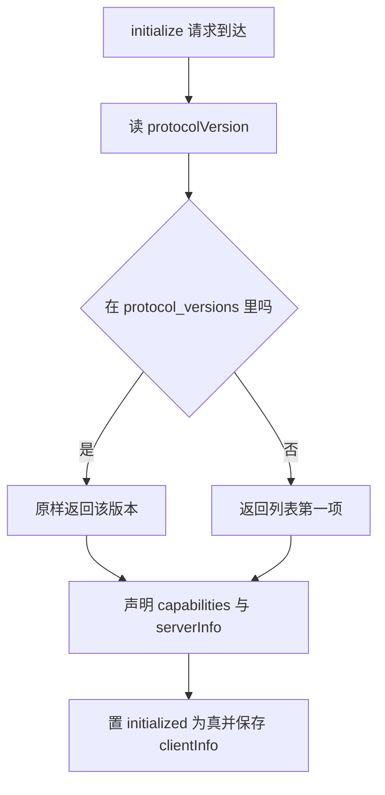
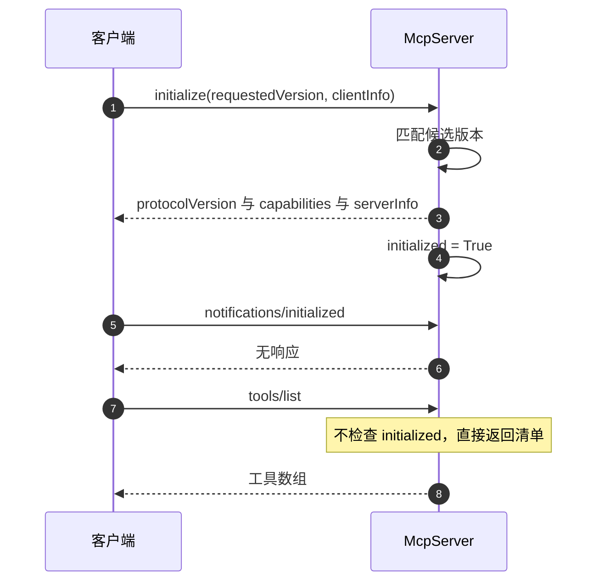

# initialize 握手与协议版本协商

MCP 会话从 `initialize` 开始：客户端上报自己支持的协议版本与身份，服务端回一个它选定的版本、能力集合与服务器信息（`backend/mcp/server.py` 的 `_initialize`）。这一次往返决定后续所有消息的解释方式，例如客户端据此知道服务端只提供 `tools` 而不提供 `resources`。

实现上没有版本区间协商，也没有失败分支：客户端报的版本如果在候选列表里就原样返回，否则回退到列表第一项。回退是静默的，客户端收到的版本可能与它上报的不同，需要自己比较。这个取舍让握手永远不会因为版本不匹配而失败，代价是把兼容性判断推给客户端。

版本列表的候选与官方 SDK 的导入关系是理解行为差异的关键：同一份代码在装了官方 mcp 包与没装的机器上，可能回不同的版本。

## initialize 的入参

`_initialize` 只读两个参数（`backend/mcp/server.py`）：

| 参数 | 类型 | 缺省时的行为 |
| --- | --- | --- |
| `protocolVersion` | 字符串 | 用候选列表第一项 |
| `clientInfo` | 对象，含 name 与 version | 记录为 `None` |

`clientInfo` 不是对象时被归一成 `None`，不报错。这个字段没有被后续逻辑使用，只保存在 `self.client_info` 上供诊断。`protocolVersion` 缺失时按“不在候选列表里”处理，同样回退。

调用方在传输层看到的是 `params` 必须为对象，这一点由入口校验保证。`initialize` 自身不再做参数校验，因此 `params: {}` 是合法的，会得到一个完全默认的结果。

## 版本选择的匹配逻辑

选择只有一行（`backend/mcp/server.py`）：

```python
requested = params.get("protocolVersion")
version = requested if requested in self.protocol_versions else self.protocol_versions[0]
```

判据是精确相等，不做前缀或日期先后的比较。客户端报 `2025-03-26` 而候选列表里有它，就回 `2025-03-26`；报一个候选列表里没有的未来版本，回候选列表第一项。两种情况的响应形状完全相同，客户端无法从响应本身区分“接受了我的版本”与“回退到服务端首选”。

候选列表的顺序有意义：第一项同时是默认版本与回退版本。列表由探测器构造，第一项是官方 SDK 的 `LATEST_PROTOCOL_VERSION`（如果装得上），其后是内置的三个版本。因此列表整体是从新到旧的排序。

回归测试固定了两个行为：上报列表中最后一个版本时原样返回，上报 `1999-01-01` 时回退到第一项（两处断言都在 `tests/backend/test_mcp_server.py` 里）。这两个用例把“精确匹配加回退到首选”的语义锁住了。



## 能力与服务器信息

响应里的四个字段一次给全（`backend/mcp/server.py`）：

```python
return {
    "protocolVersion": version,
    "capabilities": {"tools": {"listChanged": False}},
    "serverInfo": {"name": self.server_name, "version": self.server_version},
    "instructions": "KnowledgeDiver 只读网关：可语义检索卡片、读取卡片/链接/树结构、诊断质量。"
                    "本服务不提供联网搜索或写库能力。",
}
```

| 字段 | 内容 | 说明 |
| --- | --- | --- |
| `protocolVersion` | 选定的版本 | 见上一节 |
| `capabilities` | `{"tools": {"listChanged": false}}` | 只声明工具能力，且不发变更通知 |
| `serverInfo` | `{"name": "knowledgediver-readonly", "version": "0.1.0"}` | 模块常量 `SERVER_NAME` 与 `SERVER_VERSION` |
| `instructions` | 一段中文说明 | 告诉客户端本服务只读 |

`capabilities` 里只有 `tools` 一项，没有 `resources`、`prompts` 或 `logging`。客户端按这份声明决定可用方法族，因此调用 `resources/list` 属于超出声明范围，服务端会回 `-32601`。

`listChanged` 为 `false` 表示服务端不会主动推送工具清单变化的通知。工具清单在网关构造时从注册表派生一次（`backend/mcp/gateway.py` 的 `mcp_tools`），运行期不变，因此这个声明与实现一致。

`serverInfo` 的两个值是模块常量：名称 `knowledgediver-readonly`，版本 `0.1.0`（`backend/mcp/server.py` 的模块常量）。构造函数允许覆盖它们（`McpServer.__init__` 的 `server_name` 与 `server_version` 参数），测试与嵌入方可以传自己的名字。

## instructions 的定位

`instructions` 是一段面向模型的中文说明，内容为“只读网关，可语义检索卡片、读取卡片/链接/树结构、诊断质量，不提供联网搜索或写库能力”（`backend/mcp/server.py`）。它同时出现在两个地方：协议的 initialize 响应里，以及 `backend/mcp/__init__.py` 的模块文档里。

这段文字的作用是给客户端模型一个能力边界提示。它不是强制约束，约束由工具白名单与执行器启用集合实现（`backend/mcp/gateway.py` 的三层只读边界）。两者需要一致：如果以后放开写层工具，这段说明必须同步改，否则模型会按旧说明拒绝使用新工具。

## 初始化状态与后续方法

握手会把 `self.initialized` 置为 `True`（`backend/mcp/server.py`），并把 `clientInfo` 存进 `self.client_info`。这两个状态只写不读：后续方法没有任何一处检查 `initialized`，也没有使用 `client_info`。

后果是生命周期约束形同虚设：客户端可以在没有 `initialize` 的情况下直接发 `tools/list` 或 `tools/call`，服务端照常处理。按 MCP 的会话约定，客户端应先 initialize 再 initialized 通知，然后才调用其他方法；本实现未强制，标注为与本仓库实现相关的宽松处理。

`notifications/initialized` 是握手完成的确认通知，命中专门的分支后直接返回 `None`。它不改变任何状态，因此漏发这条通知不会影响服务端行为。



## 候选版本从哪里来

候选列表在模块导入时确定（`backend/mcp/server.py`）：

```python
_BUILTIN_PROTOCOL_VERSIONS = ("2025-06-18", "2025-03-26", "2024-11-05")

def _detect_protocol_versions():
    try:
        from mcp.types import LATEST_PROTOCOL_VERSION
        latest = str(LATEST_PROTOCOL_VERSION)
        return (latest, *_BUILTIN_PROTOCOL_VERSIONS)
    except Exception:
        return _BUILTIN_PROTOCOL_VERSIONS
```

内置三项是固定的协议日期版本。首选版本取决于运行环境里是否装了官方 mcp 包：装了就用它的最新版本，没装就用内置列表首项。这意味着「首选版本」不是固定值，它会随环境变化——把版本来源交给一个可选依赖，就必然带来这种不确定性。

这带来一个部署差异：requirements.txt 没有声明 mcp（`backend/mcp/__init__.py` 说明过这一点），干净环境里首选是 `2025-06-18`，而开发者机器上可能是 `2026-07-28`。客户端上报的版本若只在装了包时才在列表里，两台机器上会得到不同的协商结果。要固定行为，需要在启动时把 `protocol_versions` 显式传给 `McpServer` 构造函数，或用配置锁定。

## 易错点

1. 认为版本不匹配会报错。列表里没有就静默回退到第一项。
2. 认为回退响应可识别。接受与回退的响应形状一致，只能比较请求与响应。
3. 依赖 `initialized` 状态。它只写不读，没有方法检查。
4. 把 `instructions` 当权限控制。实际的边界在网关白名单与执行器启用集合。
5. 忽略官方包的安装差异。首选版本随环境变化。
6. 认为 `clientInfo` 会影响行为。它只被保存，没有消费方。

## 小结

### 核心概念

| 概念 | 取值或做法 | 来源 |
| --- | --- | --- |
| 入参 | `protocolVersion`、`clientInfo` | `McpServer._initialize` |
| 版本匹配 | 精确相等，否则回退首项 | `_initialize` 的版本选择 |
| 首选版本 | SDK 的 LATEST，否则内置首项 | `_detect_protocol_versions` |
| 内置候选 | 2025-06-18、2025-03-26、2024-11-05 | `_BUILTIN_PROTOCOL_VERSIONS` |
| 能力声明 | 仅 tools，listChanged 为 false | `_initialize` 返回的 `capabilities` |
| 服务器信息 | knowledgediver-readonly、0.1.0 | `SERVER_NAME`/`SERVER_VERSION` 与 `serverInfo` |
| 握手状态 | `initialized` 与 `client_info` 只写不读 | `_initialize` 写入的两个属性 |
| 完成通知 | 无响应，不改变状态 | `handle_message` 的通知分支 |

### 设计权衡

| 决策 | 收益 | 代价 |
| --- | --- | --- |
| 版本精确匹配加回退 | 握手永不失败 | 客户端需自行比较协商结果 |
| 首选跟随已装 SDK | 与官方客户端默认版本对齐 | 环境不同行为不同 |
| 不强制生命周期顺序 | 调试与手工测试方便 | 偏离 MCP 会话约定 |
| capabilities 只声明 tools | 客户端不会调用未实现方法族 | 扩展方法族时要同步改声明 |
| instructions 与 __init__ 重复 | 两处都能读到能力边界 | 改权限时容易漏改一处 |

## 练习

### 基础题

1. 写出 `initialize` 读取的两个参数，并说明缺省时各自的取值。
2. 说明上报版本不在候选列表时服务端返回什么，客户端如何判断发生了回退。
3. 列出 `capabilities` 的完整内容，并解释 `listChanged` 为 false 的含义。

### 挑战题

4. 把首选版本固定为不依赖已装 SDK 的常量，列出需要改动的代码与对现有测试的影响。
5. 给服务端加上生命周期检查：未握手时拒绝 `tools/list` 与 `tools/call`，说明错误码选择与需要补的测试。
6. 设计一个协商失败策略（例如客户端版本低于最低支持版本时拒绝），说明错误码、instructions 的作用范围与对现有客户端的影响。

### 附：本页引用的路径

| 路径 | 用途 |
| --- | --- |
| `backend/mcp/server.py` | initialize 实现、版本探测与常量 |
| `backend/mcp/__init__.py` | 能力边界与手写实现原因 |
| `backend/mcp/gateway.py` | 工具清单派生与只读三层边界 |
| `tests/backend/test_mcp_server.py` | 版本协商与通知断言 |
| `backend/mcp/examples/claude_desktop_config.json` | 客户端启动参数示例 |
| `backend/mcp/examples/cursor_mcp.json` | 另一客户端配置示例 |
