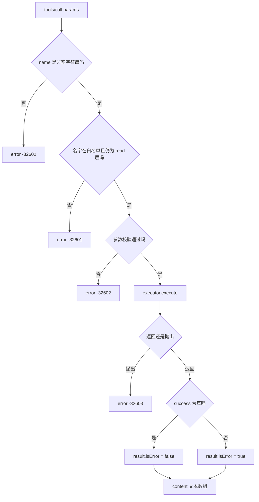
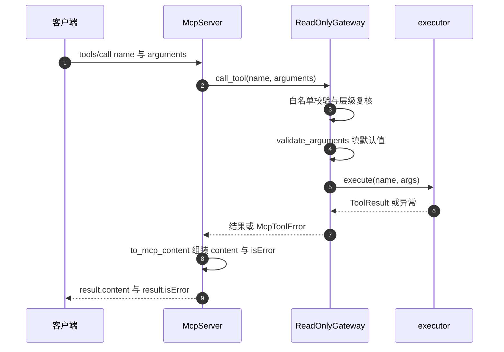

# tools 方法族的消息往返

`tools` 是这份实现唯一完整支持的方法族，成员两个：`tools/list` 返回工具描述数组，`tools/call` 执行一个工具并返回文本内容（`backend/mcp/server.py:150-163`）。两个方法的响应形状不同：list 的 `result.tools` 是描述对象数组，call 的 `result` 是 `content` 与 `isError` 两项。

调用失败时有三种出路，分别落在不同位置：协议或参数或权限问题走 JSON-RPC 的 `error` 对象；工具自己返回“失败”时走 `result.isError = true`；执行器抛出的异常被网关包装成 `-32603`，又回到 `error`。模块文档把前两条写成“工具自身执行失败用 isError 表达”，实际代码还多了第三条，理解这一点才能正确读客户端收到的消息。

工具描述的字段来源与 schema 细节属于另一单元的范围，这里只写到消息结构需要为止。

## tools/list 的响应结构

处理只有一行（`backend/mcp/server.py:150-151`）：

```python
def _tools_list(self) -> dict:
    return {"tools": self.gateway.list_tools()}
```

网关的 `list_tools` 返回深拷贝并按名字排序的数组（`backend/mcp/gateway.py:155-156`），元素由 `mcp_tools` 派生（`:60-72`）。每个元素三个字段：

| 字段 | 来源 |
| --- | --- |
| `name` | 注册表 schema 的 `function.name` |
| `description` | 注册表的描述文本，缺失时为空串 |
| `inputSchema` | 注册表的 `function.parameters` 深拷贝 |

清单在网关构造时定一次，`tools/list` 每次返回新的深拷贝。客户端修改返回的对象不会影响服务端后续响应。响应条数与工具层白名单一致：回归测试断言名字集合等于注册表 read 层（`tests/backend/test_mcp_server.py:265-270`）。

## tools/call 的请求结构

请求的 `params` 需要两个字段（`backend/mcp/server.py:154-155`）：

```json
{"name": "search_similar_cards", "arguments": {"query": "图论"}}
```

`name` 必须是非空字符串，否则回 `-32602`，消息为“tools/call 缺少字符串参数 name”（`:156-157`）。`arguments` 缺失时归一成空对象（`:155`），因此无参工具可以只传 `name`。

请求的 `id` 决定是否回复：通知形式的 call 直接返回 `None`（`:195-196`），执行不会被触发。需要执行并拿到结果的调用必须带非 null 的 id。

## 参数校验发生在网关

`tools/call` 自身只校验 `name`，参数校验在网关内部完成（`backend/mcp/gateway.py:183`）。校验函数 `validate_arguments` 做四件事（`:92-138`）：

| 检查 | 失败错误码 | 消息特征 |
| --- | --- | --- |
| `arguments` 是对象 | `-32602` | arguments 必须是 JSON 对象 |
| 不含未知参数 | `-32602` | 不支持的参数，并列出可用参数 |
| 类型与 enum 匹配 | `-32602` | 参数类型错误或取值非法 |
| 必填参数齐全 | `-32602` | 缺少必填参数 |

校验通过后返回规整后的新字典：填入了 schema 里的默认值，只保留 schema 声明的属性（`:113-138`）。回归测试用默认值断言了这一点：只传 `query` 时执行器收到的是带 `limit` 与 `threshold` 的完整参数（`tests/backend/test_mcp_server.py:195-198`）。布尔值被特殊处理，不接受作为 integer 或 number（`gateway.py:85-89`）。

这条链上的失败都以 `McpToolError` 抛出，由 `tools/call` 捕获并转成 JSON-RPC 错误（`backend/mcp/server.py:158-161`）：

```python
try:
    result = await self.gateway.call_tool(name, arguments)
except McpToolError as exc:
    return self._error(msg_id, exc.code, exc.message)
```

错误码原样使用异常里的 `code`，不重写。网关在不同位置抛不同码：名字不在白名单或层级复核不通过抛 `-32601`（`gateway.py:176-181`），参数问题抛 `-32602`（`:101-137`），执行异常抛 `-32603`（`:189-191`）。

## 三条失败出路

| 失败类型 | 消息位置 | 例子 | 来源 |
| --- | --- | --- | --- |
| 协议/参数/权限 | `error.code` | 未知工具、缺必填参数、越权工具 | `backend/mcp/server.py:158-161` |
| 工具返回失败 | `result.isError = true` | 执行器返回 `success=False` | `:162-163`、`:105` |
| 执行器抛异常 | `error.code = -32603` | 数据库故障 | `backend/mcp/gateway.py:189-191` |

第二与第三条的区分需要记住：同样是“工具没成功”，如果执行器把失败包装成返回值，客户端拿到的是带文本内容的成功响应加 `isError` 标记；如果是抛出的异常，客户端拿到的是 JSON-RPC 错误，没有 `content` 字段。模块文档写的是“工具自身执行失败 → isError”，覆盖的是返回值那条路（`backend/mcp/server.py:10-13`）。

回归测试两条都覆盖了：返回 `success=False` 时断言 `isError` 为真且文本含摘要（`tests/backend/test_mcp_server.py:283-290`），执行器抛 `RuntimeError` 时断言 `-32603` 且消息含原因（`:214-219`）。



## 内容转换与出站包装

工具返回值先被拆成三部分：成功标志、摘要、数据（`backend/mcp/server.py:58-70`）。摘要成为文本主体，数据被 `json.dumps`（`ensure_ascii=False`）追加在后面，两者用空行分隔（`:87-94`）；都为空时写一句占位文本（`:95-96`）。最终 `content` 是单元素数组，元素类型固定为 `text`（`:105`）。

出站文本还可以被不可信内容包裹：当工具返回成功、开关开启、且该工具被注册表标记为可能返回外部派生文本时，文本会被套上边界与免责声明（`:98-104`）。开关来自配置 `UNTRUSTED_WRAP_TOOL_RESULTS`（`backend/config.py:53`，默认 `inherit`）与 `UNTRUSTED_WRAP_MCP`（`:54`）。这是消息边界上的安全处理，因为客户端模型会把这些文本当指令读。

内容数组目前只有文本类型，没有 `image`、`resource` 等类型，也没有较新规范里的 `structuredContent` 字段。工具返回的结构化数据被序列化进文本，按通用做法标注为本实现的简化。



## 请求与响应的原文示例

成功调用（id 为 5，测试里的形状）：

```json
{"jsonrpc": "2.0", "id": 5, "method": "tools/call",
 "params": {"name": "list_cards", "arguments": {}}}
```

```json
{"jsonrpc": "2.0", "id": 5,
 "result": {"content": [{"type": "text", "text": "list_cards ok\n\n{\"tool\": \"list_cards\"}"}],
            "isError": false}}
```

越权调用（`refresh_card` 属于写层）：

```json
{"jsonrpc": "2.0", "id": 7,
 "error": {"code": -32601,
           "message": "工具 refresh_card 属于 write 层，只读 MCP 网关不暴露。..."}}
```

第二条的文本内容由摘要与数据拼接而成，拼接格式可以在 `backend/mcp/server.py:87-94` 对着看。第三条的错误消息由 `deny_reason` 生成，包含层级与可用工具名（`backend/mcp/gateway.py:161-169`）。

## 易错点

1. 认为所有工具失败都用 `isError`。抛出的异常走 `-32603`，没有 `content`。
2. 认为 `tools/call` 校验 `arguments`。校验在网关里，错误码仍是 `-32602`。
3. 用通知形式调用工具并等结果。通知直接丢弃，不执行。
4. 期待 `structuredContent`。内容只有文本一项。
5. 忽略出站包装开关。开启时文本会被边界包裹，客户端看到的前后缀不同。
6. 认为 `tools/list` 每次返回同一对象。每次是新的深拷贝。

## 小结

### 核心概念

| 概念 | 取值或做法 | 来源 |
| --- | --- | --- |
| list 响应 | `result.tools` 数组，按名字排序 | `backend/mcp/server.py:150-151`、`gateway.py:155-156` |
| list 元素字段 | name、description、inputSchema | `backend/mcp/gateway.py:60-72` |
| call 请求 | `params.name` 与 `params.arguments` | `backend/mcp/server.py:154-155` |
| 参数校验 | 默认值填充、未知参数拒绝、类型与 enum、必填 | `backend/mcp/gateway.py:92-138` |
| 错误分流 | 协议走 error，返回失败走 isError，异常走 -32603 | `backend/mcp/server.py:158-163`、`gateway.py:189-191` |
| 内容形状 | 单元素 text 数组 | `backend/mcp/server.py:105` |
| 出站包装 | 按开关与工具标记包裹文本 | `:98-104`、`backend/config.py:53-54` |

### 设计权衡

| 决策 | 收益 | 代价 |
| --- | --- | --- |
| 校验集中在网关 | 协议层薄，校验可单测 | 协议层不校验 arguments，错误码需跨模块理解 |
| 工具失败用返回值表达 | 模型能看到原因并自我修正 | 客户端需要同时处理 isError 与 -32603 两条路 |
| 结构化数据并入文本 | 客户端无需额外解析 | 丢失结构化能力 |
| 出站包裹可开关 | 默认保持旧行为 | 两种文本形态需要在客户端侧兼容 |
| 只支持 text 类型 | 实现最小可用 | 无法返回资源引用与图片 |

## 练习

### 基础题

1. 写出 `tools/list` 响应的字段结构，并说明每个字段来自注册表的哪一部分。
2. 写出 `tools/call` 请求的最小合法形状，说明 `arguments` 缺失时的行为。
3. 区分三种失败出路，并各给一个触发条件。

### 挑战题

4. 让执行器抛出的异常也走 `isError` 路径，说明需要改动的函数、对客户端的影响与需要补的测试。
5. 在 `content` 里追加图片或资源类型，列出消息结构变化与客户端兼容性考虑。
6. 设计一组 `tools/call` 消息级测试，覆盖权限、参数、默认值、返回值失败与异常五类，并写出每条的期望响应的准确字段。

### 附：本页引用的路径

| 路径 | 用途 |
| --- | --- |
| `backend/mcp/server.py` | list 与 call 的处理、内容转换与包装（:58-70、:87-105、:150-163） |
| `backend/mcp/gateway.py` | 工具派生、参数校验与错误码（:37-40、:60-72、:92-138、:155-191） |
| `backend/config.py` | 出站包装开关（:50-54） |
| `tests/backend/test_mcp_server.py` | 消息语义与错误分流断言（:195-219、:265-300） |
| `backend/mcp/__init__.py` | 方法子集与模块划分（:1-22） |
