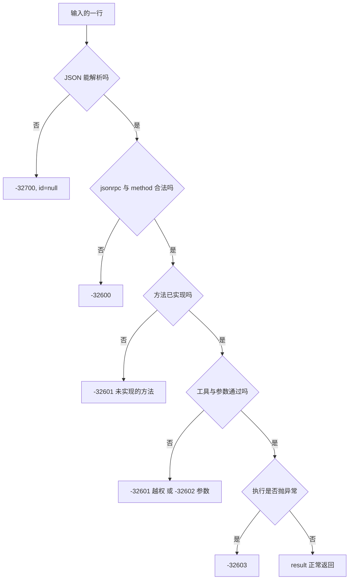
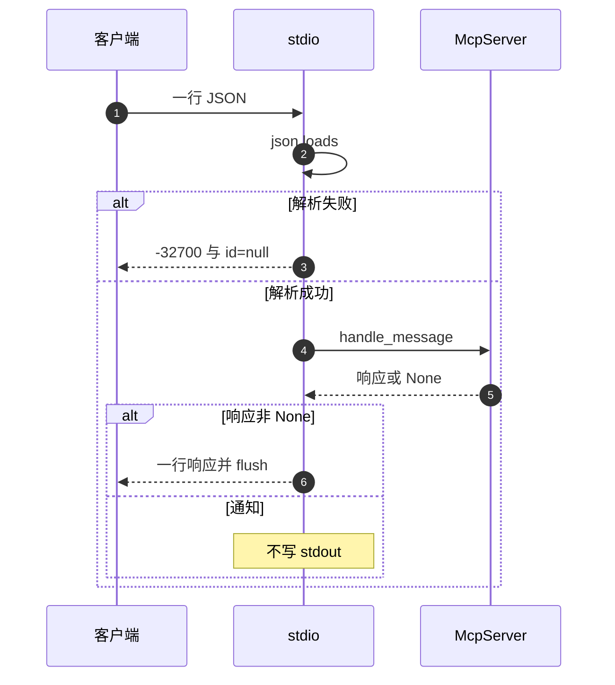

# 传输边界、错误码与通道卫生

协议层与传输层的分工在模块文档里写得很清楚：`server.py` 处理 JSON-RPC 方法，`stdio.py` 负责换行分隔的输入输出（`backend/mcp/__init__.py`）。边界上有两条不可违反的规则：一行一条 JSON 消息；标准输出只写协议消息，日志与异常一律走标准错误（`backend/mcp/stdio.py` 的模块文档）。任何一行多余的文本都会让客户端把非 JSON 内容当成协议消息解析。

错误码把失败分成五类，分散定义在两个模块里。解析失败由传输层直接构造响应，请求与参数错误由协议层判断，权限与执行错误由网关抛出再由协议层包装。读客户端收到的错误时，`code` 是分类的第一依据，`message` 是上下文。

stdio 服务的循环细节属于相邻单元，这里只写到与消息边界有关的部分。

## 一行一条消息的边界

`serve_async` 的循环以行为单位（`backend/mcp/stdio.py`）：先从标准输入读一行，读到空串表示输入结束并退出循环，否则去掉首尾空白，空行直接跳过，再尝试解析。

为什么用换行分帧，而不是先发一个长度、再接固定字节数？JSON-RPC 的消息本身就是自包含的文本，一个换行足以切分，标准库的 `readline` 与 `write` 就能实现，不需要自己解析帧头；代价是消息体里不能出现裸换行，所以序列化时不能加缩进，也不能在文本里塞原始换行。另一条常见路线是 `Content-Length` 头（语言服务器协议 LSP 用的就是它）：任意二进制都能承载，代价是要多写一层帧解析。选哪条，取决于传输里会不会出现二进制与嵌套换行。

三条边界约定都体现在这几行里：

| 约定 | 代码位置 | 后果 |
| --- | --- | --- |
| 换行分隔 | `json.loads(line)` 按行解析 | 一条消息不能跨行，多行 JSON 会解析失败 |
| 空行忽略 | `if not line: continue` | 心跳或占位空行不会触发错误 |
| 输入结束即退出 | `if line == "": break` | 客户端关闭管道，服务端结束会话 |

这三条约定对应循环开头的几行：

```python
line = await asyncio.to_thread(stdin.readline)
if line == "":        # 读回空串 = EOF：对端关掉了管道
    break
line = line.strip()
if not line:          # 空行不是消息
    continue
```

`asyncio.to_thread` 把阻塞的 `readline` 挪到线程里执行，避免它在等输入时卡住整个事件循环；读回空串是 UNIX 管道的「对端已关闭」信号（EOF），和「读到一个空行」是两回事，空行会先被 `strip()` 掉然后跳过。处理是逐条串行的：一行读完处理完，才读下一行。因此同一会话里不会出现两条消息并发处理，这也解释了为什么取消通知没有可作用的对象。

## stdout 只写协议消息

响应写回时一次性写入整行并刷新（`backend/mcp/stdio.py`）：

```python
stdout.write(json.dumps(response, ensure_ascii=False) + "\n")
stdout.flush()
```

只有 `response` 不为 `None` 时才写，通知因此不产生任何输出。`ensure_ascii=False` 让中文以 UTF-8 原样输出，配合入口配置里的 `PYTHONIOENCODING=utf-8`（`backend/mcp/examples/claude_desktop_config.json` 的 env 段）。`PYTHONIOENCODING` 是 Python 解释器读取的环境变量，用来强制标准输入输出的编码，避免在默认编码不是 UTF-8 的机器上把中文写坏。写完立即刷新，避免客户端等待缓冲区。

通道纪律的另一半在入口：日志被强制指向标准错误（`backend/mcp/__main__.py`）：

```python
logging.basicConfig(level=logging.INFO, stream=sys.stderr, format="[mcp] %(levelname)s %(message)s")
```

启动失败也写标准错误并返回退出码 2。任何在别处新增的 `print` 默认写标准输出，会污染协议通道，这是修改这个模块时最容易忽略的约束。

## 解析失败的响应

JSON 解析失败时，传输层直接构造响应，不走协议层（`backend/mcp/stdio.py`）：

```python
except json.JSONDecodeError as exc:
    response = {
        "jsonrpc": "2.0",
        "id": None,
        "error": {"code": -32700, "message": f"JSON 解析失败: {exc.msg}"},
    }
```

`id` 固定为 null，因为解析失败时拿不到消息里的 id。错误信息只带 `exc.msg`（解析器给出的短描述），不含出错位置或原始文本。客户端要定位问题需要对照自己发出的那一行。

解析失败不影响循环：`response` 被写回后继续读下一行。一次坏消息不会让会话结束，只有标准输入关闭才会退出。

## 错误码的来源与分布

五类错误码的常量分布如下：

| 码 | 含义 | 定义位置 | 使用位置 |
| --- | --- | --- | --- |
| `-32700` | JSON 解析失败 | `backend/mcp/stdio.py`（字面量） | 传输层解析分支 |
| `-32600` | 请求不合法 | `backend/mcp/server.py` | `handle_message` 的 `jsonrpc`、`method`、`params` 三处检查 |
| `-32601` | 方法未实现或工具被拒 | `backend/mcp/gateway.py` | `server.py` 的方法兜底、`gateway.py` 的 `deny_reason` |
| `-32602` | 参数不合法 | `backend/mcp/gateway.py` | `server.py` 的 `params` 检查、`gateway.py` 的 `validate_arguments` |
| `-32603` | 执行内部错误 | `backend/mcp/gateway.py` | `call_tool` 的异常包装 |

`-32700` 在协议层还有一个同名常量 `ERR_PARSE`（`backend/mcp/server.py`），但没有任何使用点，解析失败完全在传输层处理。这是一个只定义不使用的常量，排查时不要到协议层找解析分支。

`-32601` 承担两种语义：协议层用它表示未实现的方法，网关用它表示工具不在白名单或层级复核不通过（`backend/mcp/gateway.py`）。两者的消息文本不同，前者是“未实现的方法: X”，后者是 `deny_reason` 生成的层级说明。客户端若只按码分支，会把越权调用与打错方法名当成同一类。



## 跨边界传递的上下文

消息里携带的上下文有四处，都在出站方向上被处理过：

| 上下文 | 位置 | 处理 |
| --- | --- | --- |
| `id` | 响应顶层 | 原样回填，解析失败时为 null |
| `jsonrpc` | 响应顶层 | 固定为 2.0 字面量 |
| 错误 `message` | `error.message` | 中文说明加具体值，不含堆栈 |
| 工具文本 | `result.content[0].text` | 摘要加 JSON 数据，按开关套不可信边界 |

错误消息不泄漏堆栈：网关捕获执行异常后只把 `exc` 的字符串写进消息，并把原异常挂在 `__cause__` 上（`backend/mcp/gateway.py` 的 `call_tool`），堆栈进日志而不是消息。工具文本的边界包裹在内容转换函数里（`backend/mcp/server.py` 的 `to_mcp_content`），作用于成功返回的文本。



## 核验模式与启动失败

入口提供了一个不走协议的自检模式：`--list-tools` 把工具清单以缩进 JSON 打到标准输出后退出（`backend/mcp/__main__.py`）。这条路径写的是普通 JSON 而不是协议消息，属于人工核验，不能与 stdio 服务同时使用。配置示例里的客户端不会传这个参数。

启动失败（例如没给用户名）在构造网关时抛出，入口捕获后写标准错误并返回 2。返回非零退出码让客户端能判断子进程启动失败，而不是一直等待首条响应。用户名来源是 `--username` 或环境变量 `KD_MCP_USERNAME`（`backend/mcp/runtime.py` 的 `resolve_identity`）。

就绪日志也走标准错误，包含用户名与工具名列表，是排查“客户端连上了但没有工具”时的第一处证据。

## 易错点

1. 在 `backend/mcp/` 里新增 `print`。默认写标准输出，会破坏协议通道。
2. 发多行格式化的 JSON。按行解析，跨行内容会被判为 `-32700`。
3. 认为 `-32700` 由协议层产生。它在传输层构造，协议层的 `ERR_PARSE` 未被使用。
4. 只按错误码分类 `-32601`。它同时表示未实现方法与越权工具。
5. 从 `error.message` 里找堆栈。堆栈只进日志。
6. 把 `--list-tools` 的输出当协议响应。那是核验模式。

## 小结

### 核心概念

| 概念 | 取值或做法 | 来源 |
| --- | --- | --- |
| 消息边界 | 一行一条，空行忽略 | `stdio.serve_async` 的循环头部 |
| 输出纪律 | stdout 只写协议，日志走 stderr | `stdio.serve_async` 的写回与 `__main__` 的 `logging.basicConfig` |
| 解析失败 | `-32700`，`id` 为 null，会话继续 | `stdio.serve_async` 的 `except` 分支 |
| 请求错误 | `-32600` | `handle_message` 的前三道校验 |
| 未实现与越权 | `-32601`，消息不同 | `handle_message` 兜底与 `gateway.deny_reason` |
| 参数错误 | `-32602` | `_tools_call` 的 `name` 检查与 `gateway.validate_arguments` |
| 内部错误 | `-32603`，不泄漏堆栈 | `gateway.call_tool` 的异常包装 |
| 启动失败 | stderr 加退出码 2 | `__main__.main` 的异常捕获 |

### 设计权衡

| 决策 | 收益 | 代价 |
| --- | --- | --- |
| 换行分隔 JSON | 无需分帧协议，标准库即可 | 消息不能格式化多行 |
| 传输层直接处理解析错误 | 协议层保持干净 | 错误码常量两处定义 |
| `-32601` 复用两种语义 | 码集最小 | 客户端需读消息文本区分 |
| 错误只带短描述 | 消息紧凑，不泄漏内部 | 定位需要对照原始请求 |
| 提供 `--list-tools` | 人工核验方便 | 与协议模式互斥，需注意用法 |

## 练习

### 基础题

1. 写出从一行输入到一行输出的完整处理顺序，标出解析失败与通知两个分支。
2. 列出五个错误码，并各给一个触发条件与来源模块。
3. 说明为什么日志必须写标准错误，以及写错通道的后果。

### 挑战题

4. 给解析失败的消息补上出错行号或片段，说明如何在不泄漏敏感内容的前提下实现，并列出需要改动的函数。
5. 把 `-32601` 的两种语义拆成不同错误码，分析对现有客户端与测试的影响，给出兼容方案。
6. 设计一组传输层测试，覆盖空行、坏 JSON、通知、EOF 与超长单行，并写出每条期望的输出行数与错误码。

### 附：本页引用的路径

| 路径 | 用途 |
| --- | --- |
| `backend/mcp/stdio.py` | 逐行循环、解析失败与写出 |
| `backend/mcp/server.py` | 协议错误码与错误响应 |
| `backend/mcp/gateway.py` | 网关错误码与异常包装 |
| `backend/mcp/__main__.py` | 日志通道、启动失败与核验模式 |
| `backend/mcp/runtime.py` | 用户名与会话解析 |
| `backend/mcp/examples/claude_desktop_config.json` | 编码与启动参数 |
| `backend/mcp/__init__.py` | 模块分工与传输约定 |
