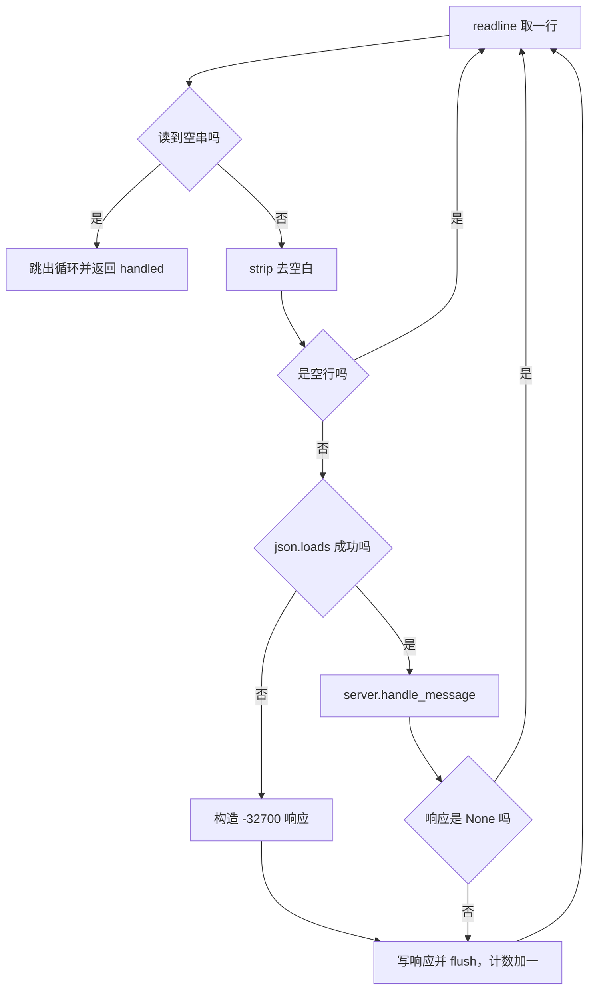
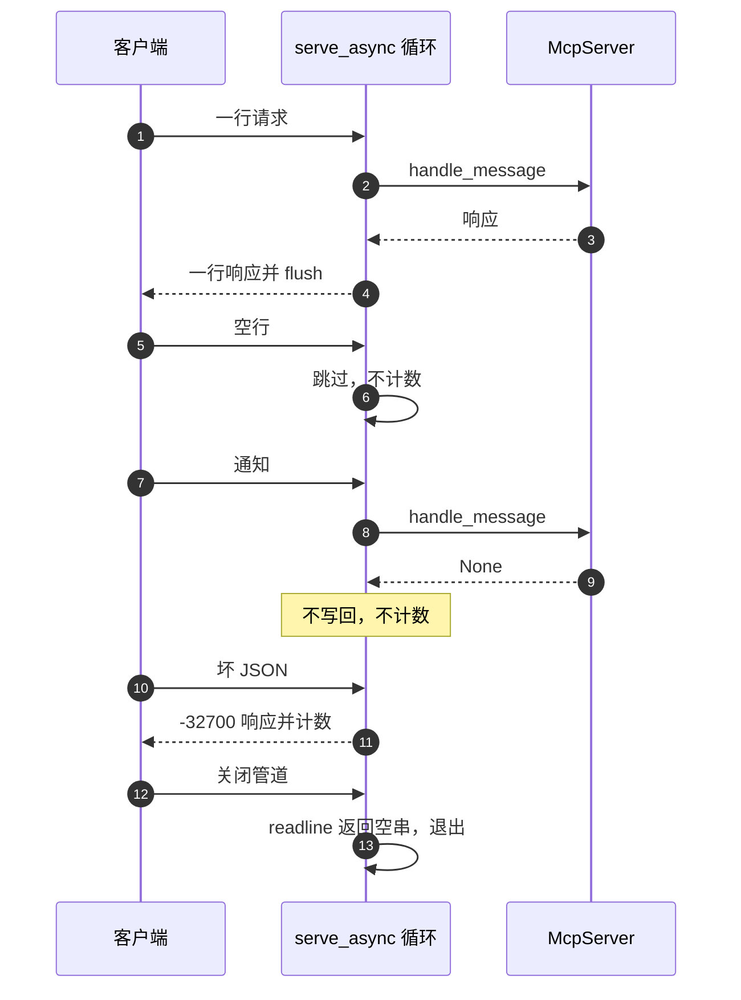

# 逐行循环：读取、分发与写回

stdio 服务器的全部传输逻辑在一个 while 循环里（`backend/mcp/stdio.py:22-46`）。它做四件事：读一行、解析、交给协议层、把响应写回去。没有连接管理、没有超时、没有并发。这种简单来自 MCP 的 stdio 约定：客户端把服务端当子进程启动，双方用标准输入输出对话，进程存活期就是一个会话。

循环里唯一不那么直观的是读取方式。`stdin.readline` 是阻塞调用，直接写在协程里会卡住事件循环，虽然这个程序没有别的并发任务，代码仍然用 `asyncio.to_thread` 把它挪到线程里（`:26`）。这样写的好处是循环保持异步形态，未来若要加超时或并行处理不需要重写结构；代价是每行一次线程切换。

计数与空行的关系由回归测试锁定，是读这段代码时最容易看错的地方。

## 循环的四个阶段

`serve_async` 的主体结构如下（`backend/mcp/stdio.py:22-46`）：

| 阶段 | 代码 | 说明 |
| --- | --- | --- |
| 读取 | `line = await asyncio.to_thread(stdin.readline)` | 阻塞读放进线程 |
| 结束判断 | `if line == "": break` | 空串表示 EOF |
| 预处理 | `line.strip()`，空行 `continue` | 去空白并跳过空行 |
| 解析与分发 | `json.loads`，失败构造错误，成功走 `handle_message` | 见下一节 |
| 写回 | 非 `None` 才写，写后 `flush` | 见写回一节 |

循环变量只有两个：`handled` 计数与当前行。没有任何跨行状态，因此逐行处理的顺序不影响结果。协议层的有状态部分集中在 `McpServer` 的 `initialized` 与 `client_info` 上（`backend/mcp/server.py:122-123`），传输层不触碰它们。



## 阻塞读取放进线程

读取那一行是 `await asyncio.to_thread(stdin.readline)`（`:26`）。`to_thread` 把函数调用提交给默认线程池并等待结果，事件循环在这段时间里可以跑别的任务。对这个单任务循环来说，收益只是形式上的异步；实际的理由是保持 `serve_async` 可被 `asyncio.run` 直接驱动，也便于测试里用 `StringIO` 替换标准流。

`serve_async` 的三个参数都允许测试注入：`server`、`stdin`、`stdout`（`:22`）。回归测试用 `io.StringIO` 构造输入输出，直接断言写出的行数与内容（`tests/backend/test_mcp_server.py:323-344`）。这也是为什么 `handled` 作为返回值暴露出来：测试可以核对处理条数，而不必解析全部输出。

`StringIO` 的 `readline` 在读到末尾时返回空串，与真实管道的 EOF 行为一致，因此 EOF 用例也能在内存流上跑（`:347-349`）。真实场景里空串出现在客户端关闭管道或进程被终止时。

## 计数口径：什么算处理过一条

`handled` 在写回分支里自增（`backend/mcp/stdio.py:45`），因此它统计的是写出的响应条数，而不是读到的行数。三处差异：

| 输入 | 是否写响应 | 是否计数 |
| --- | --- | --- |
| 空行 | 否 | 否 |
| 通知（无 id） | 否 | 否 |
| 请求 | 是 | 是 |
| 解析失败 | 是（`-32700`） | 是 |

回归测试给的输入有 7 行：initialize、空行、initialized 通知、tools/list、tools/call、坏 JSON、ping，断言 `handled == 5`（`tests/backend/test_mcp_server.py:323-339`）。5 来自四个请求加一个解析错误；空行与通知各少一条。这个用例同时断言执行器只被调用一次（`:344`），说明通知形式的调用没有触达执行器。

把 `handled` 当“读取行数”会让这个断言看似出错，实际是口径不同。日志或监控若要统计客户端消息量，需要自己加计数，不能复用返回值。

## 写回与刷新

写回只有在 `response is not None` 时发生（`backend/mcp/stdio.py:42-45`）：

```python
if response is not None:
    stdout.write(json.dumps(response, ensure_ascii=False) + "\n")
    stdout.flush()
    handled += 1
```

三个细节都影响客户端行为：末尾的换行是 MCP 的分帧标记，缺了客户端会一直等下一行；`ensure_ascii=False` 保证中文按 UTF-8 输出而不是转义序列；`flush` 保证响应立刻离开缓冲区。stdio 传输没有长度前缀，换行与刷新缺一不可。

写回是同步调用，不放进线程。正常输出量是每请求一行，同步写不会成为瓶颈；只有在客户端停止读取、管道缓冲区写满时才会阻塞，此时整个循环停住，属于对端行为导致的背压。



## EOF 退出与返回值

读到空串时跳出循环并把 `handled` 返回（`:25-28`）。返回值有两个消费方：测试断言处理条数；`serve_stdio` 把它作为同步入口的返回值（`backend/mcp/stdio.py:49-51`），而 `__main__.main` 忽略它并固定返回 0（`backend/mcp/__main__.py:53-54`）。

EOF 退出没有清理动作：不关闭数据库连接、不发送任何结束消息、不等待正在执行的任务。由于处理是逐行串行的，跳出循环时不可能有半途的任务。数据库连接随进程结束被系统回收，`SessionDatabaseManager.close` 没有被调用，这一点按代码事实记录，不是缺陷。

客户端视角的等价信号是子进程退出。若客户端在退出前还发了若干行，这些行已经处理完才可能读到 EOF，因为管道按字节序读取。

## 与协议层的职责分界

| 职责 | 传输层 | 协议层 |
| --- | --- | --- |
| 读行与分帧 | 是 | 否 |
| JSON 解析与 `-32700` | 是 | 否 |
| 消息字段校验与 `-32600` | 否 | 是 |
| 方法分发 | 否 | 是 |
| 序列化与写回 | 是 | 否 |
| 通知静默 | 依据响应是否为 `None` | 决定返回 `None` |

分界点只有一个：`handle_message` 的返回值。传输层不解析消息内容，协议层不接触流。这个界让协议逻辑可以脱离标准输入输出做单测（`tests/backend/test_mcp_server.py:224-319` 全部不经过传输层），也让传输层可以换成别的通道而复用协议层。

## 易错点

1. 把 `handled` 当读取行数。它只统计写出的响应。
2. 认为通知也会被计数。通知没有响应，不计数。
3. 忘记写回时的换行或 `flush`。客户端会等待或收到粘包。
4. 在循环外捕获异常。循环内除解析错误外没有兜底，协议层抛出的异常会终止整个会话。
5. 期待 EOF 时做清理。退出路径没有关闭连接或发送结束消息。
6. 认为读取是同步阻塞事件循环的。它被 `to_thread` 挪到线程池。

## 小结

### 核心概念

| 概念 | 取值或做法 | 来源 |
| --- | --- | --- |
| 循环入口 | `serve_async(server, stdin, stdout)` | `backend/mcp/stdio.py:22` |
| 读取方式 | `asyncio.to_thread(stdin.readline)` | `:26` |
| EOF 判据 | 读到空串 | `:27-28` |
| 空行 | 跳过，不计数 | `:29-31` |
| 解析失败 | 构造 `-32700`，计数 | `:32-39` |
| 写回 | 换行加 `flush`，计数加一 | `:42-45` |
| 返回值 | 写出的响应条数 | `:24`、`:46` |
| 测试口径 | 7 行输入得 `handled == 5` | `tests/backend/test_mcp_server.py:323-344` |

### 设计权衡

| 决策 | 收益 | 代价 |
| --- | --- | --- |
| 逐行串行处理 | 无并发状态，逻辑简单 | 单条慢请求阻塞后续消息 |
| 读取放进线程 | 保持异步形态，便于测试 | 每行一次线程切换 |
| 解析错误在传输层 | 协议层不必处理坏输入 | 错误码常量两处存在 |
| 返回值暴露处理条数 | 测试可断言 | 与“读取行数”口径不同，容易误读 |
| EOF 无清理 | 退出路径简单 | 依赖进程回收资源 |

## 练习

### 基础题

1. 写出循环的四个阶段，并说明空行在哪个阶段被处理。
2. 解释为什么 7 行输入得到 `handled == 5`，逐行说明计数与不计数。
3. 说明写回为什么必须带换行并立即 flush。

### 挑战题

4. 给循环加上单条处理超时：要求说明超时后如何继续服务、如何写响应，以及需要改动的函数。
5. 把逐行串行改成受控并发，分析消息顺序、`McpServer` 状态与输出行交错三方面的影响。
6. 设计一组传输层测试，覆盖 EOF、空行、坏 JSON、通知与写回失败，并写出每条的期望 `handled` 与输出。

### 附：本页引用的路径

| 路径 | 用途 |
| --- | --- |
| `backend/mcp/stdio.py` | 逐行循环与写回（:22-51） |
| `backend/mcp/server.py` | `handle_message` 与协议层状态（:122-123、:166-201） |
| `backend/mcp/__main__.py` | 对返回值的处理（:53-54） |
| `tests/backend/test_mcp_server.py` | 传输层回归断言（:321-349） |
