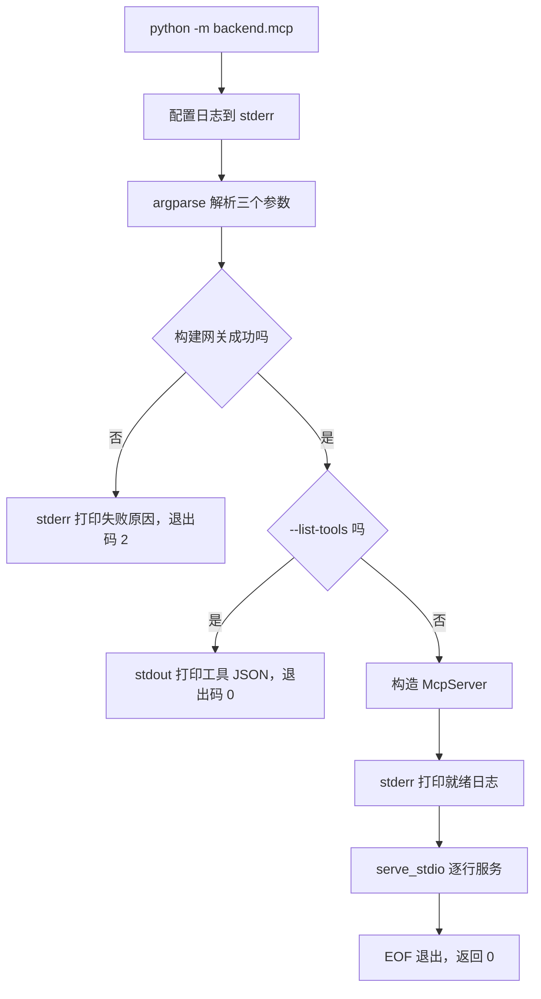
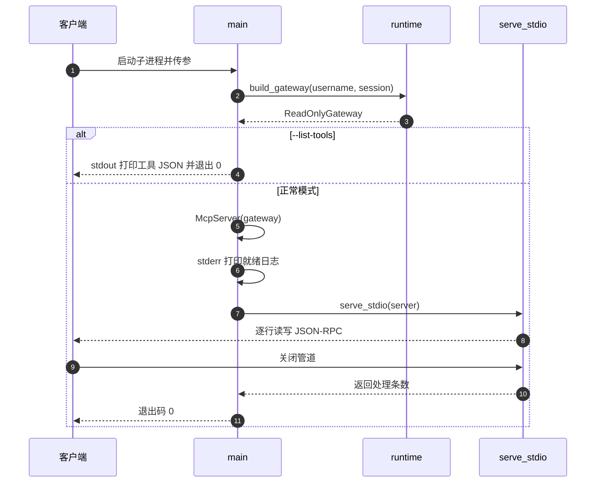

# 同步入口、退出码与日志通道

标准输入输出是异步接口，进程入口是同步的，中间需要一个桥。`serve_stdio` 就是这座桥：一行 `asyncio.run` 把协程循环跑完再返回（`backend/mcp/stdio.py:49-51`）。入口 `main` 负责更靠前的部分：解析参数、构建网关、把日志压到标准错误、决定退出码（`backend/mcp/__main__.py:29-54`）。

退出码只有两个取值：正常结束返回 0，构建失败返回 2。客户端（Claude Desktop、Cursor 等）靠子进程退出码判断启动是否成功，因此构建失败必须在首条消息之前暴露，而不是等客户端发 `initialize` 才回错误。日志通道同样是协议的一部分：stdout 属于 JSON-RPC，任何日志混进去都会变成一条解析失败的消息。

argparse 的默认行为按通用做法标注，代码没有覆写。

## 同步桥：一次会话一个事件循环

`serve_stdio` 的实现只有一行（`backend/mcp/stdio.py:49-51`）：

```python
def serve_stdio(server, stdin=None, stdout=None) -> int:
    """同步入口：阻塞式服务一个 stdio 会话。"""
    return asyncio.run(serve_async(server, stdin or sys.stdin, stdout or sys.stdout))
```

三个参数都可注入：`stdin`、`stdout` 缺省时才取 `sys.stdin` 与 `sys.stdout`，取值发生在调用时而不是导入时。这让测试与嵌入方都能替换流。返回值是 `serve_async` 的处理条数，入口 `main` 不使用它。

`asyncio.run` 会新建事件循环、跑完协程、关闭循环。因此一个进程只服务一个会话，会话结束即进程结束。这种“一进程一会话”的模型由 stdio 传输推导而来：客户端每次连接都启动一个新子进程，进程内不需要处理第二次 `initialize`。

`asyncio.run` 同时决定了异常路径：协程里未捕获的异常会从 `serve_stdio` 抛出，沿 `main` 冒泡到 `raise SystemExit(main())`（`backend/mcp/__main__.py:57-58`），最终以带 traceback 的退出结束。传输循环内部只兜住 JSON 解析错误，协议层与执行层的异常按契约已被包装成错误响应，因此这条路径主要留给编程错误。

## 参数解析与配置来源

入口用 argparse 定义三个参数（`backend/mcp/__main__.py:18-26`）：

| 参数 | 缺省 | 作用 |
| --- | --- | --- |
| `--username` | `None` | KD 用户名，等价于环境变量 `KD_MCP_USERNAME` |
| `--session` | `None` | 会话 ID，等价于 `KD_MCP_SESSION`，再缺省为默认会话 |
| `--list-tools` | 假 | 打印工具清单后退出，不进入协议模式 |

`--session` 的默认值刻意留成 `None`，实际的默认在 `runtime.resolve_identity` 里落到 `DEFAULT_SESSION_ID`（`backend/mcp/runtime.py:39-40`）。这样命令行参数、环境变量、全局默认三层的优先级只有一处实现，入口不重复判断。

argparse 自带的 `--help` 与参数错误行为没有被覆写：未知参数会打印用法并退出，退出码为 2（按 argparse 通用做法）。这与构建失败的 2 撞在同一个数值上，若客户端只按退出码分类，需要再读 stderr 文本区分。

## 日志设置

日志配置在参数解析之前执行（`backend/mcp/__main__.py:30-31`）：

```python
logging.basicConfig(level=logging.INFO, stream=sys.stderr, format="[mcp] %(levelname)s %(message)s")
```

三个显式选择：级别 INFO、输出流 stderr、格式固定为 `[mcp] 级别 消息`。级别 INFO 与就绪日志、网关调试日志的级别匹配；`backend/mcp/gateway.py:184` 的调用日志是 DEBUG，默认不会出现，需要调低级别才可见。

配置只对根日志器生效（`basicConfig` 的行为）。若上层应用已经配置过日志，这里的调用不会改变既有设置，这是 `basicConfig` 的常见行为。作为独立子进程启动时不存在这种情况，因为进程内没有别的配置者。

## 启动失败与退出码

构建网关包在 try 里（`backend/mcp/__main__.py:34-38`）：

```python
try:
    gateway = build_gateway(args.username, args.session)
except Exception as exc:
    print(f"[mcp] 启动失败: {exc}", file=sys.stderr)
    return 2
```

捕获的是 `Exception`，因此用户名缺失（`McpConfigError`）、数据库打不开、导入失败都会走同一条路：写一行 stderr、返回 2。消息里带上异常文本，最有用的是用户名缺失时的那句“请用 --username 或设置环境变量 KD_MCP_USERNAME”。

成功路径不返回中途值，只在结尾返回 0（`:53-54`）。会话因 EOF 结束时 `serve_stdio` 正常返回，进程以 0 退出，客户端据此知道是对方关闭了连接。



## 核验模式与正常模式的分叉

`--list-tools` 分支在构建网关之后、构造服务器之前（`backend/mcp/__main__.py:40-43`）：

```python
if args.list_tools:
    print(json.dumps({"tools": gateway.list_tools()}, ensure_ascii=False, indent=2))
    return 0
```

两个顺序上的细节需要注意。第一，它先构建网关，因此即使是“只看工具清单”也要提供合法用户名并解析会话，缺少任一项仍会以 2 退出。第二，输出走 stdout 且是缩进 JSON，不是协议消息；这条路径与 stdio 服务互斥，客户端配置里不能带这个参数。



## 信号与中断

入口没有注册信号处理器。客户端关闭管道走 EOF 正常退出；用户按 Ctrl+C 时 `KeyboardInterrupt` 从 `asyncio.run` 抛出，`main` 不捕获，进程按 Python 默认行为打印 traceback 并以 130 退出（按 Python 行为的描述，仓库未覆写）。客户端场景下不会出现键盘中断。

进程退出时没有资源清理：`build_gateway` 构造的 `PipelineAPI` 与数据库连接不显式关闭，`SessionDatabaseManager.close` 没有被调用。SQLite 连接随进程结束由系统回收，WAL 文件保持在可恢复状态。这一点按代码事实记录。

## 易错点

1. 把日志写到 stdout。协议通道被污染，客户端会收到解析失败。
2. 在客户端配置里加 `--list-tools`。服务不会进入协议模式。
3. 只用退出码分类失败。argparse 错误与构建失败都是 2。
4. 认为缺用户名也能 `--list-tools`。构建网关在前，仍会失败。
5. 期待进程退出时关闭数据库。退出路径没有显式清理。
6. 调低日志级别后期待 stdout 也有日志。就绪与调试日志都走 stderr。

## 小结

### 核心概念

| 概念 | 取值或做法 | 来源 |
| --- | --- | --- |
| 同步桥 | `asyncio.run(serve_async(...))` | `backend/mcp/stdio.py:49-51` |
| 注入流 | 缺省时才取 `sys.stdin` 与 `sys.stdout` | `:50` |
| 参数 | username、session、list-tools | `backend/mcp/__main__.py:18-26` |
| 日志 | INFO 级别、stderr、固定格式 | `:30-31` |
| 构建失败 | stderr 一行、退出码 2 | `:34-38` |
| 正常退出 | EOF 后返回 0 | `:53-54` |
| 核验模式 | 先建网关，stdout 打印缩进 JSON | `:40-43` |
| 清理 | 无显式关闭 | 退出路径代码 |

### 设计权衡

| 决策 | 收益 | 代价 |
| --- | --- | --- |
| 一进程一会话 | 无跨会话状态 | 客户端每次连接都要重启进程与模型 |
| 缺省参数延迟到运行时 | 优先级只有一处实现 | 入口读不出最终值，需看 runtime |
| 构建失败提前返回 2 | 客户端能立刻判断启动失败 | 与 argparse 的错误码重叠 |
| `--list-tools` 复用网关构建 | 输出与协议模式同源 | 必须提供合法用户名 |
| 不做信号与清理处理 | 代码短 | 依赖系统回收资源 |

## 练习

### 基础题

1. 写出 `serve_stdio` 的一行实现，并说明三个参数的缺省取值时机。
2. 列出退出码的两种取值与各自触发条件。
3. 解释为什么日志必须配置到 stderr，以及 `--list-tools` 为什么写 stdout。

### 挑战题

4. 给入口加一个 `--protocol-version` 参数以固定协商结果，说明改动点与对 `McpServer` 构造的影响。
5. 区分 argparse 错误与构建失败的退出码，分析对客户端与本仓库测试的影响。
6. 设计退出清理方案：列出需要关闭的资源、在 `main` 中的位置，以及异常路径下如何保证执行。

### 附：本页引用的路径

| 路径 | 用途 |
| --- | --- |
| `backend/mcp/__main__.py` | 参数解析、日志、退出码与模式分叉（:18-58） |
| `backend/mcp/stdio.py` | 同步入口与返回类型（:49-51） |
| `backend/mcp/runtime.py` | 会话与用户名的最终默认值（:32-40） |
| `backend/mcp/gateway.py` | 调试级调用日志（:184） |
| `tests/backend/test_mcp_server.py` | 传输与运行时断言（:321-392） |
