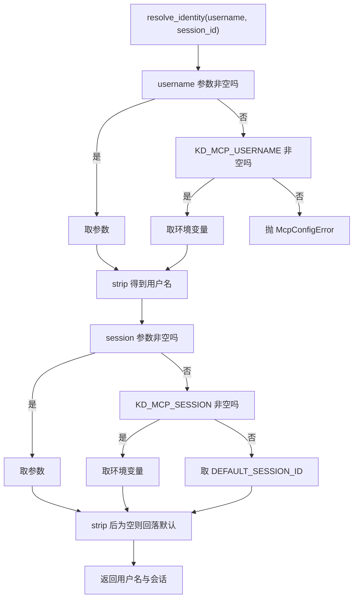
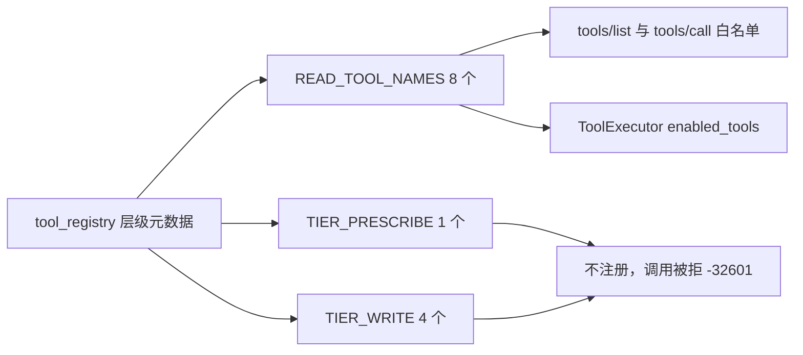
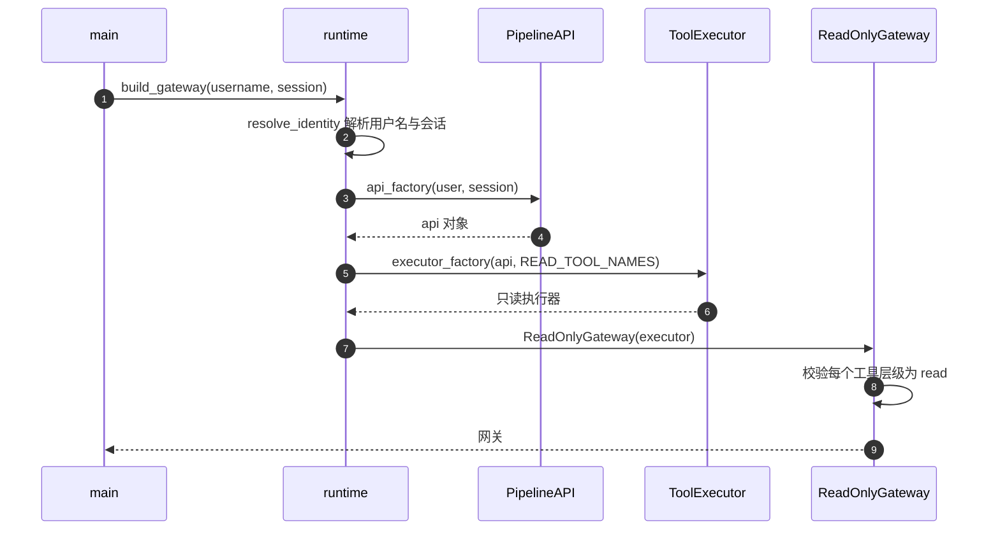

# 启动装配：身份解析与只读执行器

服务器启动时要回答三个问题：服务哪个用户、哪个会话的数据；用哪个对象执行工具；暴露哪些工具。答案分别在 `resolve_identity`、`build_executor`、`ReadOnlyGateway.__init__` 里（`backend/mcp/runtime.py:32-74`、`backend/mcp/gateway.py:141-150`）。这三个函数串起来的顺序就是启动装配的全部内容，没有配置文件、没有插件加载。

只读承诺在装配阶段被写成三层：清单白名单、调用时的层级复核、执行器的启用集合（`backend/mcp/gateway.py:15-19`）。前两层在网关内，第三层在构造执行器时把 `enabled_tools` 限成八个只读工具的集合（`backend/mcp/runtime.py:63`）。即使前两层被绕过，执行器仍然拒绝写层工具。

工具描述的字段结构属于相邻单元，这里只写到装配与边界为止。

## 身份解析的三层取值

`resolve_identity` 的两个入参都可为空，取值优先级写在同一段代码里（`backend/mcp/runtime.py:32-40`）：

```python
resolved_user = (username or os.getenv(ENV_USERNAME) or "").strip()
if not resolved_user:
    raise McpConfigError(...)
resolved_session = (session_id or os.getenv(ENV_SESSION) or DEFAULT_SESSION_ID).strip()
return resolved_user, resolved_session or DEFAULT_SESSION_ID
```

| 字段 | 优先级 | 环境变量 | 最终默认 |
| --- | --- | --- | --- |
| 用户名 | 参数、环境变量、无 | `KD_MCP_USERNAME`（`:21`） | 无，缺失即报错 |
| 会话 | 参数、环境变量、默认 | `KD_MCP_SESSION`（`:22`） | `DEFAULT_SESSION_ID`（`:18`） |

用户名的三步都做了 `strip`，全空白视为未提供；会话在拼接后又剥一次空白，空串回落到默认会话（`:40`）。默认值来自 `backend.config` 的 `DEFAULT_SESSION_ID`，与 Web 侧共用同一个常量。

用户名缺失抛 `McpConfigError`，消息里直接给出两种提供方式与环境变量名（`:35-38`）。这个异常继承 `RuntimeError`（`:28-29`），被入口的宽捕获转成退出码 2。

回归测试固定了优先级：环境变量提供时无参调用可用；显式参数优先于环境变量；`KD_MCP_USERNAME` 被删除后无参调用抛错（`tests/backend/test_mcp_server.py:385-392`）。



## 两个可注入工厂

`build_executor` 接受两个工厂参数，缺省时才用真实实现（`backend/mcp/runtime.py:43-63`）：

| 工厂 | 缺省实现 | 真实依赖 |
| --- | --- | --- |
| `api_factory(username, session_id)` | 函数内导入 `PipelineAPI` 并构造 | 数据库与嵌入模型 |
| `executor_factory(api, enabled)` | 函数内导入 `ToolExecutor` 并构造 | `backend.agent.tools` |

默认实现在函数体内部导入（`:52-54`、`:58-60`），模块导入阶段不加载流水线与 Agent 工具链。这让 `backend.mcp` 可以被轻量导入，例如只读工具清单或做单元测试时不必启动数据库。

注入点存在的直接用途是测试：回归测试用假工厂绕开真实数据库与嵌入模型，构造执行器并断言它收到的 `enabled` 集合恰好是只读白名单（`tests/backend/test_mcp_server.py:354-371`）。`build_gateway` 同样把两个工厂透传下去（`backend/mcp/runtime.py:66-74`），使端到端测试可以在内存里跑完整个装配（`:374-382`）。

```python
api = api_factory(username, session_id)
return executor_factory(api, set(READ_TOOL_NAMES))
```

最后一行是第三层兜底的落点：执行器拿到的启用集合是 `READ_TOOL_NAMES` 的拷贝，不含写层与处方层名字。拷贝而不是直接传引用，避免执行器意外改动模块级常量。

## 只读启用集合的来源

`READ_TOOL_NAMES` 在网关模块导入时从注册表派生（`backend/mcp/gateway.py:33-35`）：

```python
READ_TIERS = (registry.TIER_READ,)
READ_TOOL_NAMES = frozenset(registry.tools_by_tier(registry.TIER_READ))
FORBIDDEN_TIERS = frozenset({registry.TIER_PRESCRIBE, registry.TIER_WRITE})
```

清单是对注册表 read 层的查询结果，并没有手写八个名字。注册表增删只读工具时，暴露集合与执行器启用集合会一起变化，不需要改 `backend/mcp`。模块文档列出的八项是当时的结果快照（`backend/mcp/gateway.py:8-10`），回归测试用固定集合锁住了它（`tests/backend/test_mcp_server.py:79-82`）。

处方层被排除的理由写在常量注释里：`plan_knowledge_gaps` 会消耗一次 AI 调用，不属于只读承诺（`gateway.py:32`）。写层的四个工具（联网搜索、扩展、刷新、建链）排除理由更直接，它们会改动数据。



## 网关构造与导入期断言

`ReadOnlyGateway` 构造时先按名字建工具字典，再校验每个名字的层级（`backend/mcp/gateway.py:144-150`）：

```python
self._tools = {t["name"]: t for t in mcp_tools()}
illegal = sorted(n for n in self._tools if registry.tool_tier(n) != registry.TIER_READ)
if illegal:
    raise RuntimeError(f"只读网关拒绝注册非 read 层工具: {illegal}")
```

这是一条启动期断言：如果注册表被改成把写层工具算进只读导出集，服务器直接拒绝启动，而不是带着越权能力运行。回归测试用 `monkeypatch` 模拟这种改动，断言构造抛 `RuntimeError`（`tests/backend/test_mcp_server.py:138-148`）。

断言之外还有调用期的实时复核：`call_tool` 在分发前再查一次 `tool_tier(name) == TIER_READ`（`gateway.py:178-181`）。注册表在运行期被改动时，第二层能立刻拦下，测试同样覆盖了这条路径（`tests/backend/test_mcp_server.py:124-135`）。

## 手写实现与官方 SDK 的关系

模块文档说明了为什么不直接用官方 mcp 包（`backend/mcp/__init__.py:16-22`）：开发环境里已装 mcp 2.2.0，但 `requirements.txt` 没有声明它，为避免干净环境装不上，协议层用标准库实现了一个子集，同时把版本探测做成可选导入（`backend/mcp/server.py:41-48`）。

这个取舍对装配的影响是：`backend.mcp` 在没有任何第三方 MCP 依赖的环境里可以完整启动；装了官方包时只影响协议版本候选，不影响工具与执行器。官方包的导入失败被宽捕获，注释写明“无 SDK 时零影响”（`server.py:47-48`）。

## 装配失败的传播路径

| 失败点 | 异常 | 传播结果 |
| --- | --- | --- |
| 用户名缺失 | `McpConfigError` | 入口捕获，stderr 加退出码 2 |
| `PipelineAPI` 构造失败 | 底层异常 | 同上 |
| 注册表层级不一致 | `RuntimeError` | 同上 |
| 扩展/模型缺失 | 延迟到首次调用 | 启动成功，检索或索引时降级 |

第四行需要单独记住：向量扩展加载失败与嵌入模型加载失败都不在装配路径上（扩展在会话数据库初始化时、模型在首次编码时），因此启动成功不代表向量能力可用。



## 易错点

1. 把工具清单一处一处手写。它从注册表派生，手写会与执行器启用集合脱节。
2. 认为三层防御是重复劳动。白名单防名字，层级复核防注册表改动，启用集合防前两层失效。
3. 把 `READ_TOOL_NAMES` 直接传给执行器而不是拷贝。模块级常量可能被外部改动。
4. 在模块顶层导入 `PipelineAPI`。会让轻量导入与单测都拉起数据库依赖。
5. 认为启动成功等于向量可用。扩展与模型都是延迟加载的。
6. 把 `McpConfigError` 当配置警告。它会直接阻止启动。

## 小结

### 核心概念

| 概念 | 取值或做法 | 来源 |
| --- | --- | --- |
| 用户名优先级 | 参数、`KD_MCP_USERNAME`、否则报错 | `backend/mcp/runtime.py:32-38` |
| 会话优先级 | 参数、`KD_MCP_SESSION`、默认会话 | `:39-40` |
| 可注入工厂 | `api_factory` 与 `executor_factory` | `:43-63` |
| 启用集合 | `set(READ_TOOL_NAMES)` | `:63` |
| 只读清单来源 | 注册表 read 层 | `backend/mcp/gateway.py:33-34` |
| 启动期断言 | 非 read 层工具拒绝构造 | `:147-150` |
| 调用期复核 | 每次调用重查层级 | `:178-181` |
| 手写协议层 | 避免新增依赖 | `backend/mcp/__init__.py:16-22` |

### 设计权衡

| 决策 | 收益 | 代价 |
| --- | --- | --- |
| 工厂可注入 | 单测不依赖数据库与模型 | 生产路径与实际构造有一层间接 |
| 默认实现延迟导入 | 模块导入轻量 | 依赖错误推迟到构造时暴露 |
| 三层只读边界 | 任一层失效仍有兜底 | 同一约束三处维护 |
| 启动期断言 | 配置错误立刻失败 | 注册表改动可能让服务起不来 |
| 启动不做向量自检 | 启动快 | 能力缺失到调用时才可见 |

## 练习

### 基础题

1. 写出用户名与会话的取值优先级，并说明缺失用户名时的行为。
2. 说明两个工厂的签名与缺省实现，以及它们在测试中的用途。
3. 列出只读的三层防线，各用一句说明它拦什么。

### 挑战题

4. 在启动装配里加入一次向量能力自检，列出检查内容、失败策略与对启动时间的影响。
5. 把只读清单改成配置驱动，分析它与注册表派生方案的差异、需要补的测试与误配风险。
6. 设计一组装配测试，用假工厂覆盖身份缺失、注册表层级异常与执行器启用集合，并写出每条的断言。

### 附：本页引用的路径

| 路径 | 用途 |
| --- | --- |
| `backend/mcp/runtime.py` | 身份解析与装配（:18-74） |
| `backend/mcp/gateway.py` | 只读清单、构造断言与调用复核（:15-19、:32-35、:141-191） |
| `backend/mcp/__init__.py` | 手写实现的原因与模块划分（:1-22） |
| `backend/mcp/server.py` | 可选 SDK 导入与版本探测（:41-48） |
| `tests/backend/test_mcp_server.py` | 装配与边界断言（:79-148、:354-392） |
| `backend/config.py` | `DEFAULT_SESSION_ID` 常量来源 |
