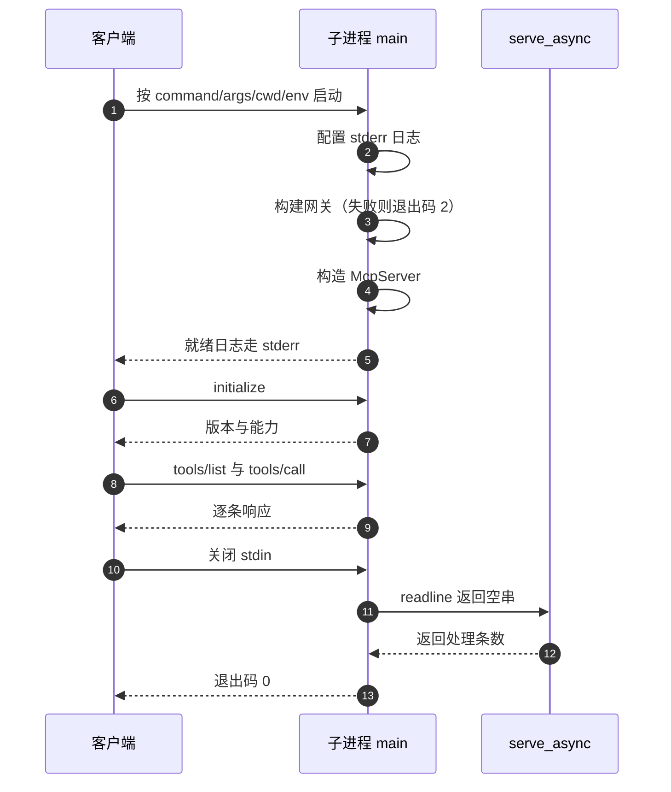
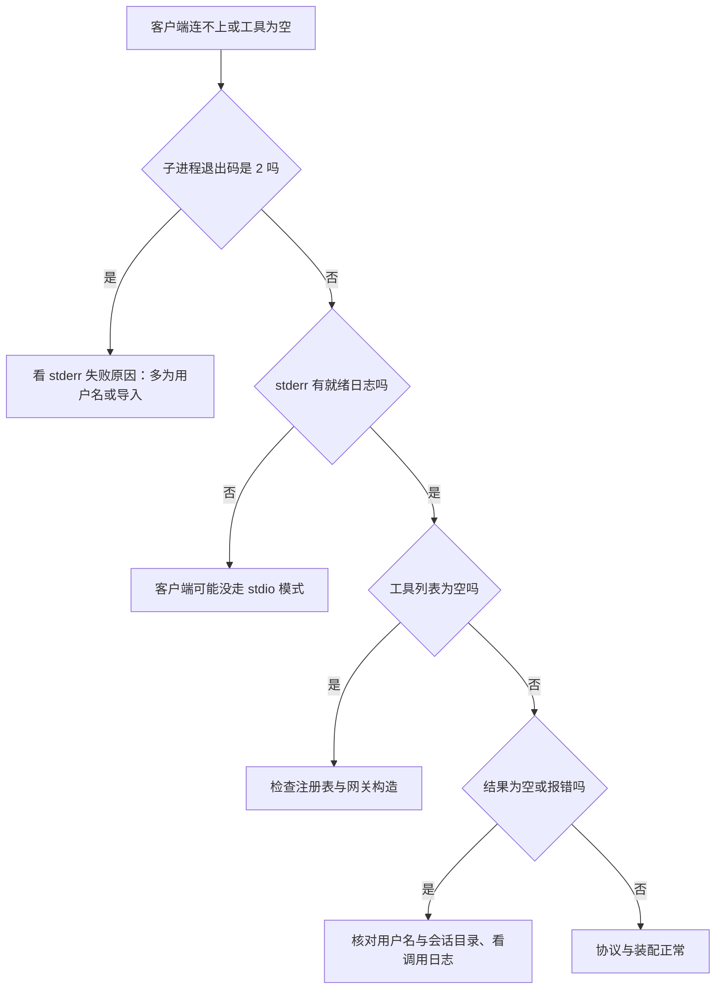

# 客户端配置与进程生命周期

客户端接入这个服务器不需要网络地址，只需要一条启动命令。仓库里给了两份配置样例：Claude Desktop 的 `claude_desktop_config.json` 与 Cursor 的 `cursor_mcp.json`（`backend/mcp/examples/`）。两份都把 `command` 指向同一台机器上的 Python 解释器，把 `-m backend.mcp` 作为参数，再附上用户名。

配置决定的不只是“怎么启动”，还包括子进程的工作目录、模块搜索路径与编码。这三项错了会在启动阶段就失败，而不是在协议阶段回一个错误码。因此排查连接问题时，先看 stderr 与退出码，再看协议消息。

样例里的路径是 Windows 形式的绝对路径，按配置原文描述；在 WSL 或其他平台上需要替换解释器与路径，这一点在适配一节说明。

## 配置文件的四个字段

Claude Desktop 样例的完整结构如下（`backend/mcp/examples/claude_desktop_config.json`）：

```json
{
  "mcpServers": {
    "knowledgediver": {
      "command": "D:/KnowledgeDiver/.venv/Scripts/python.exe",
      "args": ["-m", "backend.mcp", "--username", "<你的KD用户名>", "--session", "default"],
      "cwd": "D:/KnowledgeDiver",
      "env": {
        "PYTHONPATH": "D:/KnowledgeDiver",
        "PYTHONIOENCODING": "utf-8",
        "KD_MCP_USERNAME": "<你的KD用户名>",
        "KD_MCP_SESSION": "default"
      }
    }
  }
}
```

| 字段 | 作用 | 本样例取值 |
| --- | --- | --- |
| `command` | 启动的可执行文件 | Windows 虚拟环境里的 python.exe |
| `args` | 命令行参数 | `-m backend.mcp` 加用户名与会话 |
| `cwd` | 子进程工作目录 | 仓库根目录 |
| `env` | 环境变量 | 模块路径、编码与两个身份变量 |

`mcpServers` 下的键 `knowledgediver` 是客户端显示的服务名，与协议里的 `serverInfo.name`（`knowledgediver-readonly`，`backend/mcp/server.py`）无关。改显示名不影响协议。

## 命令、工作目录与 PYTHONPATH

三个字段共同保证 `-m backend.mcp` 能被找到：

- `command` 指向装有依赖的解释器；样例用的是项目内虚拟环境，而不是系统 Python。
- `cwd` 设成仓库根目录，相对路径与数据库目录（`cards/`、`data/`）都基于它解析（`backend/config.py` 与各存储模块的 `PROJECT_ROOT`）。
- `env.PYTHONPATH` 再给一份模块搜索路径，避免客户端启动时没有继承 shell 的 `PYTHONPATH`。

三者里最容易漏的是 `cwd`。数据库与卡片目录按进程工作目录解析，工作目录不对时服务能启动，但读到的是另一份（或不存在的）数据。表现是工具清单正常、查询结果为空。

Cursor 样例省掉了 `--session` 参数，改用环境变量之外的默认值，即 `DEFAULT_SESSION_ID`（`backend/mcp/runtime.py`）。两份样例的差异只在会话的给法，命令与路径部分相同。Cursor 那份节选如下：

```json
{
  "mcpServers": {
    "knowledgediver": {
      "command": "D:/KnowledgeDiver/.venv/Scripts/python.exe",
      "args": ["-m", "backend.mcp", "--username", "<你的KD用户名>"],
      "cwd": "D:/KnowledgeDiver",
      "env": { "PYTHONPATH": "D:/KnowledgeDiver", "KD_MCP_USERNAME": "<你的KD用户名>" }
    }
  }
}
```

## 编码与中文输出

配置里显式设了 `PYTHONIOENCODING=utf-8`。原因是协议输出包含中文：`instructions` 是中文说明（`backend/mcp/server.py`），工具摘要与错误消息也含中文。stdio 写回时用 `ensure_ascii=False`（`backend/mcp/stdio.py`），若输出流的编码不是 UTF-8，写入可能抛编码错误或产生乱码。

这一项在 Windows 上尤其需要：默认控制台编码与管道编码可能不是 UTF-8，客户端解析 `json.loads` 时遇到乱码会得到解码错误而不是协议错误。配置样例把它和 `PYTHONPATH` 放在一起，属于运行环境而非协议参数。

## 身份参数的两种给法

用户名与会话各有两种给法，优先级由 `resolve_identity` 统一处理：

| 项 | 命令行 | 环境变量 | 优先级 |
| --- | --- | --- | --- |
| 用户名 | `--username` | `KD_MCP_USERNAME` | 命令行优先 |
| 会话 | `--session` | `KD_MCP_SESSION` | 命令行优先，再缺省默认会话 |

两份样例都同时提供了两种，看起来重复，实际是防御性写法：某些客户端在合并 `env` 时行为不同，参数与环境变量各留一份更稳。用户名缺失时服务不会启动，入口以退出码 2 结束并打印提示（`backend/mcp/__main__.py`）。

用户名对应 `data/` 与 `cards/` 下的存储目录，写错不会报“无此用户”，而是读写另一个目录，表现为空结果。核对方式是拿用户名去看 `cards/<username>/<session>/session.db` 是否存在。

## 进程生命周期

客户端每次建立 MCP 会话都会启动一个新的子进程，进程内只处理一条 stdio 会话（`backend/mcp/stdio.py`）。



三个退出信号要分清：构建失败退出码 2 且 stderr 有一行原因；正常 EOF 退出码 0；未捕获异常带 traceback 退出。客户端配置错误最常见的是第一种，表现为服务列表里能看到条目但工具为空。

生命周期内没有显式资源清理：数据库连接与嵌入模型随进程结束回收。因此每次会话启动都会重新加载一次模型，首次 `tools/call` 会包含加载时间；仓库注释给出的量级是约 500 ms（声明值，未实测）。要紧的是这个结构：进程不常驻，加载成本每开一次会话就要再付一遍。

多个客户端同时连接会得到多个子进程，各自打开同一会话的数据库连接。SQLite 的 WAL 模式支持多连接读写，但嵌入模型会在每个进程里各加载一份，内存按进程数增长。

## 故障排查表

| 现象 | 首要检查 | 可能原因 |
| --- | --- | --- |
| 客户端看不到工具 | stderr 与退出码 | 用户名缺失（退出码 2）、注册表导入失败 |
| 工具列表正常但结果为空 | `cards/<user>/<session>/session.db` | 用户名或会话写错、向量未索引 |
| 响应解析失败 | stdout 是否混入日志 | 代码或依赖往 stdout 打印了非协议文本 |
| 会话立刻结束 | 退出码 | 构建失败或客户端关闭了 stdin |
| 中文乱码 | `PYTHONIOENCODING` | 输出流编码不是 UTF-8 |
| 首次调用明显慢 | 时间戳与日志 | 模型与扩展的首次加载 |
| 调用返回 `-32603` | stderr 日志 | 执行器抛异常，原因在日志里 |



## 适配到非 Windows 平台

样例里的 `command` 与路径是 Windows 形式：`D:/KnowledgeDiver/.venv/Scripts/python.exe`、`cwd` 与 `PYTHONPATH` 都是 `D:/` 前缀。在 WSL 或 Linux 上需要把它们换成对应解释器与仓库路径，例如虚拟环境里的 `bin/python`；`args` 与 `env` 的键名不变。

本仓库的样例只覆盖 Windows 与 Cursor/Claude Desktop 两种客户端，其他客户端的配置字段名可能不同（例如用 `servers` 而不是 `mcpServers`），需要按客户端文档映射。按通用做法标注：stdio 传输的约定一致，配置结构随客户端变化。

## 易错点

1. 只改 `command` 不改 `cwd`。服务能启动但指向错误的工作目录。
2. 漏设 `PYTHONIOENCODING`。中文输出可能乱码或抛编码错误。
3. 认为用户名写错会报用户不存在。实际会读写另一个目录并返回空。
4. 把显示名 `knowledgediver` 当成协议里的服务器名。
5. 认为进程常驻。客户端的每次会话都是一次新的子进程与一次模型加载。
6. 在配置里加 `--list-tools`。它会让进程打印清单后立刻退出。

## 小结

### 核心概念

| 概念 | 取值或做法 | 来源 |
| --- | --- | --- |
| 配置文件 | `mcpServers` 下的 command、args、cwd、env | `backend/mcp/examples/claude_desktop_config.json` |
| 启动命令 | 虚拟环境解释器加 `-m backend.mcp` | 同上 |
| 工作目录 | 仓库根，决定数据目录解析 | 同上 |
| 编码 | `PYTHONIOENCODING=utf-8` | 同上 |
| 身份 | 参数或环境变量，命令行优先 | `runtime.resolve_identity` |
| 会话模型 | 一进程一会话，EOF 退出码 0 | `stdio.serve_stdio` 与 `asyncio.run` |
| 启动失败 | stderr 一行加退出码 2 | `__main__.main` 的 `try/except` |
| 就绪日志 | stderr 打印用户与工具名 | `main` 里的 `logging.info` |

### 设计权衡

| 决策 | 收益 | 代价 |
| --- | --- | --- |
| 一进程一会话 | 隔离彻底，无残留状态 | 每次连接重新加载模型 |
| 身份支持两种给法 | 不同客户端都能配置 | 两份样例看起来重复 |
| 工作目录决定数据路径 | 无需额外配置项 | 配错时静默读到空数据 |
| 全本地 stdio | 不开端口，无网络暴露 | 客户端必须能启动本机子进程 |
| 样例只给 Windows 路径 | 与开发机一致 | 跨平台需要手工替换 |

## 练习

### 基础题

1. 写出配置文件的四个字段，并说明哪个字段缺失会导致模块找不到。
2. 说明用户名与会话的两种给法与优先级。
3. 列出三种退出信号及各自的排查含义。

### 挑战题

4. 把样例改造成 Linux 与 Windows 通用的一份配置，说明哪些字段要参数化、客户端是否支持。
5. 设计一个启动自检脚本：在客户端接入前验证命令、cwd、编码与身份，列出检查项与期望输出。
6. 分析同一会话被两个客户端子进程同时索引与检索时的行为，指出并发风险点与验证方法。

### 附：本页引用的路径

| 路径 | 用途 |
| --- | --- |
| `backend/mcp/examples/claude_desktop_config.json` | Claude Desktop 配置样例 |
| `backend/mcp/examples/cursor_mcp.json` | Cursor 配置样例 |
| `backend/mcp/__main__.py` | 启动失败、就绪日志与退出码|
| `backend/mcp/runtime.py` | 身份解析与环境变量名|
| `backend/mcp/stdio.py` | 写回编码与同步入口|
| `backend/mcp/server.py` | 服务器名与中文 instructions|
| `backend/ai/embedder.py` | 首次加载量级的声明值|
