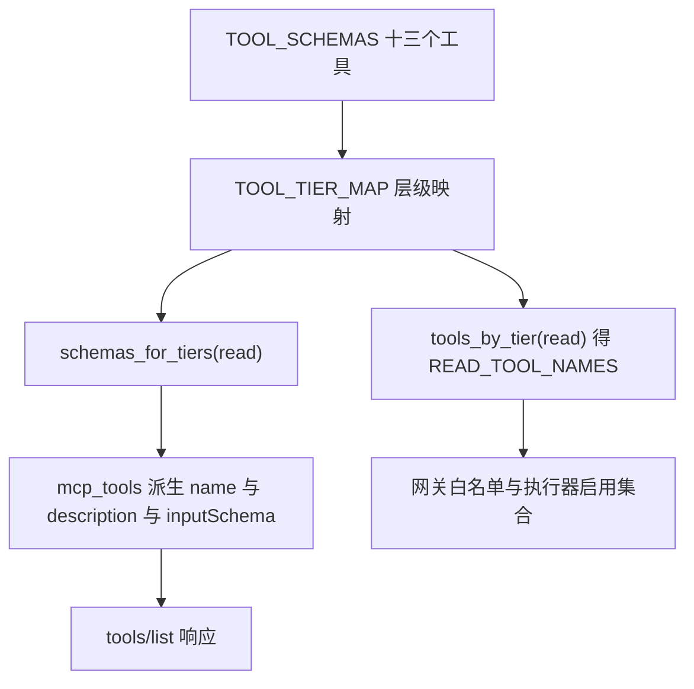
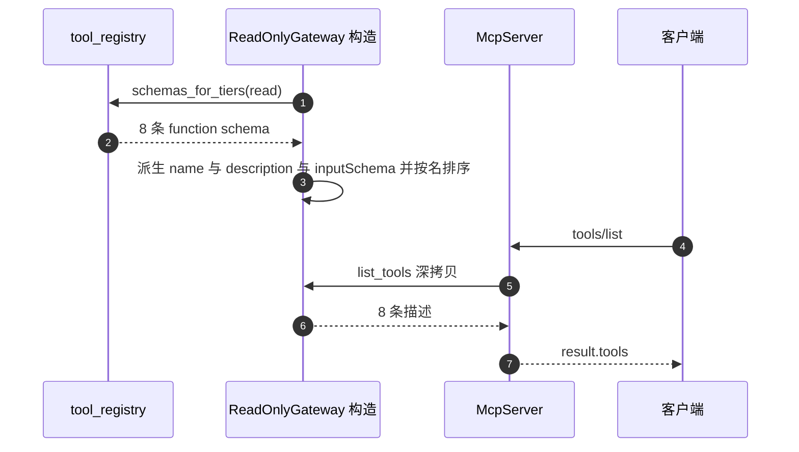

# 工具 schema 的三段结构与层级来源

MCP 的 `tools/list` 返回的每个元素只有三个字段：`name`、`description`、`inputSchema`（`backend/mcp/gateway.py`）。这三个字段没有独立维护，而是从 Agent 侧的注册表逐字段派生。注册表里的 schema 写成 OpenAI function calling 的形状，外层 `type`，内层 `function`，`function` 再分 `name`、`description`、`parameters`（`backend/agent/tool_registry.py`）。

两套格式的差别只在包装层：OpenAI 的 `function.parameters` 与 MCP 的 `inputSchema` 都是 JSON Schema 子集，代码直接深拷贝复用（`gateway.py`）。因此改注册表一处，Agent 上下文与 MCP 客户端同时生效。这也是把 schema 拆出到注册表的动机之一：原先它和执行分支写在一个类里，MCP 导出要遍历注册表而不是复制一遍工具定义（`tool_registry.py`）。

把工具定义收敛成一份带类型描述的 schema，是让模型能用工具的前提：模型看不到函数签名，只能靠 `description` 与 `inputSchema` 决定调哪个工具、传什么参数。因此 schema 不只是文档，而是接口契约；两端共用同一份，才能避免「描述改了、执行没改」的漂移。

参数校验与返回值结构属于相邻两页。

## schema 的三段结构

每个工具是一个字典，形状固定（以 `search_similar_cards` 为例，`backend/agent/tool_registry.py`）：

```python
{
    "type": "function",
    "function": {
        "name": "search_similar_cards",
        "description": "在本会话已有卡片中语义搜索。...",
        "parameters": {
            "type": "object",
            "properties": {
                "query": {"type": "string", "description": "..."},
                "limit": {"type": "integer", "description": "...", "default": 5},
                "threshold": {"type": "number", "description": "...", "default": 0.35},
            },
            "required": ["query"],
        },
    },
}
```

| 层级 | 字段 | 作用 |
| --- | --- | --- |
| 外层 | `type` | 固定 `function`，兼容 OpenAI 工具调用格式 |
| `function` | `name` | 工具唯一标识，映射与调用都用它 |
| `function` | `description` | 给模型读的用途说明与调用时机 |
| `function` | `parameters` | JSON Schema 子集，描述入参 |

没有 `required` 的工具（例如 `list_cards`、`get_card_tree`、`assess_knowledge_base`）表示零必填参数，参数对象可以为空（`tool_registry.py` 里这几个工具的 schema）。

## 十三个工具与三个层级

`TOOL_SCHEMAS` 共十三个工具（`tool_registry.py`），层级映射单独列在 `TOOL_TIER_MAP` 里，每条都要手工登记：

| 层级 | 数量 | 工具 |
| --- | --- | --- |
| read | 8 | search_similar_cards、get_card_info、get_linked_cards、list_cards、get_card_tree、assess_card_quality、assess_knowledge_base、assess_exploration_need |
| prescribe | 1 | plan_knowledge_gaps |
| write | 4 | search_by_keyword、expand_from_card、refresh_card、link_card |

三个层级在注册表文档里各有定义：read 不改知识库也不消耗 AI 调用；prescribe 只读但消耗一次 AI 调用；write 会联网或改动卡片与链接。MCP 网关只导出 read 层，处方与写层永不注册（`backend/mcp/gateway.py`）。

未登记的工具名在 `tool_tier` 里按 read 处理，注释写明这是保守选择：不会因为未知工具而放宽权限。这条兜底与 MCP 网关的“拒绝非 read 层”断言方向一致，都倾向于收紧。

## 描述文本承担的选择逻辑

`description` 不是注释，它是模型选择工具的主要依据。八条 read 描述里写的是“什么时候用”：

| 工具 | 描述里的调用时机 | 来源 |
| --- | --- | --- |
| search_similar_cards | 查找已有知识的第一步，应始终优先调用 | `backend/agent/tool_registry.py` |
| get_card_info | 语义搜索命中后读取完整内容 | 同上 |
| get_linked_cards | 扩展上下文、了解相关主题 | 同上 |
| list_cards | 问“有哪些卡片”或知识库概览时 | 同上 |
| get_card_tree | 决定挂载位置、评估薄弱层、选择扩展源卡 | 同上 |
| assess_card_quality | 找最薄弱卡片 | 同上 |
| assess_knowledge_base | 判断优先补哪个主题域 | 同上 |
| assess_exploration_need | 联网前评估必要性 | 同上 |

写层描述更长，因为要约束使用条件。例如 `refresh_card` 的描述写明“最后手段，触发条件非常严格，通常不调用”，`search_by_keyword` 的描述要求歧义短词自带领域限定。这些文字直接进入模型上下文，改描述等同于改决策规则。

MCP 客户端把这些描述原样展示给它的模型，因此描述必须自包含：客户端没有 Agent 的提示词上下文，仅凭 `tools/list` 的文本决定调用。跨端复用时，描述里不应依赖只有本仓库才懂的约定。

## JSON Schema 子集的字段清单

`parameters` 用到的字段只有五个，都在校验函数里有对应实现（`backend/mcp/gateway.py`）：

| 字段 | 出现位置举例 | 校验行为 |
| --- | --- | --- |
| `type` | 每个属性 | 映射到 Python 类型，整数与布尔区分 |
| `properties` | 每个工具 | 属性集合，决定“未知参数”判据 |
| `required` | 有必填的工具 | 缺失即 `-32602` |
| `default` | `limit`、`threshold` | 缺失时填入 |
| `enum` | `link_card.parent` | 取值必须在列表内 |

类型映射只覆盖六种：字符串、整数、数字、布尔、对象、数组（`gateway.py`）。布尔是整数的子类，校验函数对期望为 integer 或 number 的值额外排除布尔，避免 `limit=True` 通过。没有 `$ref`、`oneOf`、`additionalProperties` 等复杂关键字，超出六种类型的 schema 会被当作“无类型约束”跳过类型检查。



## 从注册表到 MCP 清单的字段映射

派生函数只取三个字段并做一次深拷贝（`backend/mcp/gateway.py` 的 `mcp_tools`，主干如下）：

```python
for schema in registry.schemas_for_tiers(READ_TIERS):
    fn = schema["function"]
    tools.append({
        "name": fn["name"],
        "description": fn.get("description", ""),
        "inputSchema": copy.deepcopy(fn.get("parameters") or {"type": "object", "properties": {}}),
    })
tools.sort(key=lambda t: t["name"])
```

| MCP 字段 | 来源 | 处理 |
| --- | --- | --- |
| `name` | `function.name` | 直接取 |
| `description` | `function.description` | 缺失时为空串 |
| `inputSchema` | `function.parameters` | 深拷贝，缺失时补空对象 schema |

最后按名字排序，保证 `tools/list` 顺序稳定。网关构造时把结果存成字典，`list_tools` 每次返回深拷贝，客户端改不动内部状态。

回归测试断言 `inputSchema` 与注册表的 `parameters` 完全相等（`tests/backend/test_mcp_server.py`），这把“派生而非手写”的约束固定下来。若以后在派生时做字段改名，这条断言会失败，提醒改动者同步更新两端的文档与客户端。



## 别名表与工具名容错

模型可能把工具名说错，注册表准备了一张别名表（`backend/agent/tool_registry.py`）：

| 别名 | 实际工具 |
| --- | --- |
| `get_card` | `get_card_info` |
| `search_keyword` | `search_by_keyword` |
| `link_cards` | `link_card` |
| `assess_exploration` | `assess_exploration_need` |
| `search_similar` | `search_similar_cards` |

解析顺序是精确匹配优先，再查别名（`backend/agent/tools.py`）。`get_card` 没有同时映射到 `get_card_info` 与 `get_card_tree`，注释说明这是为了避免歧义（`tool_registry.py`）。别名机制只存在于 Agent 侧的执行器里；MCP 网关的白名单按精确名字判断，客户端传别名会得到 `-32601`。

## 易错点

1. 手写 MCP 清单。它从注册表派生，手写会与执行器启用集合脱节。
2. 新增工具只加 schema 不登记层级。`tool_tier` 会把未登记名当 read 层，可能让写工具进入只读导出集。
3. 在 `parameters` 里用复杂 JSON Schema 关键字。校验只覆盖六种类型与 enum。
4. 认为描述只是文档。它直接进入模型上下文，决定工具选择。
5. 在 MCP 客户端传别名。别名只在 Agent 执行器里生效。
6. 期待 `tools/list` 顺序随意。派生时按名字排序。

## 小结

### 核心概念

| 概念 | 取值或做法 | 来源 |
| --- | --- | --- |
| schema 外层 | `type: function` | `backend/agent/tool_registry.py` |
| schema 内层 | name、description、parameters | 同上 |
| 工具数量 | 13，其中 read 层 8 | `TOOL_TIER_MAP` |
| MCP 清单字段 | name、description、inputSchema | `backend/mcp/gateway.py` |
| 层级未登记 | 按 read 处理 | `tool_registry.py` |
| 参数关键字 | type、properties、required、default、enum | `gateway.py` |
| 别名 | 5 条，仅 Agent 侧生效 | `tool_registry.py`、`tools.py` |

### 设计权衡

| 决策 | 收益 | 代价 |
| --- | --- | --- |
| schema 集中到注册表 | 一处改动两端生效 | 注册表变大，层级需手工同步登记 |
| 复用 OpenAI parameters 作 inputSchema | 零转换代码 | 两端只能使用共同子集 |
| 描述写满调用时机 | 模型选择更准 | 描述变长，占上下文 |
| 未登记名按 read 处理 | 不会因未知工具放宽权限 | 新增写工具漏登记时会被误判为只读 |
| 别名只放 Agent 侧 | MCP 白名单判断简单 | 两端容错行为不一致 |

## 练习

### 基础题

1. 写出 schema 的三段结构，并说明 MCP 清单取了哪三个字段。
2. 列出 read 层的八个工具与 write 层的四个工具，说明分层依据。
3. 说明未登记层级的工具会得到什么权限，以及这种兜底的风险。

### 挑战题

4. 新增一个只读工具，列出需要改动的三处（schema、层级、测试）与只读网关会自动生效的原因。
5. 把 alias 表接入 MCP 网关，分析对白名单判断、错误消息与两端一致性的影响。
6. 为 schema 写一个静态检查：确保每个 read 层工具的 `parameters` 只使用五种受支持关键字，说明实现方式与漏报场景。

### 附：本页引用的路径

| 路径 | 用途 |
| --- | --- |
| `backend/agent/tool_registry.py` | 十三个 schema、层级映射与别名|
| `backend/agent/tools.py` | 别名解析与工具名匹配|
| `backend/mcp/gateway.py` | schema 派生与参数关键字支持|
| `tests/backend/test_mcp_server.py` | schema 与清单一致性断言|
| `backend/mcp/__init__.py` | 只读导出与手写实现说明|
