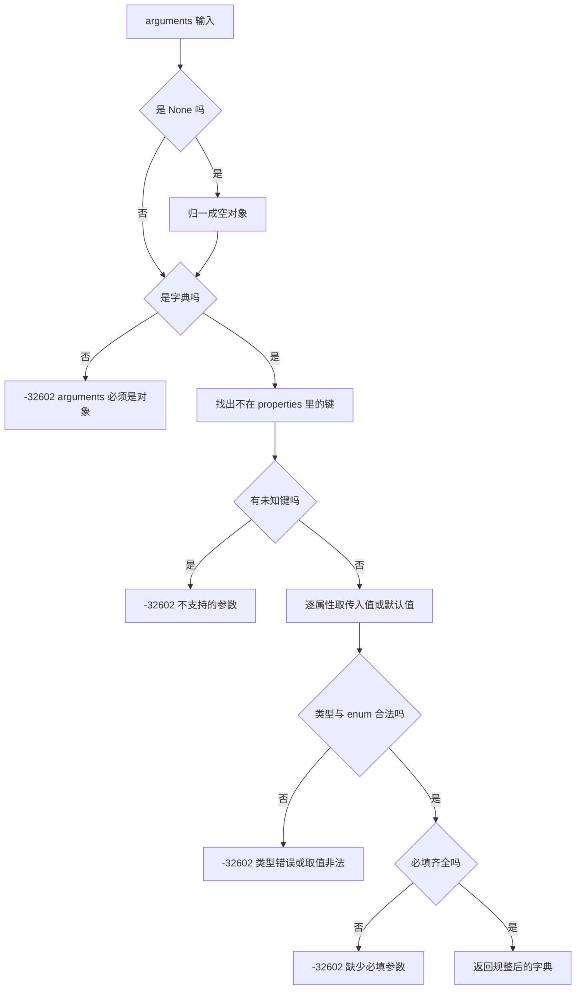
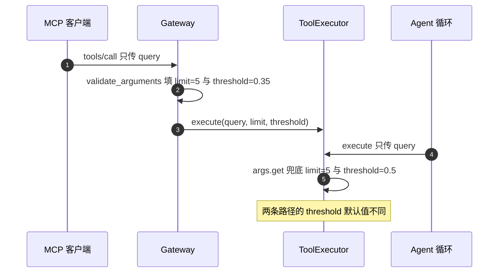

# 参数校验与默认值的两条路径

同一份 schema 被两条调用链消费：MCP 客户端调用经过 `validate_arguments`，Agent 循环调用经过执行器里的 `args.get` 兜底。两条路径都读同一份 `parameters`，但对默认值、未知参数与类型错误的处理并不相同。MCP 路径是严格校验，未知参数直接拒绝；Agent 路径只取自己认识的键，多余键被忽略，参数缺失由各工具函数自己补默认值。

差异的根源是调用方不同。MCP 客户端是外部模型，参数由它生成，服务端必须假设输入不可信，因此在进入执行器前做一次结构化校验（`backend/mcp/gateway.py`）。Agent 循环的模型输出先经过提示词约束与执行器的模糊匹配，历史实现选择了逐工具容错，把缺失参数补齐成“参数错误”文本让模型自我修正，而不是抛协议错误（`backend/agent/tools.py`）。

返回值结构在相邻一页。

## 校验的六步顺序

`validate_arguments` 的流程是顺序的，每一步失败都抛同一类异常（`backend/mcp/gateway.py`）：

| 顺序 | 检查 | 失败结果 |
| --- | --- | --- |
| 1 | `arguments` 为 None 时归一成空对象 | 不失败 |
| 2 | `arguments` 必须是字典 | `-32602` |
| 3 | 每个键必须在 `properties` 里 | `-32602`，列出可用参数 |
| 4 | 逐属性取传入值或默认值 | 无默认且未传的属性跳过 |
| 5 | 类型与 enum 校验 | `-32602`，消息含期望与实际类型 |
| 6 | 必填属性是否齐全 | `-32602`，列出缺失名字 |

顺序本身有语义：未知参数在类型检查之前被拦下，因此传一个拼错名字的参数会得到“不支持的参数”而不是“缺少必填参数”。这条顺序让错误消息更接近问题本身，回归测试分别覆盖了未知参数与缺失必填两种情况（`tests/backend/test_mcp_server.py`）。



## 未知参数先于类型检查

第三步用的判据是“键不在 `properties` 里”（`backend/mcp/gateway.py`）。schema 里没有声明 `additionalProperties`，校验函数默认全部拒绝，这一点与 JSON Schema 的宽松默认相反。

拒绝消息会列出可用参数名，对有多个参数的工具很有用。零参数工具的可用参数列表为空，消息里写“可用参数: 无”。回归测试断言了这条消息包含“不支持的参数”（`tests/backend/test_mcp_server.py`）。

对 Agent 路径而言，未知键不会报错：各工具函数用 `args.get("query")` 这类写法取值，多余键自然被忽略。两端行为不同的直接后果是同一个错误参数在 MCP 客户端得到 `-32602`，在 Agent 循环里得到一次正常的工具执行。

## 类型映射与布尔排除

类型映射表只有六项（`backend/mcp/gateway.py`）：

| schema 类型 | 接受的 Python 类型 |
| --- | --- |
| `string` | `str` |
| `integer` | `int` |
| `number` | `int`、`float` |
| `boolean` | `bool` |
| `object` | `dict` |
| `array` | `list` |

这张表在源码里就是一个字典，键是 schema 里的类型名，值是允许的 Python 类型元组：

```python
_TYPE_MAP = {
    "string": (str,),
    "integer": (int,),
    "number": (int, float),
    "boolean": (bool,),
    "object": (dict,),
    "array": (list,),
}
```

`integer` 与 `number` 都接受 `int`，区别只在是否也接受 `float`。布尔需要单独处理：Python 里 `bool` 是 `int` 的子类，`True` 会被 `isinstance(value, int)` 判真，因此校验函数对期望不是 `bool` 的值显式返回假：

```python
def _type_ok(value, expected):
    if isinstance(value, bool) and expected != (bool,):
        return False
    return isinstance(value, expected)
```

回归测试用 `limit: True` 覆盖了这条（`tests/backend/test_mcp_server.py`）。schema 里未声明类型的属性会被跳过类型检查，只做存在性判断，这是子集实现的边界。

## 枚举与必填

枚举检查发生在类型检查之后（`backend/mcp/gateway.py`），判据是 `value not in enum_values`。目前只有 `link_card.parent` 使用枚举，取值 `"a"` 或 `"b"`（`backend/agent/tool_registry.py`）；而 `link_card` 属写层，MCP 网关不暴露它，因此枚举校验在当前暴露集合里没有实际使用者。测试用合成 schema 覆盖了这条路径（`tests/backend/test_mcp_server.py`）。

必填检查在最后，用的是规整后的字典（`gateway.py`）。因此带默认值的属性不会被误判为缺失，只有既无默认值又未传的必填项才会触发。消息列出所有缺失名字，一次调用能看到全部问题。

## 默认值填充的两条路径

MCP 路径的默认值来自 schema（`gateway.py`）。回归测试直接断言了填充结果：只传 `query` 调用 `search_similar_cards`，执行器收到的是带 `limit: 5` 与 `threshold: 0.35` 的完整参数（`tests/backend/test_mcp_server.py`）。

Agent 路径不走这个函数，默认值写在各工具函数里。`_search_similar` 的写法是：

```python
limit = args.get("limit", 5)
threshold = args.get("threshold", 0.5)
```

（`backend/agent/tools.py`）两处默认值并不一致：

| 参数 | schema 默认（MCP 路径） | 执行器兜底（Agent 路径） |
| --- | --- | --- |
| `limit` | 5 | 5 |
| `threshold` | 0.35 | 0.5 |

`threshold` 的两个数不同，且它的含义在接口层被当作另一个口径使用，这一处错位在相邻一页展开。这里先记住一个事实：同一个工具在两条链路上拿到的默认参数可能不同，核对行为要说明走的是哪条路径。



## 规整结果与执行器边界

校验函数的返回值是一个新字典，只含 schema 声明过的属性（`gateway.py`）。它的构造方式是先建空字典，逐属性写入传入值或默认值，因此顺序与 `properties` 的声明顺序一致，未声明的键不会出现。

这个字典直接传给执行器（`gateway.py`）。执行器侧的 `execute` 不会再做 schema 校验，它只按工具名分发（`backend/agent/tools.py`）。因此 MCP 路径的校验是唯一的严格关口；Agent 路径的严格性由各工具函数自己的参数检查提供，例如 `_search_similar` 对空 `query` 返回“参数错误：缺少 query”的失败结果（`tools.py`），这是一个 `success=False` 的返回值而不是协议错误。

## 易错点

1. 认为 `arguments` 缺失会报错。它被归一成空对象，再由必填检查决定结果。
2. 认为未知参数会被忽略。MCP 路径直接拒绝，Agent 路径才忽略。
3. 用 `True` 当整数参数。布尔被显式排除。
4. 认为未声明类型的属性不做检查。它跳过类型检查但仍在 `properties` 约束内。
5. 认为两条路径默认值一致。`threshold` 在 schema 是 0.35，在执行器是 0.5。
6. 认为执行器会再校验一次参数。校验只在网关里做。

## 小结

### 核心概念

| 概念 | 取值或做法 | 来源 |
| --- | --- | --- |
| 校验入口 | `validate_arguments(schema, arguments)` | `backend/mcp/gateway.py` |
| 未知参数 | 拒绝并列出可用参数 | `validate_arguments` 的未知键检查 |
| 类型表 | 六种类型 | `_TYPE_MAP` |
| 布尔排除 | `bool` 不算 integer 或 number | `_type_ok` |
| 枚举 | 目前仅 `link_card.parent` 使用 | `tool_registry.py` |
| 必填检查 | 在规整后执行 | `gateway.py` |
| MCP 默认值 | 来自 schema 的 `default` | `validate_arguments` 的取默认值分支；测试 `tests/backend/test_mcp_server.py` |
| Agent 兜底 | `args.get` 逐工具写死 | `backend/agent/tools.py` |

### 设计权衡

| 决策 | 收益 | 代价 |
| --- | --- | --- |
| MCP 侧严格拒绝未知参数 | 外部模型输入可控 | 与 Agent 侧行为不一致 |
| 只支持六种类型 | 实现短，覆盖现有 schema | 复杂 schema 关键字失效 |
| 必填检查放最后 | 一次报出全部缺失 | 消息里不区分“缺默认”与“漏必填” |
| Agent 侧逐工具兜底 | 错误可被模型自我修正 | 默认值分散，两处容易漂移 |
| 校验只在网关做 | 执行器简单 | Agent 路径没有结构化校验 |

## 练习

### 基础题

1. 列出校验的六步顺序，说明未知参数为什么在类型检查之前。
2. 写出类型映射表，并解释 `True` 作为 `limit` 被拒绝的原因。
3. 对比 `threshold` 在两条路径上的默认值，指出差异来源。

### 挑战题

4. 让 Agent 路径复用 `validate_arguments`，分析对现有工具函数、错误消息与测试的影响。
5. 给校验函数补上 `additionalProperties` 与数组元素类型的支持，说明实现方式与需要补的测试。
6. 写一个校验用例集，覆盖 None、非字典、未知键、类型错、枚举错与缺必填，并写出每条的期望消息要点。

### 附：本页引用的路径

| 路径 | 用途 |
| --- | --- |
| `backend/mcp/gateway.py` | 校验实现与错误码|
| `backend/agent/tools.py` | Agent 侧默认值与参数错误处理|
| `backend/agent/tool_registry.py` | schema 默认值与枚举|
| `tests/backend/test_mcp_server.py` | 校验与默认值断言|
| `backend/mcp/server.py` | 错误响应的装配|
