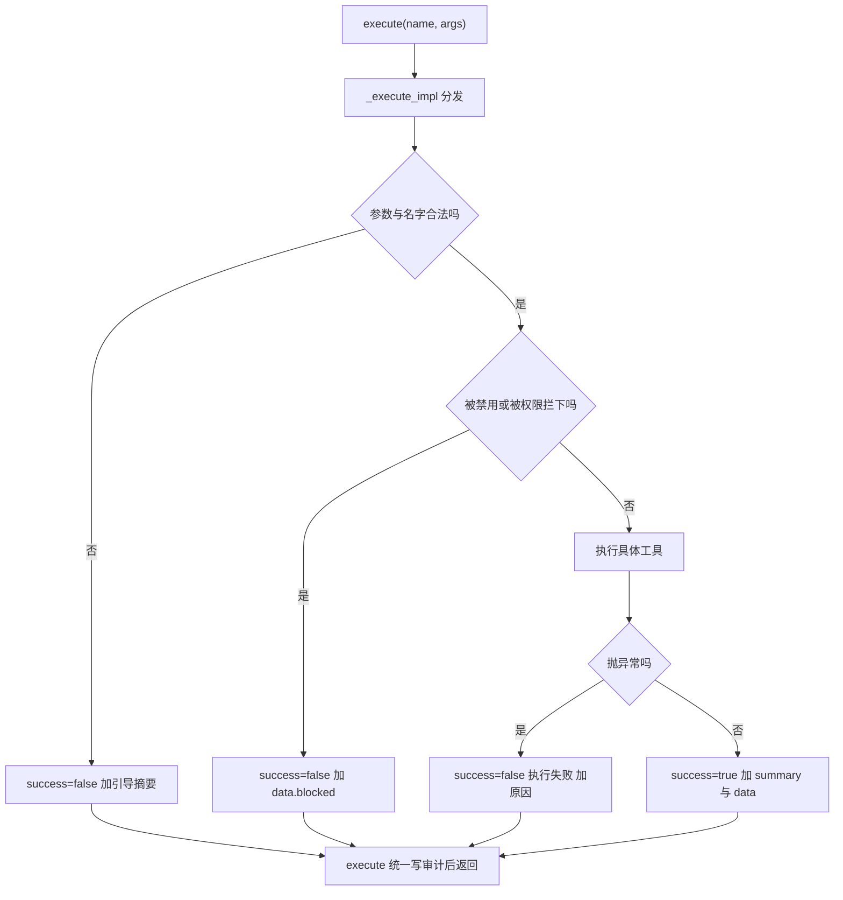
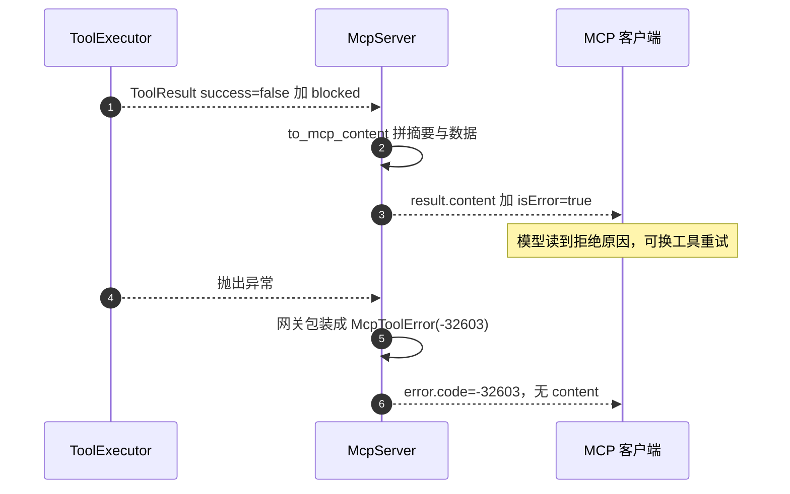

# ToolResult 字段与 isError 映射

工具执行器对外只有一个返回类型：`ToolResult`，四个字段 `tool`、`success`、`summary`、`data`（`backend/agent/schemas.py`）。它既是 Agent 循环的返回值，也是 MCP `tools/call` 的内容来源。执行器内部把绝大多数失败都写成 `success=False` 的返回值，而不是抛异常，因此 MCP 侧看到的多数“失败”都是 `result.isError = true` 而不是 JSON-RPC 错误。

这套设计的目标是让模型能看到失败原因并自我修正。摘要文本里写的是“缺少 query，请重新调用并传入 query”“未知工具，可用工具有……”这类引导语（`backend/agent/tools.py`）。如果改成抛异常，MCP 客户端只会拿到一个 `-32603`，模型看不到下一步该怎么做。

阈值与包裹等跨层口径在相邻一页。

## ToolResult 的四个字段

模型定义只有四行（`backend/agent/schemas.py`）：

```python
class ToolResult(BaseModel):
    tool: str
    success: bool
    summary: str
    data: Optional[dict[str, Any]] = None
```

| 字段 | 类型 | 含义 |
| --- | --- | --- |
| `tool` | 字符串 | 实际执行的工具名，可能经过别名归一 |
| `success` | 布尔 | 业务成功标志 |
| `summary` | 字符串 | 面向模型或用户的文本，必须可读 |
| `data` | 可选字典 | 结构化附属数据，可为空 |

`summary` 是必填的，即使失败也要给文本。`data` 是自由字典，不同工具放不同键：搜索放 `count` 与 `cards`（`tools.py`），树放 `tree`，拒绝放 `blocked`、`reason` 等。没有统一的 `data` schema，这一点决定了 MCP 侧只能把 `data` 序列化进文本。

## 执行器把失败写成返回值

`_execute_impl` 的失败分支全部返回 `ToolResult`（`backend/agent/tools.py`）：

| 失败场景 | 返回内容 | 位置 |
| --- | --- | --- |
| LLM 参数不是合法 JSON | `success=False`，摘要含原文片段与重试指引 | `_execute_impl` 的 JSON 解析失败分支 |
| 工具名未知且无法模糊匹配 | `success=False`，摘要列出全部可用工具 | `_execute_impl` 的未知工具分支 |
| 工具被实验开关禁用 | `success=False`，摘要说明实验模式已禁用 | `_execute_impl` 的实验开关分支 |
| 权限模式禁用该层 | `success=False`，`data.blocked=True` 与层级 | `_execute_impl` 的权限拒绝分支 |
| 连续三次联网搜索 | `success=False`，`data.blocked=True` 与计数 | `_execute_impl` 的联网次数限制分支 |
| 执行抛出异常 | `success=False`，摘要是“执行失败: 原因” | `_execute_impl` 的异常捕获分支 |

只有最后一类来自异常，其余都在业务逻辑里被判断成失败。异常被宽捕获后不重抛，日志里记一行错误，返回值里只放异常文本，不带堆栈。

成功分支的形状与失败分支对称：`success=True`，摘要给出可读结果，`data` 放结构化内容。搜索结果的结构是逐卡一条，含 `id`、`title`、`score` 与质量信息。



## blocked 数据契约

拒绝类失败在 `data` 里放三个键：`blocked`、`reason`，以及各自的补充字段（`backend/agent/tools.py` 的两个拒绝分支）：

| `reason` | 触发 | 补充字段 |
| --- | --- | --- |
| `permission` | 权限模式禁用该层 | `tier` |
| `write_streak` | 连续三次联网搜索 | `write_streak` |

`blocked` 是审计与上层判断的判据：`execute` 写审计时取 `(result.data or {}).get("blocked")`。它不是协议字段，MCP 客户端只在文本里看到拒绝原因，看不到 `blocked` 这个键——因为 `data` 会被序列化进文本而不是作为结构化字段传递。

这一层契约的意义在于区分“失败”与“被拒绝”：搜索无结果也是 `success=True`（`tools.py`），而权限拒绝是 `success=False` 加 `blocked`。上层统计工具失败率时，两种要分开算。

## 文本拼装：摘要加数据

MCP 侧的内容转换把两个字段拼成文本（`backend/mcp/server.py`）：

```python
success, summary, data = _result_fields(result)
text = summary
if data:
    rendered = json.dumps(data, ensure_ascii=False, default=str, indent=None)
    text = f"{text}\n\n{rendered}" if text else rendered
if not text:
    text = "（工具执行完成，无文本输出）"
```

`_result_fields` 同时兼容 `ToolResult` 对象与普通字典：对对象用 `getattr`，对字典用 `get`，并且都给了默认值（`success` 默认真，`summary` 默认空串）。这让 MCP 层可以直接接非 `ToolResult` 的执行器，测试里的假执行器返回的就是 `ToolResult`，两条路径都被覆盖。

序列化用 `ensure_ascii=False` 保留中文，`default=str` 兜住非 JSON 类型，`indent=None` 压成一行。压行是为了节省上下文：`tools/list` 与 `tools/call` 的文本都会进入客户端模型的上下文，格式尽量紧凑。

摘要为空且数据为空时写一句占位文本。这保证 `content` 永远非空——MCP 的内容数组若为空，部分客户端会认为响应不合法。

## isError 的判定边界

`to_mcp_content` 的返回值是一个二元组：内容数组与 `isError`（`backend/mcp/server.py`）：

```python
return [{"type": "text", "text": text}], (not success)
```

`isError` 直接取 `success` 的反值，没有别的判据。因此执行器里“搜索无结果”“没有关联卡片”这类 `success=True` 的结果都算成功，只有显式写成失败的返回值算 `isError`。回归测试用 `success=False` 的 `ToolResult` 断言 `isError` 为真（`tests/backend/test_mcp_server.py`）。

模块文档把错误分成两类：协议、参数、越权走 JSON-RPC `error`；工具自身执行失败走 `result.isError`（`backend/mcp/server.py`）。实际还有第三条：执行器抛出的异常在网关里被包装成 `-32603`（`backend/mcp/gateway.py`）。这一条与执行器内部的宽捕获叠加后很少触发，但契约上仍然存在。



## Agent 与 MCP 两种信封

同一个 `ToolResult` 在两端的去向不同：

| 维度 | Agent 循环 | MCP 客户端 |
| --- | --- | --- |
| 载体 | `ToolResult` 对象 | JSON-RPC 响应 |
| 文本 | `summary` 直接进对话 | `content[0].text`，摘要加数据 |
| 结构化数据 | `data` 可直接读取 | 被序列化进文本 |
| 失败 | `success=False` 由循环处理 | `result.isError` 或 `error` |
| 拒绝原因 | `data.blocked` 可判别 | 只在文本里 |

MCP 客户端拿不到结构化字段，这是本实现的选择。若要让客户端按字段分支，需要把 `data` 放进额外的内容类型或较新规范的 `structuredContent`，目前未实现。

## 审计记录的字段

审计开启时，`execute` 在返回前记一条记录（`backend/agent/tools.py`）：

| 字段 | 来源 |
| --- | --- |
| `tool` | `result.tool` |
| `tier` | `tool_tier(result.tool)` |
| `success` | `result.success` |
| `blocked` | `data.get("blocked")` |
| `reason` | `data.get("reason")` |
| `username`、`session_id` | 从 `api` 对象读取 |

开关默认关闭，关闭时 `record_audit` 是纯 no-op（`backend/agent/tool_registry.py`）。审计记录只反映执行器视角，MCP 协议层的错误（`-32601`、`-32602`）发生在网关，不经过执行器，因此不会出现在审计日志里。

## 易错点

1. 认为失败都抛异常。执行器把失败写成返回值，只有意外异常才被包装。
2. 把 `isError` 当协议错误。它是 `result` 里的布尔字段，与 `error` 互斥。
3. 期待 MCP 客户端收到 `data`。它被拼进文本，不是结构化字段。
4. 把“搜索无结果”当失败。它是 `success=True`。
5. 在审计日志里找参数校验失败。校验在网关，发生在执行器之前。
6. 认为占位文本不会出现。摘要与数据都空时它保证 `content` 非空。

## 小结

### 核心概念

| 概念 | 取值或做法 | 来源 |
| --- | --- | --- |
| 返回类型 | `ToolResult(tool, success, summary, data)` | `backend/agent/schemas.py` |
| 失败表达 | 多数失败是 `success=False` 返回值 | `backend/agent/tools.py` |
| 拒绝契约 | `data.blocked`、`reason`、补充字段 | `_execute_impl` 的两个拒绝分支 |
| 内容拼装 | 摘要加空行加 JSON 数据 | `backend/mcp/server.py` |
| 占位文本 | 两者都空时使用 | `to_mcp_content` 的占位分支 |
| `isError` | `not success` | `to_mcp_content` 的返回值 |
| 异常路径 | 网关包装成 `-32603` | `backend/mcp/gateway.py` |
| 审计字段 | tool、tier、success、blocked、reason、身份 | `backend/agent/tools.py` |

### 设计权衡

| 决策 | 收益 | 代价 |
| --- | --- | --- |
| 失败写成返回值 | 模型能看到原因并修正 | 客户端要区分 `isError` 与协议错误 |
| 摘要必填 | 失败也有可读输出 | 实现者要写引导语 |
| `data` 自由字典 | 各工具自定结构 | 客户端拿不到结构化字段 |
| 文本压成一行 | 节省上下文 | 人工阅读可读性下降 |
| 审计只覆盖执行器 | 实现简单 | 协议层错误不在审计里 |

## 练习

### 基础题

1. 写出 `ToolResult` 的四个字段，说明哪个字段可空、哪个字段必填。
2. 列出三种失败场景，并说明它们分别走 `isError` 还是 `-32603`。
3. 说明 `blocked` 与 `reason` 出现在什么情况下，以及 MCP 客户端能否读到它们。

### 挑战题

4. 把 `data` 作为结构化内容同时返回给 MCP 客户端，说明消息结构变化与兼容性处理。
5. 为“搜索无结果”与“权限拒绝”设计不同的客户端提示，分析 `success` 判据是否需要增加区分字段。
6. 设计一组返回结构测试，覆盖成功、业务失败、权限拒绝、异常与空摘要空数据五种情况，写出每条的期望信封字段。

### 附：本页引用的路径

| 路径 | 用途 |
| --- | --- |
| `backend/agent/schemas.py` | `ToolResult` 定义|
| `backend/agent/tools.py` | 失败分支、拒绝数据与审计|
| `backend/mcp/server.py` | 内容拼装与 `isError` 判定|
| `backend/mcp/gateway.py` | 执行异常包装|
| `backend/agent/tool_registry.py` | 审计开关与层级查询|
| `tests/backend/test_mcp_server.py` | `isError` 与错误分流断言|
