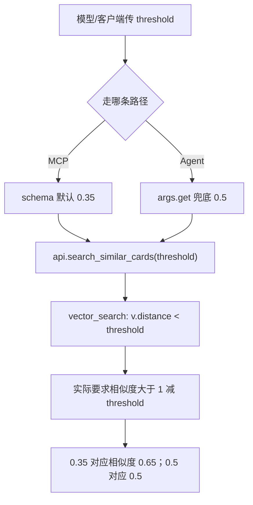
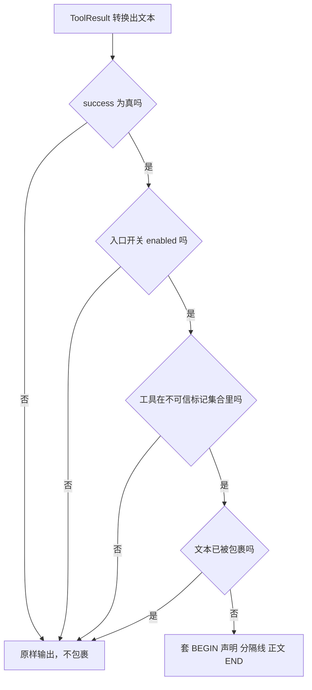

# 阈值口径错位与出站文本包裹

schema 与实现之间有两处数值口径不一致：`threshold` 在工具描述里是相似度门槛，在底层是余弦距离阈值；`limit` 在不同层有 5 与 10 两个默认值。它们不会被任何断言拦住，因为跨层调用只传数字，类型与范围都合法。结果是模型以为自己设了一个宽松的召回门槛，实际拿到的是严格得多的结果。

出站方向另有一层处理：工具返回的文本跨越 MCP 边界进入客户端模型的上下文，可能携带来自网页或卡片的外部内容，因此按开关可以套上不可信边界（`backend/mcp/server.py:80-105`）。这一层默认关闭以保持旧行为，开启后同一份 `ToolResult` 会产生带边界的文本。

换算结果由距离与相似度的关系推导得出。

## threshold 的两套口径

同一个参数名在两层有两种定义：

| 层 | 定义 | 默认值 | 来源 |
| --- | --- | --- | --- |
| 工具 schema | 相似度门槛（0~1），低于此值的卡片不返回 | 0.35 | `backend/agent/tool_registry.py:65` |
| 接口层 | 距离阈值，越小越相似 | 0.7 | `backend/pipeline/api.py:428`、`:438` |
| 向量层 | `v.distance < threshold` | 0.7 | `backend/storage/sqlite_card_store.py:436`、`:446` |

工具层的参数直接透传，没有换算（`backend/agent/tools.py:343-344`）：

```python
threshold = args.get("threshold", 0.5)
results = await self._api.search_similar_cards(query, limit=limit, threshold=threshold)
```

因此 schema 里的 0.35 最终作为距离阈值使用，含义从“相似度至少 0.35”变成“相似度至少 0.65”。把两套口径写成公式：

$$d = 1 - s \quad\Rightarrow\quad d_{\max} = 0.35 \iff s_{\min} = 0.65$$

描述文本承诺的 $s_{\min} = 0.35$ 对应 $d_{\max} = 0.65$，实际执行的是 $d_{\max} = 0.35$。两者在相似度上的差是 0.30。

MCP 路径由 schema 默认值填出 0.35（`backend/mcp/gateway.py:114-120`，测试 `tests/backend/test_mcp_server.py:195-198`）；Agent 路径的兜底是 0.5（`tools.py:343`），对应 $s_{\min} = 0.50$。两条路径都比描述更严格，MCP 路径最严。



## 错位带来的召回影响

错位的方向是“比描述更严格”，因此不会误召回，只会漏召回。对语义搜索这个工具而言，漏召回的后果是模型看到“本地知识库中未找到相关内容”（`backend/agent/tools.py:345-350`），进而转向联网搜索或直接放弃。

核对影响的步骤可以固定下来：

1. 取一个会话，用同一个查询跑 `search_similar_cards`，一次用 0.35、一次用 0.65，比较返回条数。
2. 若 0.35 的返回条数明显少于 0.65，说明参数确实按距离解释。
3. 再用工具返回的 `score` 与阈值对比：`score` 是相似度，若所有返回的 `score` 都大于 `1 - threshold`，即可确认口径。

第三步不需要改代码，是判断口径最直接的方法。修复方式有两类：在 tools 层把相似度换算成距离（`threshold = 1 - threshold`），或把接口层改成接收相似度。两种改法都要同步改描述，避免文档与实现再次分叉。

## limit 的两个默认值

| 位置 | 默认值 | 来源 |
| --- | --- | --- |
| 工具 schema | 5 | `backend/agent/tool_registry.py:64` |
| Agent 执行器兜底 | 5 | `backend/agent/tools.py:342` |
| 接口层 | 10 | `backend/pipeline/api.py:427` |
| 卡片搜索路由 | 10 | `backend/routes/cards.py:61`、`:75` |

MCP 与 Agent 两条路径最终都传 5，接口层的 10 只在直接调用 API 时生效。这一处的风险比 `threshold` 小：即使漏传，两条工具路径也是一致的 5。

## score 与 distance 的暴露差异

工具返回的 `score` 是相似度，不是距离（`backend/pipeline/api.py:457`）：

```python
"score": round(1.0 - dist, 4)
```

搜索结果的 `data.cards` 里每张卡带 `score`（`backend/agent/tools.py:355`），摘要里也会打印 `score`（`:364`）。于是同一个工具里出现两套词：入参 `threshold` 按距离解释，出参 `score` 按相似度解释，且数值方向相反。模型看到 `score=0.72` 与 `threshold=0.35`，很容易以为“远高于门槛”，实际门槛在相似度上是 0.65。

跨层核对清单可以压缩成三句话：入参阈值是距离上界，出参分数是相似度，两者的换算关系是 $s = 1 - d$。文档与 schema 若只写其中一个，就会留下这类错位。

## 出站包裹的开关层级

MCP 出站文本的包裹由三个开关共同决定（`backend/mcp/server.py:98-104`）：

```python
enabled = untrusted.entry_enabled("mcp") or untrusted.entry_enabled("tool_result")
if wrap is not None:
    enabled = bool(wrap)
if success and enabled and registry.returns_untrusted_text(tool) and not untrusted.is_wrapped(text):
    text = untrusted.wrap_tool_result_text(text, tool=tool, override=untrusted.ENTRY_ON)
```

| 开关 | 环境变量 | 默认 | 作用 |
| --- | --- | --- | --- |
| 主开关 | `KD_UNTRUSTED_WRAP` | legacy | 全局包裹模式（`backend/config.py:48-49`） |
| E4 工具结果入口 | `KD_UNTRUSTED_WRAP_TOOL_RESULTS` | inherit | 工具返回值跨 MCP 边界（`:53`） |
| E5 MCP 入口 | `KD_UNTRUSTED_WRAP_MCP` | inherit | MCP 资源文本（`:54`） |

`inherit` 表示跟随主开关，主开关为 legacy 时整条判据为假，文本原样输出。`entry_enabled` 的解析顺序是：显式覆盖、环境变量、配置常量，最后回落到 `resolve_mode()`（`backend/agent/untrusted.py:128-141`）。两个入口用逻辑或连接，任一个开启就包裹。

## 包裹的判据与形状

包裹还要求两个条件同时成立：工具被注册表标记为“返回值可能含外部派生文本”，且文本尚未被包裹（`backend/mcp/server.py:102`）。

标记集合包含全部十三个工具（`backend/agent/tool_registry.py:289-293`），查询函数 `returns_untrusted_text` 只做集合成员判断（`:296-298`）。覆盖全部工具的原因是它们都会返回卡片标题、内容或来源，这些内容源自抓取或模型生成，按外部派生处理更安全。

`is_wrapped` 只检查首尾边界标记（`backend/agent/untrusted.py:99-103`），避免重复包裹。包裹后的形状是：

```text
BEGIN
<声明>
来源: tool:<工具名>
---
<已中和边界的内容>
END
```

（`untrusted.py:75-96`）正文在包裹前会做边界标记中和，防止外部内容伪造 BEGIN/END 让模型误判边界（`:70-72`、`:92`）。

## 只在成功时包裹

判据的第一个条件是 `success`（`backend/mcp/server.py:102`），注册表注释解释了原因：错误与拒绝消息是本系统自己写的引导语，不含外部派生文本，不需要包裹（`backend/agent/tool_registry.py:287-288`）。

后果是同一个工具的两种返回在客户端侧形态不同：成功返回可能带边界，失败返回不带。客户端若按“是否带边界”判断内容可信度，需要同时考虑失败文本本身可信这一前提。这一点按设计意图标注，不是缺陷。



## 跨层核对清单

| 核对项 | 期望一致的内容 | 当前状态 |
| --- | --- | --- |
| `threshold` 语义 | schema 描述、接口 docstring、向量层 SQL | 不一致（相似度对距离） |
| `threshold` 默认值 | schema 0.35、执行器 0.5、接口 0.7 | 三处不同 |
| `limit` 默认值 | schema 5、执行器 5、接口 10 | 工具路径一致，接口层不同 |
| `score` 语义 | 出参文档与实际换算 | 一致（`1 - dist`） |
| 包裹开关 | config 常量、环境变量名、入口判据 | 一致 |
| 包裹标记集合 | 工具数量与判据 | 十三个工具全覆盖 |

前两行是当前实现里确实存在的错位，其余四行核对结果一致。把这张表放进改动检查清单，可以在改检索参数时避免只改一层。

## 易错点

1. 按 schema 描述理解 `threshold`。底层按距离解释，实际召回更严。
2. 认为两条路径默认值一致。0.35 与 0.5 不同，接口层还有 0.7。
3. 用 `threshold` 与返回的 `score` 直接比较。两者方向相反。
4. 认为出站文本一定被包裹。默认 legacy，两个入口都是 inherit。
5. 认为失败文本也会被包裹。判据要求 `success` 为真。
6. 重复包裹。`is_wrapped` 会拦下已带边界的文本。

## 小结

### 核心概念

| 概念 | 取值或做法 | 来源 |
| --- | --- | --- |
| schema 阈值语义 | 相似度门槛 0~1，默认 0.35 | `backend/agent/tool_registry.py:65` |
| 接口阈值语义 | 距离上界，默认 0.7 | `backend/pipeline/api.py:428`、`:438` |
| 向量层过滤 | `v.distance < threshold` | `backend/storage/sqlite_card_store.py:446` |
| 执行器兜底 | `args.get("threshold", 0.5)` | `backend/agent/tools.py:343` |
| 出参分数 | `1 - dist` | `backend/pipeline/api.py:457` |
| 包裹开关 | 主开关加两个入口，默认 legacy 与 inherit | `backend/config.py:48-54` |
| 包裹判据 | 成功、开关开启、工具标记、未包裹 | `backend/mcp/server.py:102` |
| 标记集合 | 十三个工具全覆盖 | `backend/agent/tool_registry.py:289-293` |

### 设计权衡

| 决策 | 收益 | 代价 |
| --- | --- | --- |
| 工具层透传阈值不换算 | 改动面小 | 描述与实现口径分叉 |
| 出参暴露相似度 | 对模型直观 | 与入参阈值方向相反 |
| 包裹默认关闭 | 既有行为逐字段不变 | 需显式开启才有防护 |
| 标记全部工具 | 不遗漏外部派生文本 | 可能包裹不含外部内容的文本 |
| 只在成功时包裹 | 错误引导语保持原样 | 客户端需知道失败文本可信 |

## 练习

### 基础题

1. 写出 `threshold` 在 schema 与接口层的两种语义，并给出 MCP 默认值对应的相似度下限。
2. 说明 `limit` 在四处默认值中的分布。
3. 列出包裹判据的四个条件，说明哪个条件决定失败文本不被包裹。

### 挑战题

4. 修掉 `threshold` 的口径错位：给出两种改法、改动点与需要同步更新的描述文本。
5. 设计一个不改代码的核对方案，用一次工具调用判断 `threshold` 按距离还是相似度解释。
6. 分析包裹开启后对客户端模型行为的影响，给出验证方法与回滚开关的组合。

### 附：本页引用的路径

| 路径 | 用途 |
| --- | --- |
| `backend/agent/tool_registry.py` | 阈值描述、limit 默认值与不可信标记集合（:59-70、:287-298） |
| `backend/agent/tools.py` | 执行器兜底与结果字段（:342-369） |
| `backend/pipeline/api.py` | 接口层阈值与分数换算（:424-462） |
| `backend/storage/sqlite_card_store.py` | 距离过滤与默认阈值（:436-449） |
| `backend/routes/cards.py` | 路由侧默认值（:61、:75） |
| `backend/mcp/server.py` | 出站包裹判据（:80-105） |
| `backend/agent/untrusted.py` | 入口开关与包裹形状（:75-148） |
| `backend/config.py` | 包裹开关常量（:48-54） |
| `tests/backend/test_mcp_server.py` | 默认值填充断言（:195-198） |
