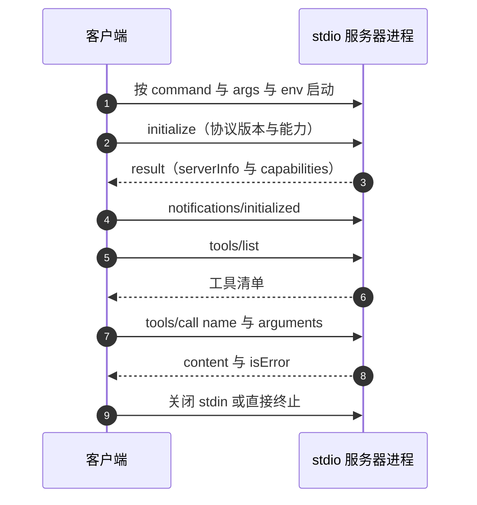
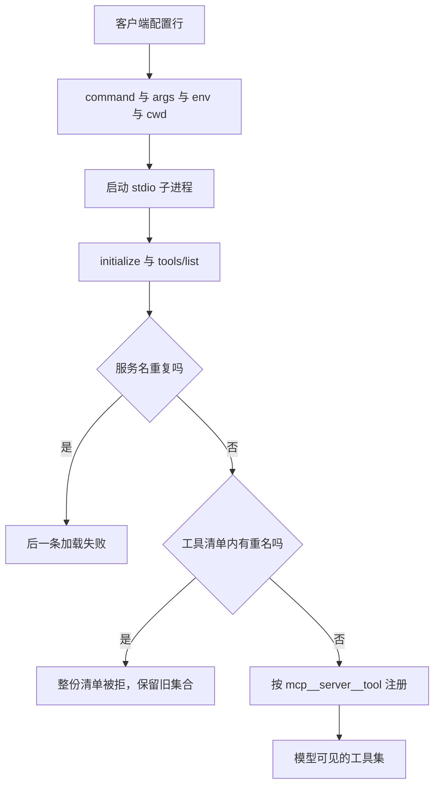

# 客户端如何拉起 stdio 服务器

stdio 传输的接入动作可以用一句概括：客户端按配置启动一个本机进程，通过它的标准输入输出交换 JSON-RPC 消息。没有端口、没有握手 URL、没有服务注册中心。本仓库的服务器按这个模型设计（`backend/mcp/stdio.py:49-51`），客户端侧则按各自的配置格式描述这条命令行。

客户端的差异集中在配置文件的形状与字段名上：Claude Desktop 用 `mcpServers`，dsh 用 profile 里的插件行，本仓库的爬虫服务还带一份通用的 `.mcp.json`。命令、参数、工作目录与环境变量的语义一致，都是启动子进程的参数。

## 一客户端一进程的连接模型

客户端的接入动作分四步：按配置启动进程、发 `initialize`、发 `tools/list`、之后按需 `tools/call`。



dsh 客户端在 stdio 传输下有一个额外步骤：官方 SDK 会先起一个临时探测进程确认能拉起，再起实际提供服务的进程（`node_modules/@deepseek-ai/dsh-mcp-client/README.md:28`）。这条行为对启动慢的服务器意味着启动阶段要付出两次进程创建的成本，对只读服务器（本仓库的 KnowledgeDiver 网关）影响很小，对需要拉起浏览器的服务器（爬虫）影响明显。

服务器侧不感知客户端数量：每个客户端各起一个进程，各自持有一份模块状态。本仓库的网关无跨进程共享状态，代价是嵌入模型在每个进程里各加载一份（见 22 领域相关单元）。

## 配置行的四个字段

客户端配置行的公共字段是四个（`README.md:59`）：

| 字段 | 作用 | 缺省 |
| --- | --- | --- |
| `command` | 可执行文件 | 必填 |
| `args` | 命令行参数数组 | 空 |
| `env` | 附加环境变量，合并到清理后的父环境之上 | 空 |
| `cwd` | 子进程工作目录 | 继承客户端 |

`env` 的合并语义需要单独记：客户端会先清理父进程环境，再叠加配置里的变量（`README.md:138`）。清理规则是丢弃名字匹配 `/KEY|PASSWORD|SECRET|TOKEN/i` 与 `DSH_*` 的环境变量，避免把宿主机的密钥透给第三方服务器。因此服务器需要的环境变量必须在配置里显式列出，不能指望从 shell 继承。

`cwd` 决定服务器里相对路径的解析基准。KnowledgeDiver 的配置把它设成仓库根，因为数据库与卡片目录按进程工作目录解析（`backend/mcp/examples/claude_desktop_config.json`）；爬虫的 `.mcp.json` 没有设 `cwd`，改为让启动脚本自己推导仓库根（`dsh-plugin/scripts/launch.sh:26-33`）。

## 工具命名空间

客户端侧的工具名由服务名与原始名拼成，dsh 的规则是 `mcp__<serverName>__<rawName>`（`README.md:75`）：

```text
serverName = better-crawler，rawName = fetch_url
公开名 = mcp__better-crawler__fetch_url
```

实现是一个纯函数（`lib/index.js:96-100`）：干净情况下逐字拼接；当服务名或原始名含不合法字符或被规范化时，拼接串会追加一段由 `(serverName, rawName)` 哈希出的短后缀，保证同一对身份得到同一个稳定名字，不同身份不会撞名（`:85-95`）。命名规则被当作 v1 契约固定下来，因为它直接影响会话历史与权限规则（`README.md:224`）。

本仓库爬虫的三个工具因此呈现为：

| 原始名 | 公开名 |
| --- | --- |
| `fetch_url` | `mcp__better-crawler__fetch_url` |
| `fetch_urls` | `mcp__better-crawler__fetch_urls` |
| `crawler_status` | `mcp__better-crawler__crawler_status` |

（`dsh-plugin/README.md:12-14`）服务端注册时用的是原始名 `fetch_url`（`src/better_crawler/mcp_server.py:63-70`），命名空间只加在客户端一侧。

## 冲突与更新规则

命名空间把同名工具隔离开，但同名的服务器与重复列出的工具另有规则（`README.md:77-81`）：

| 情况 | 结果 |
| --- | --- |
| 两个服务器都提供 `search` | 共存为 `mcp__a__search` 与 `mcp__b__search` |
| 两个配置行用同一个服务名 | 后加载的那条失败并报错 |
| 一个服务器重复列出同一工具 | 整个工具清单被拒，保持上一版工具集 |
| 更新与已注册工具名冲突 | 整次更新被拒，不产生部分工具集 |

最后两条的实现是注册前先查重，命中即抛错（`lib/index.js:131-132`）。这保证模型看到的工具集要么是完整的旧集合，要么是完整的新集合，不会出现半更新状态。

## 三种客户端的配置形态

| 客户端 | 入口文件 | 服务名 | 身份/参数 | 来源 |
| --- | --- | --- | --- | --- |
| Claude Desktop | `claude_desktop_config.json` | `knowledgediver` | `--username` 与 `--session` | `backend/mcp/examples/claude_desktop_config.json` |
| Cursor | `cursor_mcp.json` | `knowledgediver` | `--username`，会话走默认 | `backend/mcp/examples/cursor_mcp.json` |
| 通用客户端 | `.mcp.json` | `better-crawler` | 无身份参数，只有环境变量 | `/mnt/d/better-crawler-4-agent/.mcp.json:1-16` |
| dsh | profile 插件行 | `better-crawler` | 配置字段而非命令行 JSON | `dsh-plugin/cordis.patch.yml:21-37` |

三种形态的公共点是都把同一条命令行表达出来。差异在身份传递方式：KnowledgeDiver 需要用户名与会话，爬虫只需要环境变量。接入一个新服务器时，先确认它是否要求身份参数，再决定配置里是否要放 `--username` 这类参数。

服务器的自述名称与客户端的服务名是两回事：KnowledgeDiver 的 `serverInfo.name` 是 `knowledgediver-readonly`（`backend/mcp/server.py:34`），而配置里的键名与工具前缀用的是配置里的服务名。改其中一处不会同步另一处。



## 易错点

1. 指望从 shell 继承环境变量。父环境的密钥类变量会被清理，必须在 `env` 里显式声明。
2. 混淆服务器的 `serverInfo.name` 与客户端配置的服务名。工具前缀取后者。
3. 两个配置行写同一个服务名。后一条会加载失败。
4. 认为慢启动只付一次进程成本。stdio 传输会先起探测进程。
5. 在服务器侧改工具名。公开名由客户端拼装，改名会破坏历史与权限规则。
6. 忘记 `cwd`。依赖相对路径的服务器会读到错误的数据目录。

## 小结

### 核心概念

| 概念 | 取值或做法 | 来源 |
| --- | --- | --- |
| 连接模型 | 一客户端一子进程，stdio 交换 JSON-RPC | `backend/mcp/stdio.py:49-51` |
| 配置字段 | command、args、env、cwd | `@deepseek-ai/dsh-mcp-client/README.md:59` |
| 环境清理 | 丢弃密钥类与 `DSH_*` 变量 | `README.md:138` |
| 命名空间 | `mcp__<serverName>__<rawName>` | `README.md:75`、`lib/index.js:96-100` |
| 冲突规则 | 服务名重复失败、工具重名整份拒绝 | `README.md:77-81` |
| 命名契约 | v1 固定，影响历史与权限 | `README.md:224` |
| 探测进程 | stdio 协商先起临时进程 | `README.md:28` |

### 设计权衡

| 决策 | 收益 | 代价 |
| --- | --- | --- |
| 客户端一进程一会话 | 隔离彻底 | 每进程重复加载资源 |
| 服务名做命名空间 | 同名工具可共存 | 名字变长，前缀固定 |
| 名字带哈希兜底 | 非法字符也能得到稳定名 | 名字可读性下降 |
| 父环境清理 | 不泄漏宿主机密钥 | 必需变量须显式配置 |
| 更新整份替换 | 模型看不到半更新集合 | 一处冲突会回退整批 |

## 练习

### 基础题

1. 写出配置行的四个公共字段与 dsh 的环境清理规则。
2. 说明 `mcp__better-crawler__fetch_url` 的三段构成，以及服务端的原始名。
3. 列出三种工具集冲突情形及各自结果。

### 挑战题

4. 给爬虫服务器换一个服务名，列出需要同步改动的位置与对既有会话历史的影响。
5. 设计一个跨客户端的配置生成脚本，说明如何处理 `mcpServers` 与 profile 插件行两种格式。
6. 分析 stdio 探测进程对启动时间的影响，给出测量方案与是否应当关闭的判断依据。

### 附：本页引用的路径

| 路径 | 用途 |
| --- | --- |
| `node_modules/@deepseek-ai/dsh-mcp-client/README.md` | 客户端配置、命名空间与冲突规则（:28-93、:136-138、:224） |
| `node_modules/@deepseek-ai/dsh-mcp-client/lib/index.js` | 公开名实现与清单查重（:96-100、:131-132） |
| `backend/mcp/examples/claude_desktop_config.json` | KnowledgeDiver 的 Claude Desktop 配置 |
| `backend/mcp/examples/cursor_mcp.json` | KnowledgeDiver 的 Cursor 配置 |
| `backend/mcp/stdio.py` | 服务器侧 stdio 会话入口（:49-51） |
| `backend/mcp/server.py` | `serverInfo.name`（:34） |
| `/mnt/d/better-crawler-4-agent/.mcp.json` | 通用客户端配置样例（:1-16） |
| `dsh-plugin/cordis.patch.yml` | dsh 插件行（:21-37） |
| `dsh-plugin/README.md` | 工具名与安装说明（:5-35） |
| `src/better_crawler/mcp_server.py` | 服务端工具注册（:36-44、:63-124） |
| `dsh-plugin/scripts/launch.sh` | 启动脚本的仓库根推导（:26-39） |
