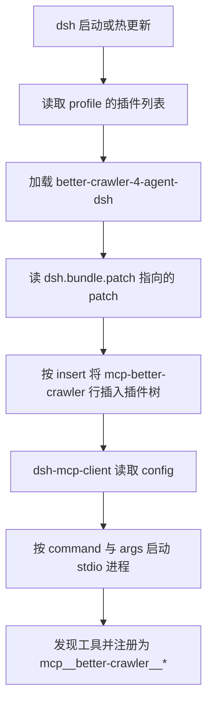
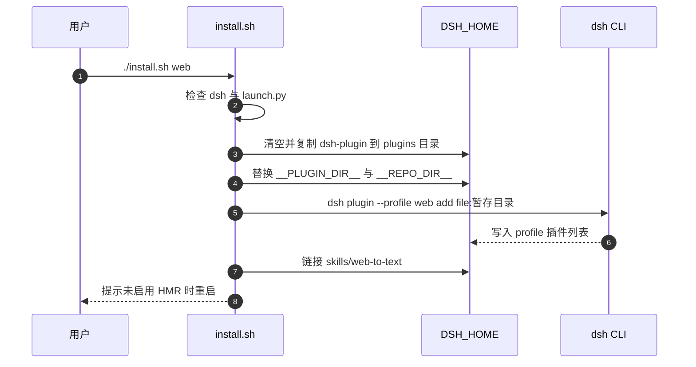

# dsh 插件包的声明与安装流程

dsh 的接入单位是插件包，而不是一份配置文件。一个包要声明自己是 bundle 并给出 patch 文件，dsh 在启动或热更新时把 patch 应用到 profile 的插件树上（`dsh-plugin/package.json`）。爬虫仓库的 `dsh-plugin` 目录就是这层适配：它不包含抓取逻辑，只写一条插入语句，把官方 MCP 客户端插件挂到 profile 根上。

这层适配的存在说明一个通用服务器的接入形态可以拆成两部分：服务器本体保持客户端中立，接入层按每个客户端写一遍。服务器本体的工具注册在相邻单元。

## 插件包的最小声明

包声明只有几行（`dsh-plugin/package.json`）：

```json
{
  "name": "better-crawler-4-agent-dsh",
  "private": true,
  "type": "module",
  "dsh": {
    "bundle": {
      "patch": "./cordis.patch.yml"
    }
  }
}
```

| 字段 | 作用 |
| --- | --- |
| `name` | 安装到 profile 时的包名 |
| `private` | 不发布到 npm |
| `dsh.bundle.patch` | 声明这是 bundle 并指向 patch 文件 |

没有 `dsh.bundle.patch` 的目录不会被 dsh 当成插件；爬虫仓库根目录就没有这个字段，因此它本身不是 dsh 插件（`dsh-plugin/README.md`）。这条边界决定了安装时不能把仓库根目录直接 `dsh plugin add`。

## patch 行的字段

patch 文件是一条插入语句，向 profile 根插入一个 MCP 客户端行（`dsh-plugin/cordis.patch.yml`）：

```yaml
- insert:
    - id: mcp-better-crawler
      name: '@deepseek-ai/dsh-mcp-client'
      config:
        serverName: better-crawler
        transport: stdio
        command: /bin/sh
        args:
          - __PLUGIN_DIR__/scripts/launch.sh
        env:
          PYTHONIOENCODING: utf-8
          PYTHONUTF8: '1'
          BETTER_CRAWLER_TIMEOUT: '25'
          BETTER_CRAWLER_MAX_CHARS: '50000'
        toolCallTimeoutMs: 180000
```

| 字段 | 取值 | 含义 |
| --- | --- | --- |
| `id` | `mcp-better-crawler` | 插件行的稳定地址，可被覆盖层按 id 关掉或改写 |
| `name` | `@deepseek-ai/dsh-mcp-client` | 提供 MCP 客户端能力的插件 |
| `serverName` | `better-crawler` | 工具名前缀 |
| `transport` | `stdio` | 用子进程传输 |
| `command` | `/bin/sh` | 先起 shell，再执行启动脚本 |
| `args` | 启动脚本路径 | 由暂存流程替换 |
| `env` | 四个变量 | 编码、抓取超时与正文上限 |
| `toolCallTimeoutMs` | `180000` | 单次调用上限，覆盖默认 60000 |

行是可寻址的：profile 自己的 patch 或 `--patch` 覆盖层能按 `mcp-better-crawler` 关掉它、改 `command` 或改超时，不必修改这个包（`cordis.patch.yml`、`dsh-plugin/README.md`）。这是把接入层做成声明式 patch 的收益：改配置不需要动服务器代码。



## 为什么必须暂存

stdio MCP 行要写启动器的绝对路径，而仓库可能 clone 在任何位置。占位符 `__PLUGIN_DIR__` 与 `__REPO_DIR__` 不是可用路径，直接注册会失败（`dsh-plugin/README.md`）。

安装脚本的应对是先把 `dsh-plugin/` 复制到 `$DSH_HOME/plugins/better-crawler-4-agent-dsh`，在副本里替换占位符，再注册副本（`dsh-plugin/install.sh`）。注册的是固定位置的副本，因此绝对路径不会随后续 clone 位置变化而失效。

启动脚本本身对未替换的情况也留了后路：仓库根按 `BETTER_CRAWLER_REPO`、脚本所在布局、暂存时写入的绝对路径三种顺序推导，都拿不到才报错退出（`dsh-plugin/scripts/launch.sh`）。这段推导的写法如下：

```sh
DERIVED=$(CDPATH= cd -- "$HERE/../.." 2>/dev/null && pwd || printf '')
if [ -n "${BETTER_CRAWLER_REPO:-}" ]; then
	REPO=$BETTER_CRAWLER_REPO
elif [ -n "$DERIVED" ] && [ -f "$DERIVED/scripts/launch.py" ]; then
	REPO=$DERIVED
else
	REPO=__REPO_DIR__
fi
```

前两个分支都不成立时，`REPO` 会落到占位符 `__REPO_DIR__`；紧接着的存在性检查发现启动器不存在，就打印提示让用户跑 `install.sh` 或设置环境变量，而不是留一个空指针式的报错。

## 安装脚本的三步

`install.sh` 接受一个参数：目标 profile，默认 `web`（`dsh-plugin/install.sh`）。流程是三步：

| 步骤 | 动作 | 对应操作 |
| --- | --- | --- |
| 1 | 暂存目录到 `$DSH_HOME/plugins/` | `rm -rf` 后 `cp -R` 到暂存目录 |
| 2 | 注册为 profile bundle | `dsh plugin --profile <profile> add file:<暂存目录>` |
| 3 | 链接技能到 `$DSH_HOME/skills` | `ln -sfn <仓库>/skills/web-to-text <DSH_HOME>/skills/web-to-text` |

替换命令针对两个文件（`cordis.patch.yml` 与 `scripts/launch.sh`），并在替换后给启动脚本加执行位。技能链接用了保护：目标已存在且不是符号链接时不覆盖，只打印提示，避免脚本覆盖用户自己放的同名技能。暂存、替换与注册这三步在 `install.sh` 里是这样写的：

```sh
STAGE=$DSH_HOME/plugins/better-crawler-4-agent-dsh

rm -rf "$STAGE"
mkdir -p "$(dirname -- "$STAGE")"
cp -R "$HERE" "$STAGE"
sed -i "s|__PLUGIN_DIR__|$STAGE|g; s|__REPO_DIR__|$REPO|g" \
	"$STAGE/cordis.patch.yml" "$STAGE/scripts/launch.sh"
chmod +x "$STAGE/scripts/launch.sh"

dsh plugin --profile "$PROFILE" add "file:$STAGE"
```

`sed -i` 是「就地编辑文件」：把两个占位符替换成本机真实路径，再写回原文件；`chmod +x` 补上启动脚本的执行位，否则 `/bin/sh` 能读它、直接执行却会失败。

脚本开头有两道前置检查：`dsh` 必须在 `PATH` 上，仓库根的启动器必须存在。检查失败直接退出，不留下半安装状态。

## 卸载与重装

卸载是三条命令：从 profile 移除包、删除暂存目录、删除技能符号链接（`dsh-plugin/README.md`）。第三步只在链接由脚本建立时才需要执行，文档里也标了这个前提。

重装不需要先卸载：脚本会先 `rm -rf` 暂存目录再复制（`install.sh`），因此重复执行会得到一份干净的副本。风险点是技能链接：如果上一次的链接还在，第二步会走“已存在且是符号链接”的分支，删除并重建。

配置生效时机取决于 HMR：启用时改动立即生效，未启用时需要重启 dsh（`dsh-plugin/README.md`）。安装脚本末尾的提示也是这个意思（`install.sh`）。



## 与通用配置形态的对照

同一台服务器在 dsh 与通用客户端下的接入写法不同，语义相同：

| 维度 | `.mcp.json` | dsh patch 行 |
| --- | --- | --- |
| 载体 | JSON 配置 | YAML 插入语句 |
| 服务名 | `mcpServers` 的键 | `config.serverName` |
| 命令 | `command` 与 `args` | `config.command` 与 `config.args` |
| 环境 | 直接列变量 | `config.env` |
| 调用超时 | 客户端默认 | `config.toolCallTimeoutMs` |
| 生效方式 | 客户端重启或重载 | HMR 或重启 |
| 覆盖方式 | 改配置文件 | 按行 id 的覆盖层 |

`.mcp.json` 里命令是 `python` 加 `scripts/launch.py`，dsh patch 里命令是 `/bin/sh` 加启动脚本（两个文件都在仓库里）。后者多了 shell 一层，因为启动脚本要处理解释器选择与路径转换，而不是直接执行 Python。

## 易错点

1. 把仓库根目录直接 `dsh plugin add`。根目录没有 `dsh.bundle.patch`，不是插件包。
2. 手工注册未替换占位符的 patch。启动器路径不是可用路径。
3. 认为安装后立即生效。取决于 profile 是否启用 HMR。
4. 忘了技能链接的前提。目标已存在且不是符号链接时脚本不覆盖。
5. 把 `id` 与服务名混为一谈。`id` 用于覆盖，服务名用于工具前缀。
6. 认为改超时要改包。覆盖层可按行 id 改。

## 小结

### 核心概念

| 概念 | 取值或做法 | 来源 |
| --- | --- | --- |
| 包声明 | `dsh.bundle.patch` 指向 patch | `dsh-plugin/package.json` |
| 插入行 | `id: mcp-better-crawler` | `dsh-plugin/cordis.patch.yml` 的 `insert` 段 |
| 客户端插件 | `@deepseek-ai/dsh-mcp-client` | `cordis.patch.yml` 里该行的 `name` 字段 |
| 暂存目录 | `$DSH_HOME/plugins/better-crawler-4-agent-dsh` | `install.sh` 的 `STAGE` 变量与暂存段 |
| 占位符 | `__PLUGIN_DIR__`、`__REPO_DIR__` | `install.sh` 的 `sed` 替换 |
| 技能链接 | `$DSH_HOME/skills/web-to-text` | `install.sh` 的技能链接段 |
| 生效时机 | HMR 或重启 | `dsh-plugin/README.md` |

### 设计权衡

| 决策 | 收益 | 代价 |
| --- | --- | --- |
| 接入层独立成包 | 服务器保持客户端中立 | 每个客户端各写一层 |
| patch 声明式插入 | 改配置不动代码 | 多一层 YAML 间接 |
| 安装先暂存 | 绝对路径稳定 | 磁盘上多一份副本 |
| 行可被覆盖 | profile 可关闭或改写 | id 成为需要维护的接口 |
| 技能单独链接 | 支持技能的会话可发现 | 多一步卸载清理 |

## 练习

### 基础题

1. 写出插件包声明 bundle 的字段与 patch 行的必填键。
2. 说明为什么安装脚本要先暂存再注册，以及占位符替换涉及哪两个文件。
3. 列出安装脚本的三步与各自的失败前置检查。

### 挑战题

4. 把这条 patch 行改成 Streamable HTTP 形态，列出字段变化与需要调整的启动逻辑。
5. 设计一个校验脚本：在安装后确认 patch 已替换、启动脚本可执行、技能链接正确，写出检查项与期望输出。
6. 分析按行 id 覆盖超时的两种做法（profile patch 与 `--patch` 覆盖层）的差异与冲突优先级。

### 附：本页引用的路径

| 路径 | 用途 |
| --- | --- |
| `dsh-plugin/package.json` | bundle 声明|
| `dsh-plugin/cordis.patch.yml` | 插入行与字段|
| `dsh-plugin/install.sh` | 暂存、替换与注册|
| `dsh-plugin/README.md` | 安装卸载与配置说明|
| `dsh-plugin/scripts/launch.sh` | 仓库根推导与失败提示|
| `/mnt/d/better-crawler-4-agent/.mcp.json` | 通用配置形态对照|
| `node_modules/@deepseek-ai/dsh-mcp-client/README.md` | 客户端插件字段与默认值|
