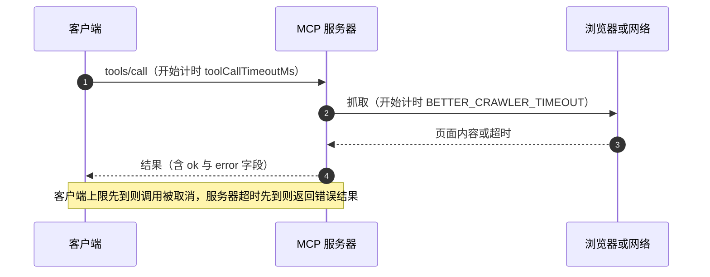
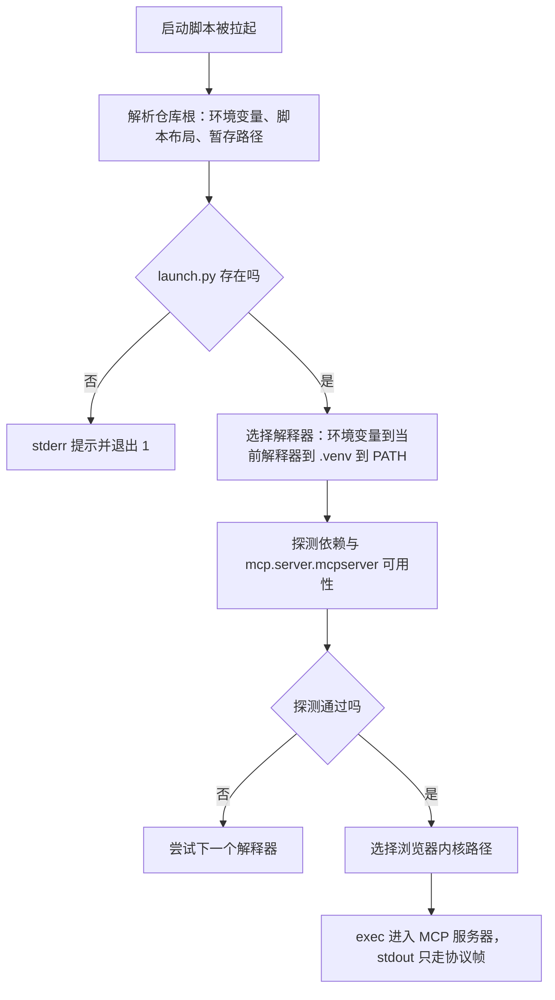

# 配置字段与超时预算

接入配置里最容易被忽略的是时间字段。一次工具调用的耗时由三层决定：客户端为整次调用设的上限、服务器为单次外部操作设的超时、以及外部资源本身的响应时间。三层里任何一层先到，调用都会失败，而失败的表现各不相同：客户端超时表现为调用被取消，服务器超时表现为返回一个带错误字段的结果。

爬虫仓库把三层都显式写了出来：客户端层 `toolCallTimeoutMs: 180000`，服务器层 `BETTER_CRAWLER_TIMEOUT=25`（都在 `dsh-plugin/cordis.patch.yml` 里），外部资源是浏览器渲染。数值之间要留出批量操作的空间，

## 一次调用的三层时间预算



三层的关系是包含而非并列：客户端上限应该大于服务器单次操作的上限之和，否则服务器还没来得及返回结果，调用就被客户端取消。批量工具是这条关系的压力点：`fetch_urls` 一次最多 20 条 URL，并发上限 8（`src/better_crawler/mcp_server.py` 的 `fetch_urls`），最坏情况下要跑几轮单页超时。

注释把这个判断写在了配置里：`fetch_urls` 批量可能跑几十秒，SDK 默认的 60 秒会截断长批量（`cordis.patch.yml` 的 `toolCallTimeoutMs`）。因此这里取 180 秒。

## dsh 侧调用超时

| 字段 | 默认值 | 本项目取值 | 来源 |
| --- | --- | --- | --- |
| `toolCallTimeoutMs` | 60,000 | 180,000 | `@deepseek-ai/dsh-mcp-client/README.md` 与 `dsh-plugin/cordis.patch.yml` |

超时的作用范围是单次 `tools/call` 或资源请求（`@deepseek-ai/dsh-mcp-client/README.md` 的配置字段说明），实现上作为 SDK 调用参数传入（`lib/index.js` 的调用参数与重连实现）。客户端超时与服务器自身超时是两条独立的计时器：前者在客户端进程里，后者在服务器进程里。

KnowledgeDiver 的配置没有设这个字段，因此使用 60 秒默认值。它的只读工具都不做外部网络请求，唯一可能慢的是首次调用时的嵌入模型与扩展加载。

## 抓取超时与正文上限

服务器侧的两个环境变量都从环境读取，默认值写在代码里。相关代码是这样写的：

```python
DEFAULT_MAX_CHARS = int(os.getenv("BETTER_CRAWLER_MAX_CHARS", "50000"))

async def _get_fetcher() -> Fetcher:
    """延迟初始化，避免服务器启动时就拉起 Chromium。"""
    global _fetcher
    if _fetcher is not None:
        return _fetcher
    async with _fetcher_lock:
        if _fetcher is None:
            f = Fetcher(timeout=float(os.getenv("BETTER_CRAWLER_TIMEOUT", "25")))
            await f.start()
            _fetcher = f
    return _fetcher
```

默认值出现在两个地方：模块顶层的 `DEFAULT_MAX_CHARS`，以及首次抓取时构造 `Fetcher` 的 `timeout`。抓取器延迟初始化，因此服务器启动阶段不会拉起 Chromium。

| 变量 | 默认值 | 作用 | 来源 |
| --- | --- | --- | --- |
| `BETTER_CRAWLER_TIMEOUT` | 25 秒 | 单页抓取超时，传给 `Fetcher` | `src/better_crawler/mcp_server.py` |
| `BETTER_CRAWLER_MAX_CHARS` | 50000 | 单次返回正文上限 | `DEFAULT_MAX_CHARS` 的 `os.getenv` |

正文上限的作用是保护上下文：一条结果若把整页几万字都塞进模型上下文，后续对话会被挤占（源码注释与 `dsh-plugin/README.md`）。返回结果里带 `truncated` 标记说明是否被截断（`mcp_server.py`）。

两个变量的传递路径在三条配置里都能看到：`.mcp.json` 的 `env`、dsh patch 的 `config.env`、以及服务器代码的两处 `os.getenv`（`mcp_server.py` 的 `DEFAULT_MAX_CHARS` 与 `Fetcher(timeout=...)`）。环境变量是这条传输链的唯一载体，客户端不会把配置字段直接翻译成工具参数。

`crawler_status` 会把当前生效的 `timeout` 与 `max_chars_default` 打回给调用方（`mcp_server.py`），这是核对配置是否生效的最快方式：改完配置调用一次，看返回值里的数字。

## 启动与发现的超时

除调用超时外还有一类超时发生在连接阶段。dsh 官方 SDK 用 60 秒默认值约束启动与发现请求，显式的连接超时仍是开放方向（`@deepseek-ai/dsh-mcp-client/README.md`）。stdio 传输还会先起一个探测进程（同一份 README），因此慢启动的服务器在启动阶段可能连续消耗两次进程创建时间。

| 阶段 | 约束 | 来源 |
| --- | --- | --- |
| 探测与连接 | SDK 默认 60 秒 | `@deepseek-ai/dsh-mcp-client/README.md` |
| `tools/list` 发现 | SDK 分页与页限由 SDK 决定 | `@deepseek-ai/dsh-mcp-client/README.md` |
| 单次调用 | `toolCallTimeoutMs` | `@deepseek-ai/dsh-mcp-client/README.md` |
| 重连尝试间隔 | 500 ms 起，翻倍至 30 秒 | `@deepseek-ai/dsh-mcp-client/README.md` |

重连的间隔与次数也属于时间预算：一次断连的尝试上限是 10 次，间隔按 500、1000、2000…… 翻倍到 30000 封顶（见 `@deepseek-ai/dsh-mcp-client/README.md` 的重连字段）。超过上限后工具被移除，直到重载配置或重启。

## 解释器与浏览器的解析顺序

爬虫的启动器要解决两个路径问题：用哪个 Python、用哪个浏览器内核（`scripts/launch.py` 的模块文档）。

| 资源 | 解析顺序 |
| --- | --- |
| 解释器 | `BETTER_CRAWLER_PYTHON`、当前解释器、仓库内 `.venv`、`PATH` 上的 python |
| 浏览器 | `BETTER_CRAWLER_BROWSERS_PATH` / `PLAYWRIGHT_BROWSERS_PATH`、仓库内 `.playwright`、Playwright 默认目录 |

依赖探测不只看能否导入，还要求 API 可用：`mcp 1.x` 没有 `mcp.server.mcpserver`，只查导入会选中旧版本，然后在实际启动时失败。这是把版本约束写进探测串的原因，探测串本身很短：

```python
_REQUIRED = ("playwright", "mcp", "trafilatura", "bs4", "httpx")

# 除了能导入，还得确认 API 可用：mcp 1.x 没有 mcp.server.mcpserver
_PROBE = (
    "import " + ", ".join(_REQUIRED) + "\n"
    "from mcp.server.mcpserver import MCPServer\n"
)
```

探测方式是 `python -c` 跑这段代码、看退出码：能导入且能找到新 API，才算这个解释器可用。

启动脚本还固定了一条输出纪律：stdout 只承载 MCP 帧，所有诊断信息走 stderr（`dsh-plugin/scripts/launch.sh` 的头部注释）。stdio 传输下 stdout 混入任何非协议文本都会让客户端解析失败，这条纪律与服务器侧的日志设置一致（`backend/mcp/__main__.py` 的 `logging.basicConfig`）。



## KnowledgeDiver 的配置缺项

对照爬虫的三层时间配置，KnowledgeDiver 的样例只设了路径、编码与身份：

| 项 | KnowledgeDiver | 爬虫 | 影响 |
| --- | --- | --- | --- |
| 客户端调用超时 | 未设，用默认 | 180000 | 只读检索通常远快于默认值 |
| 服务器单次操作超时 | 无此配置 | 25 秒 | 首次模型加载不受超时约束 |
| 返回正文上限 | 无此配置 | 50000 | 卡片内容本身受长度约束 |
| 解释器 | 直接指定虚拟环境解释器 | 启动脚本按序探测 | 路径写死，换机器要改 |

首次调用要等嵌入模型与向量扩展加载，仓库注释给出的量级是约 500 ms（声明值，未实测）。真正影响预算的是结构而不是这个数字：每个客户端会话都会重新加载一次模型，把它当成常驻进程来估算必然偏乐观。默认 60 秒在量级上够用，风险在于假设不成立。

## 易错点

1. 只调服务器超时不调客户端超时。批量调用会被客户端先取消。
2. 把 `BETTER_CRAWLER_TIMEOUT` 当整次批量超时。它是单页超时，批量按轮数累积。
3. 认为配置字段会直接变成工具参数。环境变量是唯一传输载体。
4. 用 `crawler_status` 之外的方式核对配置。返回值里有当前生效值。
5. 认为启动没有超时约束。SDK 默认 60 秒约束启动与发现请求。
6. 在 stdout 打印诊断。stdio 传输下会破坏协议解析。

## 小结

### 核心概念

| 概念 | 取值或做法 | 来源 |
| --- | --- | --- |
| 客户端调用超时 | 默认 60000，本项目 180000 | `@deepseek-ai/dsh-mcp-client/README.md` 与 `dsh-plugin/cordis.patch.yml` |
| 单页抓取超时 | 默认 25 秒 | `src/better_crawler/mcp_server.py` 的 `Fetcher` 构造 |
| 正文上限 | 默认 50000 字符 | `DEFAULT_MAX_CHARS` |
| 启动与发现 | SDK 默认 60 秒 | `@deepseek-ai/dsh-mcp-client/README.md` |
| 重连预算 | 10 次，间隔 500 ms 起翻倍至 30 秒 | `@deepseek-ai/dsh-mcp-client/README.md` |
| 解释器顺序 | 环境变量、当前、`.venv`、`PATH` | `scripts/launch.py` 的模块文档与 `_candidate_pythons` |
| 输出纪律 | stdout 仅协议帧，诊断走 stderr | `dsh-plugin/scripts/launch.sh` 的头部注释 |

### 设计权衡

| 决策 | 收益 | 代价 |
| --- | --- | --- |
| 客户端超时放大到 180 秒 | 批量抓取不被打断 | 服务器卡死时客户端等待更久 |
| 正文上限 50000 | 单条结果不挤占上下文 | 长文被截断，需再抓 |
| 解释器按序探测 | 换机器不改配置 | 启动多几次探测开销 |
| 依赖探测含 API 校验 | 避免选中旧版本后崩溃 | 探测串需要随依赖升级维护 |
| 诊断全走 stderr | 协议解析稳定 | 客户端要单独看 stderr |

## 练习

### 基础题

1. 写出三层时间预算各自的字段或环境变量与默认值。
2. 说明 `BETTER_CRAWLER_TIMEOUT` 与 `toolCallTimeoutMs` 的区别，以及为什么后者要远大于前者。
3. 列出解释器与浏览器的解析顺序。

### 挑战题

4. 为一次 20 条 URL 的批量抓取估算最坏耗时，判断 180 秒是否足够，并给出测量方案。
5. 给 KnowledgeDiver 配置补一份超时预算，说明每个字段的取值依据与风险。
6. 设计一个启动自检：在客户端连接前验证解释器、依赖 API、浏览器路径与 stdout 纪律，写出检查命令与期望输出。

### 附：本页引用的路径

| 路径 | 用途 |
| --- | --- |
| `node_modules/@deepseek-ai/dsh-mcp-client/README.md` | 调用、启动与重连超时|
| `node_modules/@deepseek-ai/dsh-mcp-client/lib/index.js` | 超时传入与重连实现|
| `dsh-plugin/cordis.patch.yml` | 180 秒与两个抓取变量|
| `dsh-plugin/scripts/launch.sh` | 输出纪律与仓库根推导|
| `/mnt/d/better-crawler-4-agent/.mcp.json` | 环境变量形态|
| `src/better_crawler/mcp_server.py` | 抓取超时、正文上限与批量限制|
| `scripts/launch.py` | 解释器与浏览器解析、依赖探测|
| `backend/mcp/examples/claude_desktop_config.json` | KnowledgeDiver 配置字段 |
| `backend/ai/embedder.py` | 首次加载量级的声明值|
