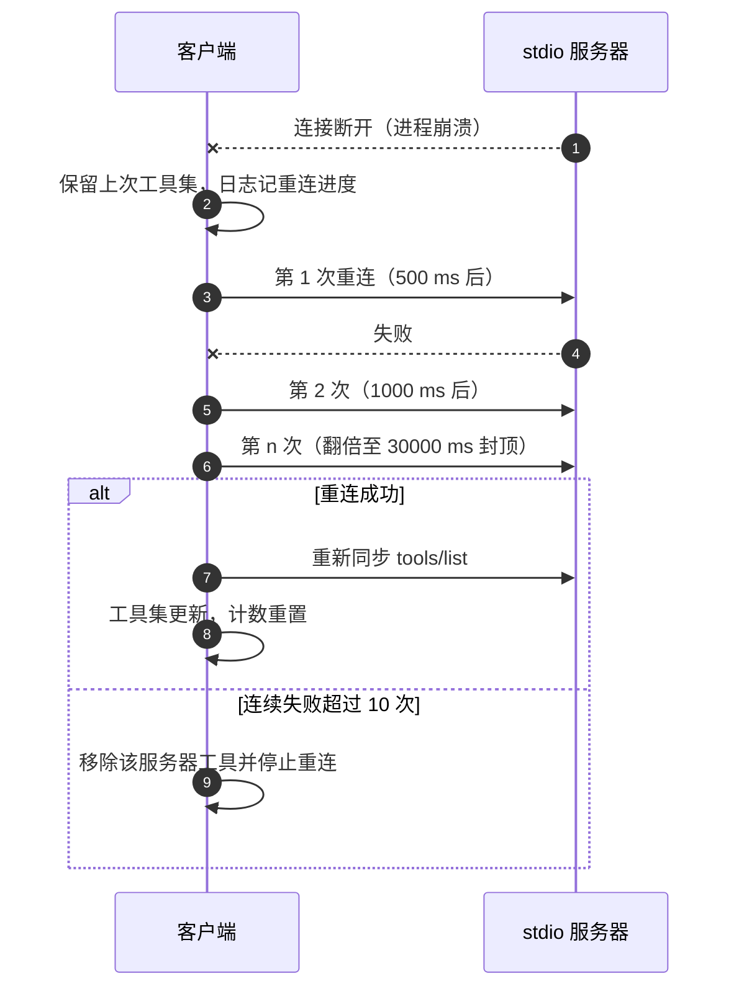
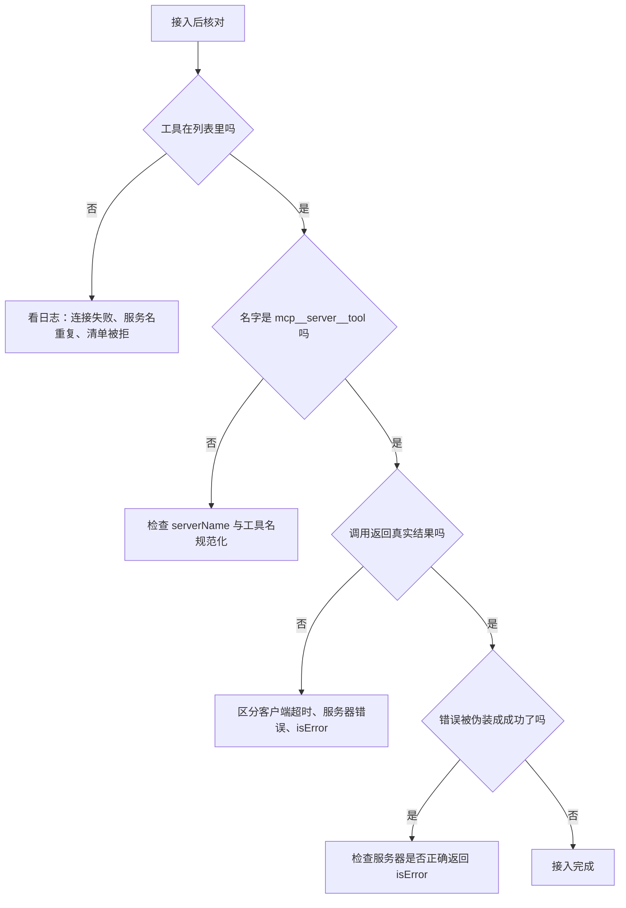

# 接入核对与故障定位

接入完成后要确认的不只是“进程起来了”，还有四条更具体的判据：工具出现在模型工具列表里、名字符合命名空间规则、调用能返回真实结果、错误不会被伪装成成功。这四条分别对应客户端的发现、命名、调用与错误处理路径，任何一条不成立都有独立的排查方向。

服务器之间的排查入口不同。KnowledgeDiver 是只读检索服务器，问题多出现在身份、数据目录与模型加载；爬虫服务器涉及外部浏览器与网络，问题多出现在依赖、浏览器内核与超时。

## 接入成功的四条判据

| 判据 | 期望 | 来源 |
| --- | --- | --- |
| 工具可见 | 首轮对话前工具列表已注册 | `@deepseek-ai/dsh-mcp-client/README.md:91` |
| 名字稳定 | `mcp__<serverName>__<rawName>` | `:75` |
| 调用真实 | 返回远端服务器的结果，资源链接以文本出现 | `:85` |
| 错误可见 | 服务器报错时调用失败，不伪装成功 | `:85`、`:134` |

第四条在实现上更严格：MCP 的 `isError` 结果在图像持久化之前就抛出（`README.md:134`）。这意味着错误结果不会被当成一次成功调用来处理后续附件。

图片类结果另有条件：当前模型接受图片输入且附件能力开启时才进入对话，否则与音频、内嵌资源一样给出一条诊断文本（`README.md:87`）。本仓库两台服务器的工具都返回文本，这条不适用，但换成返回图片的服务器时要先确认这两个前提。

## 工具集的冲突与更新

发现阶段的异常都会导致“工具不出现”或“回退到旧集合”，而不是部分注册。规则集中在客户端一侧：

| 情形 | 行为 | 来源 |
| --- | --- | --- |
| 服务名重复 | 后一条加载失败 | `README.md:78` |
| 工具清单内重名 | 整份清单被拒，保留旧工具 | `README.md:79`、`lib/index.js:131-132` |
| 更新与已注册名冲突 | 整次更新被拒，不产生部分集合 | `README.md:81`、`lib/index.js:110-114` |
| 发现失败 | 保留上一版工具 | `README.md:80` |

原子性来自“先校验后注册”的次序：全部工具名检查通过才提交，否则整批丢弃。对运维的含义是排查工具缺失时，先看日志里有没有“工具清单被拒”这类整批失败，而不是逐个工具找。

## 断连与重连

stdio 服务器进程崩溃后，客户端按固定的退避策略重连（`README.md:93`）：

| 参数 | 默认值 | 含义 |
| --- | --- | --- |
| `reconnect.enabled` | true | 是否自动重连 |
| `reconnect.initialDelayMs` | 500 | 首次延迟 |
| `reconnect.maxDelayMs` | 30000 | 退避上限 |
| `reconnect.maxAttempts` | 10 | 连续失败上限 |

间隔按 500、1000、2000 逐次翻倍直到 30000 封顶（`lib/index.js:576`），重连成功后重新同步工具集（`:674`）。达到 10 次连续失败后工具被移除并停止重连，直到重载配置或重启（`lib/index.js:567-573`、`README.md:93`）。服务器保持连接一段时间后计数会重置（`README.md:93`）。

断连期间工具仍然在列表里，调用会失败——这一点容易误判成“服务器正常但工具坏了”。编辑配置条目会在原地重载连接（`README.md:93`），这是不重启客户端的恢复手段。

## 服务端指令与提示模板

服务器可以在初始化时提供 `instructions`，客户端把它作为字面文本并入系统提示（`README.md:12`）。爬虫的 `instructions` 说明服务只负责抓取、不提供搜索（`src/better_crawler/mcp_server.py:39-43`）；KnowledgeDiver 的 `instructions` 说明只读边界与工具用法（`backend/mcp/server.py:144-147`）。

指令长度有硬上限：默认 32768 UTF-8 字节，含归属信息，超限会拒绝连接（`README.md:62`、`lib/index.js:494`、`:655-656`）。这条上限会把“写得太长的说明”变成启动失败，而不是截断，因此改 `instructions` 时要顺带核对字节数。

MCP 的提示模板（prompts）在当前客户端里不支持（`README.md:12`、`:227`）。服务器若只暴露 prompts 而不暴露 tools，模型侧什么也看不到。

## 两台服务器各自的核对清单

| 核对项 | KnowledgeDiver | 爬虫 |
| --- | --- | --- |
| 工具数量 | 8 个只读工具 | 3 个工具 |
| 身份参数 | 需要用户名，会话可默认 | 无 |
| 环境变量 | `KD_MCP_USERNAME`、`KD_MCP_SESSION` | 编码、超时、正文上限 |
| 数据目录 | 由 `cwd` 与用户名决定 | 无 |
| 外部依赖 | 嵌入模型与向量扩展 | 浏览器内核与网络 |
| 首选探针 | `--list-tools` 打印工具清单 | `crawler_status` 返回状态与生效配置 |
| 启动失败信号 | 退出码 2 与 stderr 一行原因 | 启动脚本 stderr 提示与退出 1 |

KnowledgeDiver 的 `--list-tools` 会在构建网关之后打印工具清单并退出（`backend/mcp/__main__.py:40-43`），因此它同时验证了身份解析与网关构造。只读性由三层防线保证：清单白名单、构造期与调用期层级复核、执行器启用集合（`backend/mcp/gateway.py:33-35`、`:147-150`、`:178-181`、`backend/mcp/runtime.py:63`）。

爬虫的 `crawler_status` 返回版本、超时、正文上限与浏览器可用性，并提示首次调用才会启动浏览器（`src/better_crawler/mcp_server.py:123-133`）。它不触网，是排查浏览器问题的第一站。

## 故障定位表

| 现象 | 客户端侧检查 | 服务器侧检查 |
| --- | --- | --- |
| 工具完全不出现 | 日志中的连接失败与服务名重复 | 进程能否独立启动、stderr 输出 |
| 工具出现但调用报未知工具 | 名字是否被规范化加了后缀 | 服务端注册的原始名 |
| 调用被取消 | 是否触及 `toolCallTimeoutMs` | 单次操作是否超过服务器超时 |
| 调用返回失败但进程正常 | 结果为 `isError` 还是协议错误 | 执行器日志中的异常原因 |
| 断连后工具还在但调用失败 | 重连日志与尝试次数 | 进程崩溃原因 |
| 启动即失败 | 指令字节数是否超限 | 依赖探测、解释器与路径 |
| 中文乱码 | — | 输出流编码是否为 UTF-8 |

最后一行是两个仓库共同的经验：stdio 传输的编码问题在客户端表现为解析失败，在服务器表现为写入异常，排查起点都在服务器侧的 stderr。

## 易错点

1. 认为工具缺失是逐个工具的问题。多数情况是整批清单被拒或连接失败。
2. 把断连期间的工具列表当成可用。调用会失败直到重连成功。
3. 忽略重连上限。10 次失败后工具被移除，需要重载或重启。
4. 把 `instructions` 当无限长的说明。超过 32768 字节会拒绝连接。
5. 期待 prompts 生效。当前客户端不支持提示模板。
6. 只看工具是否出现，不验证调用与错误路径。

## 小结

### 核心概念

| 概念 | 取值或做法 | 来源 |
| --- | --- | --- |
| 工具可见时机 | 首轮对话之前 | `@deepseek-ai/dsh-mcp-client/README.md:91` |
| 错误处理 | `isError` 结果抛出，不伪装成功 | `:85`、`:134` |
| 清单原子性 | 重名或冲突整批拒绝 | `:79-81`、`lib/index.js:131-132` |
| 重连预算 | 10 次，500 ms 起翻倍至 30 秒 | `README.md:64-67`、`:93` |
| 指令上限 | 默认 32768 字节，超限拒绝连接 | `:62`、`lib/index.js:494` |
| 提示模板 | 当前不支持 | `README.md:12`、`:227` |
| KD 探针 | `--list-tools` | `backend/mcp/__main__.py:40-43` |
| 爬虫探针 | `crawler_status` | `src/better_crawler/mcp_server.py:119-133` |

### 设计权衡

| 决策 | 收益 | 代价 |
| --- | --- | --- |
| 工具集整批提交 | 不会出现半更新状态 | 一处冲突回退整批 |
| 断连保留工具列表 | 历史与权限规则稳定 | 期间调用失败，易误判 |
| 自动重连有上限 | 不会无限重试 | 达到上限需人工恢复 |
| 指令超限即拒绝连接 | 配置错误立刻暴露 | 说明写长会阻断启动 |
| 每台服务器一个探针工具 | 排查路径短 | 探针本身也要维护 |

## 练习

### 基础题

1. 写出接入成功的四条判据与各自的验证动作。
2. 说明工具清单被整批拒绝的三种情形。
3. 列出重连的四个参数与达到上限后的行为。

### 挑战题

4. 为接入设计一份自动化核对脚本，覆盖工具可见、命名、调用与错误路径，写出检查项与期望。
5. 分析 `failOnStartupError` 开关对部署的影响：何时应该打开，何时保持关闭。
6. 设计一个断连演练：如何安全地模拟服务器崩溃并验证重连与工具移除，说明恢复步骤。

### 附：本页引用的路径

| 路径 | 用途 |
| --- | --- |
| `node_modules/@deepseek-ai/dsh-mcp-client/README.md` | 判据、冲突、重连与指令上限（:12、:62-67、:75-93、:134、:227） |
| `node_modules/@deepseek-ai/dsh-mcp-client/lib/index.js` | 清单查重、重连与指令校验（:110-114、:131-132、:494、:567-578、:655-674） |
| `backend/mcp/__main__.py` | `--list-tools` 探针（:40-43） |
| `backend/mcp/gateway.py` | 只读三层防线（:33-35、:147-150、:178-181） |
| `backend/mcp/runtime.py` | 执行器启用集合（:63） |
| `backend/mcp/server.py` | 指令文本（:144-147） |
| `src/better_crawler/mcp_server.py` | 指令与 `crawler_status`（:39-43、:119-133） |
| `dsh-plugin/scripts/launch.sh` | 启动失败提示（:36-39） |
