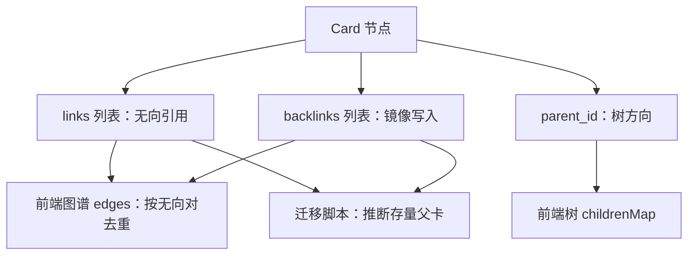
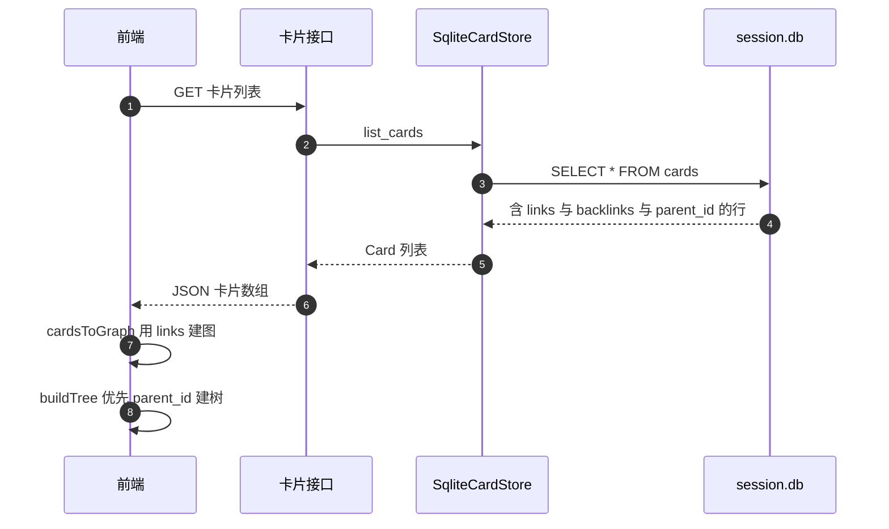

# 卡片节点与两类关系

知识图谱在这个项目里有两种结构同时存在：一种是卡片之间的引用关系，存成 `links` 与 `backlinks` 两个列表；另一种是父子层级，存成 `parent_id` 指针。前者被文档描述为无向（Obsidian 风格），后者是有向的树。两种关系的写入路径不同，读取路径也不同：树用父指针查询，图谱用链接列表渲染。

把这两种结构分开记，是理解这一组模块的前提。链接管理器只维护链接列表，父指针的维护在存储层与迁移脚本里；前端的树视图优先用父指针，图谱视图只用链接列表。

## 卡片模型的十一个字段

`Card` 是一个 pydantic 模型（`backend/models/card.py:17-34`）：

| 字段 | 类型 | 含义 |
| --- | --- | --- |
| `id` | 字符串 | UUID 主键，有格式校验 |
| `title` | 字符串 | 卡片标题 |
| `content` | 字符串 | Markdown 正文 |
| `metadata` | 字典 | 自定义键值，值限字符串、数字或字符串列表 |
| `links` | 字符串列表 | 无向引用链接 |
| `backlinks` | 字符串列表 | 入链镜像 |
| `parent_id` | 可空字符串 | 树形父卡，空表示根 |
| `created_at` | 时间 | 创建时间 |
| `updated_at` | 时间 | 更新时间 |
| `sources` | 字符串列表 | 来源标识 |
| `confidence` | 浮点 | 置信度，校验在 0 到 1 之间 |
| `tags` | 字符串列表 | 标签 |

三条校验写在模型里：`id` 必须是合法 UUID（`:36-43`），`metadata` 的值类型受限（`:45-56`），`confidence` 越界即报错（`:58-63`）。`links`、`backlinks`、`parent_id` 都没有额外校验，关系一致性由写入方保证。

## links 与 backlinks 的镜像写入

模型注释把 `backlinks` 描述成“入链镜像，与 links 互为补集方向”（`card.py:27-28`）。按写入代码看，这个描述只在“双方都写”这个意义上成立：创建链接时，两张卡片的 `links` 与 `backlinks` 都会被追加对方的 ID（`backend/links/manager.py:93-99`）：

```python
for card, other_id in ((from_card, to_card_id), (to_card, from_card_id)):
    if other_id not in card.links:
        card.links.append(other_id)
    if other_id not in card.backlinks:
        card.backlinks.append(other_id)
```

因此对当前代码写出的数据，任意卡片的 `links` 与 `backlinks` 内容相同，`get_outgoing_links` 与 `get_incoming_links` 会返回同一个列表（`manager.py:137-145`）。存储层的补链函数同样对两个列表各写一遍（`backend/storage/sqlite_card_store.py:349-355`）。

镜像语义的代价是入链与出链接口分不出方向。它的收益是删除与校验都简单：任何一边残留都能在另一边的遍历里被发现，`remove_link` 对两张卡片的两个字段统一清理（`manager.py:120-130`）。

需要注意存量数据不满足这个镜像：仓库里的一张卡片 `links` 为空、`backlinks` 有一个 ID（`cards/1111/default/0d105335-3b12-4fc4-aeb0-705ee4b71c67.md:1-8`）。旧数据的链接写入路径与现在不同，迁移脚本正是靠这种不对称性推断父卡（`backend/storage/parent_migration.py:43-53`）。看到 `links` 与 `backlinks` 不一致时，先判断它是旧数据还是新的写入 bug。

## parent_id 承载树方向

树方向单独由 `parent_id` 表示，不参与链接列表。存储层的注释写明了这个决定（`backend/storage/sqlite_card_store.py:311-312`）：

```text
树方向由 parent_id 显式承载，不再依赖 links 方向或创建时间推断
```

这个改动解决的是旧实现的一个歧义：`links` 是无向的，无法区分“谁是谁的父卡”；旧代码用创建时间推断，遇到“后建的父卡挂载先建的子卡”就会判错。`parent_id` 把方向写死，查询变成一条 `WHERE parent_id = ?`（`:360-374`），根卡判定变成 `parent_id` 为空（`:377-386`）。

`parent_id` 与链接不是互斥的：挂载新卡时会同时写两条关系，一条无向链接加一条父指针（`backend/pipeline/api.py:386-394`）。因此同一对卡片可以既在图谱里相连，又在树里有方向。反过来，父指针存在而链接缺失也能渲染树，只是图谱里看不到那条边。



## 两种存储后端

仓库里有两个卡片存储实现，都继承同一个抽象基类（`backend/storage/base.py`）：

| 后端 | 落盘形态 | 路径 | 现状 |
| --- | --- | --- | --- |
| `CardStore` | 一卡一个 Markdown 文件，含 frontmatter | `cards/<user>/<session>/<id>.md` | 仍导出，历史数据在磁盘上 |
| `SqliteCardStore` | 每会话一个 SQLite 库 | `cards/<user>/<session>/session.db` | 运行时实际使用 |

Markdown 后端的路径由用户名与会话拼出，默认会话是 `default`（`backend/storage/card_store.py:51-63`），写文件时带一个锁文件（`:73-77`）。它的 frontmatter 里就有 `links`、`backlinks`、`parent_id` 三个字段，磁盘样例可见（`cards/1111/default/0d105335-3b12-4fc4-aeb0-705ee4b71c67.md:1-19`）。

运行时路径全部走 SQLite 后端：流水线 API、流水线工厂、各路由与链接路由都构造 `SqliteCardStore`（`backend/pipeline/api.py:58`、`backend/pipeline/factory.py:41`、`backend/routes/links.py:33-35`）。SQLite 的 cards 表把两个列表存成 JSON 文本列，`parent_id` 是带默认空串的文本列（`backend/storage/session_database.py:26-41`）：

| 列 | 类型 | 默认 |
| --- | --- | --- |
| `links` | TEXT | `'[]'` |
| `backlinks` | TEXT | `'[]'` |
| `parent_id` | TEXT | `''` |

读回时用 JSON 反序列化恢复列表（`sqlite_card_store.py:186-188`），`parent_id` 的空串归一成 `None`（`:188`）。这个归一很重要：模型层用 `None` 表示根，数据库层用空串，两处不一致会在判定根卡时出错。

## 树与图谱两种视图的分工

后端提供两套读取路径：

| 视图 | 数据来源 | 后端入口 | 前端入口 |
| --- | --- | --- | --- |
| 树 | `parent_id` | `get_card_tree`（`api.py:476-498`） | `buildTree` 的 tree 模式（`frontend/src/utils/tree.ts:18-23`） |
| 图谱 | `links` | 卡片列表接口返回 `links` | `cardsToGraph`（`frontend/src/utils/graph.ts:17-49`） |

两者共用同一份卡片数据，但筛选与排序规则不同。树视图在父指针缺失时回退到链接推断（`tree.ts:52-54`），图谱视图只用链接并跳过目标不在卡片集里的边（`graph.ts:42-44`）。后端 `get_card_tree` 的注释说“以根卡牌（无入链）为起点”，实现调用的却是 `get_root_cards`（父指针为空），这是一处过期的文档字符串（`api.py:479` 与 `:497`）。



## 易错点

1. 把 `backlinks` 当成有方向的入链。当前写入让两个列表内容一致。
2. 用链接推断父子。树方向只在 `parent_id` 里，链接是无向的。
3. 在数据库层用空串、模型层用 `None` 判定根卡。读回时有归一，写入时要注意。
4. 认为 Markdown 后端还在运行。运行时路径全部走 SQLite。
5. 期待图谱显示断链边。目标不在卡片集里的链接会被跳过。
6. 直接引用 `get_card_tree` 的注释描述根卡判据。实现用的是父指针。

## 小结

### 核心概念

| 概念 | 取值或做法 | 来源 |
| --- | --- | --- |
| 节点模型 | 十一个字段的 pydantic 模型 | `backend/models/card.py:17-34` |
| 链接写入 | 双方 links 与 backlinks 各追加一次 | `backend/links/manager.py:93-99` |
| 树方向 | `parent_id` 显式承载 | `backend/storage/sqlite_card_store.py:311-312` |
| 两种后端 | Markdown 卡片文件与每会话 SQLite | `backend/storage/card_store.py:50-77`、`sqlite_card_store.py` |
| 运行时后端 | 全部构造 `SqliteCardStore` | `backend/pipeline/api.py:58`、`routes/links.py:33-35` |
| 库表列 | links、backlinks、parent_id 默认空 | `backend/storage/session_database.py:26-41` |
| 两种视图 | 树用父指针、图谱用链接 | `api.py:476-498`、`frontend/src/utils/graph.ts:17-49` |

### 设计权衡

| 决策 | 收益 | 代价 |
| --- | --- | --- |
| 链接无向并镜像写入 | 删除与校验简单 | 出链入链接口分不出方向 |
| 树方向独立成父指针 | 消除创建时间启发式 | 一份关系要写两个字段 |
| 保留 Markdown 后端 | 兼容历史数据与导出 | 两份存储格式需要分别维护 |
| 列表存成 JSON 文本 | 实现简单 | 无法用 SQL 直接按链接查询 |
| 前端按需选视图 | 树与图谱各取所需 | 同一份数据两套渲染规则 |

## 练习

### 基础题

1. 写出 `Card` 里与关系有关的三类字段，说明各自的方向语义。
2. 说明创建链接时 links 与 backlinks 的写入方式，以及由此产生的接口行为。
3. 对比两种存储后端的落盘形态与运行时的实际选择。

### 挑战题

4. 把 `backlinks` 改成单向入链（只写对方的链接），列出需要改动的写入路径、查询接口与迁移方案。
5. 设计一个一致性巡检：找出 `links` 与 `backlinks` 不对称、`parent_id` 指向不存在卡片的记录，写出判据与统计方式。
6. 分析把链接列表拆成独立关系表的收益与代价，说明对图谱查询与删除级联的影响。

### 附：本页引用的路径

| 路径 | 用途 |
| --- | --- |
| `backend/models/card.py` | 卡片模型与校验（:17-63） |
| `backend/links/manager.py` | 链接写入与查询（:93-99、:120-145） |
| `backend/storage/sqlite_card_store.py` | 补链、父指针与读取归一（:186-188、:311-312、:349-355） |
| `backend/storage/session_database.py` | cards 表结构（:26-41） |
| `backend/storage/card_store.py` | Markdown 后端路径与文件锁（:50-77） |
| `backend/pipeline/api.py` | 树构建与挂载（:58、:386-394、:476-498） |
| `backend/pipeline/factory.py` | 运行时的存储构造（:41） |
| `backend/routes/links.py` | 链接路由的存储构造（:33-35） |
| `cards/1111/default/0d105335-3b12-4fc4-aeb0-705ee4b71c67.md` | 磁盘卡片样例与 frontmatter（:1-19） |
| `frontend/src/utils/tree.ts` | 树构建与父指针优先（:18-23、:48-86） |
| `frontend/src/utils/graph.ts` | 图谱建边与去重（:17-49） |
