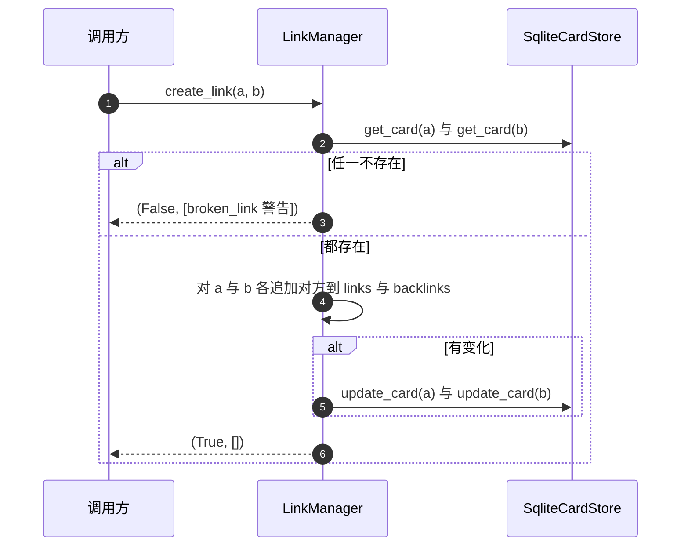
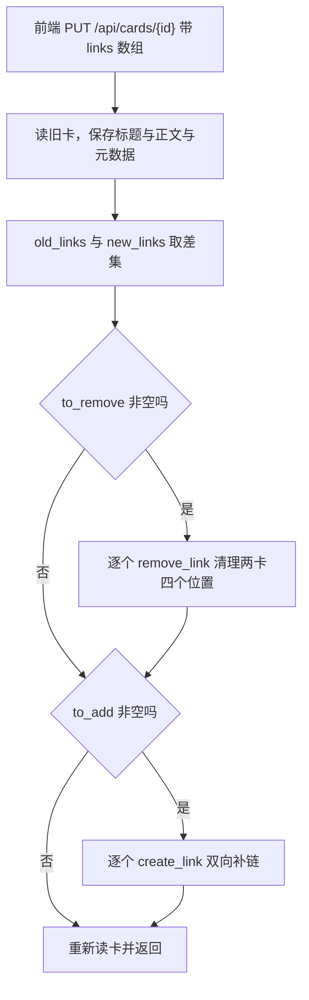

# 无向链接的对称维护

链接的写入只有一个入口：`LinkManager.create_link`（`backend/links/manager.py`）。它没有方向概念，调用 `create_link(a, b)` 与 `create_link(b, a)` 效果相同；写入时对两张卡片的 `links` 与 `backlinks` 各追加一次对方 ID，再用一个 `changed` 标志决定要不要落库。这个形状让链接的创建天然幂等（同一操作执行多次与执行一次结果相同）：已经存在的链接不会产生任何写操作。

维护对称性的难点不在创建，而在“只给一方的新链接集合”这类入口。前端编辑卡片时提交的是整份 `links` 数组，路由要把它与旧值做差集，分别调用创建与删除（`backend/routes/cards.py`）。

## 创建的幂等与对称写入

`create_link` 的骨架是三段：取两张卡片、初始化可能为空的列表、对两张卡片各写两个字段。

```python
from_card = await self._get_card(from_card_id)
to_card = await self._get_card(to_card_id)
if not from_card or not to_card:
    warn = LinkWarning(type="broken_link", message="One or both cards not found", card_ids=[...])
    return False, [warn]
```

（`backend/links/manager.py`）返回的是二元组：成功标志与警告列表。链接已经存在时不报错也不写库，返回 `(True, [])`。`link_type` 参数保留在签名里但不参与存储，注释说明它是兼容保留。

| 步骤 | 行为 | `create_link` 中的环节 |
| --- | --- | --- |
| 取卡 | 任一不存在即返回断链警告 | 读两张卡，缺任一即返回警告 |
| 初始化 | `None` 的列表补成空列表 | 对空值做 `or []` 兜底 |
| 双向写入 | 两张卡片的 links 与 backlinks 各追加对方 | 遍历两张卡的写入循环 |
| 条件落库 | 只在有变化时保存 | `if changed` 判断 |



## 断链时的失败返回

链接目标不存在时不会抛异常，返回 `False` 与一条 `broken_link` 警告（`manager.py`）。`LinkWarning` 是 pydantic 模型，三个字段：`type`、`message`、`card_ids`。目前 `type` 只有 `cycle_detected` 与 `broken_link` 两个取值，前者由环检测使用。

调用方对失败的处理分两处：链接路由把 `ok=False` 转成 HTTP 400（`backend/routes/links.py`），卡片编辑路由不检查返回值，差集里的目标不存在时静默跳过（`backend/routes/cards.py`）。同一个失败在两条入口上表现不同，排查链接缺失时要确认走的是哪条。

## 移除的对称清理

`remove_link` 对两张卡片的 `links` 与 `backlinks` 四个位置逐一查找并删除（`manager.py`），任一位置有删除即算变化，最后保存两张卡片。链接不存在时返回 `False`，路由把它转成 404（`routes/links.py`）。

删除逻辑用 `try/except ValueError` 包住 `list.remove`（`manager.py`）。

`remove_link` 的清理动作简化后大致是这样（示意）：

```python
changed = False
for card, other_id in ((from_card, to_card_id), (to_card, from_card_id)):
    for field in ("links", "backlinks"):
        if other_id in getattr(card, field):
            try:
                getattr(card, field).remove(other_id)
            except ValueError:
                pass          # 删除前已判过成员关系，这里是防御性写法
            changed = True
if changed:
    self._update_card(from_card)
    self._update_card(to_card)
```

由于删除前已经判过成员关系，这个异常实际不会触发，属于防御性写法。实际的清理语义由外层的 `changed` 决定：四个位置都不含对方 ID 时，两张卡片不会被保存。

## 同步与异步存储的兼容层

`LinkManager` 的方法是 `async`，但它持有的 `SqliteCardStore` 是同步实现。`async` 函数被调用时返回协程，协程要交给事件循环才会真正执行，`await` 就是等待它的结果。两者靠两个小函数衔接（`manager.py`）：

```python
async def _maybe_await(self, value):
    if inspect.isawaitable(value):
        return await value
    return value
```

取值与保存都经过这一层，因此同一个管理器既能配同步存储，也能配异步存储。代价是每次访问都要做一次 `isawaitable` 判断，且类型标注上 `store.get_card` 可能返回协程，静态检查看不出真实类型。

这一层还决定了调用方式：同步上下文里调用链接管理器必须用 `asyncio.run_until_complete` 之类的桥梁。流水线 API 把它封在 `_run_async` 里（`backend/pipeline/api.py`），这是相邻单元讨论过的事件循环问题的同源表现。

## 卡片编辑路由的差集同步

前端保存编辑时提交整份链接数组（`frontend/src/hooks/useCardManager.ts`），路由按差集处理（`backend/routes/cards.py`）：

```python
old_links = set(existing.links or [])
new_links = set(card_data.links)
to_add = new_links - old_links
to_remove = old_links - new_links
link_manager = LinkManager(store)
for target_id in to_remove:
    await link_manager.remove_link(card_id, target_id)
for target_id in to_add:
    await link_manager.create_link(card_id, target_id)
existing = store.read_card(card_id)
```

三点需要注意。第一，标题、正文与元数据先单独保存一次，链接同步之后再把卡片重新读一遍返回，因为链接管理器会改动并保存卡片。第二，差集用集合，重复 ID 被自动去重。第三，`to_add` 里的目标若不存在，`create_link` 返回失败但路由不处理，链接会静默缺失。



## 存储层的补链函数

除了管理器，存储层自己也有一个对称补链函数 `_ensure_undirected_link`（`backend/storage/sqlite_card_store.py`）。它与 `create_link` 的写入内容一致：两张卡片的两个列表各补对方，存在则跳过，有变化才更新。

这个函数在设置父指针时被调用：`update_parent` 在写入父指针之后确保父子之间有一条无向链接。也就是说“挂到父卡下”这个动作在存储层就同时产出两种关系，不需要调用方记得再建链接。

| 函数 | 位置 | 触发时机 |
| --- | --- | --- |
| `LinkManager.create_link` | `backend/links/manager.py` | 工具、路由、流水线显式建链 |
| `_ensure_undirected_link` | `backend/storage/sqlite_card_store.py` | 设置或更换父指针时 |

## 对外接口与调用方

链接有一组独立的 REST 接口（`backend/routes/links.py`）：

| 方法与路径 | 作用 | 失败码 |
| --- | --- | --- |
| `POST /api/links` | 创建链接 | 400 |
| `DELETE /api/links` | 删除链接 | 404 |
| `GET /api/links/{id}/outgoing` | 出链列表 | — |
| `GET /api/links/{id}/incoming` | 入链列表 | — |
| `GET /api/links/{id}/validate` | 断链校验 | — |

这组接口在当前前端里没有调用方：对 `frontend/src` 全量检索 `/api/links` 无命中，前端编辑链接走的是卡片 PUT 接口。出链与入链接口也因此在数据上返回相同结果（镜像写入）。这组接口目前的实际使用者是外部调用方与调试。

图谱视图直接读卡片自带的 `links` 字段建边，按无序对去重，反向边只留一条（`frontend/src/utils/graph.ts`）。它不区分 links 与 backlinks，因此镜像写入对图谱没有影响。

## 易错点

1. 把 `create_link` 当有向操作。两个方向参数效果相同。
2. 处理 `create_link` 的返回值只判断成功标志。警告列表里可能带断链信息。
3. 认为卡片编辑路由会报链接目标不存在。它不检查返回值。
4. 在同步上下文里直接调用管理器方法。需要事件循环桥接。
5. 认为设置父指针不需要建链接。存储层会自动补一条无向链接。
6. 用出链与入链接口验证方向。当前数据下两者相同。

## 小结

### 核心概念

| 概念 | 取值或做法 | 来源 |
| --- | --- | --- |
| 创建入口 | `create_link(from, to, link_type)` | `backend/links/manager.py` |
| 返回值 | `(成功标志, 警告列表)` | `backend/links/manager.py` |
| 幂等 | 已存在则无写操作 | `backend/links/manager.py` |
| 断链 | `broken_link` 警告，返回假 | `backend/links/manager.py` |
| 删除 | 四个位置对称清理 | `backend/links/manager.py` |
| 异步兼容 | `_maybe_await` 包装 | `backend/links/manager.py` |
| 差集同步 | 编辑路由按集合差增删 | `backend/routes/cards.py` |
| 存储补链 | 父指针写入后补无向链接 | `backend/storage/sqlite_card_store.py` |

### 设计权衡

| 决策 | 收益 | 代价 |
| --- | --- | --- |
| 链接无向 | 调用方不需定方向 | 出链入链接口失去区分度 |
| 失败用返回值不用异常 | 调用方批量处理不中断 | 忽略返回值的入口会静默缺失 |
| 条件落库 | 重复建链零写开销 | 需要维护 `changed` 标志 |
| 异步兼容层 | 一套管理器配两种存储 | 类型标注与实际类型脱节 |
| 编辑走差集 | 前端只提交整份数组 | 目标不存在时静默跳过 |

## 练习

### 基础题

1. 写出 `create_link` 的步骤与返回结构，说明幂等在哪里实现。
2. 说明 `remove_link` 检查哪些位置，以及没有任何变化时的返回值。
3. 画出编辑卡片时链接增删的差集流程。

### 挑战题

4. 把断链失败改成显式错误并通知调用方，分析对卡片编辑路由、链接路由与前端提示的影响。
5. 设计链接写入的并发测试：两个进程同时给同一对卡片建链，验证幂等性与最终一致性。
6. 分析把 `_ensure_undirected_link` 的职责并入 `LinkManager` 的利弊，说明对存储层依赖方向的影响。

### 附：本页引用的路径

| 路径 | 用途 |
| --- | --- |
| `backend/links/manager.py` | 创建、删除与兼容层 |
| `backend/links/__init__.py` | 模块导出 |
| `backend/routes/links.py` | 链接 REST 接口 |
| `backend/routes/cards.py` | 卡片编辑的差集同步 |
| `backend/storage/sqlite_card_store.py` | 补链与父指针写入 |
| `backend/pipeline/api.py` | 事件循环桥接与建链调用 |
| `frontend/src/hooks/useCardManager.ts` | 前端提交整份链接数组 |
| `frontend/src/utils/graph.ts` | 图谱按无序对去重 |
