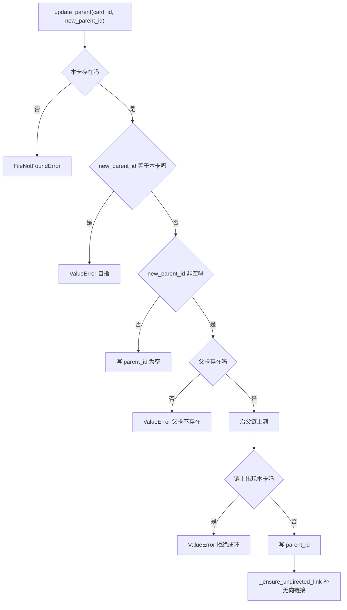
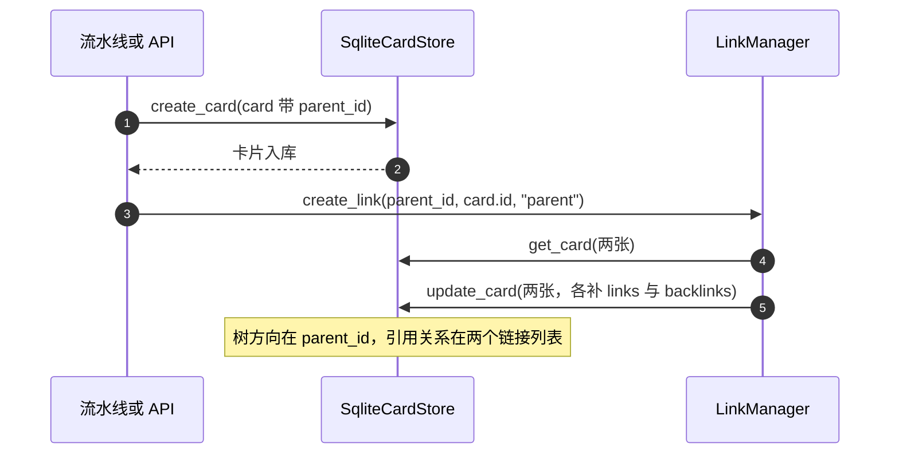
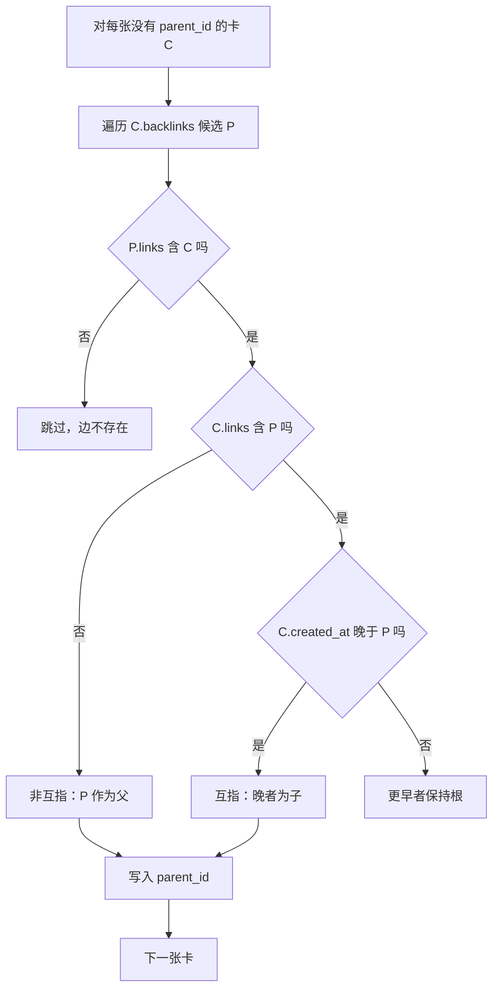

# 父指针与树的构建

树结构只有一个写入入口：存储层的 `update_parent`（`backend/storage/sqlite_card_store.py:309-341`）。它做三件事：校验新父卡合法、写入父指针、必要时补一条无向链接。读取则由两条查询支撑，`get_children` 按父指针取直接子卡，`get_root_cards` 取父指针为空的卡片（`:360-386`）。后端与前端各自在这两条查询之上递归组装树，规则不同。

父指针的引入解决了一个旧问题：链接是无向的，无法判断谁是父。迁移脚本把旧数据的推断结果固化成显式父指针，之后所有读取都以父指针为准（`backend/storage/parent_migration.py:1-13`）。

## 父指针的四条写入规则

| 规则 | 内容 | 位置 |
| --- | --- | --- |
| 卡片必须存在 | 不存在抛 `FileNotFoundError` | `sqlite_card_store.py:318-320` |
| 不能以自己为父 | 抛 `ValueError` | `:321-322` |
| 新父卡必须存在 | 不存在抛 `ValueError` | `:323-326` |
| 祖先链不得含本卡 | 含则抛 `ValueError`，拒绝成环 | `:327-335` |

第四条是整棵树能否渲染的关键。注释记录了 e2e 实证：两张卡片互相为父时，`get_root_cards()` 返回空，整棵树消失（`:315-316`）。因此防环检查属于维持树可见性的必要条件，不能当成可选的健壮性措施。

## update_parent 的三步校验

校验顺序是：读本卡、自指判断、父卡存在性、祖先链上溯。

```python
if new_parent_id and new_parent_id == card_id:
    raise ValueError("Card cannot be its own parent")
if new_parent_id:
    new_parent = self.read_card(new_parent_id)
    if new_parent is None:
        raise ValueError(f"Parent card {new_parent_id} not found")
    cur = new_parent
    while cur:
        if cur.id == card_id:
            raise ValueError(f"循环父卡: ...")
        cur = self.read_card(cur.parent_id) if cur.parent_id else None
```

（`backend/storage/sqlite_card_store.py:321-335`）上溯按父指针逐级读取，读到 `parent_id` 为空为止。每一级都走一次数据库读，链路很深时这是 O(链长) 次查询；注释没有给出链长上限，实际数据的深度由使用方式决定。

写入发生在校验之后（`:336-337`），随后在 `new_parent_id` 非空时补无向链接（`:338-340`）。把父指针设为 `None` 可以摘掉父卡，此时不会补链接，原有的无向链接也不会被删除——摘父与断链是两个独立动作。



## 子卡与根卡的查询

两条查询都很直接（`sqlite_card_store.py:360-386`）：

| 查询 | SQL 判据 | 用途 |
| --- | --- | --- |
| `get_children(card_id)` | `WHERE parent_id = ?` | 树向下递归 |
| `get_root_cards()` | `WHERE parent_id IS NULL OR parent_id = ''` | 树起点 |

根卡判据同时匹配 `NULL` 与空串，兼容模型层与数据库层的两种表示。`is_root` 是对旧调用的兼容封装，语义相同（`:384-386`）。注释强调方向来自显式父指针，不用创建时间启发式（`:363`）。

## 挂载新卡的两处写入

新卡挂到源卡下有两条路径，写入内容一致：先建无向链接，再写父指针。

流水线的挂载函数对一批新卡循环处理（`backend/pipeline/api.py:378-394`）：调用 `create_link(source, card, "expand")`，然后只在 `card.parent_id` 为空时写入父指针，最后 `update_card`。判断“为空才写”保证不会覆盖已有的父卡，这是幂等性的来源。

公开 API 的 `create_card` 则把 `parent_id` 直接放进新建的卡片对象（`api.py:536-547`），建卡后再建链接（`:549-551`）。两条路径的差别是顺序：一条先建卡再补链接，一条先建链接再补父指针，最终状态相同。

`link_cards` 提供显式的父卡参数：传入 `parent` 时按参数方向设置父指针，取值 `"a"` 表示 A 为父，`"b"` 表示 B 为父（`api.py:396-419`）。不传则只建立无向链接，不动树结构。



## 后端树的递归与防环

`get_card_tree` 先取根卡，再对每张根卡递归组装（`api.py:476-498`）：

```python
def _build_node(card, visited):
    if card.id in visited:
        return {"card": card.model_dump(mode="json"), "children": []}
    children = self.card_store.get_children(card.id)
    return {"card": ..., "children": [_build_node(c, visited | {card.id}) for c in children]}
```

`visited` 是不可变集合，每层递归产生新副本，因此兄弟分支互不影响。命中已访问节点时返回一个不带子节点的占位节点，保证递归终结。注释说明这是为历史数据准备的：旧数据可能有错层或反向边（`:488`）。

递归用 `get_children` 逐层查库，节点多时是 O(节点数) 次查询。这与前端拿全量卡片在内存建树的方式不同，两条路径的性能特征也不一样。

## 前端树的优先级与回退

前端的 `buildTree` 在 tree 模式下调用 `_buildHierarchy`（`frontend/src/utils/tree.ts:18-23`）。该函数先判断数据形态（`:52-55`）：

```ts
const hasParentIds = cards.some(c => c.parent_id);
if (hasParentIds) {
  // 用 parent_id 建 childrenMap，根 = 未设父卡或父卡不在卡片集
} else {
  // 回退到 links 推断，含连通分量断环
}
```

父指针分支只处理父卡存在于卡片集里的卡，父卡不在集合里的卡被当成根（`:64-65`），这与“悬空父指针”一致。递归同样带 `visited` 防环（`:67-71`）。

回退分支按 `links` 建边并计算入度，取入度为零的卡为根；纯环连通分量没有根，于是把分量内出边最多的卡拉成根并摘掉指向它的边，让环也能渲染（`:104-158`）。这段逻辑是为没有父指针的旧数据准备的。

## 存量数据迁移的四条推断规则

迁移模块把旧数据的链接方向推断成父指针，规则写在文档字符串里（`backend/storage/parent_migration.py:7-11`）：

| 情形 | 推断结果 |
| --- | --- |
| `C.id ∈ P.links` 且 `C.links` 不含 P | 边方向权威，`C.parent_id = P` |
| 双向边（互指） | 创建更晚者为子，更早者保持根 |
| 没有候选 | 保持根 |
| 已有父指针 | 跳过，保证幂等 |

实现按 `backlinks` 找候选父卡，再回查父卡的 `links` 确认边存在（`:43-46`）。互指时比较 `created_at`（`:47-50`），非互指直接取第一个候选（`:54-55`）。`migrate_store` 支持 `dry_run` 只统计不写入（`:61-86`），`migrate_session` 构造存储时传 `auto_index=False`，注释说明是避免与关库竞态（`:89-97`）。

迁移只在存量数据上跑一次；之后新卡由 `update_parent` 与挂载逻辑写父指针，不再依赖推断。



## 树摘要缓存的失效

写层工具成功后会让树摘要缓存失效（`backend/agent/tools.py:143-145`），因为卡片或链接变了，树摘要不再准确。这是缓存的正确性依赖：父指针或链接的任何改动都必须触发失效，否则工具读到的树是旧快照。缓存实例按用户名与会话隔离（`:145`）。

分类器也会写父指针：它按建议的父卡调用 `update_parent`，并用 `hasattr` 检查存储是否支持（`backend/classification/classifier.py:104-117`）。这条路径不经过流水线，属于自动挂载。

## 易错点

1. 用链接推断父子。读取一律以父指针为准，链接是无向的。
2. 认为摘父会同时删除链接。摘父只写空父指针，链接保留。
3. 忽略防环校验的必要性。互相为父会让根卡为空，整棵树消失。
4. 覆盖已有父指针。挂载逻辑只在本卡父指针为空时写入。
5. 在父指针缺失时只依赖回退分支。回退是旧数据兼容，不是常规路径。
6. 改动父指针后不清树摘要缓存。工具会继续返回旧树。

## 小结

### 核心概念

| 概念 | 取值或做法 | 来源 |
| --- | --- | --- |
| 父指针写入 | `update_parent(card_id, new_parent_id)` | `backend/storage/sqlite_card_store.py:309-341` |
| 防环 | 自指、父卡不存在、祖先链含本卡 | `:321-335` |
| 子卡查询 | `WHERE parent_id = ?` | `:360-374` |
| 根卡查询 | 父指针为 `NULL` 或空串 | `:377-386` |
| 挂载双写 | 无向链接加父指针 | `backend/pipeline/api.py:378-394`、`:536-551` |
| 后端递归防环 | 不可变 `visited` 集合 | `api.py:487-495` |
| 前端优先级 | 有父指针用父指针，否则回退链接 | `frontend/src/utils/tree.ts:52-55` |
| 迁移规则 | 边方向权威、互指取晚者 | `backend/storage/parent_migration.py:7-11` |

### 设计权衡

| 决策 | 收益 | 代价 |
| --- | --- | --- |
| 父指针显式写入 | 树方向唯一且可查 | 与链接双写，两处可能不一致 |
| 写入前上溯防环 | 树结构始终有根 | 每级一次读，深链成本高 |
| 挂载只补空父指针 | 幂等、不覆盖人工设置 | 换父卡需显式调用 |
| 前端优先父指针 | 与后端树一致 | 需要回退分支兼容旧数据 |
| 迁移固化成显式字段 | 之后不再依赖启发式 | 迁移逻辑与旧数据形态耦合 |

## 练习

### 基础题

1. 写出 `update_parent` 的四条校验规则与各自的异常类型。
2. 说明根卡的两条 SQL 判据，以及为什么空串也要匹配。
3. 对比后端 `get_card_tree` 与前端 `_buildHierarchy` 的建树数据来源与防环方式。

### 挑战题

4. 给 `update_parent` 加上链深上限与批量校验，分析对深链数据与迁移脚本的影响。
5. 设计一个父指针一致性巡检：找出悬空父指针、自指、环与父子链接缺失，写出检出方法与修复顺序。
6. 评估把树结构改成闭合表或物化路径的收益与代价，说明对迁移与查询的影响。

### 附：本页引用的路径

| 路径 | 用途 |
| --- | --- |
| `backend/storage/sqlite_card_store.py` | 父指针写入、防环与查询（:309-386、:342-359） |
| `backend/pipeline/api.py` | 挂载、建卡与建树（:378-419、:476-498、:536-557） |
| `backend/pipeline/pipeline.py` | 流水线内的父指针写入（:215、:303、:710-719） |
| `backend/storage/parent_migration.py` | 存量回填规则与执行（:7-97） |
| `backend/classification/classifier.py` | 分类器自动挂载（:104-117） |
| `backend/routes/classification.py` | 分类接口写父指针（:47） |
| `backend/agent/tools.py` | 树摘要缓存失效（:143-145） |
| `frontend/src/utils/tree.ts` | 前端建树与回退（:18-23、:48-182） |
| `tests/backend/test_undirected_links.py` | 父指针与无向链接的断言（:1-8、:100-101） |
