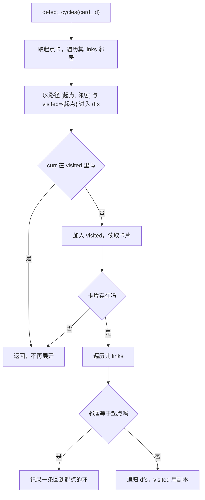
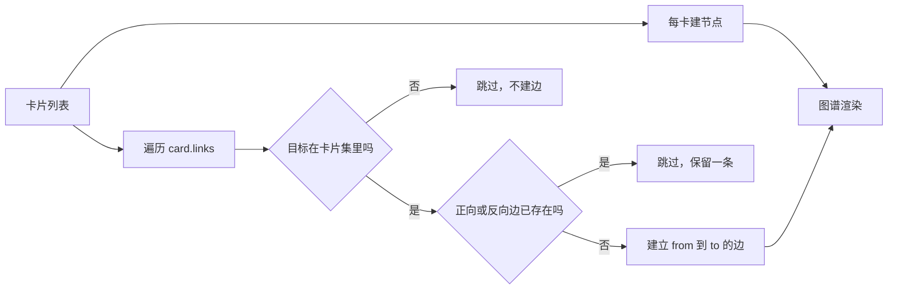

# 环检测断链校验与图谱渲染

链接关系除了写入，还需要检查与展示：检查有无环和断链，展示成图谱。检查侧有三段代码——环检测、断链校验、路径存在性查询；展示侧有两处——前端图谱建边与前端回退建树里的断环。这两侧的算法思路不同：检查侧按链接列表做 DFS，展示侧在内存里按入度与连通分量处理。

核对这几段代码时会发现两类情况：接口存在但没有前端调用方，以及函数存在但没有调用者。它们不影响当前功能，但会误导后来者以为某条能力在用。算法、调用情况与核对方法写清楚，无法从源码证明的结论明确标注。

## DFS 环检测的实现

`detect_cycles` 从指定卡片出发，沿 `links` 做深度优先搜索，收集回到起点的路径（`backend/links/manager.py:147-177`）：

```python
async def dfs(curr_id, path, visited):
    if curr_id in visited:
        return
    visited.add(curr_id)
    curr_card = await self._get_card(curr_id)
    if not curr_card:
        return
    for nxt in getattr(curr_card, 'links', []) or []:
        new_path = path + [nxt]
        if nxt == card_id:
            cycles.append(new_path + [card_id])
        else:
            await dfs(nxt, new_path, visited.copy())
```

两个细节。第一，递归传入 `visited.copy()`（`:173`），因此每条路径各自维护访问集合，同一节点可以从不同路径重复到达，这样能枚举出多条环而不是只报一条。第二，起点单独处理：遍历起点的邻居时初始化 `visited` 为含起点的集合（`:175-176`），避免起点被当成新节点重复展开。

因为 `links` 是无向镜像写入的（见相邻页），环检测实际运行在无向图上。无向图里任何一条边都会构成“a→b→a”的往返路径，因此镜像数据下几乎所有有链接的卡都会报告环。这一点是从写入语义推导出来的；函数本身没有对链接方向做区分。



## 断链校验的判据

`validate_links` 遍历卡片的 `links`，逐条读取目标卡片，读不到就生成一条 `broken_link` 警告（`manager.py:179-193`）：

```python
for linked_id in getattr(card, 'links', []) or []:
    linked_card = await self._get_card(linked_id)
    if not linked_card:
        warnings.append(LinkWarning(
            type="broken_link",
            message=f"Linked card {linked_id} does not exist",
            card_ids=[card_id, linked_id],
        ))
```

判据是“目标卡片不存在”，不检查对方是否回指本卡。因此镜像写入被破坏（一方有边、另一方没有）时不会报警告，这是校验范围之外的不对称问题。校验是 O(出链数) 次读库，返回列表而不是布尔值。

| 校验项 | 是否覆盖 | 判据 |
| --- | --- | --- |
| 链接目标不存在 | 是 | `get_card` 返回空 |
| 双方链接不对称 | 否 | — |
| 父指针悬空 | 否 | — |
| 父指针成环 | 否（由写入期校验拦住） | — |

## 未接线的查询函数

`_path_exists` 与其递归实现 `_path_exists_impl` 判断两个卡片之间是否可达（`manager.py:195-210`），带 `visited` 防重访。全仓检索这个名字只在定义处出现，没有其他调用方。

`detect_cycles` 也没有调用方：链接路由只暴露了创建、删除、出链、入链与校验五个端点（`backend/routes/links.py:38-96`），没有环检测端点。`validate_links` 有一个调用方，就是校验路由（`routes/links.py:88-96`）。

| 函数 | 定义 | 调用方 |
| --- | --- | --- |
| `create_link` | `manager.py:49` | 工具、路由、流水线 |
| `remove_link` | `:107` | 链接路由、卡片编辑路由 |
| `validate_links` | `:179` | `GET /api/links/{id}/validate` |
| `detect_cycles` | `:147` | 未发现 |
| `_path_exists` | `:195` | 未发现 |

“未发现调用方”是对当前代码的检索结论，不排除外部脚本或测试动态调用；检索范围是仓库内的 `backend`、`frontend/src` 与 `tests`。

## 前端图谱的建边与去重

图谱从卡片列表构建节点与边（`frontend/src/utils/graph.ts:17-49`）：

| 步骤 | 行为 | 位置 |
| --- | --- | --- |
| 建节点 | 每张卡一个节点，标签取标题 | `:18-23` |
| 建边 | 遍历 `card.links` | `:39-47` |
| 跳过断链 | 目标不在卡片集里就不建边 | `:42-44` |
| 无序对去重 | 正向或反向已存在则跳过 | `:28-37` |
| 边 ID | 用 `from->to` 字符串做稳定 ID | `:29`、`:35` |

去重让镜像写入的对称边只呈现一条。跳过断链意味着图谱比链接列表“干净”：数据里有边但目标缺失时，图谱不显示悬空节点，而 `validate_links` 会把它报告成警告。`getConnectedNodes` 复用同样的判据取相邻节点（`:52-69`）。



## 前端断环与根判定

回退建树分支只处理没有父指针的数据。它按 `links` 建 `childrenMap` 并统计入度（`frontend/src/utils/tree.ts:88-102`），取入度为零的卡为根（`:104-105`）。纯环连通分量里所有节点入度都大于零，没有根，于是代码找出未可达的卡片，按连通分量把出边最多的卡提升为根，并从其它节点的子列表里摘掉指向它的边（`:107-158`）。递归仍带 `visited` 防残留环（`:160-166`）。

父指针分支没有这套处理，因为写入期的防环校验保证了父链无环（`backend/storage/sqlite_card_store.py:327-335`）。两套机制分工明确：写入期防止产生环，展示期兜住历史数据里的环。

## 过期注释与未实现函数

核对中确认了三处实现与描述不一致：

| 位置 | 描述 | 实现 |
| --- | --- | --- |
| `backend/pipeline/api.py:479` | 树“以根卡牌（无入链）为起点” | 用 `get_root_cards`，判据是父指针为空（`:497`） |
| `backend/pipeline/api.py:503` | 子卡“通过 links 出现在 backlinks 中识别” | 调用 `get_children`，按 `parent_id` 查询（`:511`） |
| `frontend/src/utils/tree.ts:14-16` | tree 模式“用 links/backlinks 建父子关系” | 有父指针时优先父指针（`:52-55`） |

还有两个未实现的导出函数：`getAncestors` 与 `getDescendants` 都直接返回空数组（`tree.ts:184-190`）。它们有签名与导出，没有任何逻辑，调用方拿到的是空列表。

这些属于文档与实现的漂移，不影响运行，但会让基于注释做判断的人得到错误结论。修法是把注释改成实现的行为，或把函数补齐。

## 核对方法与结论

调用情况的结论用三条检索得出，可复现：

1. 在 `backend`、`frontend/src`、`tests` 检索 `detect_cycles` 与 `_path_exists`，只在定义处命中。
2. 在 `frontend/src` 检索 `/api/links`，无命中，说明链接 REST 接口当前无前端调用方。
3. 在 `frontend/src` 检索 `getAncestors` 与 `getDescendants`，只有定义处命中。

由此得到三条结论：环检测与路径查询是未接线代码；链接 REST 接口供外部或调试使用；祖先与后代查询未实现。这些结论基于静态检索，不排除运行时通过字符串拼接等方式间接调用。

## 易错点

1. 认为环检测会被路由调用。它没有接口。
2. 用 `validate_links` 判断链接对称性。它只查目标是否存在。
3. 期待图谱显示断链。目标缺失的边被跳过。
4. 认为回退建树的断环逻辑会用在父指针数据上。父指针分支不含它。
5. 直接调用 `getAncestors` 取祖先。它返回空数组。
6. 按注释理解根卡判据。实现按父指针。

## 小结

### 核心概念

| 概念 | 取值或做法 | 来源 |
| --- | --- | --- |
| 环检测 | 沿 links 的 DFS，逐路径访问集副本 | `backend/links/manager.py:147-177` |
| 断链校验 | 逐条读目标，不存在即警告 | `:179-193` |
| 路径查询 | 未接线 | `:195-210` |
| 校验接口 | `GET /api/links/{id}/validate` | `backend/routes/links.py:88-96` |
| 图谱建边 | 跳过断链，无序对去重 | `frontend/src/utils/graph.ts:17-49` |
| 回退断环 | 入度根判定加分量断环 | `frontend/src/utils/tree.ts:88-158` |
| 未实现函数 | `getAncestors` 与 `getDescendants` 返回空 | `:184-190` |

### 设计权衡

| 决策 | 收益 | 代价 |
| --- | --- | --- |
| 环检测留在管理器里 | 需要时可复用 | 当前无入口，容易腐化 |
| 校验只查目标存在 | 实现短、读库次数可控 | 不覆盖不对称与悬空父指针 |
| 图谱跳过断链 | 渲染不出现悬空节点 | 与校验结论看起来矛盾 |
| 展示期兜底断环 | 历史数据也能渲染 | 两处断环逻辑需分别维护 |
| 注释未随重构更新 | — | 误导后来者 |

## 练习

### 基础题

1. 写出环检测的访问集合处理方式，以及它对多条环的影响。
2. 说明断链校验的判据与它不覆盖的三种问题。
3. 列出图谱建边时被跳过的两种情况。

### 挑战题

4. 给环检测接一个只读接口并接入前端提示，说明消息结构与性能考虑。
5. 设计一个完整的链接健康巡检：断链、不对称、悬空父指针、环四类问题的检出方法、修复顺序与幂等要求。
6. 评估把 `getAncestors` 与 `getDescendants` 完整实现的收益，说明数据来源选后端递归还是前端内存计算。

### 附：本页引用的路径

| 路径 | 用途 |
| --- | --- |
| `backend/links/manager.py` | 环检测、断链校验与路径查询（:147-210） |
| `backend/routes/links.py` | 校验接口与端点集合（:38-96） |
| `backend/storage/sqlite_card_store.py` | 写入期防环（:309-341） |
| `backend/pipeline/api.py` | 过期注释（:479、:503、:497、:511） |
| `frontend/src/utils/graph.ts` | 图谱建边与去重（:17-69） |
| `frontend/src/utils/tree.ts` | 回退建树断环与未实现函数（:14-16、:88-190） |
| `tests/backend/test_undirected_links.py` | 链接行为断言（:1-8、:100-101） |
