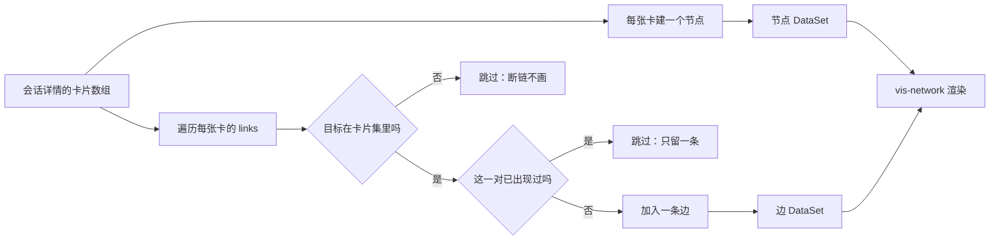
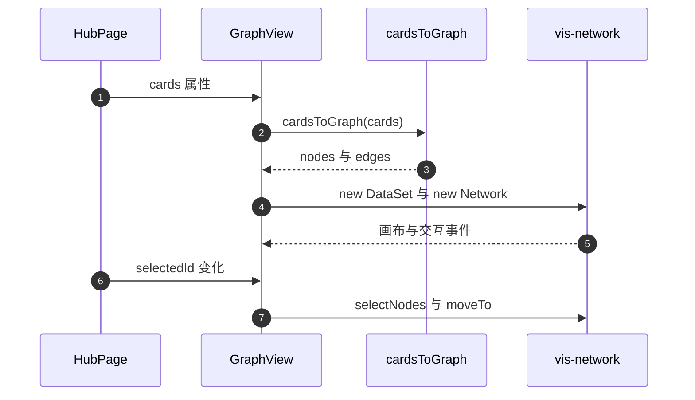

# 图谱数据从卡片列表到画布

打开知识 Hub 的图谱页时，看到的节点和连线并不是后端算好的。后端只提供卡片列表，每张卡片带着自己的 `links` 数组；前端拿到这份列表后，在浏览器里把每张卡变成节点、把链接变成边，再交给 vis-network 这个绘图库渲染。所以图谱的“数据接口”其实就是卡片接口，图谱模块承担的是从卡片到画布的转换。

这条链路决定了几个容易困惑的现象：为什么图谱里看不到悬空的链接、为什么两条互相引用的卡片只画一条线、为什么改了卡片链接后图谱会自己更新。答案都在转换规则与前端的状态更新里。

## 图谱数据来自卡片列表

图谱组件 `GraphView` 的属性里没有“图谱接口”这一项，只有一份卡片数组（`frontend/src/components/GraphView.tsx:7-13`）。Hub 页面把会话详情里的卡片直接传下去（`frontend/src/components/HubPage.tsx:149`、`:313-318`）。在 `backend`、`frontend/src` 的检索里没有发现专门返回节点与边的图谱端点，图谱数据全部由此推导。

卡片数组的形状由前端类型定义：`id`、`title`、`links`、`backlinks`、`parent_id` 等（`frontend/src/types/card.ts`）。后端对应的模型与库表在前一单元讲过，这里只需要记住图谱只用到其中两个字段：`id` 和 `links`。

这样设计的好处是前端不依赖额外的接口契约：卡片列表变了，图谱自动跟着变。代价是转换逻辑必须在前后端保持一致，一旦两边规则不同，同一个知识库在网页与其它视图里会呈现不同的结构。

## 节点与边的生成规则

转换函数 `cardsToGraph` 只有几十行，规则可以逐条列清（`frontend/src/utils/graph.ts:17-50`）：

| 规则 | 行为 | 位置 |
| --- | --- | --- |
| 节点 | 每张卡一个节点，标签取标题，尺寸固定 25 | `:18-23` |
| 建边 | 只遍历 `card.links` | `:39-47` |
| 跳过断链 | 目标 ID 不在本次卡片集里就不建边 | `:42-44` |
| 无序对去重 | 正向或反向已存在则跳过 | `:28-37` |
| 边 ID | 用 `from->to` 字符串，保证跨渲染稳定 | `:29`、`:35` |

“无序对去重”是理解图谱观感的关键。因为链接是双向维护的，A 的列表里有 B、B 的列表里也有 A，如果不去重就会画出两条重叠的线。去重时先遇到哪条就留哪条，因此边的方向在图谱上没有意义——它只是一条连接。

## 一个容易踩到的差别：相邻节点用了两个字段

同一份数据上还有第二个转换函数 `getConnectedNodes`，它取某张卡的邻居时同时看 `links` 与 `backlinks`（`frontend/src/utils/graph.ts:52-69`）。建边只用 `links`，取邻居却用两个字段。

对当前代码写出的数据两者结果一致，因为两个列表内容相同。但对旧数据就会分叉：一张卡可能 `links` 为空而 `backlinks` 有值（磁盘上就有这样的样例，前一单元给过路径）。这种卡片在图谱里没有连线，却被相邻节点查询算作邻居。看到“高亮邻居里有节点但图上没有线”时，原因在这。

## hub 侧有一份镜像实现

后端也有一份把卡片转成节点与边的代码：`HubManifest` 的 `_build_graph`（`backend/storage/hub_store.py:167-187`）。它的注释直接写明“mirrors frontend cardsToGraph logic”，规则与前端一致：每张卡一个节点、只看 `links`、目标必须存在、按排序后的元组去重。

它服务的是分享出去的知识 Hub 清单，不是网页画布。两份实现分开维护，同一规则写两遍：前端改了去重方式，后端不会自动跟。核对 Hub 数据与网页图谱不一致时，先比这两处。

| 维度 | 前端 `cardsToGraph` | 后端 `_build_graph` |
| --- | --- | --- |
| 输入 | 卡片的 `id` 与 `title` 与 `links` | 同样三个字段 |
| 去重 | `from->to` 字符串正反判断 | 排序后的二元组 |
| 输出 | 节点与边数组，含颜色与尺寸 | 仅 `id`、`label`、`from`、`to` |
| 用途 | 网页画布 | Hub 清单 |

## 图谱分数是另一条链路

检索后端时还会看到一个与图谱有关的函数 `compute_graph_score`（`backend/quality/scorer.py:151-163`）。它根据每张卡的深度与度数算一个 0 到 1 之间的分数，用于质量评估，与画布无关。

| 概念 | 输入 | 输出 | 用途 |
| --- | --- | --- | --- |
| `cardsToGraph` | 卡片列表 | 节点与边 | 渲染画布 |
| `_build_graph` | 卡片列表 | 节点与边 | Hub 清单 |
| `compute_graph_score` | 深度与度数信号 | 单卡分数 | 质量评估 |

三者共享“链接构成图”这个前提，但服务三个不同的消费者。质量评估部分在后面的单元展开，这里只做区分，避免把分数当成渲染数据。

## 易错点

1. 到后端找图谱接口。目前没有，数据来自卡片列表。
2. 认为图谱会显示断链。目标缺失的边被直接跳过。
3. 把边看成有方向。去重后方向信息已经丢失。
4. 认为相邻节点查询与建边判据相同。前者多看一个字段。
5. 只改前端建边规则。Hub 侧有一份镜像要同步。
6. 把图质量分数当成渲染用的边权重。它不参与画布。

## 小结

### 核心概念

| 概念 | 取值或做法 | 来源 |
| --- | --- | --- |
| 数据来源 | 会话详情的卡片数组 | `frontend/src/components/HubPage.tsx:149`、`:313-318` |
| 节点 | 每卡一个，标签取标题 | `frontend/src/utils/graph.ts:18-23` |
| 边 | 遍历 links，跳过断链 | `:39-47` |
| 去重 | 无序对只留一条 | `:28-37` |
| 相邻查询 | links 与 backlinks 都看 | `:52-69` |
| 后端镜像 | `HubManifest._build_graph` | `backend/storage/hub_store.py:167-187` |
| 图谱分数 | 深度与度数算分，与渲染无关 | `backend/quality/scorer.py:151-163` |

### 设计权衡

| 决策 | 收益 | 代价 |
| --- | --- | --- |
| 图谱复用卡片接口 | 少一个接口与一份缓存 | 转换规则要在前端维护 |
| 跳过断链 | 画布不出现悬空节点 | 与校验工具的报告不一致 |
| 无序对去重 | 观感干净 | 无法在图上表达方向 |
| 前后端各有一份转换 | 各自独立、互不阻塞 | 规则改动要改两处 |
| 分数独立于渲染 | 质量口径不受画布影响 | 两套“图谱”概念容易混 |

## 练习

### 基础题

1. 说明图谱数据的来源，以及为什么不需要专用后端接口。
2. 写出节点与边的四条生成规则。
3. 对比前端转换与后端 `_build_graph` 的异同。

### 挑战题

4. 为图谱设计一个后端端点，说明返回结构、缓存策略与与卡片接口的一致性保证。
5. 分析相邻节点查询与建边判据不一致的影响，给出统一方案与兼容旧数据的处理。
6. 设计一个交叉校验：比较前端转换结果与后端 `_build_graph` 结果，给出比对方法与差异分类。

### 附：本页引用的路径

| 路径 | 用途 |
| --- | --- |
| `frontend/src/utils/graph.ts` | 建边与相邻查询（:17-69） |
| `frontend/src/components/GraphView.tsx` | 图谱组件属性（:7-13） |
| `frontend/src/components/HubPage.tsx` | 卡片来源与图谱挂载（:149、:313-318） |
| `frontend/src/types/card.ts` | 前端卡片类型 |
| `backend/storage/hub_store.py` | Hub 侧图谱镜像（:167-187） |
| `backend/quality/scorer.py` | 图谱质量分数（:151-163） |
