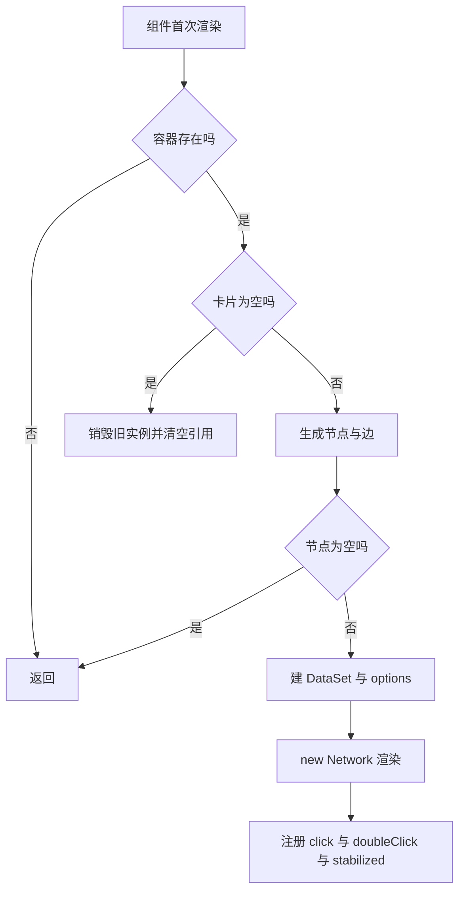
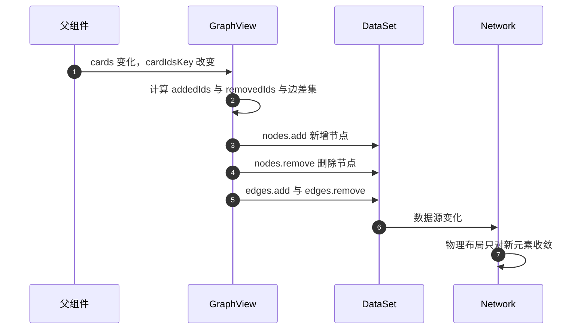

# vis-network 的初始化与增量更新

画布不是每次数据变化都重建的。首次挂载时创建一个 vis-network 实例，把节点与边装进两个可增删的集合；之后卡片集合变化时，组件按 ID 算出新增与删除的项，分别调用集合的增删方法，实例本身保持不动。这样做的好处是物理布局（节点之间的力的计算）不会每次被打散重来，画面不会剧烈跳动。

要理解这段逻辑，先接受两个名词：DataSet 是 vis-network 提供的“可增删的数据容器”，Network 是画布实例，前者是后者的数据源；增量更新就是只改容器里的条目，不换容器。

## 首次挂载做了什么

组件的首次渲染走一条固定路径（`frontend/src/components/GraphView.tsx:41-154`）：

| 顺序 | 动作 | 位置 |
| --- | --- | --- |
| 1 | 取容器元素，为空直接返回 | `:42-43` |
| 2 | 卡片为空则销毁旧实例并清空引用 | `:45-54` |
| 3 | 调 `cardsToGraph` 生成节点与边 | `:56` |
| 4 | 节点为空则返回 | `:57` |
| 5 | 清容器、建两个 `DataSet` | `:60-63` |
| 6 | 从 CSS 变量取主题色 | `:70-76` |
| 7 | 组装 `options` | `:78-151` |
| 8 | `new Network(container, data, options)` | `:153` |

实例与两个集合分别存在 `useRef` 里（`:17-19`），因此后续的增量更新与卸载清理都能拿到同一个对象。回调函数也放进 ref（`:21-22`、`:27-28`），避免因为父组件重新创建函数而触发重挂载。

依赖项是一个由排序后的卡片 ID 拼成的字符串（`:31-33`）：

```ts
const cardIdsKey = useMemo(() => cards.map(c => c.id).sort().join(','), [cards]);
```

这个键只在“卡片的身份集合”变化时改变。它是整段更新的触发开关，也是后面标签刷新问题的根源。

## 颜色与物理参数

颜色不写死在组件里，而是从文档根节点的 CSS 变量读取（`:70-76`）：主色、浅主色、悬停色、正文色、背景色、弱化文本色各有变量名与兜底值。因此换主题时图谱会跟着变，代价是每次初始化都要读一次计算样式。

布局用 forceAtlas2Based 求解器（`:82-98`），关键参数：

| 参数 | 取值 | 作用 |
| --- | --- | --- |
| `stabilization.iterations` | 800 | 初始布局迭代次数 |
| `gravitationalConstant` | -80 | 节点间斥力强度 |
| `centralGravity` | 0.001 | 向中心的拉力，取值小布局更松散 |
| `springLength` | 180 | 边的理想长度 |
| `springConstant` | 0.04 | 边的弹簧刚度 |
| `damping` | 0.7 | 运动阻尼，越大越稳 |

节点是圆点、字号 12、带阴影（`:105-137`）；边宽 1.5、连续曲线、圆度 0.5（`:138-150`）。交互开启悬停、导航按钮、缩放与拖拽（`:99-104`）。这些数值没有在代码里解释来源，属于调参结果。



## 卡片集合变化时的增量更新

第二次起走 `:198-228` 分支，全部按 ID 做差集：

| 变化 | 计算方式 | 调用 |
| --- | --- | --- |
| 新增节点 | 新 ID 减去旧 ID | `nodes.add` |
| 删除节点 | 旧 ID 减去新 ID | `nodes.remove` |
| 新增边 | 边的 ID 不在旧集合里 | `edges.add` |
| 删除边 | 旧边 ID 不在新集合里 | `edges.remove` |

删节点时，vis-network 会连带处理挂在它上面的边。边的 ID 在生成时就设计成跨渲染稳定（`frontend/src/utils/graph.ts:29`、`:35`），因此这里的比对可靠。



## 标题变化为何不会刷新标签

`cardIdsKey` 只由 ID 组成（`:31-33`），改标题不改变这个键，effect 不重跑；即使重跑，增量分支也只处理增删，不处理已有节点的属性更新。因此已存在的节点标签保持旧值，直到组件重挂载或该节点被删除后重新加入。

这是一个可复现的观感问题：改名后在列表里看到新标题，图谱上还是旧标题。修复方向有两类，一是让键包含标题并在增量分支里对已有节点调用 `update`，二是节点标签从别处按需读取。当前实现没有处理，按代码事实记录。

## 卸载与空数据清理

组件卸载时销毁实例、清空容器内容、重置交互标记（`:233-251`）。卡片变空时走的是同一个销毁逻辑（`:45-54`），但不清空容器内容——空数组时组件返回的是空状态占位（`:316-324`），容器本身已经不在渲染树里。

清理里还取消了挂起的单击定时器（`:235-237`），避免组件卸载后回调仍然触发。这一条在交互页展开。

## 两个宿主页面的挂载方式

图谱被两个页面复用，挂载方式不同：

| 宿主 | 做法 | 位置 |
| --- | --- | --- |
| Hub 页面 | 常挂载，用 CSS 的 `display` 控制显隐 | `frontend/src/components/HubPage.tsx:339-342` |
| 移动端页面 | 按条件渲染 `GraphView` | `frontend/src/components/mobile/MobileGraphPage.tsx:31-40` |

Hub 页面的注释解释了常挂载的原因：避免 vis-network 重新初始化（`HubPage.tsx:339`）。移动端页面没有这层处理，切走再切回会重建实例、重新跑一遍布局。这是同一个组件的两种使用取舍，不是缺陷，但排查“切页后布局跳一次”时要想到这个差别。

## 易错点

1. 认为每次数据变化都重建实例。只有首次与卡片集合变化时走不同分支。
2. 用标题判断数据是否变化。触发键只由 ID 组成。
3. 期待改标题后图谱立即更新。增量分支不更新已有节点属性。
4. 在增量更新的代码里找节点属性同步。它只做增删。
5. 认为两个宿主页面的挂载行为一致。Hub 常挂载，移动端按条件渲染。
6. 忘记边 ID 的稳定性要求。改 ID 规则会让增删比对失效。

## 小结

### 核心概念

| 概念 | 取值或做法 | 来源 |
| --- | --- | --- |
| 绘图库 | `vis-network/standalone` 9.x | `frontend/package.json:23`、`GraphView.tsx:2` |
| 数据容器 | 节点与边各一个 `DataSet` | `GraphView.tsx:62-63` |
| 实例引用 | `useRef` 保存 Network 与 DataSet | `:17-19` |
| 触发键 | 排序后的卡片 ID 字符串 | `:31-33` |
| 样式来源 | 文档根节点的 CSS 变量 | `:70-76` |
| 布局 | forceAtlas2Based，稳定迭代 800 | `:82-98` |
| 增量更新 | 按 ID 差集增删节点与边 | `:198-228` |
| 清理 | 卸载时销毁实例与定时器 | `:233-251` |

### 设计权衡

| 决策 | 收益 | 代价 |
| --- | --- | --- |
| 实例常驻、按 ID 增删 | 布局不跳动 | 需维护差集逻辑与稳定 ID |
| 触发键只含 ID | 标题编辑不触发重建 | 标签不刷新 |
| 颜色取 CSS 变量 | 主题统一 | 初始化时读计算样式 |
| Hub 侧常挂载 | 切换标签不重建 | 隐藏时仍占内存 |
| 移动端按条件渲染 | 省内存 | 切页重建、布局重跑 |

## 练习

### 基础题

1. 写出首次挂载的八步顺序，说明空卡片与空节点两种提前返回的差别。
2. 说明增量更新如何处理节点与边，以及边 ID 为什么要稳定。
3. 解释改标题后图谱标签不更新的原因，指出涉及的两处代码。

### 挑战题

4. 实现节点属性同步：让标签在标题变化时更新，说明触发键与增量分支怎么改，以及布局是否会受影响。
5. 给大图设计降级方案：节点数超过阈值时关闭物理或降低稳定迭代，说明判断位置与恢复方式。
6. 对比常挂载与条件渲染两种宿主方式的性能与体验差异，给出移动端的取舍建议。

### 附：本页引用的路径

| 路径 | 用途 |
| --- | --- |
| `frontend/src/components/GraphView.tsx` | 初始化、增量更新与清理（:17-251、:316-324） |
| `frontend/src/utils/graph.ts` | 稳定的边 ID（:29-35） |
| `frontend/src/components/HubPage.tsx` | 常挂载与显隐控制（:339-342） |
| `frontend/src/components/mobile/MobileGraphPage.tsx` | 移动端按条件渲染（:31-40） |
| `frontend/package.json` | 依赖版本（:23） |
