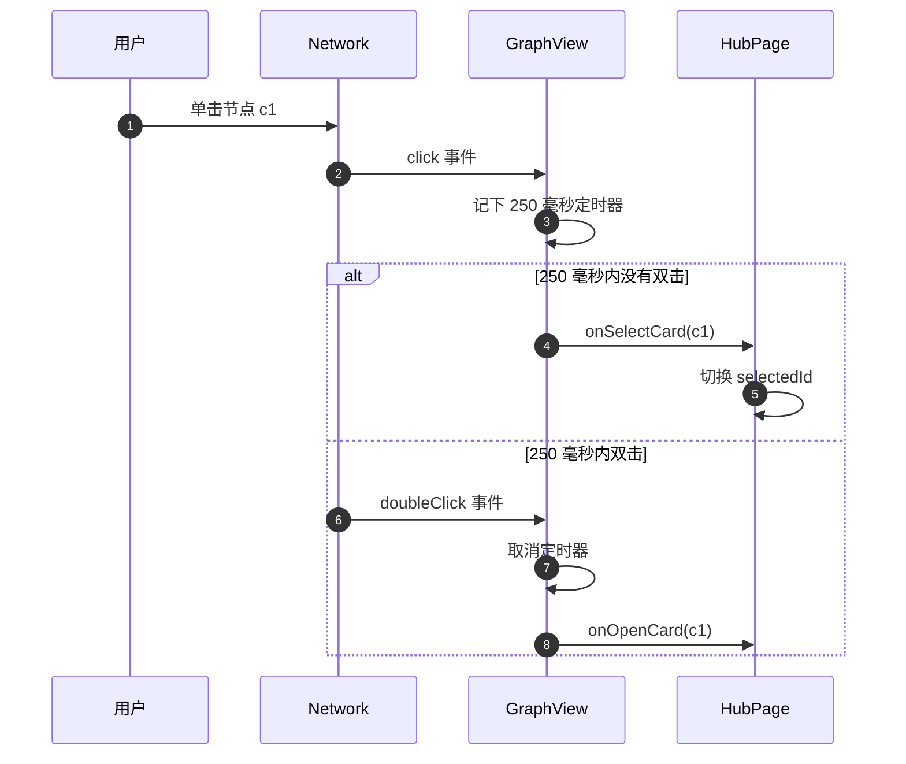
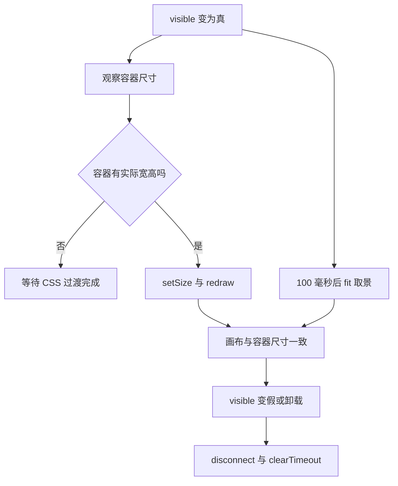

# 交互、显隐与测试替身

图上的一个节点同时承载两个动作：单击选中它，双击打开详情。浏览器在双击时会先抛一次单击事件，如果单击立刻响应，画面就会先抖动一下再打开窗口。组件的解法是给单击加一个 250 毫秒的延时，双击到来时把这个延时取消。这段逻辑不长，但它是“点了没反应”和“点了抖一下”两类体验问题的分界线。

除点击外，还有三处与交互相关的处理：首次布局稳定后自动取景、选中卡片时把相机移过去、面板由隐藏变可见时重新测量尺寸。它们分别解决“图跑出视野”“看不到选中项”“切回来是空白”三个问题。

## 单击与双击的分工

两个事件处理都注册在初始化之后（`frontend/src/components/GraphView.tsx`）：

| 事件 | 立即动作 | 延时动作 |
| --- | --- | --- |
| `click` | 标记用户已交互，清掉旧定时器 | 250 毫秒后调 `onSelectCard` |
| `doubleClick` | 取消挂起的单击定时器，标记已交互 | 调 `onOpenCard` |

注释写明了延时的原因：双击会先触发一次 `click`，若立即选中，相机会在窗口打开前做一次动画，观感抖动；延时让双击胜出。定时器句柄存在 ref 里，因此第二个事件能取消第一个的待执行回调。

两个事件的处理简化后如下（示意）：

```ts
let clickTimer: number | null = null;
network.on('click', (params) => {
  userInteractedRef.current = true;
  if (clickTimer) clearTimeout(clickTimer);
  clickTimer = window.setTimeout(() => onSelectCard(params.nodes[0]), 250);
});
network.on('doubleClick', (params) => {
  if (clickTimer) clearTimeout(clickTimer);   // 取消挂起的单击
  userInteractedRef.current = true;
  onOpenCard(params.nodes[0]);
});
```

宿主页面把选中做成了开关：再次点同一张卡会取消选中（`frontend/src/components/HubPage.tsx`）。因此单击回调需要处理“同一个 ID 再点一次”的分支，图谱组件本身不关心这个语义，只负责上报 ID。



## 用户操作后不再自动取景

布局算完会触发一次 `stabilized` 事件。组件只监听一次，并在回调里检查用户是否已经操作过：

```ts
network.once('stabilized', () => {
  if (userInteractedRef.current) return;
  network.fit({ animation: { duration: 500, easingFunction: 'easeInOutQuad' } });
});
```

用户已经点过节点或拖动过画布时，自动取景会打断他的视角，因此直接跳过。这个标记在初始化与卸载时都会重置，保证换一批数据后自动取景重新生效。用 `once` 而不是 `on`，是因为稳定事件在一次会话里可能多次触发，重复自动取景会与用户抢视角。

## 选中卡片时相机移动

父组件传入 `selectedId` 后，组件在一个动画帧里选中节点并把相机移过去：

| 步骤 | 调用 | 实现要点 |
| --- | --- | --- |
| 等一帧 | `requestAnimationFrame` | 等浏览器画完当前帧再操作 |
| 高亮节点 | `selectNodes([selectedId])` | 用 vis-network 的选中 API |
| 取坐标 | `getPosition(selectedId)` | 读节点当前布局坐标 |
| 移动并放大 | `moveTo`，缩放 1.5，动画 400 毫秒 | 只动相机，不改布局 |

这里特意不关闭物理布局。代码注释记录了一个历史问题：早期方案用一个“动画中”的标志位防止重复聚焦，结果标志位可能卡住，导致聚焦永久失效；现在改为只移动相机，让动画自身处理连续重定位。这是“用状态位做并发保护”容易出问题的典型例子，注释把它留在代码里提醒后来者。

## 面板显隐与尺寸变化

图谱所在的面板通过 CSS 过渡显示与隐藏。面板刚变可见时，画布的容器尺寸可能还是 0，vis-network 会算错可视区域。组件的处理是在 `visible` 变为真时挂一个 `ResizeObserver`（浏览器提供的元素尺寸监听 API，容器宽高变化时回调，这里用来修正画布可视区域）：

| 动作 | 作用 | 实现要点 |
| --- | --- | --- |
| `ResizeObserver` | 容器有实际宽高后调 `setSize` 与 `redraw` | 监听容器尺寸 |
| 100 毫秒后的补充取景 | 面板刚显示时先给一个合适视野 | 延迟取景 |
| 清理 | 断开观察、清定时器 | 隐藏或卸载时执行 |

两个动作配合的原因：`ResizeObserver` 解决画布尺寸，取景解决视野。只做其中一个时，常见表现是“图上什么都没有”或“图挤在角落”。这也解释了 Hub 页面为什么选择常挂载（`HubPage.tsx`）：实例不销毁，显隐切换就只需要这条尺寸重算路径。



## 测试如何替掉真实绘图库

vis-network 依赖 canvas（浏览器里的位图画布，jsdom 无法模拟），jsdom（在 Node 里模拟浏览器 DOM 的测试环境）跑不起来，因此测试在文件顶部整体替换掉它（`frontend/src/tests/GraphView.test.tsx`）。替身提供三个能力：

| 能力 | 实现 | 用途 |
| --- | --- | --- |
| `DataSet` | 用数组保存条目并实现 `add`/`remove`/`getIds` | 让增量更新可断言 |
| `Network` | 保存构造参数，记录事件回调 | 让事件注册可断言 |
| 触发函数 | `triggerClick` 与 `triggerStabilized` | 手动触发已注册的回调 |

测试还补了 jsdom 缺失的 `ResizeObserver`。四条用例覆盖：渲染、单击回调、`cardsToGraph` 的节点与边数量、空状态。其中单选用例等 250 毫秒后断言回调被调用，说明测试确实跨过了延时分支。

覆盖的边界也可以从用例看出来：双击打开、增量更新、`selectedId` 相机移动、显隐尺寸重算都没有直接断言。改这些逻辑时测试不会报警，需要手工验证。

## 空状态与样式

卡片为空时组件不渲染画布容器，而是返回一个占位块（`GraphView.tsx`），样式在 `frontend/src/components/GraphView.css`：居中、带一个半透明图标与两行提示，提示语从“暂无卡片”到“创建卡片后查看知识图谱”。测试断言空状态存在且画布容器不存在（`GraphView.test.tsx`）。

画布容器用绝对定位铺满包裹层（`GraphView.css`），并去掉 canvas 的外轮廓。包裹层背景取主题变量，与前面说的节点颜色来源一致。

## 易错点

1. 单击后立刻回调。会与双击冲突，产生抖动。
2. 认为自动取景每次稳定都会执行。它只在用户未操作时执行一次。
3. 用状态位防重复聚焦。历史方案证明它会卡住，现在只移动相机。
4. 只在显隐变化时取景不重算尺寸。画布会按旧尺寸渲染。
5. 认为测试覆盖了双击。替身提供了触发入口，但没有用例用到。
6. 在空状态下查找画布容器。空状态根本不渲染它。

## 小结

### 核心概念

| 概念 | 取值或做法 | 来源 |
| --- | --- | --- |
| 点击区分 | 单击延时 250 毫秒，双击取消 | `frontend/src/components/GraphView.tsx` |
| 选中开关 | 宿主页面同 ID 再点取消 | `HubPage.tsx` |
| 自动取景 | `stabilized` 且用户未操作时执行一次 | `GraphView.tsx` |
| 相机移动 | 动画帧内选中并 `moveTo` 缩放 1.5 | `GraphView.tsx` |
| 尺寸重算 | `visible` 变真时挂 `ResizeObserver` | `GraphView.tsx` |
| 测试替身 | 假的 `DataSet` 与 `Network` 加触发函数 | `frontend/src/tests/GraphView.test.tsx` |
| 空状态 | 占位块，不渲染画布 | `GraphView.tsx`、`GraphView.css` |

### 设计权衡

| 决策 | 收益 | 代价 |
| --- | --- | --- |
| 单击延时 250 毫秒 | 双击体验稳定 | 单击反馈有可感延迟 |
| 用户操作后不取景 | 不打断视角 | 需要维护交互标记 |
| 只移动相机不动物理 | 焦点动画顺滑 | 布局仍可能缓慢变化 |
| 显隐时重算尺寸 | 切回不空白 | 多一个观察者与定时器 |
| 整库替换绘图库 | 测试可跑 | 双击与增量路径无断言 |

## 练习

### 基础题

1. 说明单击与双击事件的先后关系，以及 250 毫秒定时器解决什么问题。
2. 解释自动取景为什么只在用户未操作时执行，标记在哪些时机重置。
3. 列出面板变可见时做的两件事与各自的清理动作。

### 挑战题

4. 为双击、增量更新与相机移动补测试，说明替身需要新增哪些能力。
5. 把 250 毫秒延时改成可配置或改为“双击区域豁免”，分析对体验与实现复杂度的影响。
6. 分析大图在大屏与移动端的取景策略差异，给出避免“图挤在角落”的具体参数与验证方式。

### 附：本页引用的路径

| 路径 | 用途 |
| --- | --- |
| `frontend/src/components/GraphView.tsx` | 点击、取景、相机与尺寸处理 |
| `frontend/src/components/GraphView.css` | 画布与空状态样式 |
| `frontend/src/components/HubPage.tsx` | 选中开关与常挂载 |
| `frontend/src/tests/GraphView.test.tsx` | 绘图库替身与四条用例 |
