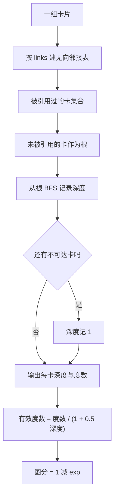
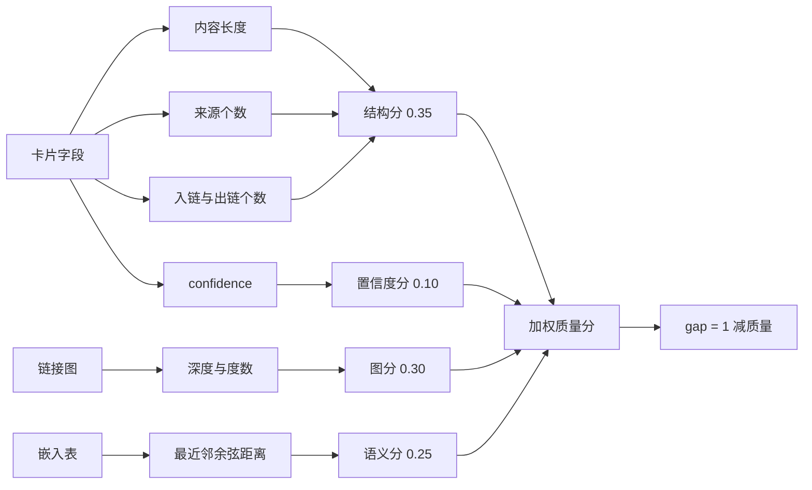

# gap 分数与四维子分

卡片质量差时，最先看到的症状是搜索结果里一张卡只有标题没有正文、或者来源为空——这类卡在后续检索里几乎提供不了信息。为了让系统能指出该补哪张卡，评分器给每张卡算一个 0 到 1 的缺口分：gap = 1 减加权质量分，越高表示越需要补内容或补来源。它不判断事实对错，也不看主题是否已饱和——后两件事分别在主题守卫与簇诊断里处理。

缺口分的构造方式是从“质量”反推：先按四个维度算出一个 0 到 1 的质量分，再用 1 减去它得到 gap。这样定义的好处是反馈方向明确：任何提升质量的编辑动作都必须让 gap 下降。代码把这条要求写成了可执行的自检，刷新内容与扩展链接两条路径各有一段断言。理解这点，就能明白为什么子分函数都选渐近不饱和的形状：logistic 是 S 形函数，输入增大时输出单调逼近 1 但不会到达，所以继续加内容仍有收益；而不是简单的“达到某个数量就给满分”。

## 为什么用 1 减质量分定义 gap

评分入口返回的是 gap 与 quality 两个互补的字段，二者相加为 1（`backend/quality/scorer.py`）：

```python
def _combine_quality(structure, graph, semantic, confidence, weights):
    quality = (
        weights["structure"] * structure +
        weights["graph"] * graph +
        weights["semantic"] * semantic +
        weights["confidence"] * confidence
    )
    quality = max(0.0, min(1.0, quality))
    return round(quality, 4), round(1.0 - quality, 4)
```

四个维度先各自落在 0 到 1，再按权重线性合成。设计权重是 `structure 0.35 / graph 0.30 / semantic 0.25 / confidence 0.10`（`backend/quality/thresholds.py`）。阈值文件被当成“单一来源”，评分器只读副本，改动要经过评审（`scorer.py`）。

模块注释记录了这个设计要解决的旧问题：早期子分用饱和或截断公式，内容超过 200 字符就冲到 0.85，三个来源就满分，结果加内容加来源都涨不动分，分布塌在 0.45 到 0.55（`scorer.py`）。新方案把所有计数型子分换成渐近函数。

## 三个结构子分

结构分由内容完整度、来源丰富度、链接密度合成，权重接近三等分（`scorer.py`）：

| 子分 | 公式 | 输入 | 形态 |
| --- | --- | --- | --- |
| 内容完整度 | logistic，中点 1500，斜率 400 | 内容字符数 | 零内容为 0，越长越接近 1 |
| 来源丰富度 | 1 减 exp，尺度 5 | 来源个数 | 三个来源约 0.45，十个来源约 0.86 |
| 链接密度 | 1 减 exp，入度加 1.5 倍出度，尺度 6 | 入度与出度 | 出链权重更高 |

三个函数都单调且不封顶，因此每加一段内容、一个来源或一条链接，结构分都会上升，gap 都会下降。链接密度把出链乘 1.5，是因为主动引用别处通常比被动被引用更能说明作者在扩展知识面。

三个子分函数的形状如下（示意，参数与正文一致）：

```python
content = 1 / (1 + math.exp(-(length - 1500) / 400))     # logistic，中点 1500，斜率 400
sources = 1 - math.exp(-n_sources / 5)                   # 尺度 5
links   = 1 - math.exp(-(in_deg + 1.5 * out_deg) / 6)    # 出链按 1.5 倍计入，尺度 6
```

内容为零时返回 0，而不是 logistic 在负无穷处的极限，这是一个显式分支（`scorer.py`）。它保证空卡片的 gap 不会因为浮点极限而算出接近 1 的“假高分”。

## 树信号与图分

图分不只看这一张卡，而是看它在链接图里的位置。树信号用一次广度优先搜索（BFS，从根出发按层向外扩展的遍历）得到每张卡的深度与度数（`scorer.py`）：

1. 把有向链接当无向边，建立邻接表；
2. 收集所有被引用的卡，没被引用的卡作为根；
3. 从根出发做 BFS，记录深度；
4. 不可达的卡深度记为 1。

图分再按“有效度数”计算（`scorer.py`）：

```python
eff_degree = degree / (1.0 + 0.5 * depth)
return round(1.0 - math.exp(-(eff_degree + 1.5) / _GRAPH_K), 4)
```

深度越大的卡，同样的度数折算出的有效度数越小。这是对“深层节点连接再多也不如顶层枢纽重要”的近似。图信号缺失时返回 0.5 作为中性值，不把缺数据当成差数据。

卡片少于两张时树信号直接返回空字典，因为没有可比较的邻居。



## 语义分与置信度

语义分看这张卡与最近邻卡的距离。距离用余弦距离（用两个嵌入向量的夹角衡量相似度，夹角越小越相似），嵌入为零向量时返回 1.0，避免除零（`scorer.py`）。最近邻距离越小，说明内容越融入已有主题，分数越高；距离代入中点为 0.30、斜率 0.20 的 logistic 后取反。

没有嵌入、没有邻居或嵌入表为空时，语义分返回 0.5，注释写明这是“保持中性，而不是误判为完美融入”。这是全模块的一贯做法：缺数据取中性值，不取极端值。

置信度分直接取卡片自己的 `confidence` 字段，缺失时为 0.5。它来自写入时留下的元数据，不由运行时计算，权重最低，只有 0.10。



## 单调反馈是怎么被保证的

模块开头把“刷新后 gap 必须下降”写成设计目标（`scorer.py`），文件末尾用两段自检把它变成断言：

| 场景 | 构造 | 断言 |
| --- | --- | --- |
| 刷新 | 20 张卡内容从 50 字加到 3000 字、来源从 0 加到 4、置信度 0.5 到 0.8 | gap 必须下降 |
| 扩展 | 目标卡从 0 条链接加到 5 条出链，5 张邻居各加一条入链 | gap 必须下降 |

两条断言都打印前后差值。第二段尤其关键：它同时改了目标卡的出链与邻居的入链，覆盖了链接密度公式里两个方向。只要子分保持渐近单调，这类断言就不会因为参数调整而失效。

自检还遍历内容长度 0 到 10000，断言 logistic 输出不越界。

## 输出字段与排序

全库评分返回每张卡一个字典（`scorer.py`），字段可以分成四组：

| 组 | 字段 | 说明 |
| --- | --- | --- |
| 身份 | `card_id`、`title` | 卡片标识 |
| 主分 | `gap_score`、`quality_score` | 互补两分 |
| 维度分 | 四个维度子分与两级嵌套明细 | 解释 gap 来源 |
| 结构明细 | `dimensions` | 内容、来源、链接，属于结构分内部 |
| 树明细 | `tree_dimensions` | 深度、度数、密度，属于图分内部 |
| 权重 | `effective_weights`、`design_weights_snapshot` | 实际权重与设计权重 |

三个明细字段是嵌套关系：四个维度子分是最外层汇总，`dimensions` 属于结构分内部，`tree_dimensions` 属于图分内部；读字段时先确认它挂在哪一维下，再和同级的子分比较。

结果按 gap 从高到低排序，因此列表开头就是最需要补的卡。`find_weakest_cards` 在此基础上过滤绝对阈值，并在没有卡超过阈值时退回取最弱的前几张，注释说明这样做是为了避免静默返回空列表让上层误判知识库已经健康。

会话内相对分位 `gap_percentile` 的算法与绝对阈值的关系，在下一节展开。

## 易错点

1. 把 gap 当成“事实错误率”。它只看结构与融入程度。
2. 认为达到某个字符数就满分。子分渐近，不给满分。
3. 用缺失嵌入当差数据。缺失时取 0.5 中性值。
4. 只看出链或只看入链。链接密度两个方向都算，出链权重更高。
5. 认为图分只看度数。深度会折算有效度数。
6. 改动阈值而不评审。阈值文件与论文口径绑定。

## 小结

### 核心概念

| 概念 | 取值或做法 | 来源 |
| --- | --- | --- |
| gap 定义 | 1 减加权质量分 | `backend/quality/scorer.py` |
| 设计权重 | 0.35 / 0.30 / 0.25 / 0.10 | `backend/quality/thresholds.py` |
| 结构子分 | logistic 内容、指数来源、指数链接 | `scorer.py` |
| 树信号 | BFS 深度与度数 | `backend/quality/scorer.py` |
| 图分 | 有效度数的指数函数 | `backend/quality/scorer.py` |
| 语义分 | 最近邻余弦距离的 logistic | `backend/quality/scorer.py` |
| 缺数据 | 语义与置信度取 0.5 | `backend/quality/scorer.py` |
| 单调反馈 | 自检断言刷新与扩展让 gap 下降 | `backend/quality/scorer.py` |

### 设计权衡

| 决策 | 收益 | 代价 |
| --- | --- | --- |
| gap 由质量反推 | 反馈方向天然单调 | 无法表达“质量高但主题重复” |
| 子分渐近不饱和 | 持续编辑持续涨分 | 接近满分很慢 |
| 权重集中在阈值文件 | 口径统一、便于评审 | 改动流程更重 |
| 缺数据取中性 | 不产生假阴性 | 掩盖数据缺失 |
| 图分含深度折扣 | 顶层枢纽更受重视 | 深树的长尾卡难涨分 |

## 练习

### 基础题

1. 写出 gap 与 quality 的关系，说明这种定义对编辑反馈的好处。
2. 列出四个维度的权重与各自的输入字段。
3. 解释树信号如何确定根，以及不可达卡如何处理。

### 挑战题

4. 设计一个实验验证内容 logistic 的中点与斜率是否合适，说明需要的样本与判据。
5. 讨论把语义分权重提高后对分布的影响，给出防止“抱团卡得高分”的修正方案。
6. 为“同一主题重复卡”设计一个补充维度，说明它与现有四维的关系与权重分配。

### 附：本页引用的路径

| 路径 | 用途 |
| --- | --- |
| `backend/quality/scorer.py` | 四维子分、树信号、gap 合成与自检 |
| `backend/quality/thresholds.py` | 设计权重与 gap 分档 |
| `backend/quality/__init__.py` | 模块对外导出 |
